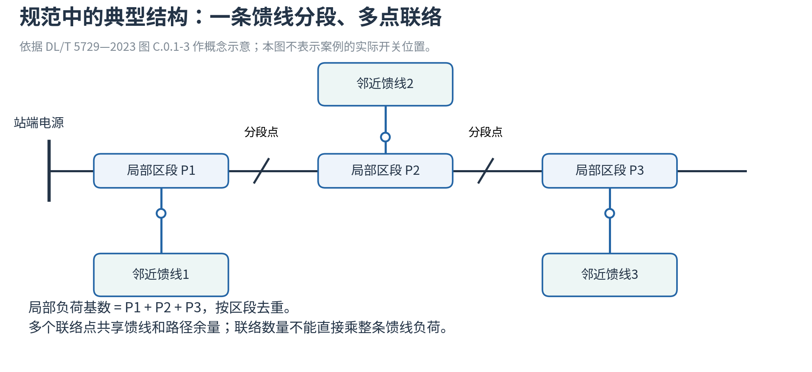
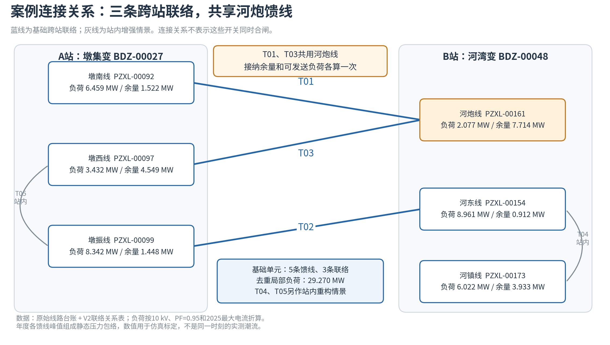
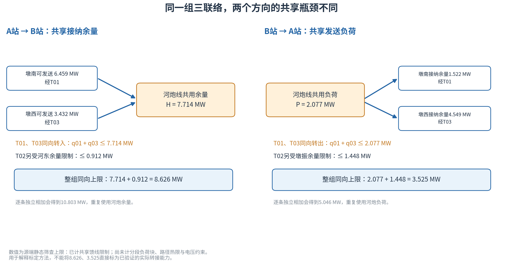

# 10 kV联络：当前等效方案与局部数据依据

> 当前采用[站级转供率与10 kV联络等效方案](站级转供率与10kV联络方案.md)：站级负荷基数乘转供率得到能力，新增独立联络以局部区段7.49106117 MW标定比例增量。本文件以下保留此前局部馈线分析；5.59 MW不作为当前站级转供率的分母。

当前方案不要求全区县既有馈线拓扑。既有能力为rho_initial × B_station；一个独立新增单元的比例提升为7.49106117 / B_station，新增线路不改变站负荷基数，不重复叠加能力。

参数接口为rebuild_2026.station_transfer_equivalent；当前参数见[站级等效转供参数](站级等效转供参数.json)，参照表见[逐站逐年转供基数与单线增量](逐站逐年转供基数与单线增量参照.csv)。年度求解器已接入站级能力约束，具体口径见[三措施优化模型说明](../2026-10-01站级转供率三措施优化/模型与参数说明.md)。

以下是规范、样本共享关系和此前局部基数讨论的计算记录。

## 1. 规范与文献依据

| 来源 | 已核位置 | 能支持的建模选择 |
| --- | --- | --- |
| DL/T 5729—2023《配电网规划设计技术导则》正式版 | 7.1.4(2)；PDF第28页／印刷18页 | 在同一供电网格或单元内组织中压联络，避免过多接线组混杂交织；多分段适度联络是典型结构之一。 |
| 同上 | 7.3.2；PDF第29页／印刷19页 | 结合变电站位置、负荷分布，以供电网格为单位设计目标网架和逐年过渡方案。 |
| 同上 | 7.3.3、7.3.4；PDF第29—30页／印刷19—20页 | 分段应依据线路长度与负荷分布；联络点数量依据周边电源和线路负载，一般不超过3个。 |
| 同上 | 附录C图C.0.1-3；PDF第53页／印刷43页 | 一条馈线可以在不同区段联络多条邻近馈线；这种结构天然共享线路和区段资源。 |
| Baran、Wu，1989 | 论文第1页引言、图1；后续网络重构模型 | 通过分段开关与联络开关改变供电归属以平衡负荷、缓解过载；可研究站间、馈线间或支线间正常负荷转接。 |

[国家能源局发布清单，序号264](https://zfxxgk.nea.gov.cn/1310759283_17047031765681n.pdf)；[全国标准信息公共服务平台](https://hbba.sacinfo.org.cn/stdDetail/4326449b56df49cdc18fb406b61818086261bab5fb90fa318e864e4b499b08e7)。

条款已对照项目内[正式PDF](../../参考政策/DL-T+5729-2023+配电网规划设计技术导则.pdf)人工核读。结构示意按概念重新绘制，未把当前案例直接命名为完整“三分段三联络”：案例中的“三条跨站联络”是两站多馈线之间的三条边，分段位置仍应单独定义。

参考文献：Baran M E, Wu F F. Network reconfiguration in distribution systems for loss reduction and load balancing. IEEE Transactions on Power Delivery, 1989, 4(2): 1401–1407. [DOI:10.1109/61.25627](https://doi.org/10.1109/61.25627)；[作者所在高校托管的原文](https://ecal.studentorg.berkeley.edu/tbsi/Energy-Systems-Optimization-Course/References/Baran89%20-%20UCB%20-%20DistFlow.pdf)。

规范支持接线与校核原则；它没有为这个仿真单元规定8.215MW、11.764MW、28.29%等固定参数。DL/T 5729—2023第7.1.2(1)中的站间转供比例处于故障或检修语境。本轮保留既定转供率作为站级等效规划能力情景，正常配置用途参照第2.0.16条，不声称比例来自逐站实测。



## 2. 案例结构与共享馈线

三条跨站联络按V2工作簿“02_联络关系”第2—4行：

- T01：墩南线（A站）合金厂支线4杆 ↔ 河炮线（B站）59杆。
- T02：墩振线（A站）王场湖支线17杆 ↔ 河东线（B站）93杆。
- T03：墩西线（A站）王场湖支线14 ↔ 河炮线（B站）王场湖支线1杆。

T01和T03分别接入河炮线的不同位置，共享其站端通路及相关馈线容量；不能视作两条独立河炮线。仅凭现有关系表不能断言两段路径完全重合，精细仿真应逐段检查共享路径和可切换负荷块。

T04连接河东与河镇，同属B站；T05为墩西与墩振之间的站内开闭所关系。同站重构本身不改变两站净负荷，但可能改变馈线接纳余量，宜作为增强情景重新求解。不能把T04或T05直接加成新的跨站容量。河镇不是三条基础跨站边的端点，所以基础单元去重为5条馈线、3条联络。



## 3. 负荷和容量依据

统一折算采用P=√3×10kV×I×0.95/1000（MW），接纳余量H=√3×10kV×max(I允许−I最大,0)×0.95/1000。功率因数0.95为仿真假定；统一使用最大电流避开河东有功记录为0但电流非0的矛盾。

| 馈线 | 编号 | 折算负荷MW | 接纳余量MW | 三联络基础单元涉及 |
| --- | --- | ---: | ---: | --- |
| 墩南线 | PZXL-00092 | 6.458714 | 1.521711 | 是 |
| 墩西线 | PZXL-00097 | 3.431747 | 4.548677 | 是 |
| 墩振线 | PZXL-00099 | 8.342423 | 1.447994 | 是 |
| 河东线 | PZXL-00154 | 8.960618 | 0.912072 | 是 |
| 河炮线 | PZXL-00161 | 2.076720 | 7.713697 | 是 |
| 河镇线 | PZXL-00173 | 6.022012 | 3.932950 | 否，仅由站内T04间接参与 |

基础单元去重总负荷为 **29.270222 MW**。六馈线样本总负荷为 **35.292234 MW**。逐条累加三条联络两端负荷则为31.346942MW，其中河炮的2.076720MW被重复一次；这三种基数不能混用。

各馈线年度最大电流通常不在同一时刻。上述负荷是规划压力包络，不是同步实测总负荷，也不用于替换区县容载比分母。

## 4. 共享约束与方向性

令q为局部负荷转接量，每条馈线的所有转出量之和不超过其可发送负荷，所有转入量之和不超过其接纳余量。为说明原比例为何有偏差，先沿用原源端筛查口径：可发送负荷暂以整条局部馈线负荷作为上界；尚未加入分段负荷块、路径热限和电压约束。

| 联络 | 两端馈线 | A→B单条独立筛查上限MW | B→A单条独立筛查上限MW |
| --- | --- | ---: | ---: |
| T01 | 墩南线—河炮线 | 6.458714 | 1.521711 |
| T02 | 墩振线—河东线 | 0.912072 | 1.447994 |
| T03 | 墩西线—河炮线 | 3.431747 | 2.076720 |

A→B时，T01、T03均转入河炮，需满足q01+q03≤7.713697MW；T02≤0.912072MW。整组上限为 **8.625769 MW**，而独立相加会得到10.802533MW。

B→A时，T01、T03均从河炮转出，需满足q01+q03≤2.076720MW；T02≤1.447994MW。整组上限为 **3.524714 MW**，而独立相加会得到5.046425MW。

线性规划枚举方向并检查共享约束得到上述结果。A→B最优分配并非唯一，附件保存了一组可行最优解。这些是源端静态上限，不能冒称完整配电潮流已验证的转接能力。



原六馈线比例计算得到9.983428MW，是允许不同联络取相反站间方向时的毛转接量：T01 A→B 6.458714MW，T02 B→A 1.447994MW，T03 B→A 2.076720MW。该解的A→B净转接量仅为 **2.934000MW**。毛转接量除以六馈线35.292234MW所得28.2879%，不能直接作为某一站减负比例。

## 5. 确定可乘转供率的局部负荷基数

以已有T01为设计规格参照（不是以其现状流量为参照）：

| 限流环节 | 依据 | 电流上限A |
| --- | --- | ---: |
| 墩南馈线 | 原始线路台账“最大允许电流” | 485 |
| 河炮馈线 | 原始线路台账“最大允许电流” | 595 |
| 墩南侧路径导线 | 参数库中的路径仿真基准值 | 500 |
| 河炮侧路径导线 | 参数库中的路径仿真基准值 | 550 |

先取限流规格I_lim=485A。S_ceiling=√3×10×485/1000=8.400446MVA；P_ceiling=S_ceiling×0.95=7.980424MW。导线参数为仿真基准，PF=0.95和其他等效元件不设置更低限流值为明确研究假定。

再选定多分段适度联络架空馈线为标准仿真接线。[DB11/T 2077—2023官方公开文本](https://bzh.scjgj.beijing.gov.cn/bzh/apifile/file/2023/20230505/0064b6d2-bccf-4406-9aed-da02e86dea64.pdf)第6.1.4条表3给出该类型70%的线路负载率控制上限。于是局部区域的规划负荷基数P_base=0.70×P_ceiling=5.586297MW。这里70%是规划负载率，和导则定义的转供率ρ分别记录；不改变ρ。

北京地方标准用于确定本仿真的规划工况参考，不表述为徐州强制执行要求。T01提供线路和路径规格原型，不宣称该实际馈线已经采用或满足所选标准接线与70%目标。其现状峰值可以超过所选仿真规划值；本轮建立的是固定标准单元。

接口为Q_local_upper=ρ×P_base，即ρ×5.586297MW；ρ按上层既定的导则口径提供。ρ的分子和分母指向同一个局部供电区域，不用两端负荷相加或整站负荷替代发送侧区域分母。“固定局部仿真单元参数.json”保存基数和校核能力，现状示例另存，比例留由原配置提供。

正常站间负荷转接量作为另一个优化变量，在这一联络能力预算内选择；不把正常运行转接量称为导则停运条件下已经验证的转供率。线路能力、接纳余量、可切换区段和站级容量同时校核。

## 6. 联络结构接入站级模型的规则

1. 保留基础五馈线、三联络结构及T01/T03共用河炮的关系。设计能力按通道及馈线容量设置；现状P、H作为验证场景输入，不作为不变的物理转供比例上限。六馈线原始数据全部保留，T04/T05另作站内重构增强情景。
2. 每个参与区县站对配置明确数量的局部单元，登记其对应模拟馈线资源。不同单元不得重复占用同一馈线负荷和余量；既有网络不默认全部站对互联。
3. 在局部子模型中选择可切换负荷块和开关状态，保证供电归属单一、正常运行保持辐射结构，并检查馈线和共享路径容量。精细潮流可参考Baran—Wu的配电网重构建模；轻量研究模型可采用明确标注的源端共享资源代理。
4. 一条发送馈线供电区域使用第5节约5.59MW的局部基数。多个联络共享同一发送馈线时，只登记一份区域负荷和ρ×P_base转出预算，由这些联络共同分配；共用受端馈线时合计检查接纳余量。约7.98MW承载能力另行校核。现状条件筛查的方向比例不替换原比例配置。
5. 上层用有符号净转接量t更新站负荷：L'_A=L_A−t，L'_B=L_B+t。按转接后负荷校核主变容量与供电安全要求，区县总负荷守恒。刚性、弹性使用同一局部单元和成本口径。
6. 新建决策添加具体馈线之间的联络边，重新计算整组能力；如果新增边仍绑定同一共享瓶颈，它的容量收益可以为0。只有新增边同时拓展可发送负荷或可接纳路径时，整组能力才可能增加。单条新线成本和完整三联络组成本分别计费。
7. 固定单元用于2022—2025年对比时，逐年沿用明确的局部参考参数。若另研究局部负荷增长，应调整局部馈线P并重新计算余量和方向能力，不能无条件按区县总负荷增长同比增加转接能力。

采用这一方案后，局部负荷基数来自线路规格与所选规划负载率上限；转供率定义和配置保持独立。实际转接量在局部能力预算及共享约束内由年度优化选择。

## 7. 复算与附件

从“实验/研究”执行：

```bash
/home/xh/anaconda3/envs/xuzhou110kv_clr/bin/python -m rebuild_2026.build_local_tie_review
```

附件：四张PNG和对应SVG；局部负荷基数确认说明；六馈线资源CSV；三联络方向边界CSV；固定局部仿真单元参数JSON；计算与来源核验JSON（原始文件SHA256、枚举方向LP结果、毛转接与净转接记录）。
