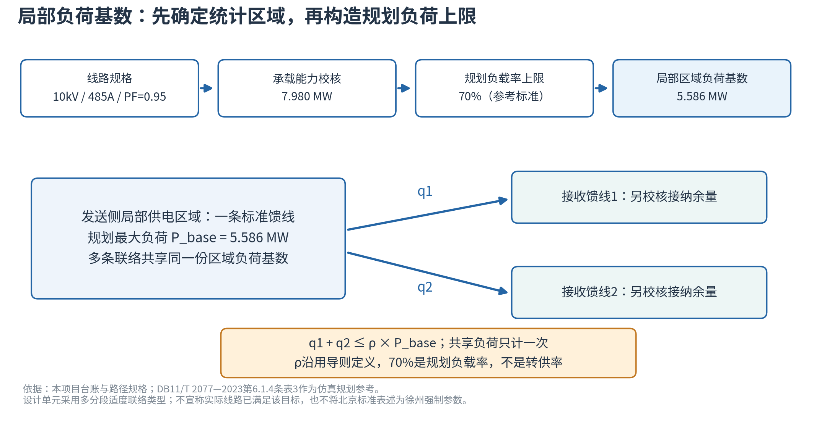

> 当前采用[站级转供率与10 kV联络等效方案](站级转供率与10kV联络方案.md)：站级负荷基数乘转供率得到能力，新增独立联络以局部区段7.49106117 MW标定比例增量。本文件以下保留此前局部馈线分析；5.59 MW不作为当前站级转供率的分母。

# 局部负荷基数确认

推荐固定基数：**5.586297MW／一个标准发送馈线供电区域**，展示取5.59MW，计算保留原值。转供率继续由上层按导则口径提供，本轮不重新估计比例。

DL/T 5729—2023第2.0.15定义的分母是同一供电区域总负荷。仿真统计区域明确为标准发送馈线所供的局部区域；接收侧是其转供去向，不加入该发送区域的分母。定义可查项目内[正式导则](../../参考政策/DL-T+5729-2023+配电网规划设计技术导则.pdf)PDF第13页／印刷第3页。

选T01作为规格原型，因为其两侧联络和源端路径能追溯。本项目台账中墩南线允许电流485A、河炮线595A，路径仿真基准分别500A、550A，取限流规格485A。在10kV、PF=0.95的明确仿真假定下，承载能力为√3×10×485×0.95/1000=7.980424MW。

采用多分段适度联络架空馈线作为标准仿真类型。[北京市市场监督管理局公开的DB11/T 2077—2023](https://bzh.scjgj.beijing.gov.cn/bzh/apifile/file/2023/20230505/0064b6d2-bccf-4406-9aed-da02e86dea64.pdf)第6.1.4条表3给出70%的负载率上限。用它构造规划工况：P_base=0.70×7.980424=5.586297MW。

70%是规划负载率λ，和转供率ρ分别记录。引用北京地方标准是仿真参考，不是声称它是徐州的强制参数，也不声称实际T01已满足所选规划接线与负载率。所选基数是标准单元的规划负荷上限，现状峰值只用于对照。

接口：Q_local_upper=ρ×P_base=ρ×5.586297MW。多条联络若共用同一发送馈线，只设一份该区域负荷和转出预算，由这些联络共同分配；共用接收馈线时合计校核接纳余量。约7.98MW承载能力、可切换区段和转接后的站容量另行校核。

本次确认局部仿真基数；尚未把新基数接入区县逐年求解，原年度结果不作本轮新结果。
