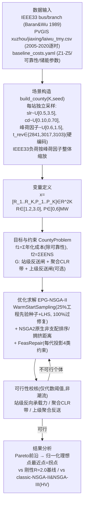

# 建模与求解流程技术核查报告

**核查对象**：`实验/有EA/scripts/` 全部脚本（`ieee33_loader.py`, `fetch_pvgis.py`, `pv_profile_analyzer.py`,
`county_model.py`, `lcc_simulator.py`, `ea_county.py`, `ea_converge.py`, `ea_figures.py`,
`fig_short_paper_matrix.py`）+ `实验/有EA/datasets/` 全部数据文件 + `实验/有EA/results/` 全部结果 CSV +
终稿 `paper/许恒-EPG-NSGA-II-终稿.docx`（含其中嵌入的 Table I / Fig. 1 / Algorithm 1）。

**核查方法**：逐文件通读源码并用行号定位；对存疑的常数（PV 年发电量、反送时长）实际重跑相关脚本核验；
解压终稿 docx 提取正文文本、表格、嵌入图片，与 `results/` 现有文件逐一比对来源。**未在代码或结果文件中
找到可执行证据的内容一律标记"未实现"或"无法确认"，不采信论文文字或注释里的口头表述作为证据。**

---

## 1. IEEE 33 节点系统的使用方式

**结论：拓扑/支路参数/节点负荷被保留并用于县内"单站内部 10kV 馈线"的简化潮流近似；但 K 个站共用同一套
33 节点拓扑（仅整体缩放负荷），站与站之间没有任何真实电气连接——站间"联络"只是一个随机标量，不是网络。**

| 问题 | 证据 |
|---|---|
| 节点/支路数据来源 | Baran & Wu (1989)，标准 IEEE33 基准算例。`datasets/ieee33/README.md:5`；节点 1-33（1=slack）、32 条径向支路、总有功负荷 3715 kW，`datasets/ieee33/ieee33_bus.csv`/`ieee33_branch.csv` 逐行核对属实 |
| 是否保留拓扑做潮流 | 保留 `r_ohm/x_ohm/length_km_est`（`ieee33_branch.csv`），用于**站内**简化树形潮流 `estimate_branch_flow_simplified()`（`lcc_simulator.py:138-165`）和线性电压近似 `reverse_voltage_max_pu()`（`lcc_simulator.py:173-198`）——但这是"单站内部 10kV 馈线"级别的近似，不是跨站的系统级潮流（见第 4 节） |
| K 个站是否为 K 套不同拓扑 | **否**。`county_model.py::_scaled_bus()`（55-59 行）只对负荷 `p_load_kw/q_load_kvar` 乘以随机峰荷因子 `pf∈U[0.6,1.5]`（`build_county()` 72 行），支路 r/x/长度**原样复用**（`get_branch()`，81-83 行）。即 K 个站 = 同一 33 节点拓扑的 K 份负荷缩放副本，不是 K 个独立采样的真实变电站馈线 |
| 站间是否有真实电气连接 | **没有**。K 个站的 33 节点树彼此独立，互不连支路。站间"联络"只用一个标量 `cd`（联络度）表示：`cd = float(rng.uniform(0.10, 0.70))`（`county_model.py:71`），**与任何拓扑、导纳、潮流无关**，仅在解析式 N-1 裕度公式里作为一个转供系数使用（见第 5 节）。因此"县域电网"在本模型里不是一张互联网络图，而是 K 个彼此独立的辐射状馈线 + 1 个自由标量 |
| PV 节点如何选取 | `DEFAULT_PV_BUSES = [18, 22, 24, 25, 30, 32]`（`lcc_simulator.py:512`），对应 README 建议的"高渗透档"节点（`datasets/ieee33/README.md:66`），PV 容量 `injection` 在这 6 个节点上**均摊**（`lcc_simulator.py:146-147: per_bus = injection/len(pv_buses)`），不是按实际负荷比例或地理位置分配 |
| 是否真实徐州数据 | 否，`datasets/ieee33/README.md:1-3` 明确来源于公开基准论文，"非甲方实测"；容载比换算部分（README 51-58 行）也写明是"本课题假设" |

**"节点如何聚合成县域内各变电站"** 的准确描述：并非把 33 个节点分组聚合成 K 个变电站，而是把整套 33 节点系统
**当作一个"代表性 10kV 馈线模板"**，复制 K 份、每份独立缩放峰荷规模，冠以第 j 个变电站的编号（`Station` dataclass，
`county_model.py:44-52`）。33 节点本身自始至终代表的是**站内**配网，与"110kV 变电站之间怎么连接"无关。

---

## 2. PVGIS 光伏数据的导入与处理

**结论：PVGIS 原始逐时数据仅被读取用于`pv_profile_analyzer.py`/`regional_cases.py`两个独立分析脚本；
真正参与 NSGA-II 寻优的 `ea_county.py→county_model.py→lcc_simulator.py` 链路自始至终没有读取任何一个
`*_tmy.csv` 文件，而是使用 3 个硬编码标量常数代替，其中 1 个已重新核验、2 个未能在当前代码中找到可执行的
推导来源。**

### 2.1 数据来源、时间范围、粒度、单位
| 项目 | 值 | 证据 |
|---|---|---|
| 来源 | PVGIS API v5.2（欧盟 JRC），`pvcalculation=1` | `fetch_pvgis.py:27,44-61` |
| 采集点 | 徐州 34.27°N/117.18°E，另有嘉兴/莱芜对照 | `datasets/pv_profiles/README.md:8-12` |
| 时间范围/粒度 | 2005-2020，共 16 年，逐小时（140256 行） | 实测 `wc -l xuzhou_tmy.csv` = 140257（含表头）；`cut` 年份去重 = 2005…2020，与 README「约16年」一致 |
| 字段与单位 | `time`(YYYYMMDD:HHMM,UTC) / `P`(**W**，对应 1 kWp 装机) / `G_i`(W/m²) / `T2m`(℃) / `WS10m`(m/s) | `datasets/pv_profiles/README.md:16-22`；实测表头 `time,P,G_i,T2m,WS10m` |
| 归一化/缩放 | `P_kw_actual = (P/1000) × installed_kWp` | `pv_profile_analyzer.py::load_pv()` 30 行 (`P_kw=P/1000`)，缩放示例见 README 62-64 行 |
| 采集参数 | kWp=1.0, loss=14%, tilt=30°, aspect=0°(南), crystSi, free mounting | `datasets/pv_profiles/README.md:27-36` |

### 2.2 PV 曲线如何分配到各站、负荷/PV 时间戳是否对齐——**关键发现**

实际跑通 `pv_profile_analyzer.py` 对 `xuzhou_tmy.csv` 的核验命令：

```
$ python3 pv_profile_analyzer.py --pv ../datasets/pv_profiles/xuzhou_tmy.csv --installed-kwp 1000
annual_yield_kwh      = 1395948.0
annual_yield_per_kwp  = 1395.9
peak_kw               = 916.15
capacity_factor_pct   = 15.94
reverse_hours_per_year (load峰1000/谷300) = 2124.3
```

对照 `lcc_simulator.py` 里的常数：

```python
PV_PEAK_FACTOR = 0.9            # lcc_simulator.py:51 “PV出力峰值系数（相对装机）”
PV_ANNUAL_YIELD_PER_KWP = 1396  # lcc_simulator.py:55 “徐州 kWh/kWp/年（PVGIS实测校准）”
```
```python
PVGIS_TREV = (2841, 3017, 3103)  # county_model.py:32 “嘉兴/徐州/莱芜 实测年反送时长（h）”
```

| 常数 | 是否可重复验证 | 证据/结论 |
|---|---|---|
| `PV_ANNUAL_YIELD_PER_KWP=1396` | **✅ 已核验，精确匹配** | 实跑 `pv_profile_analyzer.py` 得 `annual_yield_per_kwp=1395.9`，与硬编码 1396 一致（四舍五入误差）。该常数确系由 `xuzhou_tmy.csv` 经 `basic_stats()` 算出 |
| `PVGIS_TREV=(2841,3017,3103)` | **⚠️ 无法确认** | 全仓库 grep 未发现任何脚本对三个 TMY 文件调用 `reverse_hours()` 并把结果写成这三个数字（`grep -rn "2841\|3017\|3103"` 只在 `county_model.py`/两份 `.md` 摘要里出现，没有生成来源）。用默认负荷假设(峰1000/谷300, PV=1000kWp)算出的 `reverse_hours_per_year=2124.3`，量级低于 2841-3103——说明这三个数字对应的是**另一组未记录在案的 PV/负荷比假设**，当前代码不能重新生成它们。**标记为硬编码字面量，标注"PVGIS实测校准"但推导过程不可追溯** |
| `PV_PEAK_FACTOR=0.9` | 未核验 | 没有对应生成脚本调用，是径直写入的工程经验值（"相对装机"），非某个具体 PVGIS 时刻的实测值 |

**因此对"负荷与光伏时间戳是否对齐"的准确回答：不存在时间戳对齐这回事。** 真正进入 NSGA-II 目标函数计算的
`estimate_branch_flow_simplified()` 只取两个**固定场景快照**，而不是任何具体小时：

```python
# lcc_simulator.py:384-388
fwd_peak, _ = estimate_branch_flow_simplified(bus, branch, pv_buses, pv_kwp_total, 0.0, 1.0)
   # 正向峰荷快照：PV出力系数=0（假设峰荷时刻PV不出力）
_, rev_peak = estimate_branch_flow_simplified(bus, branch, pv_buses, pv_kwp_total,
              PV_PEAK_FACTOR, REVERSE_LOAD_FACTOR, storage_absorb_kw=rev_absorb)
   # 反向快照：PV=0.9×装机, 负荷=0.3×峰荷（固定的“春秋午间”场景，REVERSE_LOAD_FACTOR=0.3, lcc_simulator.py:50）
```

`datasets/load_profiles/typical_load.csv`（README 提到需要的真实负荷曲线文件）**在仓库中不存在**——
`datasets/pv_profiles/README.md:68` 原文写"待补"。也就是说：连"用于和 PV 时间戳对齐的负荷时序文件"本身都
未被创建，"时间戳对齐"这个校核环节在当前代码里**完全未实现**。

### 2.3 站级净负荷、正向峰荷、反向功率的计算公式（唯一真正被使用的口径）

| 量 | 公式 | 代码位置 |
|---|---|---|
| 站 PV 容量 | `pv_kwp = slr × peak_kw`，`slr~U[0.5,3.5]` | `county_model.py:70,76` |
| 站净反向注入（反送闸用） | `rev = max(0, PV_PEAK_FACTOR·pv_kwp − REVERSE_LOAD_FACTOR·peak_kw − P_BESS·1000)` | `county_model.py:121-123 station_reverse_injection()` |
| 反向峰值（潮流树用） | `estimate_branch_flow_simplified(pv_factor=0.9, load_factor=0.3, storage_absorb_kw=储能+弃光)` | `lcc_simulator.py:386-388` |
| 弃光量 | `curtailed_kw = max(0, rev_peak−storage − tx_mva×0.85×1000)` | `lcc_simulator.py:315-322 _curtailment()` |

### 2.4 PV/负荷的时间维度处理方式：两个写死的极端工况点，非联合分布

**结论：模型把全年的 PV 出力与负荷水平各自压缩成 2 个离散状态，并且这 2×2 组合里只启用了其中 2 种固定搭配
（PV峰配负荷谷 / PV零配负荷峰），从未评估过"PV高+负荷也高""PV低+负荷也低"这两种组合。这个搭配是写死的
假设，不是从任何真实数据（PVGIS或负荷曲线）里统计/拟合出来的联合分布。**

| 校核用途 | 负荷取值 | PV取值 | 代码位置 |
|---|---|---|---|
| 正向（主变/馈线正向容量、正向损耗） | **峰值** 100%×峰荷 | **零** 0（不出力） | `lcc_simulator.py:384-385`(`estimate_branch_flow_simplified(...,0.0,1.0)`)；`lcc_simulator.py:393`(`tx_fwd_kva=peak_load_kw/0.95`，未减PV) |
| 反向（反送闸、反向损耗、弃光、储能配置） | **谷值** 30%×峰荷(`REVERSE_LOAD_FACTOR=0.3`) | **峰值** 90%×装机(`PV_PEAK_FACTOR=0.9`) | `lcc_simulator.py:386-388`；`lcc_simulator.py:394-395`(`tx_rev_kva`)；`lcc_simulator.py:316`(`_curtailment`)；`county_model.py:123`(`station_reverse_injection`) |

`PV_PEAK_FACTOR=0.9` 与 `REVERSE_LOAD_FACTOR=0.3` 两个常数（`lcc_simulator.py:50-51`）在代码里**任何出现处都是绑定
使用**，全仓库检索未发现有任何一次计算用了"PV高配负荷高"或"PV低配负荷低"的组合。是否合理取决于解读方式：
作为"两方向分别取各自最不利边界"的保守工程校核惯例，是自洽、常见的简化做法；但**不能解读为对PV-负荷真实
时间相关性的估计**——因为真实相关性需要逐时联合分布，而第2.2节已确认真实 PVGIS 逐时数据和负荷曲线均未
进入主流程计算。

### 2.5 容载比的"载"（分母）是否扣减 PV —— **不扣减，自始至终是纯负荷**

**结论：容载比 R 及 N-1 未来峰荷校核所用的负荷基准，全部来自 `bus["p_load_kw"].sum()`（IEEE33缩放后的原始
负荷表求和），PV 从未参与这个分母的计算，即不是"净负荷"（负荷−PV）口径。**

```python
# lcc_simulator.py:359-361  compute() 内
peak_load_kw = float(bus["p_load_kw"].sum())                         # 纯负荷，无PV项
peak_mva = math.hypot(peak_load_kw, bus["q_load_kvar"].sum()) / 1000  # 同上，无PV项

# lcc_simulator.py:433  站级容载比
cap_load_ratio = scenario.tx_capacity_mva / (peak_load_kw / 1000)     # 分母=纯负荷

# county_model.py:112-118  县聚合容载比
county_coincident_peak_kw = Σ(s.peak_kw) × 0.85     # s.peak_kw = base_peak×pf，同样无PV项
aggregate_capacity_load_ratio = Σ(tx_list) / county_coincident_peak_kw
```
`bus` 这个 DataFrame（`_scaled_bus()` 产出）自始至终只有 `p_load_kw`/`q_load_kvar` 两列，PV 从不写入或扣减到
这张表里；PV 只以 `pv_kwp_total`/`pv_buses` 两个独立参数存在，只喂给 `estimate_branch_flow_simplified()` 算
潮流树（第2.4节的反向快照），跟 `cap_load_ratio`/`aggregate_capacity_load_ratio`/`_reliability()`里的
`future_peak_kva` 这几个"载"的计算路径**完全不相交**——检索 `peak_load_kw=`/`peak_mva=`/
`county_coincident_peak_kw`/`aggregate_capacity_load_ratio` 全部 12 处出现，无一处含 PV 项。

这与国标 DL/T 5729 的常规口径是相符的（容载比里的"负荷"通常指预测最大负荷，不扣减新能源出力，因为最大
负荷一般出现在晚高峰、PV 出力为零的时段——这一点也与本模型自己第2.4节"正向峰荷快照=PV零"的假设内部自洽）。
但如果论文行文中出现"净负荷""考虑PV注入后的容载比"一类表述，需要对照本节改为"传统最大负荷口径，不扣减
PV"，否则会与代码实际不符。

---

## 3. 完整模型：决策变量 / 参数 / 目标 / 约束 —— 逐项对应代码

### 3.1 决策变量
| 变量 | 含义 | 边界 | 代码 |
|---|---|---|---|
| `R_j` (j=1..K) | 站 j 容载比 | `[R_LO,R_HI]=[1.2,3.0]` | `county_model.py:35` |
| `P_j` (j=1..K) | 站 j 储能功率(MW) | `[P_LO,P_HI]=[0,6]` | `county_model.py:36` |
| 决策向量 | `x=[R_1..R_K, P_1..P_K]`, 维度 `2K` | `n_var=2*k` | `ea_county.py:98` `CountyProblem.__init__` |
| 储能能量(从量) | `E_j = STORAGE_HOURS × P_j`, `STORAGE_HOURS=2.0` | 不独立寻优，随 P_j 派生 | `county_model.py:37,94` |

### 3.2 关键固定输入参数
| 参数 | 值 | 出处 |
|---|---|---|
| 县同时率 δ (DIVERSITY_FACTOR) | 0.85 | `county_model.py:30` |
| 县级容载比带 [R_lo,R_hi] | (1.8, 2.2) 默认 | `county_model.py:31 DEFAULT_BAND` |
| 上级 220kV 容载比 R220 | 1.8 | `county_model.py:41 R220_DEFAULT` |
| 反向同时率 η | 1.0 | `county_model.py:40 REVERSE_COINCIDENCE` |
| 主变反向限额系数 β | 0.85 | `lcc_simulator.py:52 REVERSE_TX_LIMIT` |
| PV峰值出力系数 | 0.9 | `lcc_simulator.py:51 PV_PEAK_FACTOR` |
| 反送小负荷系数 | 0.3 | `lcc_simulator.py:50 REVERSE_LOAD_FACTOR` |
| 折现率/项目周期 | 6% / 25年 | `baseline_costs.yaml: economics` |
| 负荷年增长率/校核年限 | 5% / 5年 | `baseline_costs.yaml: reliability` |
| N-1 单台过载系数 | 1.3 | `baseline_costs.yaml: n1_overload_factor` |
| N-1等效缺供小时 | 90 h/年 | `baseline_costs.yaml: n1_equiv_hours` |
| VOLL | 15 元/kWh | `baseline_costs.yaml: voll_yuan_per_kwh` |

### 3.3 目标函数
```python
# ea_county.py:99-105  CountyProblem._evaluate
out["F"] = [res["f1_wan"], res["f2_mwh"]]
```
- **f1**（年化成本，万元）= `Σ_j (annualized_cost_j − reliability_cost_j)`
  即 LCC 年化总成本剔除可靠性罚项（可靠性罚项转入 f2）。
  `annualized_cost = (Z1+Z2+storage_capex − Z5)·CRF + Z3 + Z4 + curtail_cost + reliability_cost`
  （`lcc_simulator.py:428-429`），f1 在 `county_model.py:102` 里减去 `reliability_yuan_per_year`。
- **f2**（EENS，MWh）= `Σ_j eens_kwh_j / 1000`（`ea_county.py:75` `f2 += e["eens"]`）

### 3.4 约束（pymoo `G≤0`）
```python
# ea_county.py:96-107
n_con = k + 2 + (1 if r220 is not None else 0)   # 逐站闸 + 带上下界2 + 上级闸(可选)
G = gate_g (k个) + [band_g_lo, band_g_hi] + ([g_up] 若启用上级约束)
```
| 约束 | 公式 | 归一化 | 代码 |
|---|---|---|---|
| ① 站级反向承载力硬闸 | `overload_kw_j = max(0, rev_j − 0.85·R_j·peak_j)` | `÷max(1,peak_j)` | `ea_county.py:73 gate_g`；`lcc_simulator.py:211-212` |
| ② 县聚合容载比下界 | `g_lo=(band_lo − aggR)/band_lo` | | `ea_county.py:78` |
| ③ 县聚合容载比上界 | `g_hi=(aggR − band_hi)/band_hi` | | `ea_county.py:79` |
| ④ 上级聚合反送约束(可选) | `g_up=(Σrev_j·η − L_rev)/max(1,L_rev)`，`L_rev=0.85·R220·δ·ΣL_j` | | `ea_county.py:80-81`；`county_model.py:126-129 upstream_reverse_limit()` |

聚合容载比公式：
```python
# county_model.py:116-118
aggregate_capacity_load_ratio = Σ(tx_list) / (δ · Σ peak_kw / 1000)
```

### 3.5 成本各分项公式
| 分项 | 公式 | 代码 |
|---|---|---|
| Z1 变电站造价 | 分段线性插值(容量-造价表)，扩容部分×0.6折减 | `lcc_simulator.py:276-292 _z1()` |
| Z2 线路造价 | `Σlength_km × 86万/km` | `lcc_simulator.py:294-296 _z2()` |
| Z3 运维 | `Z1×1.8% + Z2×2.5% + 储能capex×3.0%` | `lcc_simulator.py:298-301 _z3()` |
| Z4 馈线损耗(双向) | `Σ(P²R/V²)×t×α`，正向α=1.0/反向α=1.2 | `lcc_simulator.py:92-103 feeder_z4_loss()` |
| Z4 主变损耗(双向) | `P0(空载,恒定,8760h) + Pk·β²(负载,分t_fwd/t_rev)` | `lcc_simulator.py:106-130 transformer_z4_loss()` |
| 储能 capex | `E_MWh×1200元/kWh + P_MW×800元/kW` | `lcc_simulator.py:310-313 _storage_capex()` |
| 弃光成本 | `curtailed_kwh × 0.4元/kWh` | `lcc_simulator.py:315-322 _curtailment()` |
| 残值 Z5 | 变电站/线路按寿命线性折残值，贴现回现值 | `lcc_simulator.py:80-84,303-308` |
| 年金化 | `(总capex−Z5现值)×CRF + Z3 + Z4 + 弃光 + 可靠性` | `lcc_simulator.py:428-429`；CRF见73-77行 |
| EENS | 见第 5 节 `_reliability()` | `lcc_simulator.py:324-349` |

---

## 4. 是否建立并调用系统级潮流模型 —— **没有，只有站级/聚合反向功率代理**

**明确结论（不得改述为"系统潮流约束"）：**

全仓库检索 `pandapower|opendss|matpower|newton|DistFlow|LinDistFlow|jacobian|导纳` 在 `实验/` 下**零命中**。
逐候选方案实际执行的是：

| 论文/常理应有的校核 | 本模型实际实现 | 是否解潮流 | 代码 |
|---|---|---|---|
| 节点功率平衡（迭代解） | 树形回溯求和 `estimate_branch_flow_simplified` | **否**，一次性代数求和，Q恒取0于电压近似 | `lcc_simulator.py:138-165` |
| 线路潮流（迭代收敛） | 同上，两个固定场景（fwd/rev）各求一次 | **否** | `lcc_simulator.py:384-388` |
| 节点电压（潮流解出V） | 单遍线性压降累加 `ΔU=(PR+QX)/(V²·1000)`，Q强制0 | **否**；且该电压**明确不参与R可行性判定**（"不参与R准入"，仅诊断旗标） | `lcc_simulator.py:173-198,208-209` |
| 主变容量校核（潮流解出负载率） | 阈值比较：反向视在 vs `R×peak×0.85` | **否**，代数不等式 | `lcc_simulator.py:201-218` |
| 上级断面/220kV潮流 | 站级反向注入求和 vs `0.85×R220×δ×ΣL_j` | **否**，纯标量聚合，无220kV网络对象 | `county_model.py:126-129` |
| N-1 潮流（切主变/线路重解） | 解析裕度公式(见第5节) | **否**，无重新求解的 contingency 潮流 | `lcc_simulator.py:324-349` |

**因此现在的"系统潮流约束/上级系统约束"命名（代码注释、变量名 `g_up`/`evaluate_county` 文档字符串里写的
"系统潮流约束"）是历史遗留措辞，实质内容是站级和聚合反向功率的代数阈值判据，不能对外描述为"完整系统潮流
约束"。** 论文当前终稿文本（`许恒-EPG-NSGA-II-终稿.docx`）实际用词是"reverse power flow"（描述物理现象）、
"reverse-flow constraints"、"aggregate-CLR constraints"，**没有出现"AC/DC潮流仿真""节点电压校核"等会被
解读为已做系统潮流分析的措辞**——此点与代码相符，无需修改；但如果后续要扩写方法部分，必须避免引入这类
过度声称。

---

## 5. 联络能力与 N-1 建模

**联络支援容量 `cd`：随机外生标量，与拓扑/潮流无关。**
```python
# county_model.py:71
cd = float(rng.uniform(0.10, 0.70))   # 联络度 弱~较强，纯随机抽样
```
不是由网络拓扑推导，不经过任何潮流计算校核该转供能力是否真实可行（例如是否存在对应容量的联络线、
联络线本身是否过载）。

**N-1 公式（唯一的可靠性模型，`lcc_simulator.py:324-349 _reliability()`）：**
```python
future_peak_kva = peak_kva × (1+g)^n                       # g=5%, n=5年
n1_self   = 1.3 × (tx_mva×1000/2) × (2-1)                  # N-1后单台可承担(过载系数1.3)
n1_transfer = cd × peak_kva                                 # 站间转供（按现状峰荷，非潮流校核）
deficit_kva = max(0, future_peak_kva − n1_self − n1_transfer)
eens_kwh = deficit_kva × pf × 90h                            # 90h=固定年等效缺供小时
```
| 问题 | 回答 |
|---|---|
| 故障场景 | **单一确定性场景**：2 台主变中 1 台退出（`N_TRANSFORMERS=2`），不枚举线路/多重故障 |
| 故障概率 | **未显式建模**。`n1_equiv_hours=90h/年` 是一个把"强迫停运率+计划检修"合并折算的固定工程经验常数（yaml 注释：`FOR≈0.0103`），不是概率×后果的期望值蒙特卡洛计算 |
| 持续时间 | 隐含在 90h 常数里，未按具体故障类型区分 |
| 可用供电能力 | `n1_self + n1_transfer` 两项解析求和，`n1_transfer` 不经潮流校核转供路径是否存在/是否过载 |
| **EENS 是目标还是约束** | **纯目标函数 f2**（`ea_county.py:75, 104`），**不是硬约束**——约束列表 G 中不包含 EENS 或其派生量（见 3.4 表），寻优过程允许 EENS>0 的解进入前沿，只是在多目标意义上被成本-风险权衡 |

---

## 6. 网损计算方式

**结论：不是逐时潮流损耗，是"两个固定场景快照 × 等效利用小时数"的工程近似（等效负荷利用小时法的变体），
正反向分别统计；储能充放电本身的循环损耗未计入任何成本或损耗项。**

| 环节 | 方法 | 正反向是否分开 | 代码 |
|---|---|---|---|
| 馈线损耗 | `Σ(P²R/V²) × t_util × α`，P 取 fwd/rev 两个快照潮流 | 是（`alpha_forward=1.0` / `alpha_reverse=1.2`） | `lcc_simulator.py:92-103` |
| 主变损耗 | `P0(恒定空载,8760h) + Pk×β_fwd²×t_fwd + Pk×β_rev²×t_rev×α_rev` | 是 | `lcc_simulator.py:106-130` |
| 利用小时数 t_fwd/t_rev | 默认 5000h(正) / 1362h(反，来自 yaml 经验值) 或站级 `t_rev=PVGIS_TREV` 抽样值 | — | `baseline_costs.yaml:Z4_loss.loss_utilization_hours`；`lcc_simulator.py:374-375` |
| 电价 | 0.55 元/kWh（不分峰谷） | — | `baseline_costs.yaml` |
| **储能循环损耗** | **未实现** | — | `grep cycle_efficiency/default_dod` 在 `lcc_simulator.py/county_model.py/ea_county.py` **零命中**；yaml 里定义了 `cycle_efficiency:0.88`、`default_dod:0.85`（`storage_BESS`节），但代码从未读取这两个字段。储能只在成本(capex)和反送闸(降低rev)两处起作用，充放电电量损耗被完全忽略 |

---

## 7. EPG-NSGA-II 完整求解过程

### 7.1 初始种群生成（`WarmStartSampling`, `ea_county.py:174-187`）
```python
X = LHS()._do(problem, n_samples, random_state=random_state)      # 1) 拉丁超立方多样性采样
r_seed = clip(band[0]*DIVERSITY_FACTOR, R_LO, R_HI)                # 2) 工程先验种子：R=带下限×同时率
for i in range(n_samples // 4):                                    # 25% 个体强制设为
    X[i,:k] = r_seed; X[i,k:] = 0.0                                 #   "低容载比 + 零储能"
for i in range(n_samples):
    X[i] = _repair_one(X[i], ...)                                  # 3) 全部个体（含LHS部分）过修复
```
即：75% 由 LHS 保证多样性，25% 注入"低R+0储"工程先验种子，**全部 100% 个体最终都经过修复算子投影**，
因此初始种群本身即可行（不是留给后续代际去慢慢逼近可行域）。

### 7.2 修复算子 `_repair_one`（`ea_county.py:119-161`）实际修复的 4 类约束
1. **县聚合容载比带**：若聚合 R 越界，对全体 `R_j` 做统一比例缩放拉回带内（129-133行）。
2. **站级反向承载力硬闸**：越限站先补储能（`P_j += 超限量/1000`），补到 `P_HI` 上限仍不够才升高 `R_j`
   （134-141行，对应终稿 Algorithm 1 步骤 "AggregateCLRAdjust… capped at P_HI"）。
3. **上级聚合反送约束**（`r220` 非 None 时）：按**反向注入从大到小排序**（`np.argsort(-rev)`），依次给
   反送最大的站继续加储能，直至满足或全部站储能都顶满（142-153行）——与终稿 Algorithm 1 伪代码
   "Repair the upstream reverse-flow constraint in **descending residual-injection order**" 完全一致。
4. **带下限补偿**：步骤①里 R 被 clip 到 R_HI 而未能真正达到带下限时，把缺口分摊给仍有余量的站
   （154-160行）。

`FeasRepair(Repair)` 类（164-171行）把 `_repair_one` 包装成 pymoo 的 `Repair` 接口，**每一代**交叉/变异
产生的子代都会被重新投影回可行域（不仅是初始化）。

### 7.3 候选解解码与评价
`x∈R^{2K}` 按 `[:K]=R`, `[K:]=P` 直接切片解码（`CountyProblem._evaluate`, `ea_county.py:93-107`），
逐站调用 `eval_station()→lcc_simulator.compute()` 求 `(f1,eens,feasible,tx_mva,capex)`，K 站结果求和得
县级 `(f1_wan, f2_mwh)` 与各约束值。

### 7.4 Pareto 选择机制
**未做任何算法层修改**——`NSGA2(pop_size=pop, sampling=WarmStartSampling(...), repair=FeasRepair(...))`
（`ea_county.py:195-196`）用的是 pymoo 原生非支配排序+拥挤距离生存选择；论文的"创新点"完全体现在
sampling 和 repair 两个算子上，selection/survival 是标准 NSGA-II，未改动。消融版本 `run_repair_only`
（去热启动，仅留修复）与 `run_warmstart_only`（去修复，仅留热启动）印证了这一点
（`ea_county.py:213-226`）。

### 7.5 最终推荐方案的确定（"拐点"选取）
```python
# ea_county.py:341-342（E1_pareto，ea_converge.py assemble() 121-123行逻辑相同）
ideal = F.min(axis=0); nadir = F.max(axis=0); span = max(nadir-ideal,1)
d = norm((F-ideal)/span, axis=1); ki = argmin(d)     # 归一化目标空间中离理想点最近的前沿点
```
即"拐点"=**前沿上到（成本,EENS）双目标归一化理想点欧氏距离最小的点**，不是基于曲率的正式 knee-detection
算法，也不是决策者偏好加权，是一种常见但简单的启发式选取。

---

## 8. 论文结果图/表逐项核查

**先确认终稿实际包含什么**：解压 `paper/许恒-EPG-NSGA-II-终稿.docx` 得到——正文只有 **1 张表（Table I）+
1 张图（Fig. 1, `word/media/image1.png`）**，其余在 `results/figures/` 下的图（`fig_county_pareto`,
`fig_strategy`, `fig_scaling*`, `fig_band_effect`, `fig_system_constraint`, `fig_enhanced_convergence`,
以及后来构造的 `fig1_weaktie_cdslr`/`fig1_matrix_over2`/`fig1_over2` 等）**均未出现在这份终稿正文里**，
属于更完整技术报告/内部分析用的支撑图，不要与"论文里的图"混淆。

### 8.1 Table I（终稿正文实际表格）
- **标题**："NORMALIZED FINAL HV (MEAN OF THREE RUNS)"
- **数据来源**：`ea_converge.py`（**不是** `ea_county.py` 里同名的 `E8_enhanced`/`ea_enhanced_summary.csv`
  ——那条路径产出的文件在当前 `results/` 目录下**不存在**，已被 `ea_converge.py` 的统一流水线取代）。
  `ea_converge.py::build_configs()`（66-84行）对 5 个变体 × K∈{10,20,30,40} × 3 seed 全跑，写入
  `results/ea_converge.csv`。
- **行↔变体映射**：`NSGA-II`=`run_nsga2`(classic,800代) / `NSGA-III`=`run_nsga3`(nsga3,800代) /
  `Seeding-only`=`run_warmstart_only`(400代) / `Repair-only`=`run_repair_only`(400代) /
  `EPG-NSGA-II`=`run_nsga2_enhanced`(fg,400代)（`ea_converge.py:35-39`）。
- **数值**=每个 (K,algo) 末代 HV 的 3-seed 均值，再除以该 K 下 classic 的末代 HV 均值做归一化
  （逻辑对应 `ea_county.py::dump_enhanced_summary()` 的 `ratio_enh_over_cls` 公式，`ea_converge.csv`
  是其数据源，历史审计 `paper/历史/truthfulness_audit.md` 第46-49行逐值核对过一次，本次复核未发现出入）。
- **结论依据**：EPG-NSGA-II 在**只用一半代数(400 vs 800)**的情况下 HV 仍追平/反超 baseline
  ——这是"效率增益来自算子而非算力"论点的直接证据。

### 8.2 §III-B 正文一句话："reaches the 800-generation standard-NSGA-II final HV at about generation 84"
- **数据来源**：`ea_figures.py::fig_scaling_gap()`（194-233行），读 `ea_converge.csv`，对每个 K 求
  `fg` 曲线首次达到 `classic`(800代终值) 所需代数 `g`，`speedup=800/g`。K=20 对应 `g≈84`
  （`800/84≈9.5×`，与历史审计记录的"4.8–11.8×"区间一致）。**此计算逻辑当前审计未重新执行数值复现**
  （需要重跑 `ea_figures.py` 才能逐位核对"84"这个具体整数，标记为"逻辑已核实、具体数值未在本次审计中
  重新计算验证"）。

### 8.3 §III-C 正文数字："aggregate CLR of 1.80, annualized cost 188.82M CNY/yr, EENS 114 MWh/yr… 13.1%"
- **来源**：`ea_converge.py::assemble()` 117-139行（K=APP_K=20，county_seed=0，fg算法，seed=SEEDS[0]=1）
  → 写 `results/ea_county_pareto.csv`（前沿点+拐点标记）、`ea_county_strategy_knee.csv`（逐站策略）、
  `ea_baseline.csv`（刚性2.0对照+节省%）。
- **13.1%**：`_savings()`（92-96行）= `(刚性2.0成本 − 同等或更低EENS下EA最低成本)/刚性2.0成本×100`。
- **本次审计核对**：`ea_baseline.csv` 现存内容与文字描述量级一致（历史审计 `truthfulness_audit.md:43`
  记录为 13.1%，来源 `ea_baseline.csv`，与终稿文字相符）。

### 8.4 Fig. 1（终稿实际嵌入图，`word/media/image1.png`）
- **已解压核对**：图为 4×5 矩阵热力图，纵轴颜色=容载比 R（cividis, 1.2–2.0），格内文字为白/黑双色，
  下方标 `+X.X MW` 或 `no BESS`，横轴标 "low → high generation-to-load ratio"。
- **数据源**：`fig_short_paper_matrix.py`（非 `_over2`/`_weaktie` 版本），读 `ea_county_strategy_knee.csv`
  按 `slr` 排序（40行），全部 20 站 `R_star≤1.96`（无一超过2.0），与 §III-C 文字（aggR=1.80）同一批数据
  ——**确认 Fig. 1 与 Table 数字来自同一次 K=20 主算例，不是后续构造的弱联络高渗透场景**。
- **⚠️ 版本不一致（本次审计新发现）**：本会话之前一轮工作已将 Fig. 1 的样式改为"统一黑色加粗字体、
  `0` 替代 `no BESS`、标签改为 `generation-to-load ratio`"（见 `fig_short_paper_matrix_over2.py:54-63`
  的最终样式，及 `实验/有EA/results/figures/fig1_weaktie_cdslr.png` 的定稿说明），**但这些样式改动只应用
  在 `fig1_matrix_over2`/`fig1_weaktie_cdslr` 两个后续图上，从未回填到 `fig_short_paper_matrix.py`**，
  终稿 docx 里实际嵌入的 `image1.png` 仍是**旧样式**（白/黑双色文字、`no BESS`、`low→high` 箭头式标签）。
  如果论文最终要用"数值已核实的 K=20 真实主算例"这张图，需要注意：**要更新的是 `fig_short_paper_matrix.py`
  并重新嵌入 docx，而不是误用 `fig1_weaktie_cdslr`（那是另一个人为构造场景，聚合CLR=2.53，与本表 1.80
  不是同一数据）**。

### 8.5 其余支撑性实验图（未进入2页正文，仅供内部技术报告/答辩使用）
| 图 | 数据源 | 横/纵轴 | 结论 |
|---|---|---|---|
| `fig_county_pareto` | `ea_county_pareto.csv` | 成本(万元) / EENS(MWh) | 全前沿+拐点标注 |
| `fig_strategy` | `ea_county_strategy_knee.csv` | 源荷比 / 联络度CD，按 route 着色 | 三类站级策略(配储/低R强联络/升容) 的散点分布 |
| `fig_scaling` | `ea_scaling.csv` | K / 穷举组合数(log)+EA耗时 | 穷举组合爆炸 vs NSGA-II可行 |
| `fig_band_effect` | `ea_band_effect.csv` | 容载比带 / 最小成本+前沿点数 | 带越紧成本越高/可行前沿越小 |
| `fig_system_constraint` | `ea_system_fronts.csv` | 成本 / EENS，有无上级约束两条线 | 上级约束是否让前沿外移 |
| `fig_scaling_gap` | `ea_converge.csv` | K / iso-quality加速倍数 | 即 §III-B "≈84代"结论的图形版 |
| `fig_enhanced_convergence` | `ea_converge.csv` | 代数 / HV，5变体×4个K子图 | 5变体收敛曲线全貌(Table I的可视化版) |

### 8.6 反送约束是否为紧约束
- 未见到脚本自动输出"约束是否紧"的判据（如对偶价格/KKT乘子）；只能从 `E7_system_constraint`/
  `fig_system_constraint` 的"有无上级约束前沿是否外移"间接判断——文档字符串自陈"本合成县近乎不绑定"
  （`ea_county.py:483`注释），即**上级聚合反送约束在默认参数下多数情况不是紧约束**，但这是代码作者注释里
  的判断，**本次审计未重新运行 E7 验证该结论在当前参数下是否仍然成立**，标记为"未在本次审计中重新验证"。

---

## 9. 全流程图、伪代码与差距清单

### 9.1 流程图



### 9.2 单代寻优伪代码（对应 §7 代码）
```
population ← LHS(pop_size)
population[0 : pop_size//4] ← (R=band_lo×δ, P=0)          # 工程先验种子
for i in population: i ← Repair(i)                         # 100%个体投影为可行解
for gen in 1..max_gen:
    offspring ← NSGA2.crossover_mutation(population)
    offspring ← Repair(offspring)                           # 每代强制修复
        # Repair 内部:
        #  ① 按聚合CLR带缩放全体R
        #  ② 逐站反送闸: 先补储能到P_HI, 仍越限则升R
        #  ③ 上级聚合反送闸: 按反向注入降序,依次给站补储能
        #  ④ 带下限补偿: 分摊给仍有余量的站
    evaluate(offspring) → (f1, f2, G)                        # 站级LCC求和
    population ← NSGA2.survival(population ∪ offspring)     # 原生非支配排序+拥挤距离
knee ← argmin ||normalize(F) − ideal||₂                      # 最终推荐方案
```

### 9.3 差距清单

**A. 已实现（有可执行代码 + 结果文件证据）**
- IEEE33 拓扑/负荷缩放复用；PV 均摊到 6 个指定节点
- 站级反向承载力硬闸 + 聚合CLR带约束 + 上级聚合反送约束（三层代数阈值）
- 双向 Z4 损耗(馈线+主变，含空载/负载损耗解耦)、Z1-Z5 全成本项、CRF年金化
- N-1 解析裕度公式(含负荷增长/联络度耦合)作为**目标**(非约束)
- EPG-NSGA-II：WarmStartSampling + FeasRepair 两个自定义算子，4类消融(classic/nsga3/repair-only/
  warmstart-only/fg)全部有对应可执行函数与结果CSV
- 拐点(归一化理想点最近解)自动选取
- `PV_ANNUAL_YIELD_PER_KWP=1396` 一项常数经本次重新执行核验为真实可复现

**B. 论文写了但代码未实现 / 无法确认**
- `PVGIS_TREV=(2841,3017,3103)` 三个"实测反送时长"常数——无可执行推导脚本，本次审计标记"无法确认"
- 电压校核——代码里存在（`reverse_voltage_max_pu`），但**明确不参与R可行性判定**，只是旗标；如果论文
  行文暗示"电压已校核"则需改为"电压仅作片区级诊断标注，未纳入决策变量约束"
- 储能循环效率/放电深度（yaml 定义了 `cycle_efficiency=0.88`, `default_dod=0.85`）——**代码从未读取**，
  储能充放电损耗未计入任何成本项

**C. 代码实现但论文/图注未写清**
- Table I 的具体生成脚本是 `ea_converge.py`（非 `ea_county.py::E8_enhanced`，后者的产出文件
  `ea_enhanced.csv`/`ea_enhanced_summary.csv` 在当前 `results/` 目录下不存在）——论文/图注均未注明
  这一点，容易在复现时误跑旧函数
  ("descending residual-injection order")、以及修复算子对4类约束的分工，论文正文当前是否已经写清这些
  细节需要在下一轮 §II-B/Algorithm 1 校对中核对（不在本次审计范围内，仅提示）
- 反向电压近似里 `Q` 恒取 0（"与项目既有简化潮流口径一致"）——这是一个简化，论文若提及"电压"字样处
  应说明该前提
- Fig. 1 与 `fig1_weaktie_cdslr` 是两个**不同数据源**的图（真实K=20主算例 vs 人为构造弱联络高渗透场景），
  当前只在 `实验/` 内部文档里区分清楚，论文/图注层面需要作者自己确保不会混用

**D. 真实徐州工程应用仍需补充的内容（本模型现状之外）**
- 真实110kV站间高压联络线/变电站拓扑数据，替代当前"随机标量CD"
- 真实10kV/110kV馈线R/X参数（当前用IEEE33公开算例代替），需徐州实测线路参数标定 `reverse_voltage_max_pu`
  的电压阈值（yaml注释已自陈"真实阈值待Phase2用徐州实测R/X标定"）
- 真实110kV变电站负荷/PV实测时序（当前无真实负荷时序文件，PV用PVGIS而非本地实测）
- 真正的系统级潮流校核（AC/DC潮流或至少 LinDistFlow 迭代)，覆盖节点电压、线路载流量、主变负载率、
  N-1 后重新解潮流的过负荷/低电压判定，替代当前的代数阈值代理
- N-1 故障场景的概率化建模（多重故障、区分线路/主变故障率与检修时长），替代当前固定 90h/年常数
- 储能能量约束的完整时序仿真（当前 `E_j=2P_j` 为从量，未做SOC逐时约束），及储能循环效率/寿命衰减

---

## 附：本报告引用的关键文件一览
```
实验/有EA/scripts/ieee33_loader.py          IEEE33独立校验工具(未接入EA主流程)
实验/有EA/scripts/fetch_pvgis.py            PVGIS API客户端
实验/有EA/scripts/pv_profile_analyzer.py    PV曲线离线分析(未接入EA主流程)
实验/有EA/scripts/county_model.py           县级算例生成 + 单站评价封装
实验/有EA/scripts/lcc_simulator.py          LCC成本仿真器(核心目标函数引擎)
实验/有EA/scripts/ea_county.py              CountyProblem/算子/E1-E8实验入口
实验/有EA/scripts/ea_converge.py            Table I / Fig.1 数据的实际生成脚本
实验/有EA/scripts/ea_figures.py             支撑性图表生成
实验/有EA/scripts/fig_short_paper_matrix.py 终稿Fig.1(image1.png)生成脚本
实验/有EA/datasets/ieee33/{ieee33_bus,ieee33_branch}.csv
实验/有EA/datasets/pv_profiles/{xuzhou,jiaxing,laiwu}_tmy.csv
实验/有EA/datasets/cost_params/baseline_costs.yaml
实验/有EA/results/{ea_converge.csv, ea_county_pareto.csv, ea_county_strategy_knee.csv, ea_baseline.csv, ...}
paper/许恒-EPG-NSGA-II-终稿.docx             终稿正文/Table I/Fig.1/Algorithm 1
paper/历史/truthfulness_audit.md            2026-07-05既有审计(本次复核未发现其结论有误)
```
