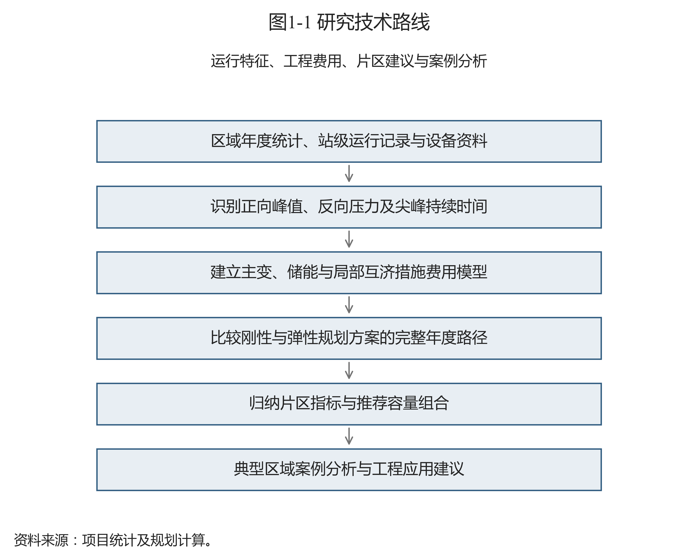

# 第一章 研究背景与意义

## 1.1 分布式新能源发展与电网规划需求

分布式光伏接入位置接近用户侧，其出力随辐照和天气变化，负荷则受产业结构、生产安排及居民用电习惯影响。两者的峰值往往发生在不同时刻。当光伏出力较高而本地用电较少时，部分电力经配电线路和变压器向上级电网反送；在晚间或光伏出力较低的负荷高峰，电网仍需承担正向供电需求。因此，新能源装机增长并不等于变电容量需求按相同比例减少。

徐州地区的年度资料显示，不同区县的分布式光伏装机、降压负荷及变电容量配置存在差异。部分地区需要同时应对正向峰值供电和局部反向功率压力，规划工作应根据具体运行数据识别约束，不能仅凭行政区域名称判断新能源渗透程度，也不能预先把某个季节固定为反送或重载工况。第三章据区县年度统计与研究单元站级数据展开说明，背景统计和进入优化的样本分别界定。

项目任务要求围绕分布式新能源高渗透率地区110 kV电网开展容载比弹性指标优化研究，重点服务于变电容量配置、配套工程安排和区域差异化投资比选。开题报告提出了运行特征分析、工程成本建模、“一片一策”建议及典型案例研究的框架。本报告沿用这一研究主线，技术方法、数值结果和结论范围按照实际完成的建模工作确定。

## 1.2 分布式新能源接入带来的规划问题

传统容量配置主要关注最大正向负荷及其增长。当分布式新能源接入后，同一座变电站可能在不同工况承担正向受电和反向送电。规划人员需要分别识别两个方向的功率极值，并确认这些极值是否来自同一时刻、同一设备范围。把不同站点的各自峰值直接相加，容易形成超过实际同步峰值的压力估计；仅看年度区域最大负荷，又可能掩盖个别站点的反向风险。

工程措施的作用也存在差别。主变容量调整影响长期供电能力；储能受功率、能量和尖峰持续时间约束；中压联络需要供端可转区段、受端余量及通道能力同时满足。即使两个地区具有相近的区域负荷规模，既有设备组合、局部网络结构和尖峰时长不同，也可能对应不同的容量和储能方案。

投资比较还需覆盖措施的不同使用寿命。只比较当年购置金额，会遗漏储能更新及后续固定运维。反之，把存量资产投资重新计入某一方案，也会破坏方案比较的共同起点。本项目采用一致的历史容量起点和评价期，比较新增工程措施产生的费用，解释容量保留、增配、互济及储能之间的替代关系。

## 1.3 容载比指标的应用及固定控制方法的局限

容载比用于描述一定供电范围、一定电压等级的变压器总额定容量与最大正向负荷之间的配置关系。它便于在规划初期筛查容量配置水平、比较年度变化，并为扩建时序提供参考。指标取值应同时说明容量和负荷的统计范围，结合负荷增长、供电安全和下级网络转供条件解释。

新能源改变净负荷形态后，区域容载比可能因为正向峰值变化而升高，即使设备容量未增加，也会出现比值变化。较高的比值既可能代表存量容量裕度，也可能反映分母变化；较低的比值则需要核查站级供电能力和替代措施。单一比值无法直接给出电压、反向承载力或主变停运后的供电结论。

固定控制方法在实际应用中的问题，主要是以同一容量上限处理差异较大的区域。若不考虑既有容量和工程措施费用，控制要求可能促使某些区域在仿真中退出容量，再由储能等措施承担供电需求。其经济性应通过完整规划路径比较，不能用“比值越低越经济”或“比值越高越安全”直接判断。

本项目的刚性对照采用逐年参考容载比上限及累计增配预算；弹性方案放宽研究上限并取消该预算。两方案采用相同候选措施、价格及技术代理条件。该设置用于分析政策控制组合对容量配置和费用的影响，不把研究自设上限当作导则推荐值。

## 1.4 研究目标、内容与技术路线

针对区域统计指标与局部设备压力不完全一致、工程措施替代关系缺少统一费用比较等问题，本项目开展运行特征识别、离散设备配置优化及年度案例分析，为徐州相关地区的容量规划和工程比选提供参考依据。

研究技术路线如图1-1所示。先建立区县背景和站级研究样本，识别正向参考净峰、反向极值与尖峰持续时间；随后构建主变、储能和候选线路的投资及固定费用模型；在相同历史起点下分别求解刚性与弹性完整路径，再按工程条件整理年度参考范围，并通过典型区域案例说明应用条件。

图1-1 研究技术路线

资料来源：项目统计及规划计算；见《数据来源说明》中图1-1的逐项定位。

报告第三章交代研究对象与数据基础，第四章给出实际优化模型及费用边界，第五章围绕图表解释配置和经济结果，第六章分析典型区域及局部互济措施，第七章提出应用流程和后续资料要求。研究输出为样本条件下的规划参考方案，完整承载力评估、逐时储能调度及工程建设校核仍需在后续工作中补充。
