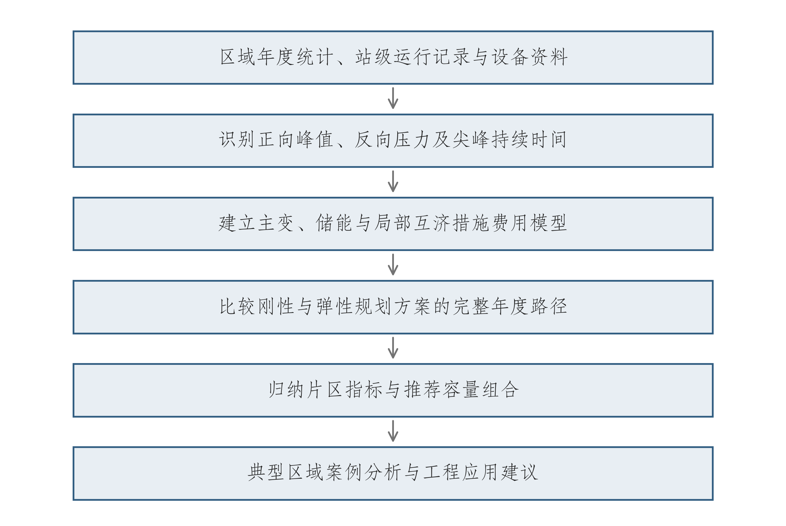

# 第一章 研究背景与意义

## 1.1 分布式新能源发展与电网规划需求

分布式光伏接入位置接近用户侧，其出力随辐照和天气变化，负荷则受产业结构、生产安排及居民用电习惯影响。两者的峰值往往发生在不同时刻。当光伏出力较高而本地用电较少时，部分电力经配电线路和变压器向上级电网反送；在晚间或光伏出力较低的负荷高峰，电网仍需承担正向供电需求。因此，新能源装机增长并不等于变电容量需求按相同比例减少[1][2]。

徐州地区各区县的分布式光伏装机、降压负荷和变电容量配置存在明显差异。规划工作需要结合区域同步峰值、站级反向功率和设备条件，识别各片区的容量需求及局部运行压力。

本项目围绕徐州分布式新能源高渗透率地区110 kV电网，开展运行特征分析、工程成本建模、容载比弹性优化及典型案例研究，形成容量配置、配套工程和“一片一策”投资比选建议。研究内容与配电网高质量发展及源网荷储协同方向衔接[3]。

## 1.2 分布式新能源接入带来的规划问题

传统容量配置主要关注最大正向负荷及其增长。当分布式新能源接入后，同一座变电站可能在不同工况承担正向受电和反向送电。规划人员需要分别识别两个方向的功率极值，并确认这些极值是否来自同一时刻、同一设备范围。把不同站点的各自峰值直接相加，容易形成超过实际同步峰值的压力估计；仅看年度区域最大负荷，又可能掩盖个别站点的反向风险。

工程措施的作用也存在差别。主变容量调整影响长期供电能力；储能受功率、能量和尖峰持续时间约束；中压联络需要供端可转区段、受端余量及通道能力同时满足。即使两个地区具有相近的区域负荷规模，既有设备组合、局部网络结构和尖峰时长不同，也可能对应不同的容量和储能方案。

投资比较采用共同历史容量和统一评价期，将主变、储能与联络措施按投运批次核算首次购置、更新及固定运维费用，分析不同设备寿命和建设时序对方案经济性的影响。

## 1.3 容载比指标的应用及固定控制方法的局限

容载比用于描述一定供电范围、一定电压等级的变压器总额定容量与最大正向负荷之间的配置关系。它便于在规划初期筛查容量配置水平、比较年度变化，并为扩建时序提供参考。《配电网规划设计技术导则（修订稿）》将其用于容量规划分析[4]。指标取值应同时说明容量和负荷的统计范围，结合负荷增长、供电安全和下级网络转供条件解释[5]。

新能源改变净负荷形态后，区域容载比可能因为正向峰值变化而升高，即使设备容量未增加，也会出现比值变化。较高的比值既可能代表存量容量裕度，也可能反映分母变化；较低的比值则需要核查站级供电能力和替代措施。单一比值无法直接给出电压、反向承载力或主变停运后的供电结论。

固定控制方法以统一上限管理不同区域的容量配置。当控制上限约束既有容量保留时，储能等措施需要承担相应的供电需求。容量调整与替代措施的经济性，应结合存量设备、站级约束及完整规划路径评价。

本项目设置刚性与弹性两类控制方案，在共同历史容量、候选措施和价格条件下，比较容载比上限及累计增配预算对容量配置与费用的影响。刚性方案采用年度上限2.0并设置累计增配预算，弹性方案采用研究上限3.2，允许按站级需求安排增配。

## 1.4 研究目标、内容与技术路线

针对区域统计指标与局部设备压力不完全一致、工程措施替代关系缺少统一费用比较等问题，本项目开展运行特征识别、离散设备配置优化及年度案例分析，为徐州相关地区的容量规划和工程比选提供参考依据。

研究技术路线如图1-1所示。先建立区县背景和站级研究样本，识别正向参考净峰、反向极值与尖峰持续时间；随后构建主变、储能和候选线路的投资及固定费用模型；在相同历史起点下分别求解刚性与弹性完整路径，再按工程条件整理年度参考范围，并通过典型区域案例说明应用条件。

图1-1 研究技术路线

资料来源：项目统计及规划计算。

第三章分析研究对象与运行特征，第四章建立容量、储能和区段转供联合优化模型，第五章给出配置、费用及价格敏感性结果，第六章分析邳州和市区典型案例，第七章归纳研究结论并提出后续研究方向。