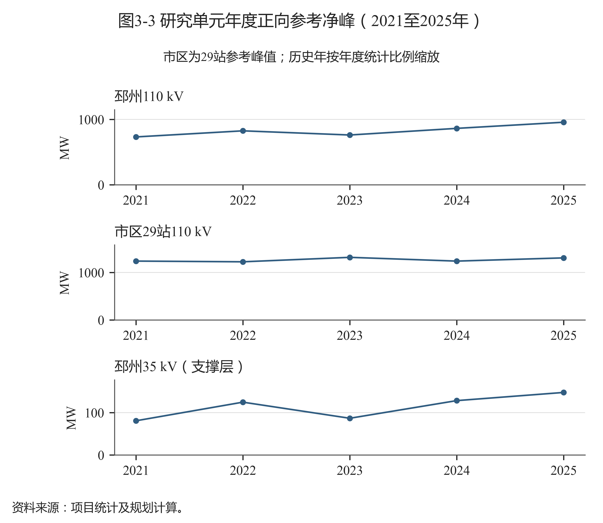
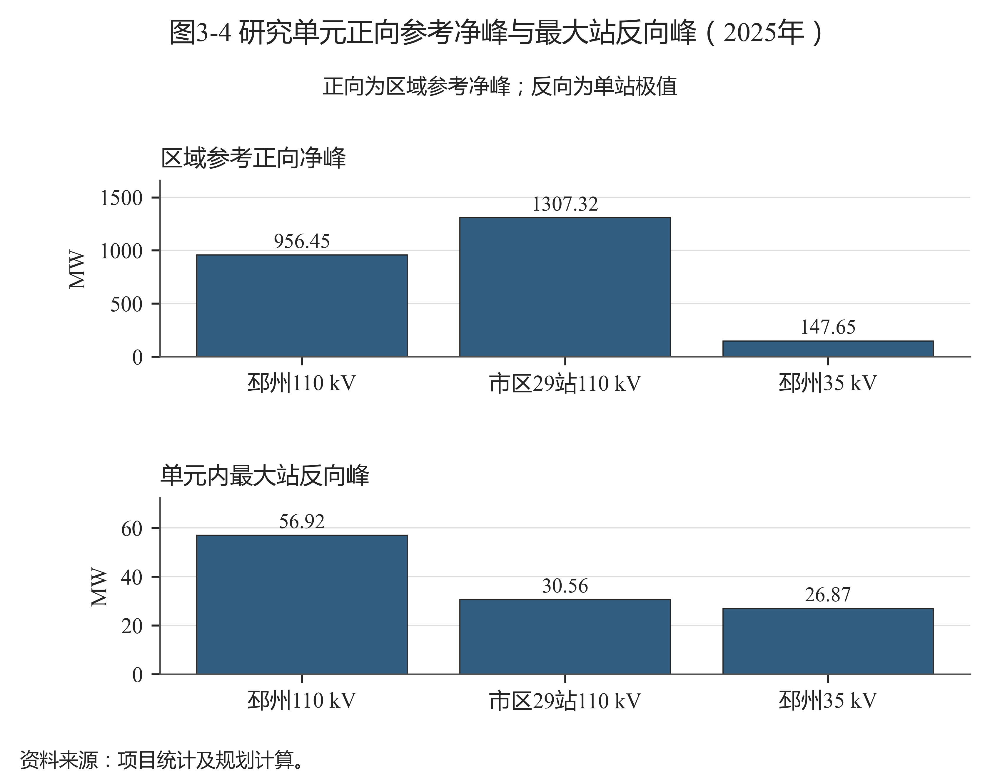
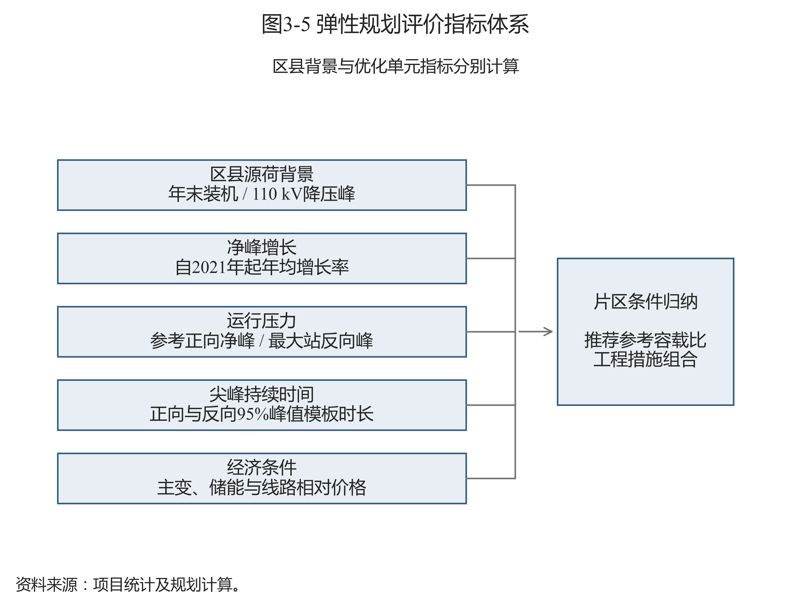

# 第三章 研究对象与数据基础

## 3.1 研究区域及电网统计范围

区域背景覆盖源表中的市区、贾汪、邳州、新沂、铜山、丰县、沛县和睢宁八个统计单元。“市区”沿用资料原有统计范围，不直接等同于某一行政区。背景统计用于说明地区差异；实际工程优化分别在邳州110 kV、市区29站110 kV及邳州35 kV支撑层开展，其他地区不填入本模型的优化结果。

研究单元与基期容量见表3-1。邳州110 kV包含20座站，35 kV支撑层包含8座站；市区按29座样本站计算。三个单元分别建立容量、负荷及费用边界，35 kV与110 kV不混加，以避免上下级供电范围重复统计。

表3-1 研究单元与基期容量

| 研究单元 | 站数（座） | 2021年容量（MVA） | 2025年参考净峰（MW） | 网络条件 |
| --- | --- | --- | --- | --- |
| 邳州110 kV | 20 | 2027.0 | 956.450 | 有候选互济 |
| 市区29站110 kV | 29 | 2948.0 | 1307.315 | 无站间互济候选 |
| 邳州35 kV（支撑层） | 8 | 245.0 | 147.650 | 无站间互济候选 |

资料来源：项目统计及规划计算；原始数据定位见《数据来源说明》。

2021年是两方案共同起点。邳州两个电压层采用甲方区域总容量，再根据2025年设备快照的站级比例分配并选择当地离散规格；总量分别为2027 MVA和245 MVA。市区29站按样本容量及全市区2021/2025年容量比例折算，离散分配总量为2948 MVA，与折算目标相差约0.649 MVA。这些逐站起点属于研究分配，不能作为2021年历史设备台账；市区另有三站缺少可对应设备容量，保留其容量来源标记。

各区域2025年110 kV基础指标见表3-2。原表容载比与容量除以降压峰的计算值并列保存，例如邳州原表为2.240，计算值为2.237，差别来自显示精度和原表记录。市区全区容量为3701 MVA、降压峰为1528.820 MW；其原表比值2.420不能直接用于29站样本。

表3-2 各区域110 kV基础指标（2025年）

| 区域 | 主变容量（MVA） | 降压峰（MW） | 原表容载比（MVA/MW） | 容量/降压峰（MVA/MW） |
| --- | --- | --- | --- | --- |
| 市区 | 3701.0 | 1528.820 | 2.420 | 2.421 |
| 贾汪 | 966.5 | 313.030 | 3.090 | 3.088 |
| 邳州 | 2139.5 | 956.450 | 2.240 | 2.237 |
| 新沂 | 1979.5 | 734.910 | 2.690 | 2.694 |
| 铜山 | 1877.0 | 813.380 | 2.310 | 2.308 |
| 丰县 | 1425.0 | 544.550 | 2.620 | 2.617 |
| 沛县 | 2094.0 | 634.280 | 3.300 | 3.301 |
| 睢宁 | 1839.0 | 759.560 | 2.420 | 2.421 |

资料来源：项目统计及规划计算；原始数据定位见《数据来源说明》。

## 3.2 分布式光伏装机与区县源荷背景

各区县2023至2025年末分布式光伏装机如图3-1所示。装机数据取月度原表12月值，按已确认的万千瓦单位转换为MW。邳州由2023年的564.702 MW增至2025年的1559.638 MW，市区由253.679 MW增至491.180 MW。数据表示区县年度装机背景，未将县域装机人为分配到各个优化电压层或市区29站。

图3-1 各区县年末分布式光伏装机（2023至2025年）

资料来源：项目统计及规划计算；见《数据来源说明》中图3-1的逐项定位。

区县源荷比对比如图3-2所示。现有资料缺少同范围用户最大用电负荷实测值，因此以110 kV年度降压峰作为分母近似。2025年市区约为0.321，邳州约为1.631，新沂约为1.803。该差异提示规划时需分别核查当地源荷和站级分布；它不直接给出设备承载力、允许并网容量或反向负载率结论。

图3-2 区县源荷比对比（2025年，降压峰近似）

资料来源：项目统计及规划计算；见《数据来源说明》中图3-2的逐项定位。

邳州35 kV与110 kV共用邳州区县背景，市区29站采用市区背景。背景指标的统计范围与工程配置指标的研究单元范围分别标注。2022年缺少同口径实际装机，不用回推值补成完整源荷矩阵；2023至2025年共有九条年度案例可参与五类指标分析。

## 3.3 正向参考净峰、反向极值与尖峰时长

研究单元年度正向参考净峰如图3-3所示。邳州年度分母采用甲方《近5年容载比》中的降压负荷；市区采用29站已观测同步峰，再按官方年度峰值比例缩放。正向参考净峰在优化过程中固定，不随规划储能动作改变，便于保持两方案的指标比较基准。

图3-3 研究单元年度正向参考净峰（2021至2025年）

资料来源：项目统计及规划计算；见《数据来源说明》中图3-3的逐项定位。

邳州110 kV参考净峰由2023年的761.232 MW增至2025年的956.450 MW；市区29站2023年为1318.771 MW，2024年降至1239.404 MW，2025年为1307.315 MW。年度分母具有波动，不能用光伏装机增长直接替代净峰增长，也不能把参考峰称为全年平均用电负荷。

正向参考净峰与最大站反向峰如图3-4所示，详细指标见表3-3。2025年邳州110 kV的最大站反向峰为56.920 MW，市区29站为30.557 MW，邳州35 kV为26.870 MW。图中正向值为区域参考峰，反向值为各站反向极值中的最大值，两者层级不同，不能视为同一时刻的一组区域正反向潮流。

图3-4 研究单元正向参考净峰与最大站反向峰（2025年）

资料来源：项目统计及规划计算；见《数据来源说明》中图3-4的逐项定位。

表3-3 研究单元运行特征指标（2025年）

| 研究单元 | 正向参考净峰（MW） | 最大站反向峰（MW） | 正向尖峰模板（h） | 反向尖峰模板（h） |
| --- | --- | --- | --- | --- |
| 邳州110 kV | 956.450 | 56.920 | 4 | 3 |
| 市区29站110 kV | 1307.315 | 30.557 | 5 | 2 |
| 邳州35 kV（支撑层） | 147.650 | 26.870 | 3 | 2 |

资料来源：项目统计及规划计算；原始数据定位见《数据来源说明》。

三个研究单元的正向尖峰时长模板分别为4、5和3 h，反向为3、2和2 h。时长按达到方向峰值95%的最长连续时段计算，既不同于95分位数，也不同于全年超过门槛的累计小时数。储能需同时满足功率和能量持续条件，这组指标用于约束有效功率，具体定义见第四章。

## 3.4 数据来源与处理流程

基础资料包括甲方年度容载比及负荷统计、主变设备台账、2025年站级时序、逐月分县光伏装机、邳州馈线和联络资料、本地工程投资汇总及储能采购案例。年度统计负责区域总量和参考峰，设备台账提供离散容量规格，时序和局部网络资料负责运行场景及候选措施，价格材料用于增量费用估计。原始记录、统计近似、历史模板和优化输出分层保存，详细文件及位置见《数据来源说明》。

处理时先统一地区、站点与设备身份，核对电压层级和单位，再清理重复时序并建立多源映射。区域参考峰按同一统计范围计算，站级反向极值独立识别。历史站级场景依据2025年模板和年度比例构造，不能写成完整五年逐站实测序列。

邳州2025年逐时列经跨源映射形成站级负荷，共同缺值小时保留缺测。市区29站共同观测时长为8339 h，缺421 h；持续时间采用已登记的周类比均值补值场景。市区原表第二列表头误写为“值(kV)”，经项目单位确认按有功净负荷MW解释，正值表示下网用电，负值表示向上级反送。原表保留，补值序列与观测序列分别标记。

历史反向场景由春秋工作日日间窗口、夜间负荷代理及年度缩放形成，2021至2022年光伏比例含回推。年度正向分母、历史反向代理和2025年观测极值各有出处；站点非同时峰值不合成区域实测同步反向峰。工程费用按同一投运年度、寿命、运维和折现规则计算，投资材料的案例范围与价格性质同时登记。

## 3.5 指标体系与数据用途

指标体系围绕源荷背景、净峰增长、净负荷极值、尖峰持续时间和措施相对成本五类条件组织，如图3-5所示。源荷背景描述区县装机水平，其余运行和工程指标按优化单元解释。各类指标共同描述应用条件，不赋予未经确认的综合权重。

图3-5 弹性规划评价指标体系

资料来源：项目统计及规划计算；见《数据来源说明》中图3-5的逐项定位。

区县源荷背景与年度推荐比值如图3-6所示。邳州110 kV在源荷近似值增高的三个年度中，推荐比值由2.738降至2.191；市区29站则随年度净峰波动在2.260、2.405和2.280之间变化。该图用于呈现样本差异，不能据此建立源荷比决定容载比的因果关系。各年度共用设备和时长模板，也不构成相互独立的验证样本。

图3-6 区县源荷背景与年度推荐比值

资料来源：项目统计及规划计算；见《数据来源说明》中图3-6的逐项定位。

电量渗透率和完整年度主变实测负载率尚缺可用于本报告的闭合数据，因此不生成相应数值或关联结论。后续需要补充同范围年度发电量、用电量及设备运行方式，方可增加这些指标，并与现有背景和工程边界重新核对。
