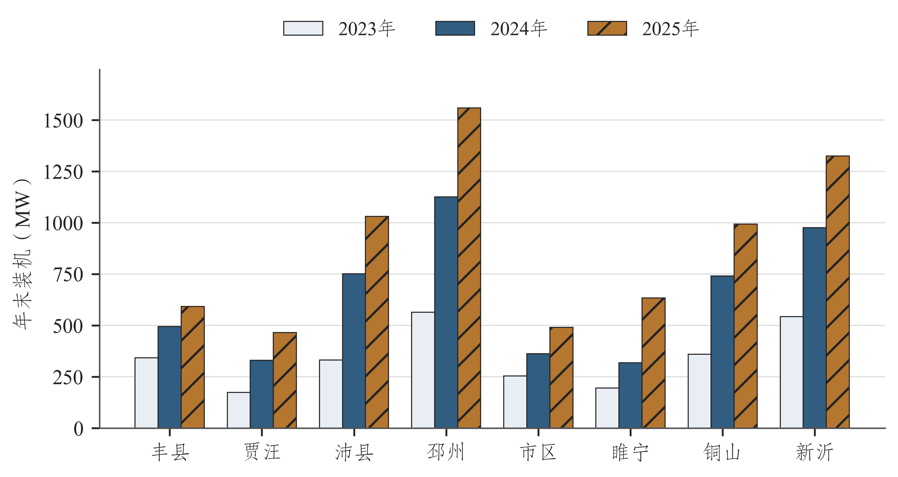
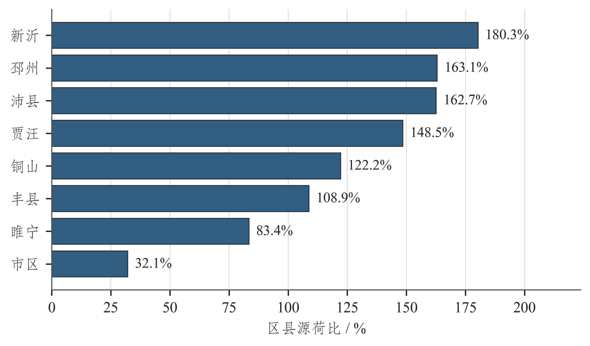
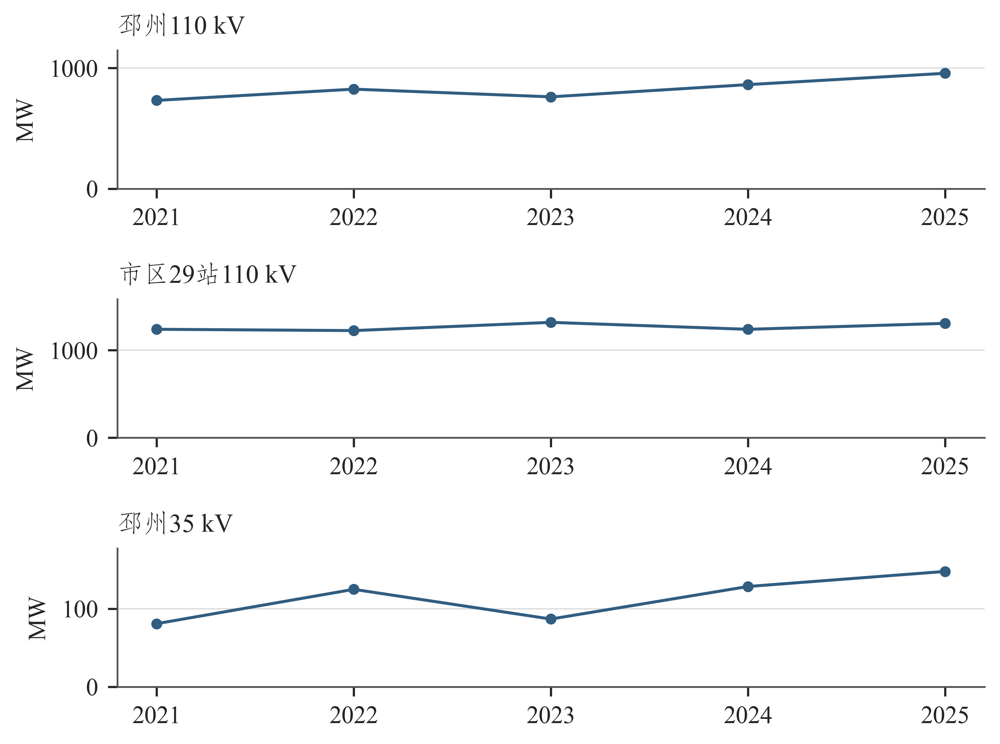
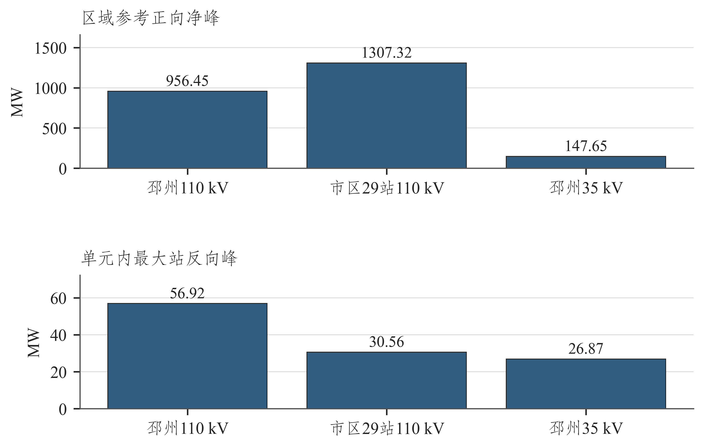
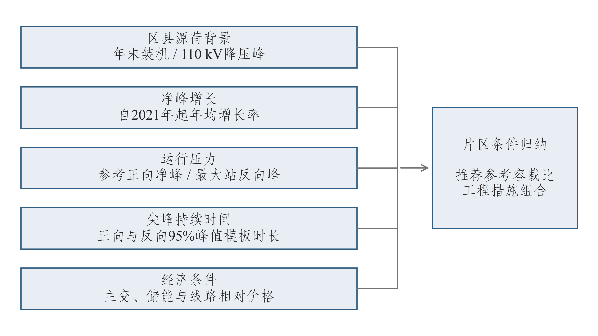
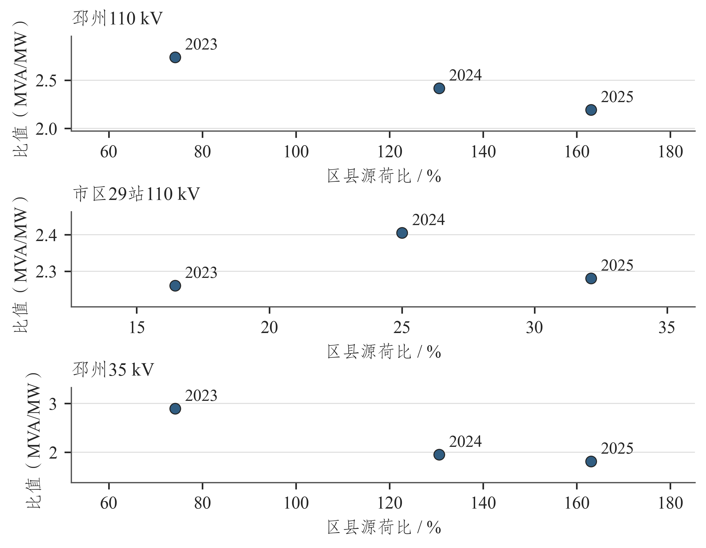

# 第三章 研究对象与数据基础

## 3.1 研究区域及电网统计范围

本项目以市区、贾汪、邳州、新沂、铜山、丰县、沛县和睢宁八个统计单元分析徐州区域源荷背景，以邳州110 kV、市区29站110 kV和邳州35 kV支撑层开展工程配置优化。市区范围采用原始统计资料的定义。

研究单元与基期容量见表3-1。邳州110 kV包含20座站，35 kV支撑层包含8座站；市区样本包含29座110 kV站。三个单元分别计算容量、负荷和费用。

表3-1 研究单元与基期容量

| 研究单元 | 站数（座） | 2021年容量（MVA） | 2025年参考净峰（MW） | 网络条件 |
| --- | --- | --- | --- | --- |
| 邳州110 kV | 20 | 2027.0 | 956.450 | 有候选互济 |
| 市区29站110 kV | 29 | 2948.0 | 1307.315 | 无站间互济候选 |
| 邳州35 kV（支撑层） | 8 | 245.0 | 147.650 | 无站间互济候选 |

资料来源：项目统计及规划计算。

两方案以2021年容量为共同起点。邳州按区域总容量和2025年站级设备比例，结合当地离散规格分配，110 kV、35 kV总量分别为2027 MVA和245 MVA。市区29站按样本容量及全市区2021/2025年容量比例折算，离散分配总量为2948 MVA，与折算目标相差约0.649 MVA。上述起点为历史容量估计；市区三座站的设备容量来源另作标记。

各区域2025年110 kV基础指标见表3-2。表中并列展示原表容载比与容量除以降压峰的计算值。邳州两值分别为2.240和2.237，反映原表记录与显示精度差异；全市区容量为3701 MVA、降压峰为1528.820 MW，原表比值为2.420。市区29站样本另按其容量和参考峰计算。

表3-2 各区域110 kV基础指标（2025年）

| 区域 | 主变容量（MVA） | 降压峰（MW） | 原表容载比（MVA/MW） | 容量/降压峰（MVA/MW） |
| --- | --- | --- | --- | --- |
| 市区 | 3701.0 | 1528.820 | 2.420 | 2.421 |
| 贾汪 | 966.5 | 313.030 | 3.090 | 3.088 |
| 邳州 | 2139.5 | 956.450 | 2.240 | 2.237 |
| 新沂 | 1979.5 | 734.910 | 2.690 | 2.694 |
| 铜山 | 1877.0 | 813.380 | 2.310 | 2.308 |
| 丰县 | 1425.0 | 544.550 | 2.620 | 2.617 |
| 沛县 | 2094.0 | 634.280 | 3.300 | 3.301 |
| 睢宁 | 1839.0 | 759.560 | 2.420 | 2.421 |

资料来源：项目统计及规划计算。

## 3.2 分布式光伏装机与区县源荷背景

各区县2023至2025年末分布式光伏装机如图3-1所示。装机取月度原表12月值，由万千瓦转换为MW。邳州由2023年的564.702 MW增至2025年的1559.638 MW，市区由253.679 MW增至491.180 MW，体现两地分布式光伏发展的规模差异。

图3-1 各区县年末分布式光伏装机（2023至2025年）

资料来源：项目统计及规划计算。

区县源荷比对比如图3-2所示。本研究以区县年末光伏装机与110 kV年度降压峰之比近似描述源荷背景。2025年市区约为0.321，邳州约为1.631，新沂约为1.803。邳州、新沂的装机相对负荷水平较高，容量规划需重点分析站级反向压力及其分布。

图3-2 区县源荷比对比（2025年，降压峰近似）

资料来源：项目统计及规划计算。

邳州35 kV与110 kV采用邳州区县背景，市区29站采用市区背景。2023至2025年装机资料与三个研究单元对应，形成九条年度案例，用于源荷背景、净峰增长、正反向压力、尖峰时长和相对价格五类条件分析。

## 3.3 正向参考净峰、反向极值与尖峰时长

研究单元年度正向参考净峰如图3-3所示。邳州年度分母采用甲方《近5年容载比》中的降压负荷；市区采用29站已观测同步峰，再按官方年度峰值比例缩放。正向参考净峰在优化过程中固定，不随规划储能动作改变，便于保持两方案的指标比较基准。

图3-3 研究单元年度正向参考净峰（2021至2025年）

资料来源：项目统计及规划计算。

邳州110 kV参考净峰由2023年的761.232 MW增至2025年的956.450 MW；市区29站2023年为1318.771 MW，2024年降至1239.404 MW，2025年为1307.315 MW。两地的年度峰值变化不同，需要结合各自负荷走势安排增配时序。

正向参考净峰与最大站反向峰如图3-4所示，详细指标见表3-3。2025年邳州110 kV最大站反向峰为56.920 MW，市区29站为30.557 MW，邳州35 kV为26.870 MW。区域正向参考峰描述总体供电需求，最大站反向峰用于识别局部反送压力。

图3-4 研究单元正向参考净峰与最大站反向峰（2025年）

资料来源：项目统计及规划计算。

表3-3 研究单元运行特征指标（2025年）

| 研究单元 | 正向参考净峰（MW） | 最大站反向峰（MW） | 正向尖峰模板（h） | 反向尖峰模板（h） |
| --- | --- | --- | --- | --- |
| 邳州110 kV | 956.450 | 56.920 | 4 | 3 |
| 市区29站110 kV | 1307.315 | 30.557 | 5 | 2 |
| 邳州35 kV（支撑层） | 147.650 | 26.870 | 3 | 2 |

资料来源：项目统计及规划计算。

三个研究单元的正向尖峰时长模板分别为4、5和3 h，反向为3、2和2 h。时长取达到方向峰值95%的最长连续时段，用于按能量持续能力折算储能有效功率，计算方法见第四章。

## 3.4 数据来源与处理流程

基础资料包括甲方年度容载比和负荷统计、主变设备台账、2025年站级时序、逐月分县光伏装机、邳州馈线和联络资料、本地工程投资汇总及储能采购案例。年度统计确定区域总量和参考峰，设备台账提供容量规格，站级时序提取运行场景，联络资料形成转供候选，工程和采购资料确定费用参数。

数据处理依次完成站点及设备身份映射、电压等级与单位核对、重复时序清理、极值和时长提取。历史站级场景以2025年模板按年度比例构造。

邳州2025年逐时列经跨源映射形成站级负荷，共同缺值小时保留缺测。市区29站共同观测时长为8339 h，缺421 h；持续时间采用已登记的周类比均值补值场景。市区原表第二列表头误写为“值(kV)”，经项目单位确认按有功净负荷MW解释，正值表示下网用电，负值表示向上级反送。原表保留，补值序列与观测序列分别标记。

历史反向场景结合春秋工作日日间窗口、夜间负荷代理和年度比例构造，2021至2022年光伏比例采用回推。2025年反向极值按站级观测提取。工程费用按投运批次计算首次投资、更新和运维，并统一折现。

## 3.5 指标体系与数据用途

指标体系围绕源荷背景、净峰增长、净负荷极值、尖峰持续时间和措施相对成本五类条件组织，如图3-5所示。源荷背景采用区县统计，其余运行与工程指标按研究单元计算，共同用于解释容量配置差异。

图3-5 弹性规划评价指标体系

资料来源：项目统计及规划计算。

区县源荷背景与年度推荐比值如图3-6所示。邳州110 kV在源荷近似值增高的三个年度中，推荐比值由2.738降至2.191；市区29站随年度净峰波动，在2.260、2.405和2.280之间变化。结合表3-3和年度容量路径，可进一步分析装机背景、峰值需求及设备配置对推荐值的共同影响。

图3-6 区县源荷背景与年度推荐比值

资料来源：项目统计及规划计算。

