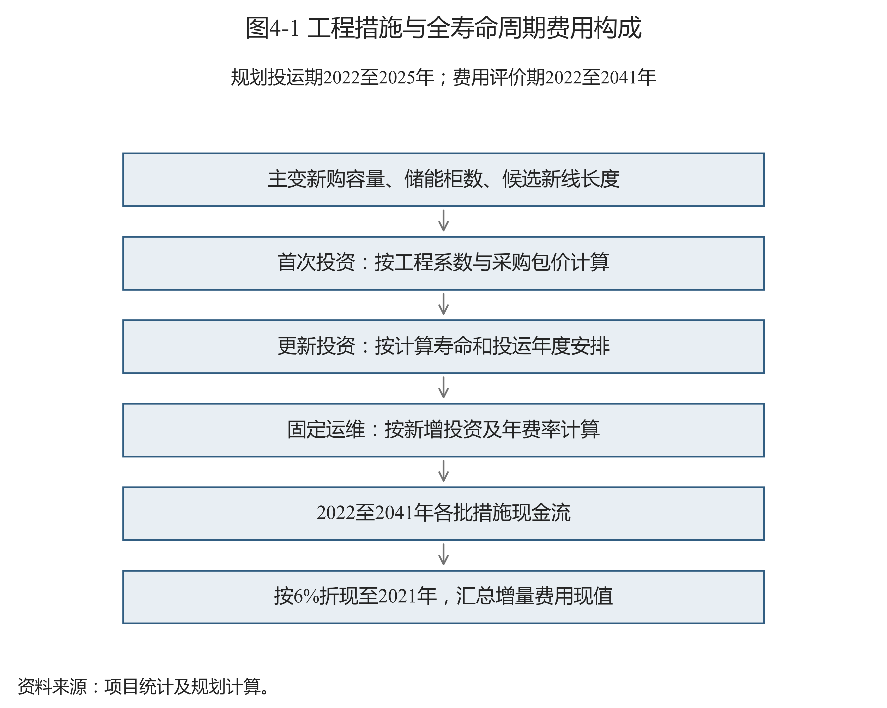

# 第四章 弹性容载比优化模型

## 4.1 问题定义与比较条件

本章研究给定历史容量、年度负荷场景和工程措施集合时，如何配置主变容量、储能及局部互济措施，使新增工程的评价期费用最低，并整理对应的年度规划参考容载比。基期为2021年，投运决策期为2022至2025年，费用评价期为2022至2041年。邳州110 kV、市区29站110 kV和邳州35 kV支撑层分别求解，费用不跨层汇总。

模型首先满足站级正向容量、反向静态筛查及单台主变停运承载代理条件，再比较工程费用。站级时序用于形成极值和持续时间输入，实际优化采用离散容量组合及静态场景。尚未开展完整交流潮流、逐时储能荷电状态或保护校核。

两方案设置见表4-1。刚性方案逐年限制规划参考容载比不超过2.0，并按单元设置累计正向增配预算。弹性方案将研究控制上限放宽至3.2，不设置该预算。共同起点、设备规格、候选措施、技术代理条件与价格保持一致。费用差反映两项控制条件的组合影响，不能全部归因于单独改变比值上限。

表4-1 刚性与弹性规划方案设置

| 研究单元 | 刚性比值上限 | 弹性比值上限 | 刚性累计增配预算 | 弹性增配预算 | 停运恢复比例 |
| --- | --- | --- | --- | --- | --- |
| 邳州110 kV | 2.0 | 3.2 | 3% | 不设此项预算 | 60% |
| 市区29站110 kV | 2.0 | 3.2 | 1% | 不设此项预算 | 45% |
| 邳州35 kV（支撑层） | 2.0 | 3.2 | 30% | 不设此项预算 | 60% |

资料来源：项目统计及规划计算；原始数据定位见《数据来源说明》。

本研究允许仿真容量退出，后续升档仍按购入设备容量计价。退出未计拆改和残值，存量沉没投资不计入新增费用。容量退出是研究动作，实际工程实施需另行核查设备利用、资产处置和施工条件。

## 4.2 指标定义与标准依据

### 4.2.1 标准承载力公式与本模型的边界

DL/T 2041—2025《分布式电源接入电力系统承载力评估导则》第6.3条给出的设备级承载力区间为：

\[
S_d=\frac{P-P_G+P_{\mathrm{ESS}}+S_e\cos\theta\,\beta}{\tau_{\max}}+\Delta P_{\mathrm{ESS}}.\tag{4-1}
\]

其中，\(S_d\)为设备级分布式电源承载力区间，按装机有功口径表示，单位MW。\(P\)为典型时刻供电范围内用电负荷，单位MW。\(P_G\)为同一时刻除分布式电源以外的其他电源出力，单位MW。\(P_{\mathrm{ESS}}\)为已并网灵活调节资源的充电功率，单位MW。\(S_e\)为变压器额定容量，单位MVA。\(\cos\theta\)为功率因数，可取0.95，无量纲。\(\beta\)为最大反向负载率，无量纲。\(\tau_{\max}\)为分布式电源最大出力系数，无量纲。\(\Delta P_{\mathrm{ESS}}\)为规划新增灵活调节资源装机规模区间，单位MW。新增资源区间在除以出力系数后相加，不重复计入已并网资源。

该导则第6.4条要求结合主变运行方式确定反向负载率。分列或仅一台运行时可按相应条件取80%。并列运行需结合供电安全、运行条件等确定。本模型采用站级总容量的80%系数进行静态筛查，未按实际运行方式逐台计算标准设备承载力，因此式（4-1）用于说明标准依据，不作为本报告已求得的承载力结果。

县级承载力还需要协调系统级和设备级边界。导则第7.2条表达为：

\[
S=[\min(S_{s,\min},S_{D,\min}),\ \min(S_{s,\max},S_{D,\max})].\tag{4-2}
\]

其中，\(S\)为县级校核后的承载力区间。\(S_{s,\min}\)、\(S_{s,\max}\)为系统级下、上限。\(S_{D,\min}\)、\(S_{D,\max}\)为县级设备承载力下、上限，单位均为MW。上下级设备按导则范围汇总，不把不同电压层重复相加。当前缺少系统级评估输入，本报告不发布县级承载力区间。

导则第8.3、8.5条区分可开放并网容量和可开放备案容量：

\[
C_{s1}=S-S_{s,\mathrm{con}},\quad C_{s2}=C_{s1}-S_{s,\mathrm{reg}},\qquad
C_{d1}=S_d-S_{d,\mathrm{con}},\quad C_{d2}=C_{d1}-S_{d,\mathrm{reg}}.\tag{4-3}
\]

其中，下标\(s\)、\(d\)分别表示县级和设备级。\(C_{s1}\)、\(C_{d1}\)为可开放并网容量区间，\(C_{s2}\)、\(C_{d2}\)为可开放备案容量区间。\(S\)、\(S_d\)为相应承载力区间。\(S_{s,\mathrm{con}}\)、\(S_{d,\mathrm{con}}\)为已并网装机。\(S_{s,\mathrm{reg}}\)、\(S_{d,\mathrm{reg}}\)为有效备案期内已备案未并网装机，单位均为MW。当前未形成完整备案及上下级容量校核，不能据优化结果发布可开放容量或红黄绿等级。

导则的现行信息见[全国标准信息公共服务平台](https://std.samr.gov.cn/hb/search/stdHBDetailed?id=52C44B7747821D39E06397BE0A0A8891)。容载比和源荷比的概念另参考项目留存的《配电网规划设计技术导则（修订稿）》。该修订稿与DL/T 2041—2025应分别引用。本研究的3.2上限、恢复比例、持续时间门槛及费用参数均为研究设置。

### 4.2.2 规划参考容载比及净负荷极值

为保持方案比较的一致性，先界定同范围正向净峰，再使用固定年度参考分母计算比值：

\[
P_y^+=\max\!\left(0,\max_t\sum_i p_{iy}(t)\right),\quad
S_{iy}=s_{i1y}+s_{i2y},\quad S_y=\sum_iS_{iy},\quad
R_y=\frac{S_y}{\widehat P_y^+}.\tag{4-4}
\]

其中，\(i\)为站点索引，\(y\)为年度，\(t\)为同一时刻，索引无量纲。\(p_{iy}(t)\)为站级净有功负荷，正值表示受电、负值表示反送，单位MW。\(P_y^+\)为区域同期最大正向净负荷，单位MW。\(s_{i1y}\)、\(s_{i2y}\)为两台主变额定容量，\(S_{iy}\)和\(S_y\)为站级、区域总容量，单位MVA。\(\widehat P_y^+\)为本模型固定年度正向参考净峰，单位MW。\(R_y\)为规划参考容载比，按工程习惯作为比值使用，量纲口径为MVA/MW。

分母不乘功率因数，也不扣除本次规划储能动作。实际物理容载比需要措施后同边界的真实负荷序列，本报告规划参考值不能替代该运行指标。站级反向极值另行计算：

\[
P_{iy}^-=\max_{t\in\mathcal T_y}\max\{-p_{iy}(t),0\},\qquad
P_{\mathrm{station},y}^-=\max_iP_{iy}^-.\tag{4-5}
\]

其中，\(\mathcal T_y\)为年度可用时段集合。\(P_{iy}^-\)为站级反向峰，\(P_{\mathrm{station},y}^-\)为研究范围最大站反向峰，\(p_{iy}(t)\)含义同式（4-4），单位均为MW。历史年度使用对应构造场景，不把最大站峰或站峰之和称为区域同步反向峰。

### 4.2.3 源荷比与净峰增长率

同范围装机与用户最大用电负荷的源荷比定义，以及本研究采用的区县近似表达为：

\[
\eta_{\mathrm{DG},y}=\frac{C_{\mathrm{DG},y}}{P_{\mathrm{L},\max,y}},\qquad
\widehat\eta_{c,y}=\frac{C_{\mathrm{PV},c,y}}{P_{110,\mathrm{down},c,y}}.\tag{4-6}
\]

其中，\(C_{\mathrm{DG},y}\)为同供电范围已并网分布式电源装机，\(P_{\mathrm{L},\max,y}\)为该范围用户最大用电负荷，单位MW。\(c\)为区县统计单元。\(C_{\mathrm{PV},c,y}\)为区县年末分布式光伏装机，\(P_{110,\mathrm{down},c,y}\)为区县110 kV年度降压峰，单位MW。\(\eta_{\mathrm{DG},y}\)、\(\widehat\eta_{c,y}\)均无量纲。前式为源荷概念表达，后式为资料条件下的研究近似，两者不作为DL/T 2041—2025的原式。

年度净峰变化采用自2021年的复合平均增长率，也可单列同比：

\[
g_y=\left(\frac{\widehat P_y^+}{\widehat P_{2021}^+}\right)^{1/(y-2021)}-1,\qquad
g_y^{\mathrm{yoy}}=\frac{\widehat P_y^+}{\widehat P_{y-1}^+}-1.\tag{4-7}
\]

其中，\(\widehat P_y^+\)、\(\widehat P_{2021}^+\)、\(\widehat P_{y-1}^+\)为相应年度正向参考净峰，单位MW且分母大于零。\(y>2021\)。\(g_y\)为基期至评价年净峰年均增长率，\(g_y^{\mathrm{yoy}}\)为同比增长率，均以比例计算，显示时乘100%表示。该增长率不表示全年平均负荷或用户毛负荷增长。

### 4.2.4 尖峰持续时间与储能有效功率

储能的容量替代作用需同时考虑功率和持续时间。本研究采用方向峰值95%以上的最长连续段：

\[
\mathcal A_i^{\pm}=\{A:A\text{为连续时段，且 }p_i^{\pm}(t)\geq0.95p_{i,\max}^{\pm},\ \forall t\in A\},\quad
D_{95,i}^{\pm}=\max_{A\in\mathcal A_i^{\pm}}|A|\Delta t,\quad
D_{95}^{\pm}=\max_iD_{95,i}^{\pm}.\tag{4-8}
\]

其中，\(p_i^+(t)=\max(p_i(t),0)\)、\(p_i^-(t)=\max(-p_i(t),0)\)，\(p_i(t)\)为模板净负荷，\(p_{i,\max}^{\pm}\)为相应方向峰值，单位MW。\(A\)为连续时段集合，\(|A|\)为时点数。\(\Delta t=1\) h。\(D_{95,i}^{\pm}\)为站级持续时间，\(D_{95}^{\pm}\)为各站时长最大值，单位h。没有相应方向峰值时按零峰规则处理，不将全年零值判为尖峰。

单柜规格为0.1 MW和0.215 MWh，采用以下有效功率代理：

\[
e_i^{\pm}=\min\left(0.1,\frac{0.215}{D_{95,i}^{\pm}}\right),\qquad
E_{iy}^{\pm}=n_{iy}e_i^{\pm}.\tag{4-9}
\]

其中，\(e_i^{\pm}\)为单柜有效功率，单位MW/柜。0.1为单柜额定功率，单位MW/柜。0.215为额定能量，单位MWh/柜。\(D_{95,i}^{\pm}\)单位h。\(n_{iy}\)为在役柜数，单位柜。\(E_{iy}^{\pm}\)为相应方向储能有效功率，单位MW。无对应方向峰值时单柜按额定功率处理，不执行除零。历史年沿用2025年时长模板。代理未计充放电效率、衰减和逐时荷电状态，正反向能力也未经统一调度验证。

### 4.2.5 措施相对价格

价格敏感性按同规格措施的基准价格归一化：

\[
a_T=\frac{c_T}{c_{T,0}},\quad a_E=\frac{c_E}{c_{E,0}},\quad a_L=\frac{c_L}{c_{L,0}},\qquad
\kappa_{TE}=\frac{a_T}{a_E},\quad\kappa_{LE}=\frac{a_L}{a_E}.\tag{4-10}
\]

其中，\(c_T,c_{T,0}\)为情景和基准主变工程系数，单位万元/MVA。\(c_E,c_{E,0}\)为同规格储能报价，使用相同万元/柜或成套总价单位。\(c_L,c_{L,0}\)为同范围线路单位投资，单位万元/km。\(a_T,a_E,a_L\)为价格倍率，\(\kappa_{TE},\kappa_{LE}\)为相对倍率，均无量纲。它们是费用输入条件，不是不同设备单价的直接量纲比，也不是优化后总费用的比值。

## 4.3 决策变量与路径连续性

各站每年从本地区、同电压台账规格构成的两台主变组合中选择一种。将组合及跨年动作展开后，非线性的规格判断可用常数系数表达，模型成为混合整数线性规划：

\[
\sum_{k\in\mathcal K_i}w_{iyk}=1,\quad
s_{ijy}=\sum_{k\in\mathcal K_i}a_{ikj}w_{iyk},\quad w_{iyk}\in\{0,1\},
\qquad
\sum_{k'}h_{iykk'}=w_{i,y-1,k},\quad
\sum_kh_{iykk'}=w_{iyk'}.\tag{4-11}
\]

其中，\(\mathcal K_i\)为站点可选双主变组合集合。\(k,k'\)为前后组合索引，\(j=1,2\)为按容量排序的主变槽位。\(a_{ikj}\)为组合中的固定额定容量，\(s_{ijy}\)为选定容量，单位MVA。\(w_{iyk}\)为组合选择二元变量。\(h_{iykk'}\)为年度转移二元变量，均无量纲。2022年的前一年度状态固定为2021年共同起点。转移约束保证2022至2025年构成连续路径，不能逐年拼接不同方案。

储能柜数、计价包数和新线状态满足：

\[
0\leq n_{iy}\leq50,\quad n_{iy}\in\mathbb Z,\quad
10b_{iy}-9\leq n_{iy}\leq10b_{iy},\quad b_{iy}\in\{0,1,\ldots,5\},\quad
n_{iy}\geq n_{i,y-1},\quad b_{iy}\geq b_{i,y-1},
\qquad u_{ey}\in\{0,1\},\quad u_{ey}\geq u_{e,y-1}.\tag{4-12}
\]

其中，\(n_{iy}\)单位柜，\(b_{iy}\)为十柜采购包数，无量纲，约束等价于在役柜数除以十向上取整。\(u_{ey}\)表示候选新线\(e\)在年度\(y\)是否已建成，无量纲。基期新增储能和新线状态为零。新增柜数和采购包数不下降，线路建成后保持在役。50柜是研究决策上限，尚不是站址容量认证。

## 4.4 技术约束与控制条件

### 4.4.1 正反向容量和停运承载代理

各站正常正向条件及反向静态筛查分别写为：

\[
0.95S_{iy}+E_{iy}^++X_{iy}^+\geq L_{iy}^+,\qquad
0.95\times0.8S_{iy}+E_{iy}^-+X_{iy}^-\geq L_{iy}^-.\tag{4-13}
\]

其中，\(S_{iy}\)为站级双主变额定容量，单位MVA。\(E_{iy}^{\pm}\)为储能有效功率，\(X_{iy}^{\pm}\)为对应场景的净送出转供功率（送出减受入），\(L_{iy}^{\pm}\)为站级正、反向静态需求，单位均为MW。0.95为功率因数，0.8为研究反向筛查系数，均无量纲。供端转供减轻本站需求，受端相应增加需求。

单台主变停运时，采用双主变中较小一台的容量代表较不利的剩余能力：

\[
0.95\min(s_{i1y},s_{i2y})+E_{iy}^++fX_{iy}^+\geq fL_{iy}^+.\tag{4-14}
\]

其中，\(s_{i1y},s_{i2y}\)单位MVA。\(E_{iy}^+,X_{iy}^+,L_{iy}^+\)单位MW。\(f\)为本研究假定的停运恢复比例，邳州取0.60，市区取0.45，无量纲。其余负荷假定由更大范围中压网络恢复，但未逐线验证，因此该式称单台主变停运承载代理，不称完整工程N−1校核。接受优化结果仍需核实实际供电恢复范围。

### 4.4.2 容载比上限和正向增配预算

年度容量与累计增配量采用以下控制：

\[
S_y\leq\overline R\widehat P_y^+,\qquad
\sum_{i}\sum_{y=2022}^{2025}\sum_{j=1}^{2}
\max(0,s_{ijy}-s_{ij,y-1})\leq\gamma S_{2021}.\tag{4-15}
\]

其中，\(S_y,S_{2021},s_{ijy}\)单位MVA。\(\widehat P_y^+\)单位MW。\(\overline R\)为研究控制上限，刚性2.0、弹性3.2，采用MVA/MW口径。\(\gamma\)为刚性累计增配比例，邳州35 kV、邳州110 kV、市区29站分别为30%、3%、1%，无量纲。预算在研究单元层面累计各站、各年、各槽位的正增量，另一站或另一年的容量退出不能抵扣。弹性方案不设置第二项约束。

该预算不同于购置费用中的新设备完整容量。主变从较小规格升至较大规格，预算统计容量净增加，费用则按购入整台容量计算。组合转移展开后，二者各自作为已知动作系数进入线性模型。

### 4.4.3 局部转供条件

只有邳州110 kV存在本模型采用的局部互济候选，区段按整体选择，并依据供端年度峰缩放历史负荷：

\[
x_{ey}^{\sigma}=z_{ey}^{\sigma}q_{e,2025}
\frac{L_{d(e),y}^+}{L_{d(e),2025}^+},\quad
0\leq x_{ey}^{\sigma}\leq\min(P_{e,\mathrm{send}},H_{e,\mathrm{receive}},T_e),\quad
z_{ey}^{\sigma}\in\{0,1\}.\tag{4-16}
\]

其中，\(e\)为候选区段，\(\sigma\in\{+,-\}\)为场景方向，\(d(e)\)为供端站。\(x_{ey}^{\sigma}\)为转供功率，\(q_{e,2025}\)为2025年区段负荷种子，\(L_{d(e),y}^+\)为供端年度峰，\(P_{e,\mathrm{send}}\)为供端功率代理，\(H_{e,\mathrm{receive}}\)为受端余量，\(T_e\)为通道上限，单位均为MW。\(z_{ey}^{\sigma}\)为区段选择，无量纲。该缩放是历史代理，不是逐年实测转供记录。

多候选共用馈线时还须约束供受端累计量，且新线未建成不能转供：

\[
\sum_{e\in\mathcal E_a^{\mathrm{send}}}x_{ey}^{\sigma}\leq P_{a,\mathrm{send}},\quad
\sum_{e\in\mathcal E_a^{\mathrm{receive}}}x_{ey}^{\sigma}\leq H_{a,\mathrm{receive}},\quad
x_{ey}^{\sigma}\leq T_eu_{ey},\quad
X_{iy}^{\sigma}=\sum_{e:d(e)=i}x_{ey}^{\sigma}-\sum_{e:r(e)=i}x_{ey}^{\sigma},\quad
x_{e,a\to b,y}^{\sigma}\leq T_ed_y,\quad x_{e,b\to a,y}^{\sigma}\leq T_e(1-d_y),\quad d_y\in\{0,1\}.\tag{4-17}
\]

其中，\(a\)为馈线，\(\mathcal E_a^{\mathrm{send}},\mathcal E_a^{\mathrm{receive}}\)为该馈线的送出、受入候选集合。\(P_{a,\mathrm{send}},H_{a,\mathrm{receive}}\)为馈线功率代理和余量。\(r(e)\)为受端站。\(x_{ey}^{\sigma},T_e,X_{iy}^{\sigma}\)单位MW。\(u_{ey}\)为新线建成二元状态。新线建成约束只用于拟建候选，既有联络按已有通道处理。其中，\(x_{e,a\to b,y}^{\sigma}\)和\(x_{e,b\to a,y}^{\sigma}\)为候选两种送受方向的转供功率，单位MW。\(d_y\)为年度共用方向二元变量，无量纲，用于排除同一年度相反方向的重复转供。送受端成对计量，忽略损耗时区域转供净和为零。

电流记录用于折算静态有功容量和受端余量：

\[
P_{\mathrm{eq}}=\frac{\sqrt3UI\cos\theta}{1000},\qquad
H=\frac{\sqrt3U\max(0,I_{\lim}-I_{\max})\cos\theta}{1000}.\tag{4-18}
\]

其中，\(U=10\) kV为线电压。\(I,I_{\lim},I_{\max}\)分别为电流、允许电流和年度记录最大电流，单位A。\(\cos\theta=0.95\)无量纲。\(P_{\mathrm{eq}},H\)单位MW。1000用于kW转MW。非同时年度最大电流只支持容量包络估计，不能视为交流潮流结果。80%反向筛查系数不用于普通正向转供。

## 4.5 成本模型及计算来源

### 4.5.1 完整成本框架与当前求解范围

工程经济评价的完整费用框架为：

\[
C_{\mathrm{total}}=C_{\mathrm{inv}}+C_{\mathrm{om}}+C_{\mathrm{loss}}+C_{\mathrm{other}},\qquad
C_{\mathrm{model}}=C_{\mathrm{initial}}+C_{\mathrm{renewal}}+C_{\mathrm{om}}.\tag{4-19}
\]

其中，\(C_{\mathrm{total}}\)为完整费用。\(C_{\mathrm{inv}}\)为首次及更新投资。\(C_{\mathrm{om}}\)为运行维护费用。\(C_{\mathrm{loss}}\)为电能损耗费用。\(C_{\mathrm{other}}\)为其他净费用。\(C_{\mathrm{model}}\)为当前计算费用。\(C_{\mathrm{initial}},C_{\mathrm{renewal}}\)分别为首次和更新投资，均为折现至2021年的现值，单位万元。后式是实际目标，前式用于明确应有科目。损耗和其他项尚未评估，不将其真实费用填为零。

工程措施及费用构成如图4-1所示，主要参数及来源性质见表4-2。主变使用本地工程案例折算，储能使用异地采购案例，线路使用规划估算，寿命、运维和折现率是研究假设。不同来源的价格性质需保留，不能统称本地统一年份实际成交价。

图4-1 工程措施与全寿命周期费用构成

资料来源：项目统计及规划计算；见《数据来源说明》中图4-1的逐项定位。

表4-2 主要参数及来源性质

| 参数 | 数值 | 单位/范围 | 依据性质 |
| --- | --- | --- | --- |
| 主变投资折算系数 | 15.48 | 35 kV，万元/新购MVA | 工程案例折算 |
| 主变投资折算系数 | 16.573333 | 110 kV，万元/新购MVA | 工程案例折算 |
| 储能单柜价格 | 27.2 | 万元/柜 | 苏州招标最高限价 |
| 储能十柜价格 | 210.456262 | 万元/10柜 | 浏阳等效中标价 |
| 单柜额定功率 | 0.1 | MW/柜 | 设备规格 |
| 单柜额定能量 | 0.215 | MWh/柜 | 设备规格 |
| 候选新线长度 | 3 | km | 规划假设 |
| 新线单位投资 | 44.543 | 万元/km | 规划折算 |
| 年折现率 | 6 | % | 研究假设 |
| 主变/线路寿命 | 20 | 年 | 研究假设 |
| 储能寿命 | 10 | 年 | 研究假设 |
| 主变/新线年运维率 | 1 | % | 研究假设 |
| 储能年运维率 | 3 | % | 研究假设 |

资料来源：项目统计及规划计算；原始数据定位见《数据来源说明》。

### 4.5.2 主变首次投资

同电压案例按静态总投资除以新购容量折算工程系数，再按升档购入的完整容量计算投资：

\[
c_v=\frac{\sum_{h\in\mathcal H_v}K_h}{\sum_{h\in\mathcal H_v}A_h},\qquad
K_{T,iy}=c_v\sum_{j=1}^{2}s_{ijy}\mathbf1(s_{ijy}>s_{ij,y-1}).\tag{4-20}
\]

其中，\(v\)为电压等级。\(\mathcal H_v\)为该等级替换案例集合。\(K_h\)为案例静态总投资，单位万元。\(A_h\)为新购主变容量，单位MVA。\(c_v\)为工程系数，单位万元/新购MVA。\(K_{T,iy}\)为当年本站主变投资，单位万元。\(s_{ijy}\)为选定容量，单位MVA。\(\mathbf1\)为条件成立取1的指示函数，无量纲。

来源为甲方《江苏徐州邢楼110千伏变电站主变扩建等工程建设规模及投资汇总表(1)》的替换案例。35 kV案例静态投资1548万元、新购100 MVA，系数15.48万元/MVA。110 kV案例2486万元、新购150 MVA，计算采用16.573333333万元/MVA。110 kV案例包含配套出线，系数具有工程范围差异，不是纯主变设备单价。两台主变按排序槽位比较，未对应真实设备序列号。旧设备回收不抵扣投资。

### 4.5.3 储能采购投资

储能使用单柜和十柜报价作为锚点，形成分包计价：

\[
K_1=27.2,\quad K_{10}=210.456262,\quad
b_E=\frac{K_{10}-K_1}{9},\quad a_E^{K}=K_1-b_E,\qquad
K_E(n)=a_E^{K}\left\lceil\frac n{10}\right\rceil+b_En,\quad K_E(0)=0.\tag{4-21}
\]

其中，\(K_1,K_{10}\)为单柜和十柜包投资锚点，单位万元。\(b_E\)为每柜边际金额，单位万元/柜。\(a_E^{K}\)为每包固定金额，单位万元。\(n\)为柜数，\(\lceil n/10\rceil\)为十柜包数，无量纲。\(K_E(n)\)为对应规模总投资，单位万元。此处\(a_E^{K}\)为包价系数，与式（4-10）的储能价格倍率\(a_E\)分别定义。

单柜锚点来自2025年苏州100 kW/215 kWh储能子项最高限价272000元。十柜锚点来自2024年浏阳1 MW储能项目中标金额2104562.62元，其最低交付能量2.15 MWh。两案例地区、年份和价格性质不同，未进行经审定的地区或价格年校正。1至10柜区间作插值，超过10柜采用整包重复采购加余数插值，属于研究计价假设。

年度新增采购仅按前后规模的费用差计入：

\[
K_{E,iy}^{\mathrm{new}}=K_E(n_{iy})-K_E(n_{i,y-1}).\tag{4-22}
\]

其中，\(K_{E,iy}^{\mathrm{new}}\)为当年新增储能投资，单位万元。\(n_{iy},n_{i,y-1}\)为本年和上年柜数，单位柜。\(K_E\)定义同式（4-21）。采购总价已含对应安装调试范围，不重复增加相同费用。规模超出案例的站址和报价仍需工程确认。

### 4.5.4 线路投资

拟建线路按当年首次建成计入长度费用：

\[
K_{L,ey}=\ell_ec_L\Delta u_{ey},\qquad\Delta u_{ey}=u_{ey}-u_{e,y-1}.\tag{4-23}
\]

其中，\(\ell_e=3\) km为当前候选长度。\(c_L=44.543\)万元/km为单位投资。\(u_{ey}\)为建成二元状态，\(\Delta u_{ey}\)为当年新增状态，无量纲。\(K_{L,ey}\)为当年新线投资，单位万元。基准首次投资为133.629万元，建成后不重复计首次投资。

单位投资按90%架空、10%电缆的规划构成折算，3 km未经测绘。新开关、间隔、保护通信等未单列，因此该金额不构成完整工程概算。既有联络不计新增购置和差异运维，含义是增量比较边界，不表示其实际运行没有费用。

### 4.5.5 更新、运维及折现

以措施类别和投运批次建立评价期现金流：

\[
A_{m,y}(t)=K_{m,y}\mathbf1(t=y)
+K_{m,y}\sum_{k\geq1:\,y+kL_m<2041}\mathbf1(t=y+kL_m)
+\mu_mK_{m,y}\mathbf1(y<t\leq2041).\tag{4-24}
\]

其中，\(m\)为主变、储能或线路类别。\(y\)为2022至2025年投运年。\(t\)为2022至2041年现金流年。\(k\)为更新次数，索引无量纲。\(K_{m,y}\)为该批首次投资，单位万元。\(L_m\)为计算寿命，单位年。\(\mu_m\)为固定年运维率，单位1/年。\(A_{m,y}(t)\)为该批措施对应年度现金流，单位万元。

主变和线路寿命20年、固定运维率1%/年，储能寿命10年、固定运维率3%/年。投运年只计投资，次年开始运维。更新年仍计运维，更新仅在年份严格早于2041年时发生。当前按原价更新的等价实价假设计算，期末不计残值。新增投资批次运维延伸至期末，未逐台注销后来退出或更换的对应费用，属于当前核算限制。

分别折现首次、更新和运维费用，形成优化目标：

\[
C_{\mathrm{initial}}=\sum_{m,y}\frac{K_{m,y}}{(1+r)^{y-2021}},\quad
C_{\mathrm{renewal}}=\sum_{m,y}\sum_{k\geq1:\,y+kL_m<2041}
\frac{K_{m,y}}{(1+r)^{y+kL_m-2021}},\quad
C_{\mathrm{om}}=\sum_{m,y}\sum_{t=y+1}^{2041}
\frac{\mu_mK_{m,y}}{(1+r)^{t-2021}},\quad
\min C_{\mathrm{model}}=\sum_{m,y}\sum_{t=2022}^{2041}
\frac{A_{m,y}(t)}{(1+r)^{t-2021}}.\tag{4-25}
\]

其中，\(C_{\mathrm{initial}},C_{\mathrm{renewal}},C_{\mathrm{om}},C_{\mathrm{model}}\)单位万元。\(K_{m,y},A_{m,y}(t)\)单位万元。\(r=0.06\)为年折现率，无量纲。\(m,y,t,k,L_m,\mu_m\)含义同式（4-24）。该目标为2022至2041年增量费用现值，折现至2021年。年度投运批次的评价期费用不是当年现金支出，也不是万元/年的等年值。

### 4.5.6 损耗与其他费用的补充计算框架

后续若补齐设备参数及措施后逐时运行结果，损耗费用可按电量和单位损耗价值计算：

\[
C_{\mathrm{loss}}=\sum_{t=2022}^{2041}
\frac{\pi_t\,\Delta W_t}{(1+r)^{t-2021}}.\tag{4-26}
\]

其中，\(\Delta W_t\)为与共同基准相比的年度增量损耗电量，单位MWh，表示该年电量。\(\pi_t\)为统一口径损耗价值，单位万元/MWh。年度电量相乘得到年度损耗费用，单位万元。\(r\)同式（4-25），\(C_{\mathrm{loss}}\)单位万元。该式是待补充的科目框架，未进入本次求解。当前缺少完整线路电阻、主变空载及负载损耗、储能效率和连续运行状态，也未确认损耗价格，不能计算或宣称已取得网损节约。

其他净费用可按实际工程范围登记并统一折现：

\[
C_{\mathrm{other}}=\sum_{t=2022}^{2041}
\frac{K_{\mathrm{aux},t}+K_{\mathrm{exit},t}+K_{\mathrm{risk},t}-V_t}
{(1+r)^{t-2021}}.\tag{4-27}
\]

其中，\(K_{\mathrm{aux},t}\)为尚未包括在措施报价中的辅助工程费用，\(K_{\mathrm{exit},t}\)为拆改及处置费用，\(K_{\mathrm{risk},t}\)为经统一方法确认的可靠性损失或补偿费用，\(V_t\)为残值或处置回收金额，均为年度金额，单位万元。\(C_{\mathrm{other}}\)为其他净费用现值，单位万元。\(r\)同式（4-25）。所有科目均应按报价范围排除重复计费。当前缺少确认来源，未赋参数或数值，也未计算电价套利、弃光收益和辅助服务收入。补齐费用后需要完整重新比选，不能直接修改现有费用结果。

## 4.6 求解方法与结果输出

模型沿图1-1的研究流程组织输入、场景、费用、方案比较及案例解释，费用运算步骤如图4-1所示。离散主变组合、组合转移、储能整数数量和新线二元状态均进入混合整数线性规划。转供区段通过二元选择与固定年度种子建立等式。求解采用HiGHS，基础方案由SciPy混合整数线性规划接口调用，价格情景支持热启动接口。

第一阶段在式（4-11）至（4-17）的可行域内最小化式（4-25）的费用。第二阶段在同费用容差内优先保留容量裕度：

\[
\max B=\sum_{y=2022}^{2025}R_y,\qquad
C_{\mathrm{model}}\leq C^*+\varepsilon_C.\tag{4-28}
\]

其中，\(B\)为四个年度规划参考容载比之和，采用MVA/MW口径。\(R_y\)同式（4-4）。\(C^*\)为首阶段最低费用，\(C_{\mathrm{model}}\)为候选路径费用，单位万元。\(\varepsilon_C=10^{-5}\)万元。第二阶段不是不计费用提高容量，而是同费用解的排序规则。

第三阶段对有转供候选的单元去除不必要转供：

\[
\min Q=\sum_{y,e,\sigma}x_{ey}^{\sigma},\qquad
B\geq B^*-\varepsilon_B,\quad
C_{\mathrm{model}}\leq C^{(2)}+\varepsilon_T.\tag{4-29}
\]

其中，\(Q\)为年度场景转供功率求和指标，单位MW，不能称转供电量。\(x_{ey}^{\sigma}\)同式（4-16）。\(B^*\)为第二阶段最优累计比值，\(\varepsilon_B=10^{-6}\)，量纲口径同\(B\)。\(C^{(2)}\)为第二阶段所选解费用，\(\varepsilon_T=10^{-6}\)万元。市区和邳州35 kV无转供变量，不执行第三阶段的转供排序。

求解相对间隙设为\(10^{-7}\)，每阶段限时120 s。复现环境采用Python 3.13、NumPy 2.1.3、SciPy 1.18.0，价格情景接口版本为highspy 1.15.1。只有求解器返回最优状态才形成成功结果，超时与不可行分别登记。六条基准路径分别输出逐站容量动作、在役储能、候选转供、年度容量与参考比值，以及投运批次的费用分解。

方案推荐先比较完整四年路径费用，再将被选路径的年度指标用于展示。单个年度的费用分配或比值不单独决定推荐，储能和新线的跨年状态也不能割裂。现有结果核查正常及停运代理、预算、区段容量、现金流和费用加总，属于模型范围内的一致性核查。推荐参考范围仍需在新地区的实际条件下重新计算。
