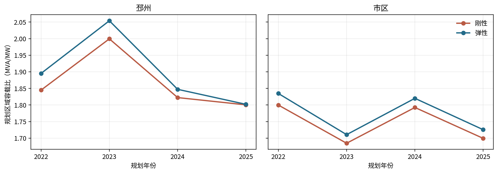
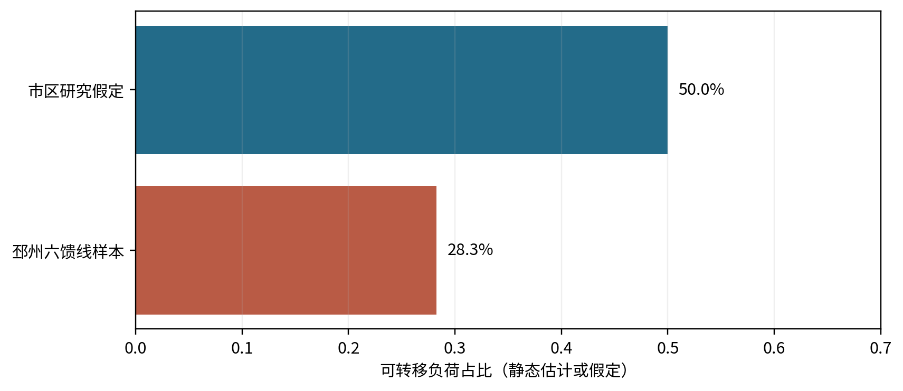
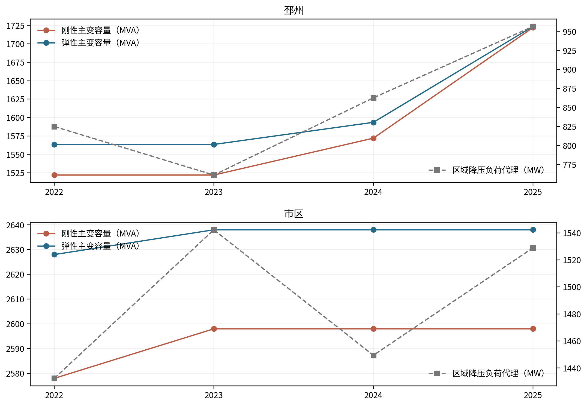
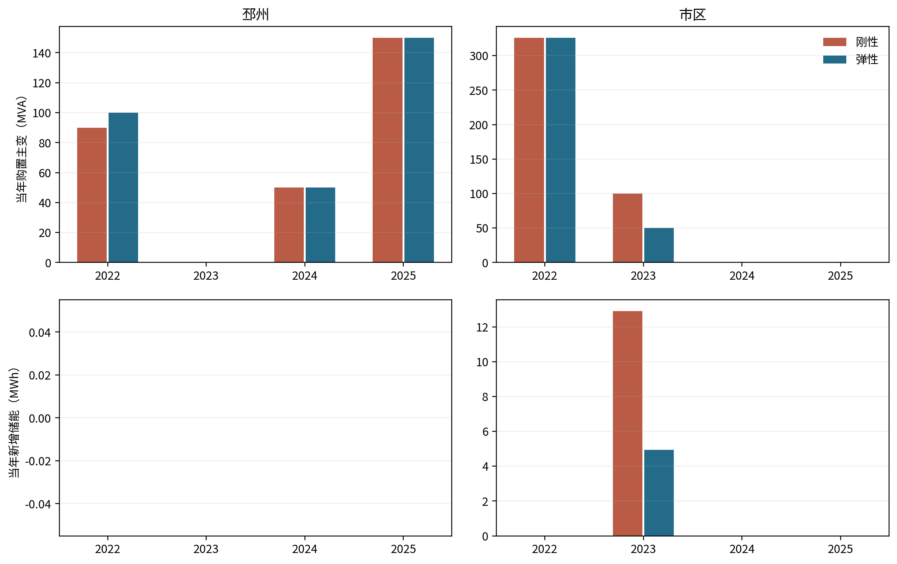
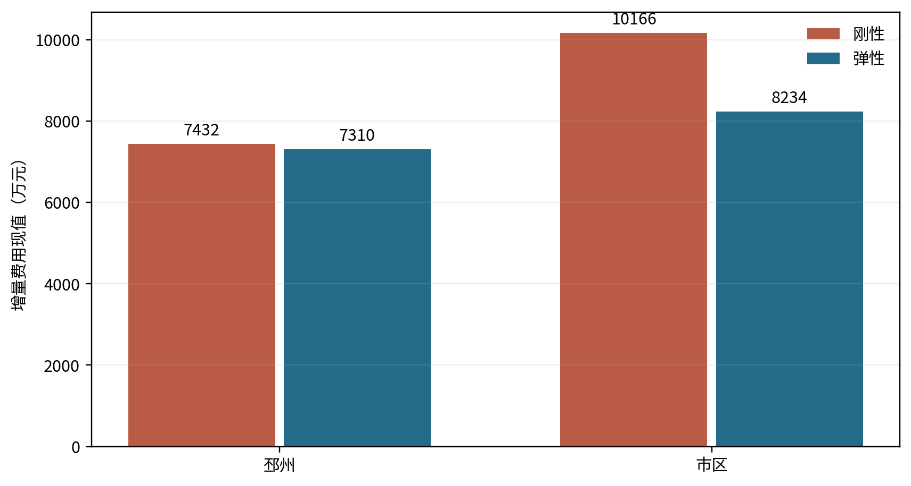
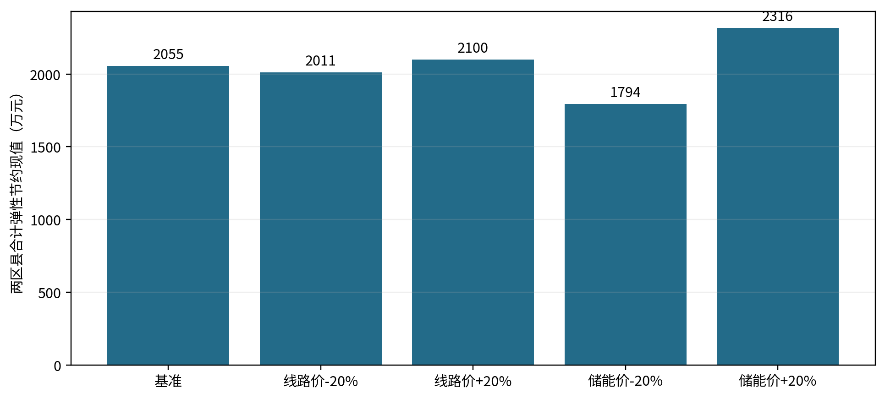

# 第五章 寻优过程、案例与推荐结果

## 5.1 参数分档与可行方案形成

第四章把主变扩容、储能和 10 kV 站间联络列为同一措施集合。求解先确认 2021 年容量状态和年度区县分母，再检查各站在正向、反向及主变停运静态场景下的承载，最后按 2021 年现值选取完整规划期费用最小的措施路径。这个顺序保证报告中的容载比可以还原为容量与负荷的计算结果，避免把预设比值直接当作建设规模。

表 5-1 列出导则增长分档及仿真起点。邳州与市区均从 2021 年开始，两方案在各自区县共享同一个初始状态。2021 年退出容量为反事实建模操作，费用不计入 2022—2025 年新增投资。市区本轮使用区县原表负荷，不再用 29 站样本自身峰值替代全区县分母。

表 5-1 区县增长分档与共同起点

| 区县 | 原表 2021 年容量（MVA） | 原表 2021 年降压负荷（MW） | 四年加权增长率 | DL/T 5729—2023 建议区间 | 仿真初始容量（MVA） | 初始比值 |
| --- | ---: | ---: | ---: | --- | ---: | ---: |
| 邳州 | 2027.0 | 731.770 | 8.0742% | 1.8～2.0 | 1463.5 | 1.999945 |
| 市区 | 3113.5 | 1449.770 | 1.8000% | 1.5～1.7 | 2462.0 | 1.698200 |

资料来源：《近5年容载比》[76] Sheet1 第 19 行与第 9 行；年度列及计算式见附录 A，导则区间见第 6.3.4 条表 6.3.4。

刚性方案对邳州采用 \(R\le 2.0\)；市区逐年控制值经离散容量和静态事故条件可行性扫描取 1.8。扫描显示 1.7、1.75、1.79 在本轮约束组合下无可行解，1.8 可行。这个结果与市区导则 1.5～1.7 的一般建议范围存在差异，原因是研究同时保留 2021 起点、2022 年后容量不减、站级静态事故供电量和“市区比值低于邳州”的排序条件。不能把 1.8 表述成导则推荐值，也不能据此认定放松后的工程安全已通过校验。弹性方案使用 2.6 的搜索包络，两区县的实际最优结果均低于该包络。

图 5-1 两区县逐年规划容载比。原表负荷代理作为共同分母，容量来自模型在役主变合计。

模型用设备离散规格求解，最后将容量除以年度负荷。年度容载比不必单调上升。邳州 2023 年原表降压负荷由 2022 年的 825.004 MW 降至 761.232 MW，两方案在役容量未变，因此比值上升；市区 2024 年也发生相同的分母效应。解释变化时必须同时查看容量和负荷。

## 5.2 典型联络案例与比例设定依据

### 5.2.1 邳州六馈线样本及既有转供

邳州站间转供比例从部分实际 10 kV 联络资料标定。六条馈线的源端功率合计为 35.292234 MW；依据三处跨站联络关系、馈线端电流和受端静态余量求得样本可转移上界 9.983428 MW，比例为 28.2879%。计算使用每处联络的方向组合以及供受端容量约束，取不重复计量的最大可转移量。资料范围仅覆盖这六条馈线，把该比例用于邳州全县属于研究外推。它没有实际事故操作记录，也未核定全县每个供电网格的转供能力。

导则第 7.1.2 条在 B、C 类供电区域给出 30%～50% 的站间转移比例建议。邳州样本估计值略低于 30%，本轮将 30% 作为区县内部转供能力的研究目标。现有容量可承担的部分作为零新建投资的可选转供；若静态站点需求及目标比例仍有缺口，模型可在任意站对投建等效新线，每条 2025 年筛查容量 7.491 MW，费用 106.8 万元。站对无网格、道路及线路长度实测，输出只用于判断需要多少新增联络能力，不能作为拟建线路清单。

### 5.2.2 市区 50% 情景

市区分布式光伏装机相对用户最大负荷较低；现有资料也没有可以逐条核定的全市区联络关系。依据会议确定的研究情景，将既有站间可转移比例设为 50%。该值处于导则 A+／A 类的 50%～70% 与 B／C 类的 30%～50% 两个建议区间的公共边界。由于市区供电区域分类未逐站核实，50% 只是规划筛查值。模型允许在静态事故场景中使用该既有能力，也允许新建等效线路；最终是否投建由费用与站级约束共同决定。

图 5-2 站间转供比例的依据。邳州数值为六馈线样本静态估计，市区数值为导则范围内的研究假定，二者证据性质不同。

本轮计算中正常场景的站间净负荷迁移为零；既有通道和新线主要在单台主变停运的静态场景中承担可恢复功率。因此，新线数量表示为了满足模型中的事故供电量及转供目标所需的等效能力，不表示投运后每年会有同等功率正常转供。对于光伏消纳，模型仅以反向功率极值进行容量筛查，没有弃光量与线路潮流，不能把新增线数直接解释为新增多少光伏消纳电量。

## 5.3 两区县逐年容量、措施与容载比

表 5-2 同列年度负荷、在役容量、容载比和当年措施。“购置主变”是新购设备铭牌容量，替换旧设备时可大于区县容量净增量。储能同时列出功率和能量，不用柜数替代工程容量。新线为当年新增条数；已投运线路次年继续在役。

表 5-2 2022—2025 年逐年推荐结果

| 区县／方案 | 年份 | 区县负荷代理（MW） | 在役主变（MVA） | 容载比 | 当年购置主变（MVA） | 当年新增储能 | 当年新增等效 10 kV 联络（条） |
| --- | ---: | ---: | ---: | ---: | ---: | --- | ---: |
| 邳州刚性 | 2022 | 825.004 | 1522.0 | 1.8448 | 90 | 0 | 10 |
| 邳州刚性 | 2023 | 761.232 | 1522.0 | 1.9994 | 0 | 0 | 0 |
| 邳州刚性 | 2024 | 862.662 | 1572.0 | 1.8223 | 50 | 0 | 0 |
| 邳州刚性 | 2025 | 956.450 | 1722.0 | 1.8004 | 150 | 0 | 0 |
| 邳州弹性 | 2022 | 825.004 | 1563.5 | 1.8951 | 100 | 0 | 10 |
| 邳州弹性 | 2023 | 761.232 | 1563.5 | 2.0539 | 0 | 0 | 0 |
| 邳州弹性 | 2024 | 862.662 | 1593.5 | 1.8472 | 50 | 0 | 0 |
| 邳州弹性 | 2025 | 956.450 | 1723.5 | 1.8020 | 150 | 0 | 0 |
| 市区刚性 | 2022 | 1432.370 | 2578.0 | 1.7998 | 326 | 0 | 3 |
| 市区刚性 | 2023 | 1542.217 | 2598.0 | 1.6846 | 100 | 6.0 MW／12.900 MWh | 0 |
| 市区刚性 | 2024 | 1449.402 | 2598.0 | 1.7925 | 0 | 0 | 0 |
| 市区刚性 | 2025 | 1528.820 | 2598.0 | 1.6993 | 0 | 0 | 0 |
| 市区弹性 | 2022 | 1432.370 | 2628.0 | 1.8347 | 326 | 0 | 1 |
| 市区弹性 | 2023 | 1542.217 | 2638.0 | 1.7105 | 50 | 2.3 MW／4.945 MWh | 0 |
| 市区弹性 | 2024 | 1449.402 | 2638.0 | 1.8201 | 0 | 0 | 0 |
| 市区弹性 | 2025 | 1528.820 | 2638.0 | 1.7255 | 0 | 0 | 0 |

资料来源：原表年度降压负荷及本轮混合整数规划结果；原格、站级容量和措施明细见附录 A、B。

图 5-3 区县主变容量与原表年度降压负荷代理。

邳州 2022 年两方案均建设 10 条等效新线，区别在于购置主变分别为 90 和 100 MVA。2023 年负荷下降，两方案都没有新增设备，弹性 \(R=2.0539\) 超过 2.0；这不是 2023 年盲目扩容造成的。2024、2025 年负荷增长使两方案继续购置主变；到 2025 年弹性容量只比刚性高 1.5 MVA，说明在本轮成本、网络与安全代理下，弹性并非每年都带来大幅增加的容量。其较低费用来自不同投运年份与主变规格组合，不能把“容载比越大越好”理解为无条件多建容量。

市区 2022 年需按静态站级条件扩容；弹性放宽 1.8 控制后，以较高容量和 1 条等效新线满足相同任务，刚性则需要 3 条。2023 年原表负荷上升到 1542.217 MW，两方案都购置主变并配储：刚性 60 柜，即 6.0 MW／12.9 MWh；弹性 23 柜，即 2.3 MW／4.945 MWh。此处主变购置容量与在役容量净变化不相等，反映旧设备替换。2024 年市区负荷回落使比值上升；2025 年负荷回升使比值下降，两年均没有新增主变。

图 5-4 当年新购主变铭牌容量和新增储能额定能量。容量净增量可与新购量不同。

## 5.4 费用现值及刚弹性差异

两区县的评价期费用现值见表 5-3。分项按年度新增投资乘相应寿命和运维折现系数复算；主变、储能、线路的成本口径与第四章式（4-9）一致。区县间加总只用于显示本研究两案例的合计，不代表徐州全域总投资。

表 5-3 增量费用现值及分项（万元）

| 区县／方案 | 主变 | 储能 | 等效新线 | 合计 |
| --- | ---: | ---: | ---: | ---: |
| 邳州刚性 | 6312.03 | 0.00 | 1119.97 | 7432.01 |
| 邳州弹性 | 6189.66 | 0.00 | 1119.97 | 7309.63 |
| 市区刚性 | 7714.07 | 2116.43 | 335.99 | 10166.49 |
| 市区弹性 | 7310.23 | 811.30 | 112.00 | 8233.52 |

资料来源：逐年投资和评价期折现系数复算；分项显示值单独四舍五入。

邳州弹性比刚性减少 122.37 万元，市区减少 1932.97 万元；两案例合计减少 2055.34 万元。这个关系由相同措施集下的重算得到，并非把“弹性成本较低”写成目标函数的硬约束。市区节约主要来自主变购置方案改变、储能减少 37 柜及少建两条等效线；邳州两方案线路和储能相同，费用差来自主变方案。若线路实际造价显著高于本轮估算或新增站址费用不可忽略，绝对费用及措施组合需重算。

图 5-5 2021 年现值口径下的两区县方案费用。

本轮四条路径均满足“弹性年度比值高于同区县刚性、同方案市区比值低于邳州”的比较条件。后一关系主要由研究任务施加的跨区县排序条件保证，不能据此证明新能源渗透率必然与容载比正相关。两区县 2025 年估计源荷比分别为 1.631、0.318，估计电量渗透率分别为 40.28%、8.69%，能够说明源荷背景差异；只有两个区县、一个完整年份且电量为估计值，无法建立可信的统计相关系数。负载率也受装置状态、同期性和分母口径影响，本报告只作描述性对照。

## 5.5 主变／线路与主变／储能价格敏感性

根据具体工程及采购基准价换算，主变／等效新线单位有功能力价格比为 1.2236，主变／储能成套功率价格比为 0.08289。在线路价格和储能价格各自上下浮动 20%、主变价格保持不变时，分别重新求解两区县双方案的四年完整路径。表 5-4 列出同一参数情景下弹性较刚性节约的费用现值。

表 5-4 两类实际价格比值的敏感性

| 情景 | 主变／线路价格比 | 主变／储能价格比 | 邳州弹性节约（万元） | 市区弹性节约（万元） |
| --- | ---: | ---: | ---: | ---: |
| 基准 | 1.2236 | 0.08289 | 122.37 | 1932.97 |
| 线路价下降 20% | 1.5296 | 0.08289 | 122.37 | 1888.17 |
| 线路价上升 20% | 1.0197 | 0.08289 | 122.37 | 1977.77 |
| 储能价下降 20% | 1.2236 | 0.10362 | 122.37 | 1671.94 |
| 储能价上升 20% | 1.2236 | 0.06908 | 122.37 | 2193.99 |

资料来源：第四章所列工程造价与采购单价；各情景重新求解结果。比值变动来自分母价格变动，不是任意赋权。

图 5-6 线路或储能价格改变后，两区县合计弹性方案节约的费用现值。

五个情景都保持本轮案例的费用次序及年度容载比排序。邳州未在基准路径配置储能，±20% 的储能价格变动没有改变两方案成本差；市区储能价下降时，弹性节约额缩小，说明替代措施的价格相对优势会改变刚弹费用差。该分析只围绕既有价格锚点的局部范围，不把它外推为未来电池价格预测。

## 5.6 条件参数矩阵与外推边界

仅用两区县历史参数不能构成通用推荐表。本研究另在两种固定站点结构模板上，以 0.3、1.0、1.8 三档源荷比和 0%、4%、8% 三档年度负荷增长率形成 18 组条件情景。参数范围覆盖或延伸当前两区县估计源荷比与负荷增长档；每组重新求刚性和弹性完整路径。表 5-5 展示矩阵读取方式，完整 18 组及逐年容载比见附录 C。

表 5-5 参数外推矩阵的读取与推荐条件

| 维度 | 取值 | 作用方式 | 解释限制 |
| --- | --- | --- | --- |
| 站点结构模板 | 邳州 20 站；市区 29 站 | 保持基准站点分布及可选站对 | 不代表任意新区县真实拓扑 |
| 年负荷增长率 | 0%；4%；8% | 从 2021 年起改变年度负荷及站级正向需求 | 情景参数，不是两区县历史预测 |
| 源荷比 | 0.3；1.0；1.8 | 相对于邳州 2025 年估计值线性缩放反向压力 | 研究映射，非导则公式或完整光伏时序 |
| 价格比 | 基准及线路、储能 ±20% | 直接改变相应实际单价后重算 | 未含新增站址和保护费用 |
| 推荐规则 | 技术约束可行且比较费用较低 | 记录逐年主变、储能、线路及结果容载比 | 不给单一无条件通用 R |

18 组中，两种站点结构和三个增长率、三个源荷比均得到静态模型可行解。只有邳州模板、零增长、源荷比 1.8 的情景在当前价格与排序条件下出现弹性低费用；其余情景的成本最小方案仍为刚性。结果说明：“当前两区县弹性较便宜”是本地数据、容量初态和市区刚性控制值共同作用的结论，不是放宽容载比后费用必然下降的数学定理。大量情景在源荷比变化时保持措施不变，说明当前静态反向极值约束尚未成为主导因素；缺少逐时光伏和真实馈线约束时，不应据此判断高渗透率影响很小。

推荐矩阵因此采用条件化表达：先确定区县或供电区域的标准指标、年度负荷和站点结构，再核实站间可转供能力与工程单价；对满足静态筛查且弹性方案更经济的单元，报告推荐该场景的年度弹性容载比及配套措施；其余单元保留刚性或重新补充可靠性、光伏消纳收益后再比选。附件中的矩阵单元给出数值及其结构模板，不把仿真值宣传为 DL/T 5729—2023 的普适上限。

## 5.7 数据核查与工程应用条件

两区县原始统计表的年度单元格、2021 年容量与负荷、模型分母和计算得到的容载比已逐项核对。独立审计检查了四条路径的站级约束、设备不减、储能柜数和投运状态，并复算目标费用；求解器报告的混合整数规划差距为零。五组价格情景也通过同样的跨方案比较检查。上述核查证明模型在给定输入和静态约束下计算一致，不等同于网架工程审定。

线路工程应用需补充供电网格、站址距离、既有开关及保护配置、导线和电缆热限、接收站余量、道路及用地条件，并用同步潮流核定故障转供。储能需补充充放电效率、荷电状态、持续时长和运行收益；主变扩建需核对间隔、消防和土建。2021—2022 年分布式光伏统计缺项还需向数据持有方确认或保留估计标记。数据补齐后应重算区县年网供最大负荷和用户电量口径，再用于工程方案定案。
