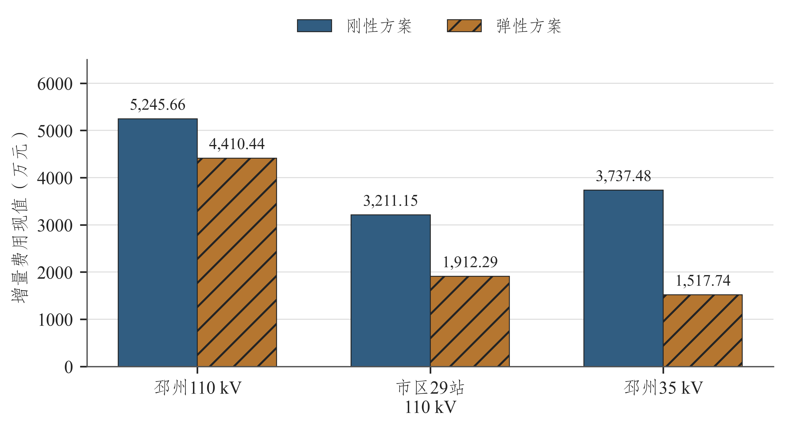
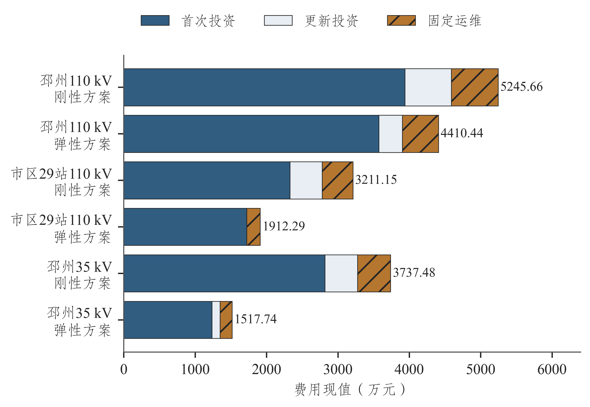
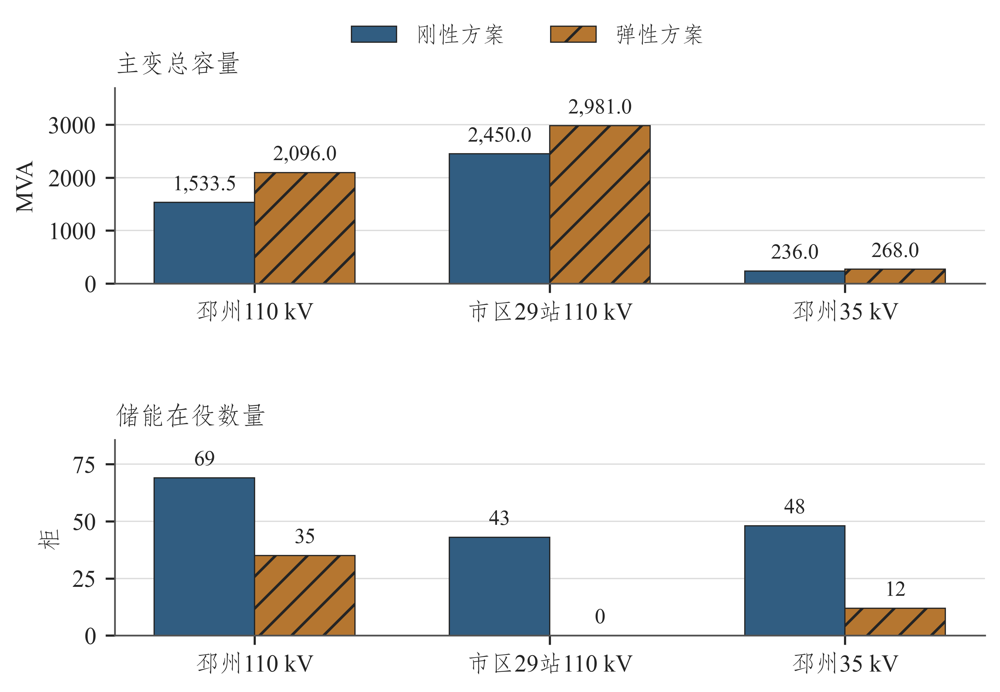
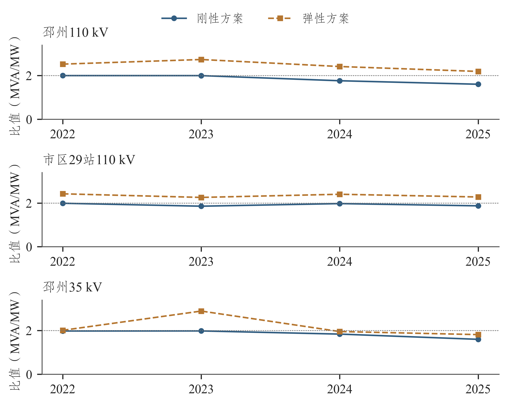
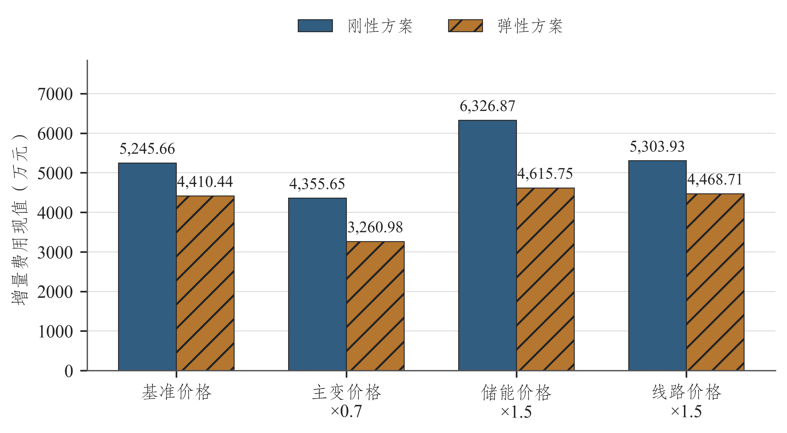
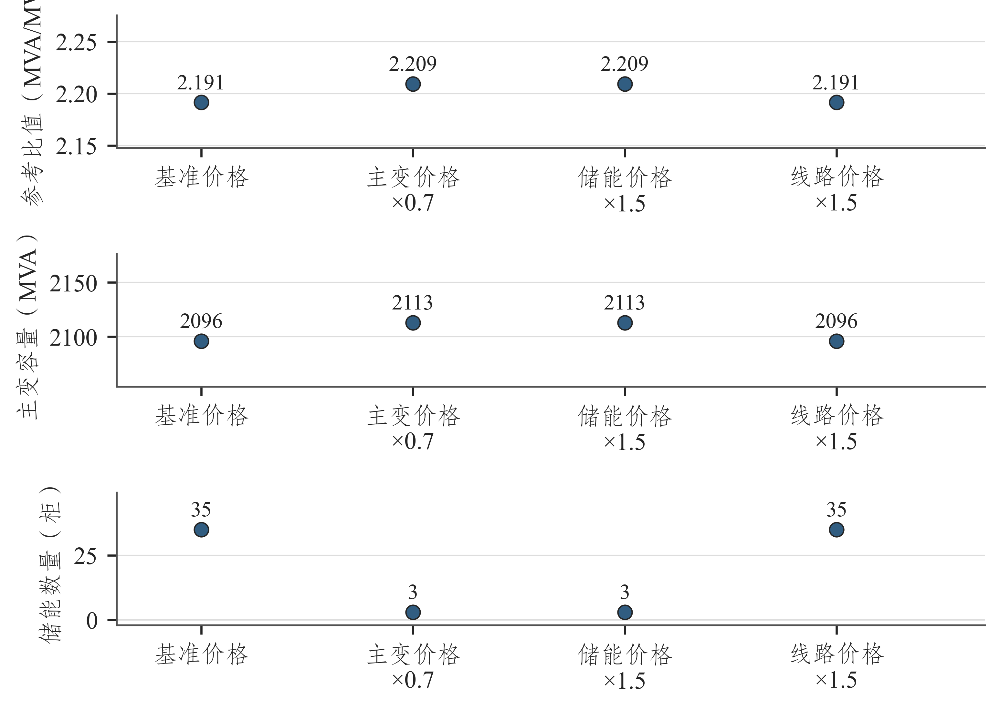

# 第五章 优化结果分析

## 5.1 结果范围与经济比较基准

本章比较三个研究单元在共同历史起点、候选措施和技术条件下的2022至2025年规划路径。费用采用第四章的首次投资、更新投资及固定运维口径，评价期为2022至2041年，现值折算至2021年，单位万元。

三个单元的弹性路径费用均低于各自刚性路径，如图5-1所示。邳州110 kV刚性、弹性费用分别为5245.66万元和4410.44万元，市区29站110 kV为3211.15万元与1912.29万元，邳州35 kV支撑层为3737.48万元与1517.74万元。费用较低的路径分别减少了部分储能或主变调整需求，具体配置应与后续图表共同理解。

图5-1 刚性与弹性方案增量费用现值

资料来源：项目统计及规划计算。

刚性方案的比值上限与累计增配预算共同限制容量动作。弹性方案允许保留更多存量主变容量，并按站级需求增配，减少储能替代需求及相应采购、更新和运维费用。

## 5.2 费用分项及配置变化

费用分项如图5-2所示，完整显示值见表5-1。邳州110 kV弹性方案首次投资现值3573.49万元、更新投资330.33万元、固定运维506.61万元，分别低于刚性的3940.27、648.64和656.75万元。费用差由各科目共同构成，储能数量及投运时序的变化还会影响十年寿命更新和后续运维。

图5-2 两方案增量费用现值分项

资料来源：项目统计及规划计算。

表5-1 两方案全寿命周期费用分项

| 研究单元 | 方案 | 首次投资现值（万元） | 更新投资现值（万元） | 固定运维现值（万元） | 合计现值（万元） |
| --- | --- | --- | --- | --- | --- |
| 邳州110 kV | 刚性方案 | 3940.27 | 648.64 | 656.75 | 5245.66 |
| 邳州110 kV | 弹性方案 | 3573.49 | 330.33 | 506.61 | 4410.44 |
| 市区29站110 kV | 刚性方案 | 2328.94 | 452.12 | 430.09 | 3211.15 |
| 市区29站110 kV | 弹性方案 | 1722.53 | 0.00 | 189.76 | 1912.29 |
| 邳州35 kV（支撑层） | 刚性方案 | 2819.25 | 456.74 | 461.48 | 3737.48 |
| 邳州35 kV（支撑层） | 弹性方案 | 1235.04 | 114.12 | 168.58 | 1517.74 |

资料来源：项目统计及规划计算。

市区29站弹性方案更新投资为0.00万元：该路径以主变容量满足需求，新增主变的20年寿命在本评价期内未触发更新。邳州35 kV弹性路径的首次、更新及运维费用均低于刚性路径，表明容量保留和增配减少了替代措施投入。表中分项独立舍入，可产生0.01万元尾差。

2025年容量与储能配置如图5-3所示。邳州110 kV弹性容量2096 MVA，刚性1533.5 MVA；储能分别为35柜和69柜。市区29站容量分别为2981和2450 MVA，储能为0柜和43柜。邳州35 kV容量分别为268和236 MVA，储能为12柜和48柜。

图5-3 两方案2025年容量与储能配置

资料来源：项目统计及规划计算。

刚性容载比约束降低在役主变容量后，部分站级供电需求由储能承担。弹性路径优先保留存量容量，并在必要位置新增主变，减少储能用量。费用比较采用共同存量起点及增量运维口径，容量退出费用按第四章的扩展科目处理。

储能的容量替代作用由本站尖峰持续时间决定。同样柜数在不同站点对应的有效功率可能不同，选型时需要结合尖峰需求、能量持续能力和运行条件核定。

## 5.3 年度规划参考容载比变化

两方案年度参考容载比如图5-4所示，推荐路径的容量、参考净峰及储能见表5-2。表内年度结果来自按完整路径费用选出的同一方案，反映设备配置的跨年连续性。

图5-4 刚性与弹性方案年度规划参考容载比

资料来源：项目统计及规划计算。

表5-2 各研究单元年度推荐结果

| 研究单元 | 年 | 参考净峰（MW） | 推荐容量（MVA） | 推荐比值（MVA/MW） | 储能（柜） |
| --- | --- | --- | --- | --- | --- |
| 邳州110 kV | 2022 | 825.004 | 2084.5 | 2.527 | 0 |
| 邳州110 kV | 2023 | 761.232 | 2084.5 | 2.738 | 0 |
| 邳州110 kV | 2024 | 862.662 | 2084.5 | 2.416 | 0 |
| 邳州110 kV | 2025 | 956.450 | 2096.0 | 2.191 | 35 |
| 市区29站110 kV | 2022 | 1224.840 | 2971.0 | 2.426 | 0 |
| 市区29站110 kV | 2023 | 1318.771 | 2981.0 | 2.260 | 0 |
| 市区29站110 kV | 2024 | 1239.404 | 2981.0 | 2.405 | 0 |
| 市区29站110 kV | 2025 | 1307.315 | 2981.0 | 2.280 | 0 |
| 邳州35 kV（支撑层） | 2022 | 124.718 | 251.0 | 2.013 | 0 |
| 邳州35 kV（支撑层） | 2023 | 86.700 | 251.0 | 2.895 | 0 |
| 邳州35 kV（支撑层） | 2024 | 128.362 | 251.0 | 1.955 | 0 |
| 邳州35 kV（支撑层） | 2025 | 147.650 | 268.0 | 1.815 | 12 |

资料来源：项目统计及规划计算。

邳州110 kV弹性容量在2022至2024年保持2084.5 MVA，年度参考比值却分别为2.527、2.738和2.416，直接原因是参考净峰变化。2025年容量增至2096 MVA，参考净峰升至956.450 MW，比值降至2.191。容量增加与净峰增长共同决定了该年度较低的参考比值。

市区29站2023至2025年弹性容量均为2981 MVA，参考比值为2.260、2.405和2.280。2024年较高比值对应较低参考净峰。样本比值采用29站自身的容量和峰值范围，全市区统计值用于区域背景分析。

邳州35 kV支撑层2023年参考净峰较低，251 MVA对应比值2.895；2025年容量增至268 MVA，参考净峰增至147.650 MW，比值为1.815。弹性配置随净峰和站级需求变化，在研究上限3.2以内形成各年度推荐值。

年度参考比值与对应容量、负荷范围和工程措施配套使用，用于年度建设时序及方案比选。

## 5.4 价格变化对配置的影响

邳州110 kV四个价格情景的费用如图5-5所示，参数和关键结果见表5-3。各情景分别重求刚性与弹性完整路径，比较价格变化引起的配置调整和费用响应。

图5-5 邳州110 kV价格情景的费用现值

资料来源：项目统计及规划计算。

表5-3 邳州110 kV价格情景与关键结果

| 价格情景 | 主变/储能/线路价格系数 | 刚性费用（万元） | 弹性费用（万元） | 2025推荐比值 | 2025储能（柜） |
| --- | --- | --- | --- | --- | --- |
| 基准价格 | 1/1/1 | 5245.66 | 4410.44 | 2.191 | 35 |
| 主变价格×0.7 | 0.7/1/1 | 4355.65 | 3260.98 | 2.209 | 3 |
| 储能价格×1.5 | 1/1.5/1 | 6326.87 | 4615.75 | 2.209 | 3 |
| 线路价格×1.5 | 1/1/1.5 | 5303.93 | 4468.71 | 2.191 | 35 |

资料来源：项目统计及规划计算。

主变工程价格降至基准70%时，刚性、弹性费用分别为4355.65万元和3260.98万元；储能价格升至150%时，分别为6326.87和4615.75万元。两种情景中，弹性方案2025年参考比值均增至2.209，储能由基准35柜降至3柜，体现相对价格对措施组合的影响。

价格情景下的配置如图5-6所示。主变降价或储能涨价时，弹性方案较基准增加17 MVA、减少32柜储能。储能涨价同时提高剩余储能及其更新运维费用，方案经济性因此取决于设备规模、投运时点和评价期现金流。

图5-6 邳州110 kV价格情景下的2025年配置

资料来源：项目统计及规划计算。

线路价格升至150%时，刚性、弹性费用分别为5303.93和4468.71万元，弹性2025年参考比值保持2.191，储能保持35柜。在该情景下，原候选组合仍为费用最优配置。

## 5.5 工程条件分层与样本参考范围

工程条件与容载比样本参考范围见表5-4。矩阵按区县源荷背景、研究单元净峰增长、正反向压力、尖峰时长和相对价格归纳年度结果，以源荷近似比值1作为样本分组界限。

表5-4 工程条件与容载比样本参考范围

| 工程类型 | 区县源荷比（降压峰近似） | 净峰年均增长率（%） | 正向参考净峰（MW） | 最大站反向峰（MW） | 正/反向时长（h） | 相对价格主变/储能、线路/储能 | 推荐比值（MVA/MW） | 支持案例 |
| --- | --- | --- | --- | --- | --- | --- | --- | --- |
| 市区29站110 kV，无互济 | 0.164至0.322 | -0.01至3.14 | 1239.403至1318.772 | 4.959至30.557 | 5/2 | 1 / 1 | 2.260至2.406 | 3个年度1条路径 |
| 邳州110 kV有互济，源荷≤1 | 0.742（点值） | 1.99 | 761.232 | 11.446 | 4/3 | 1 / 1 | 2.738（点值） | 1个年度1条路径 |
| 邳州110 kV有互济，源荷>1 | 1.305至1.631 | 5.63至6.93 | 862.661至956.450 | 33.528至56.920 | 4/3 | 1 / 1 | 2.191至2.417 | 2个年度1条路径 |
| 邳州35 kV无互济，源荷≤1 | 0.742（点值） | 3.61 | 86.700 | 6.803 | 3/2 | 1 / 1 | 2.895（点值） | 1个年度1条路径 |
| 邳州35 kV无互济，源荷>1 | 1.305至1.631 | 16.28至16.71 | 128.361至147.650 | 18.868至26.870 | 3/2 | 1 / 1 | 1.815至1.956 | 2个年度1条路径 |

资料来源：项目统计及规划计算。

市区29站无站间互济候选，三个年度的样本参考范围为2.260至2.406。邳州110 kV有互济且区县源荷近似值大于1的两个年度，参考范围为2.191至2.417；邳州35 kV对应范围为1.815至1.956。范围端点采用向外舍入，表5-2年度点值采用普通舍入。

邳州110 kV源荷近似值不超过1的分组对应2023年，比值为2.738；35 kV对应比值为2.895。各分组由同一规划路径的年度结果形成，分别展示已有工况下的点值或范围。

矩阵以已计算的年度最优值形成样本包络，供条件相近的片区开展初步比选。实际规划应结合当地容量、负荷和工程候选重新计算参考值。

典型工程条件下的应用建议见表5-5。有互济条件时，核定供受端余量及可转区段后联合比选主变与储能；无站间候选时，依据存量容量和尖峰时长配置主变与储能；价格变化时，重新比较完整规划路径。

表5-5 典型工程条件下的应用建议

| 工程条件 | 规划应用建议 | 结果依据 | 重点工程资料 |
| --- | --- | --- | --- |
| 110 kV，具备互济候选 | 先确认供受端余量及通道，再比选主变与储能 | 邳州110 kV | 年度参考净峰、站级反向压力、区段负荷 |
| 110 kV，无站间互济候选 | 以存量容量、主变调整和储能配置共同比选 | 市区29站 | 样本设备、尖峰时长与完整费用路径 |
| 35 kV支撑层 | 单独计算容量、负荷与费用，支撑110 kV规划分析 | 邳州35 kV | 上下级峰值及容量避免重复统计 |
| 区县源荷背景变化 | 更新装机与降压峰，再核对站级负荷分布 | 八区县统计 | 区县比值与局部反向压力分别判断 |
| 价格条件变化 | 按实际工程价格重新比较完整规划路径 | 邳州价格情景 | 主变、储能和线路价格向量 |

资料来源：项目统计及规划计算。

## 5.6 结果核查与规划应用

本研究完成容量与参考峰比值、费用分项、规划路径连续性和模型约束的一致性核查。结果表明，存量容量保留、储能替代及局部互济共同决定方案费用，可据此确定重点比选措施和年度投运安排。

参考结果适用于本报告的历史容量估计、尖峰模板、停运恢复比例和静态通道条件。工程应用需进一步核定设备台账、主变运行方式、储能调度及线路设计，研究展望见第七章。