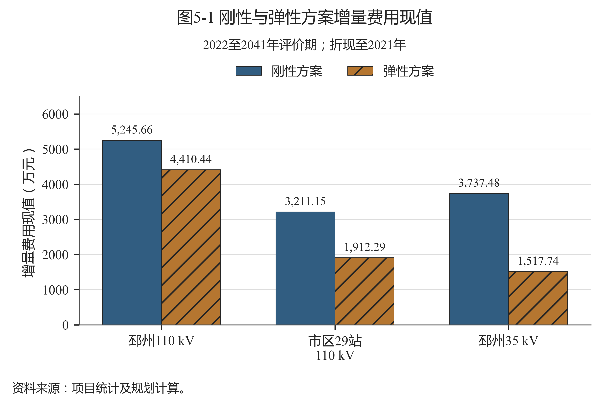
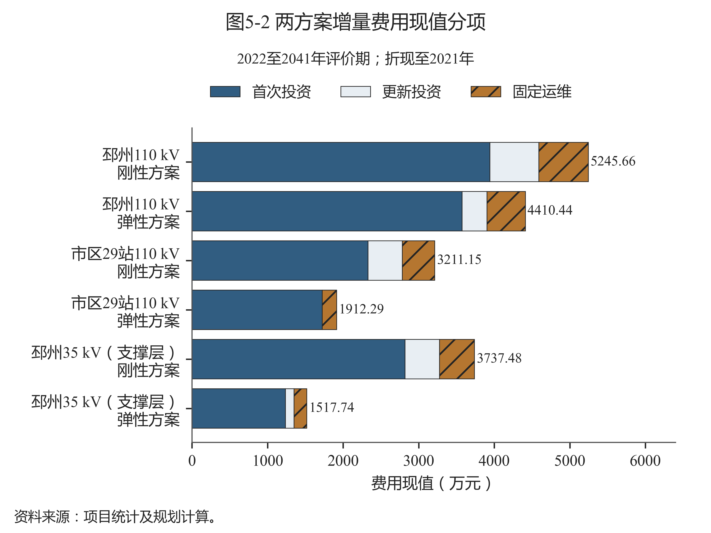
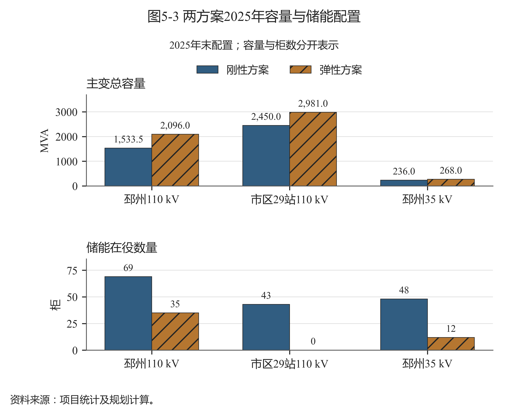
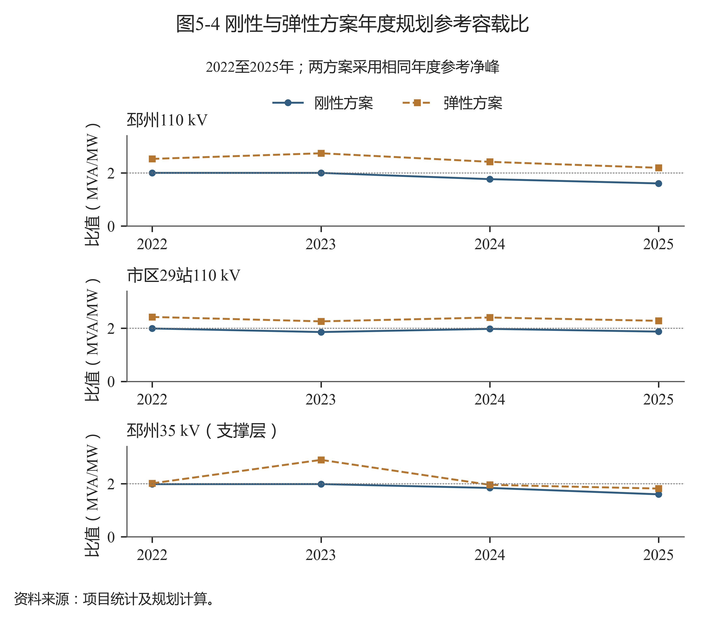
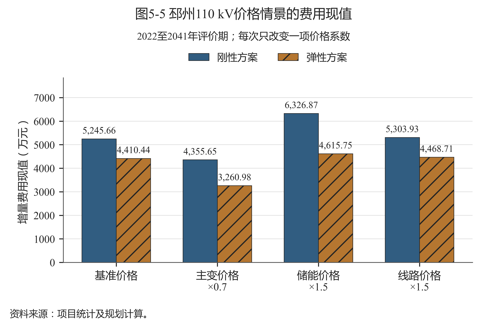
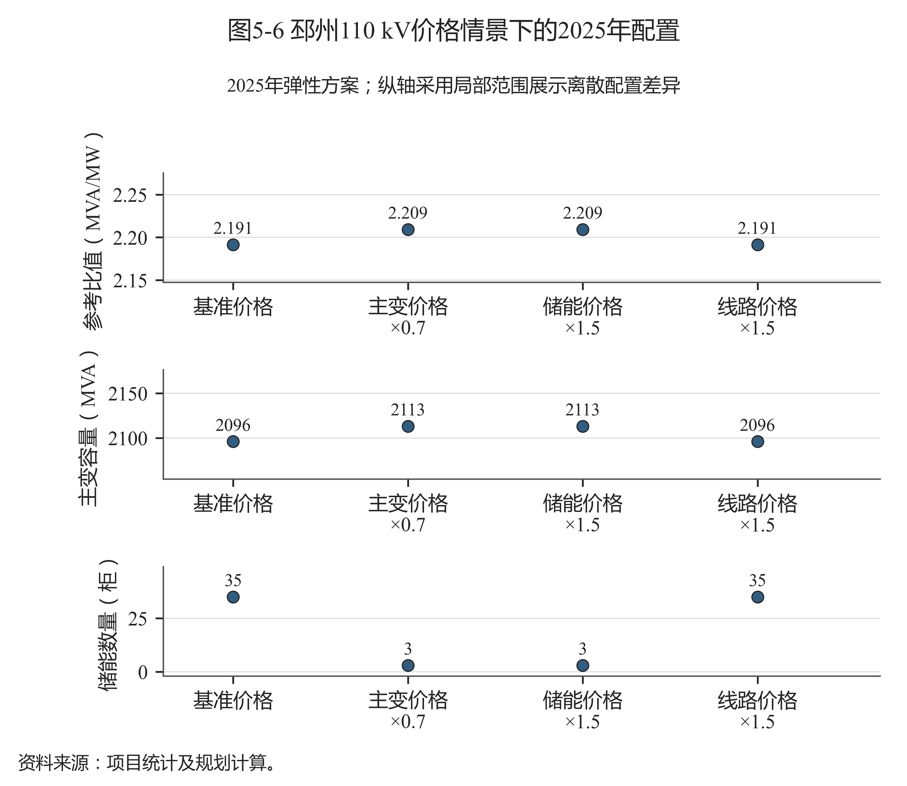

# 第五章 优化结果分析

## 5.1 结果范围与经济比较基准

本章结果对应第四章的共同历史起点、候选措施和技术代理条件。三单元分别比较2022至2025年完整规划路径，费用为投运措施在2022至2041年评价期内的增量费用现值，折现至2021年，单位万元。比较不含存量沉没投资，也不含尚未评估的损耗、拆改、残值和收益。

三个单元的弹性路径费用均低于各自刚性路径，如图5-1所示。邳州110 kV刚性、弹性费用分别为5245.66万元和4410.44万元，市区29站110 kV为3211.15万元与1912.29万元，邳州35 kV支撑层为3737.48万元与1517.74万元。费用较低的路径分别减少了部分储能或主变调整需求，具体配置应与后续图表共同理解。

图5-1 刚性与弹性方案增量费用现值

资料来源：项目统计及规划计算；见《数据来源说明》中图5-1的逐项定位。

刚性方案的上限和累计增配预算共同影响可选动作。弹性方案放宽这两项条件后，可保留更多共同起点中的主变容量，减少由替代措施承担的供电需求。因此，这一费用优势依赖当前存量和费用边界；不能直接推广为新增变电容量越多、完整工程总成本越低。

## 5.2 费用分项及配置变化

费用分项如图5-2所示，完整显示值见表5-1。邳州110 kV弹性方案首次投资现值3573.49万元、更新投资330.33万元、固定运维506.61万元，分别低于刚性的3940.27、648.64和656.75万元。费用差由各科目共同构成，储能数量及投运时序的变化还会影响十年寿命更新和后续运维。

图5-2 两方案增量费用现值分项

资料来源：项目统计及规划计算；见《数据来源说明》中图5-2的逐项定位。

表5-1 两方案全寿命周期费用分项

| 研究单元 | 方案 | 首次投资现值（万元） | 更新投资现值（万元） | 固定运维现值（万元） | 合计现值（万元） |
| --- | --- | --- | --- | --- | --- |
| 邳州110 kV | 刚性方案 | 3940.27 | 648.64 | 656.75 | 5245.66 |
| 邳州110 kV | 弹性方案 | 3573.49 | 330.33 | 506.61 | 4410.44 |
| 市区29站110 kV | 刚性方案 | 2328.94 | 452.12 | 430.09 | 3211.15 |
| 市区29站110 kV | 弹性方案 | 1722.53 | 0.00 | 189.76 | 1912.29 |
| 邳州35 kV（支撑层） | 刚性方案 | 2819.25 | 456.74 | 461.48 | 3737.48 |
| 邳州35 kV（支撑层） | 弹性方案 | 1235.04 | 114.12 | 168.58 | 1517.74 |

资料来源：项目统计及规划计算；原始数据定位见《数据来源说明》。

市区29站弹性方案更新投资显示为0.00万元，原因是该路径不配置储能，新增主变的20年寿命在本评价期内不触发更新采购；这不能解释为设备未来永不更新。邳州35 kV弹性方案保留和增配容量后，首次、更新及运维现值均低于对应刚性方案，表现为同一费用模型下措施组合的差异。表中分项独立舍入，个别分项之和与合计可差0.01万元，来源原值和总量未调整。

2025年容量与储能配置如图5-3所示。邳州110 kV弹性容量2096 MVA，刚性1533.5 MVA；储能分别为35柜和69柜。市区29站容量分别为2981和2450 MVA，储能为0柜和43柜。邳州35 kV容量分别为268和236 MVA，储能为12柜和48柜。

图5-3 两方案2025年容量与储能配置

资料来源：项目统计及规划计算；见《数据来源说明》中图5-3的逐项定位。

这些结果体现存量容量和替代措施的配置关系。容载比约束压低在役主变容量时，站级供电条件仍需满足，部分需求会转向储能。弹性路径在费用相同的候选解之间优先保留容量，并在必要位置新增设备，减少替代措施用量。容量退出未计拆改，保留存量未追加差异运维，当前费用优势应在这两个假设下解释。

储能柜数不能直接作为可靠性提高的指标。各柜在模型中受到本站尖峰时长约束，相同柜数在不同站点可能有不同有效功率。工程应用应先核实供电条件和持续时间，再判断储能是否是可实施、可持续的替代措施。

## 5.3 年度规划参考容载比变化

两方案年度参考容载比如图5-4所示，推荐路径的容量、参考净峰及储能见表5-2。推荐依据是完整路径费用，表内年度结果均属于同一被选方案，不能逐年择取两方案中较合意的比值。

图5-4 刚性与弹性方案年度规划参考容载比

资料来源：项目统计及规划计算；见《数据来源说明》中图5-4的逐项定位。

表5-2 各研究单元年度推荐结果

| 研究单元 | 年 | 参考净峰（MW） | 推荐容量（MVA） | 推荐比值（MVA/MW） | 储能（柜） |
| --- | --- | --- | --- | --- | --- |
| 邳州110 kV | 2022 | 825.004 | 2084.5 | 2.527 | 0 |
| 邳州110 kV | 2023 | 761.232 | 2084.5 | 2.738 | 0 |
| 邳州110 kV | 2024 | 862.662 | 2084.5 | 2.416 | 0 |
| 邳州110 kV | 2025 | 956.450 | 2096.0 | 2.191 | 35 |
| 市区29站110 kV | 2022 | 1224.840 | 2971.0 | 2.426 | 0 |
| 市区29站110 kV | 2023 | 1318.771 | 2981.0 | 2.260 | 0 |
| 市区29站110 kV | 2024 | 1239.404 | 2981.0 | 2.405 | 0 |
| 市区29站110 kV | 2025 | 1307.315 | 2981.0 | 2.280 | 0 |
| 邳州35 kV（支撑层） | 2022 | 124.718 | 251.0 | 2.013 | 0 |
| 邳州35 kV（支撑层） | 2023 | 86.700 | 251.0 | 2.895 | 0 |
| 邳州35 kV（支撑层） | 2024 | 128.362 | 251.0 | 1.955 | 0 |
| 邳州35 kV（支撑层） | 2025 | 147.650 | 268.0 | 1.815 | 12 |

资料来源：项目统计及规划计算；原始数据定位见《数据来源说明》。

邳州110 kV弹性容量在2022至2024年保持2084.5 MVA，年度参考比值却分别为2.527、2.738和2.416，直接原因是参考净峰变化。2025年容量增至2096 MVA，参考净峰升至956.450 MW，比值降至2.191。因此，推荐值的下降并不代表在役容量同比减少，而是容量与年度净峰的共同变化。

市区29站2023至2025年弹性容量均为2981 MVA，参考比值为2.260、2.405和2.280。2024年比值较高对应当年参考净峰较低，不能将其归因于新增容量或储能削峰。市区29站推荐值与全市区原表值采用不同范围，两者各自保存，不能互相替代。

邳州35 kV支撑层2023年参考净峰较低，251 MVA对应比值2.895；2025年容量增至268 MVA，因参考净峰增至147.650 MW，比值为1.815。弹性结果可高于也可低于2.0，控制上限3.2只是搜索边界，既不是必须达到的目标，也不是跨区域统一推荐值。

年度比值使用固定参考峰，不含本次规划储能动作后的实测净峰。规划人员应把比值与容量、负荷范围和工程措施一起使用，避免脱离条件单独下达建设规模。

## 5.4 价格变化对配置的影响

邳州110 kV四个价格情景的费用如图5-5所示，情景参数和关键结果见表5-3。每个情景均重新求解刚性、弹性完整路径，保持其余参数与约束一致；不是在原方案上乘一个费用系数。

图5-5 邳州110 kV价格情景的费用现值

资料来源：项目统计及规划计算；见《数据来源说明》中图5-5的逐项定位。

表5-3 邳州110 kV价格情景与关键结果

| 价格情景 | 主变/储能/线路价格系数 | 刚性费用（万元） | 弹性费用（万元） | 2025推荐比值 | 2025储能（柜） |
| --- | --- | --- | --- | --- | --- |
| 基准价格 | 1/1/1 | 5245.66 | 4410.44 | 2.191 | 35 |
| 主变价格×0.7 | 0.7/1/1 | 4355.65 | 3260.98 | 2.209 | 3 |
| 储能价格×1.5 | 1/1.5/1 | 6326.87 | 4615.75 | 2.209 | 3 |
| 线路价格×1.5 | 1/1/1.5 | 5303.93 | 4468.71 | 2.191 | 35 |

资料来源：项目统计及规划计算；原始数据定位见《数据来源说明》。

主变工程价格降至基准70%时，刚性费用为4355.65万元，弹性为3260.98万元；储能价格升至150%时，分别为6326.87和4615.75万元。两种情景中弹性2025年参考比值均为2.209，储能由基准35柜降至3柜。费用目标根据相对价格重新选择容量和储能组合，说明基准推荐值不能脱离报价条件使用。

价格情景下的配置如图5-6所示。主变降价或储能涨价时，弹性方案相较基准增加17 MVA、减少32柜储能，体现两类措施的经济替代。储能涨价还提高了剩余储能及其更新运维的费用，故柜数减少并不保证路径费用一定降低。工程比选应同时看设备规模、投运年和现金流，不能只看某一项设备数量。

图5-6 邳州110 kV价格情景下的2025年配置

资料来源：项目统计及规划计算；见《数据来源说明》中图5-6的逐项定位。

线路价格升至150%时，刚性、弹性费用为5303.93和4468.71万元，2025年弹性参考比值仍为2.191，储能仍为35柜。该价格变化下原候选组合仍被选择，说明这一离散价格情景尚未改变最优配置。当前只有四个价格向量，不能据此推算线路价格的连续临界值或更大范围内的方案稳定性。

## 5.5 工程条件分层与样本参考范围

弹性容载比样本支持参考矩阵见表5-4。矩阵将区县源荷背景、研究单元净峰增长、正反向压力、时长模板及相对价格放在同一行内描述。源荷指标采用区县降压峰近似，其他指标按工程单元解释；分组中的源荷比1为本次样本整理界限，不作为导则的通用分类标准。

表5-4 工程条件与容载比样本参考范围

| 工程类型 | 区县源荷比（降压峰近似） | 净峰年均增长率（%） | 正向参考净峰（MW） | 最大站反向峰（MW） | 正/反向时长（h） | 相对价格主变/储能、线路/储能 | 推荐比值（MVA/MW） | 支持案例 |
| --- | --- | --- | --- | --- | --- | --- | --- | --- |
| 市区29站110 kV，无互济 | 0.164至0.322 | -0.01至3.14 | 1239.403至1318.772 | 4.959至30.557 | 5/2 | 1 / 1 | 2.260至2.406 | 3个年度1条路径 |
| 邳州110 kV有互济，源荷≤1 | 0.742（点值） | 1.99 | 761.232 | 11.446 | 4/3 | 1 / 1 | 2.738（点值） | 1个年度1条路径 |
| 邳州110 kV有互济，源荷>1 | 1.305至1.631 | 5.63至6.93 | 862.661至956.450 | 33.528至56.920 | 4/3 | 1 / 1 | 2.191至2.417 | 2个年度1条路径 |
| 邳州35 kV无互济，源荷≤1 | 0.742（点值） | 3.61 | 86.700 | 6.803 | 3/2 | 1 / 1 | 2.895（点值） | 1个年度1条路径 |
| 邳州35 kV无互济，源荷>1 | 1.305至1.631 | 16.28至16.71 | 128.361至147.650 | 18.868至26.870 | 3/2 | 1 / 1 | 1.815至1.956 | 2个年度1条路径 |

资料来源：项目统计及规划计算；原始数据定位见《数据来源说明》。

市区29站无站间互济候选，三个年度的样本参考范围为2.260至2.406。邳州110 kV有互济且区县源荷近似值大于1的两个年度，参考范围为2.191至2.417。邳州35 kV在对应县域背景下形成1.815至1.956的范围。这些端点按表内原精度向外展示包络，与表5-2逐年点值的普通舍入有所区别；不将包络端点改成新的最优结果。

邳州110 kV源荷近似值不超过1的分组只有2023年一点，比值2.738；35 kV对应一点为2.895。单点只说明该年度已获得的配置水平，不增加人为上、下限。每个分组的年度案例属于同一完整路径，共用起点和模板，不能把多个年度当成多条独立路径。

矩阵反映已有年度最优值的包络，无法证明固定工况下区间内任意值都可行，也不支持任意五类参数交叉组合。工程使用时需查找条件相近的案例，再用当地真实容量和负荷重算；对当前未覆盖的条件保留待研究状态。

典型工程条件下的应用建议见表5-5。有互济条件时，应先核实供受端余量与可转区段；无候选线路时，应按存量、主变调整和储能联合比选；价格改变时应重新求解完整路径。上述应用顺序从当前案例解释中形成，具体工程流程见第七章。

表5-5 典型工程条件下的应用建议

| 工程条件 | 规划应用建议 | 结果依据 | 重点工程资料 |
| --- | --- | --- | --- |
| 110 kV，具备互济候选 | 先确认供受端余量及通道，再比选主变与储能 | 邳州110 kV | 年度参考净峰、站级反向压力、区段负荷 |
| 110 kV，无站间互济候选 | 以存量容量、主变调整和储能配置共同比选 | 市区29站 | 样本设备、尖峰时长与完整费用路径 |
| 35 kV支撑层 | 单独计算容量、负荷与费用，支撑110 kV规划分析 | 邳州35 kV | 上下级峰值及容量避免重复统计 |
| 区县源荷背景变化 | 更新装机与降压峰，再核对站级负荷分布 | 八区县统计 | 区县比值与局部反向压力分别判断 |
| 价格条件变化 | 按实际工程价格重新比较完整规划路径 | 邳州价格情景 | 主变、储能和线路价格向量 |

资料来源：项目统计及规划计算；原始数据定位见《数据来源说明》。

## 5.6 结果一致性及适用限制

当前结果完成了容量与参考峰比值、费用分项、规划路径连续性和模型约束的样本内一致性检查。该检查用于确认已有输入和输出相符，尚不构成独立区域验证。结果比较反映相同措施及费用边界下的规划差异，不能声称已量化新能源消纳提升、网损下降或停电损失减少。

历史逐站容量分配、时长模板、恢复比例和静态通道估计会影响配置。储能无逐时荷电状态校核，反向系数未按主变运行方式逐台核定，候选新线缺完整测绘、造价和保护资料。推荐结果可用于筛选重点核查方向和形成方案比选底稿，后续应补齐这些条件后再确定建设安排。
