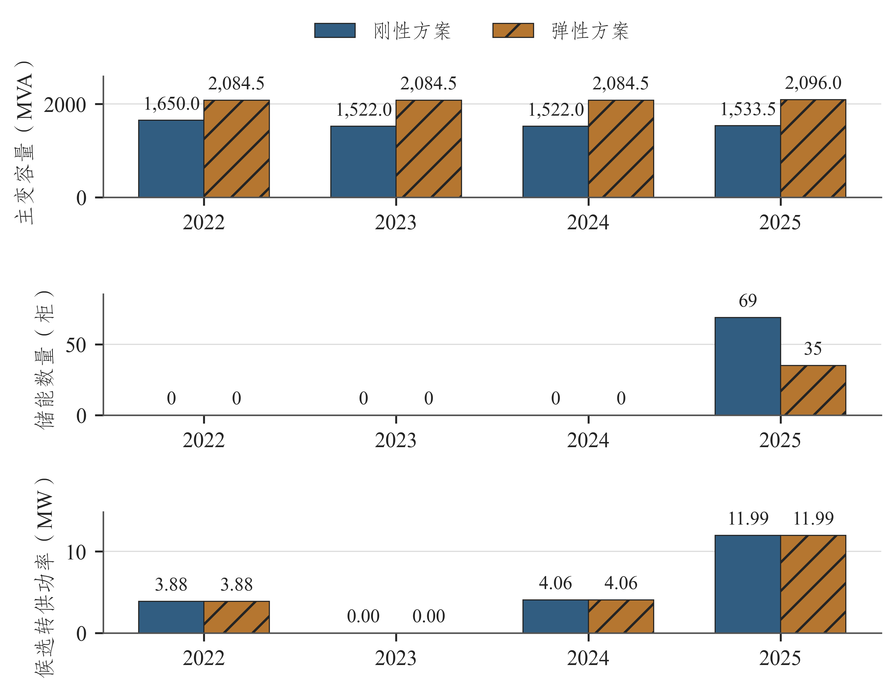

# 第六章 典型区域案例分析

## 6.1 案例选择与基础条件

本章选取具备局部互济候选的邳州110 kV和以主变、储能比选为主的市区29站110 kV，分析不同网络条件下的容量配置与费用。邳州35 kV作为支撑层在第五章单独比较。

两案例基础条件见表6-1。邳州2021年容量2027 MVA、2025年参考净峰956.450 MW；市区29站分别为2948 MVA和1307.315 MW。模型停运恢复比例分别取60%和45%，费用按各单元对应的刚性方案比较。

表6-1 典型区域案例的基础条件

| 案例单元 | 站数（座） | 基期容量（MVA） | 正/反向尖峰模板（h） | 停运恢复比例 | 互济条件 |
| --- | --- | --- | --- | --- | --- |
| 邳州110 kV | 20 | 2027.0 | 4/3 | 60% | 既有及拟建候选 |
| 市区29站110 kV | 29 | 2948.0 | 5/2 | 45% | 无站间候选 |

资料来源：项目统计及规划计算。

案例从基础条件、年度措施和费用结果展开，提出主变、储能及联络方案的工程应用重点。

## 6.2 邳州110 kV案例

### 6.2.1 局部互济条件与优化过程

邳州110 kV包含20座站。区县源荷近似比值由2023年的约0.742增至2025年的约1.631；2025年最大站反向峰为56.920 MW，正、反向尖峰模板分别为4和3 h。优化结合上述条件核定各站供电、反送及储能支撑需求。

候选互济关系如图6-1所示。既有方案将墩南线下游区段转入河炮线受入侧，拟建方案将墩振线下游区段接至河湾变新出线。既有通道静态包络为4.75 MW，拟建通道上界为9.05 MW，分别按局部案例热限与同型导线容量折算。

图6-1 邳州110 kV候选互济关系

资料来源：项目统计及规划计算。

优化按年度联合选择主变组合、储能数量和区段转供，转供同时受供端可转负荷、受端余量及通道能力约束。拟建线路按3 km、44.543万元/km估价，线路本体首次投资为133.629万元。

邳州年度措施如图6-2所示。弹性容量在2022至2024年保持2084.5 MVA，2025年为2096 MVA；前三年不配置储能，2025年配置35柜。刚性容量受到2.0上限和累计3%增配预算共同限制，2025年为1533.5 MVA，并配置69柜储能。

图6-2 邳州110 kV年度措施配置

资料来源：项目统计及规划计算。

### 6.2.2 配置与费用解释

2025年及完整路径关键结果见表6-2。两方案均选择既有候选转供4.497 MW和拟建候选转供7.491 MW。供受端成对计量，转供改变站级压力，不改变忽略损耗后的区域总功率；区域参考峰仍保持原分母。

表6-2 邳州110 kV两方案关键结果（2025年）

| 指标 | 刚性方案 | 弹性方案 |
| --- | --- | --- |
| 规划容量（MVA） | 1533.5 | 2096.0 |
| 规划参考容载比（MVA/MW） | 1.603 | 2.191 |
| 储能在役数量（柜） | 69 | 35 |
| 既有候选转供功率（MW） | 4.497 | 4.497 |
| 拟建候选转供功率（MW） | 7.491 | 7.491 |
| 完整路径费用现值（万元） | 5245.66 | 4410.44 |
| 费用降幅（%） | 比较基准 | 15.92 |

资料来源：项目统计及规划计算。

弹性路径费用为4410.44万元，较刚性5245.66万元下降15.92%。两路径转供规模相同，费用差主要来自主变容量路径和储能配置变化，并随投运时序影响更新及运维。保留主变容量减少储能需求，局部互济则调节供受站的负荷分布。

邳州案例形成主变、储能与局部转供联合配置方案。工程实施重点是核定可转区段的同步负荷、受端运行方式和通道最弱设备，据此落实拟建线路规模及配套投资。

### 6.2.3 10 kV分段联络的工程支撑作用

依据容载比与下级网络关系及分层转供研究[5][61]，局部10 kV分段联络将下级网络互济能力引入110 kV站级容量优化。模型按整体区段选择重构站级负荷分配，以静态通道容量约束转供，历史年度按供端峰值比例缩放区段负荷。

工程设计应核定区段设备和开关操作方式，并校验送受端同步潮流、电压、故障电流及保护配合。正向转供按通道热限和受端余量确定规模。

## 6.3 市区29站110 kV案例

### 6.3.1 样本范围与年度配置

市区29站按自身负荷与容量范围计算，采用全市区年度比例构造历史场景。2021年逐站容量由总量分配估计，三座站的设备容量来源另作标记，停运恢复比例取45%。

市区年度容量与储能配置如图6-3所示。刚性2022年容量2440 MVA，2023至2025年2450 MVA，2023年起43柜储能保持在役；弹性2022年2971 MVA，2023年增至2981 MVA并保持至2025年，各年储能均为零。

图6-3 市区29站年度容量与储能配置

资料来源：项目统计及规划计算。

市区样本的候选措施为主变容量调整和储能。按本次价格及尖峰模板，弹性路径选择保留和少量增配主变容量满足站级需求，形成各年储能均为零的配置。

### 6.3.2 结果及工程启示

关键结果见表6-3。2025年弹性规划参考比值2.280，刚性1.874；完整路径费用分别1912.29万元和3211.15万元，下降40.45%。较高弹性比值主要来自保留共同起点中的容量及少量增配，与43柜储能的替代配置共同影响费用。

表6-3 市区29站两方案关键结果（2025年）

| 指标 | 刚性方案 | 弹性方案 |
| --- | --- | --- |
| 规划容量（MVA） | 2450.0 | 2981.0 |
| 规划参考容载比（MVA/MW） | 1.874 | 2.280 |
| 储能在役数量（柜） | 43 | 0 |
| 完整路径费用现值（万元） | 3211.15 | 1912.29 |
| 费用降幅（%） | 比较基准 | 40.45 |

资料来源：项目统计及规划计算。

弹性方案采用主变配置，新增主变在评价期内未触发20年寿命更新，因此更新费用为零。相较刚性路径的储能采购及后续更新，主变保留与增配降低了评价期费用。

市区工程应用重点是核定历史设备容量、缺测负荷及停运恢复能力，结合现场联络条件进一步完善候选措施。新增可用通道后，可按相同费用方法联合比选主变、储能和转供。

## 6.4 案例总结

两案例分别展示了有互济候选和以站内措施为主的容量配置。邳州以局部转供配合主变和储能，市区以容量保留和增配减少储能投入，均在本单元内降低了相对刚性路径的费用。

案例可用于形成主变、储能和联络方案的比选依据。工程设计阶段按现场设备及同范围时序更新输入，完成承载力、供电安全、储能运行和线路概算校核，确定建设方案及投运时序。