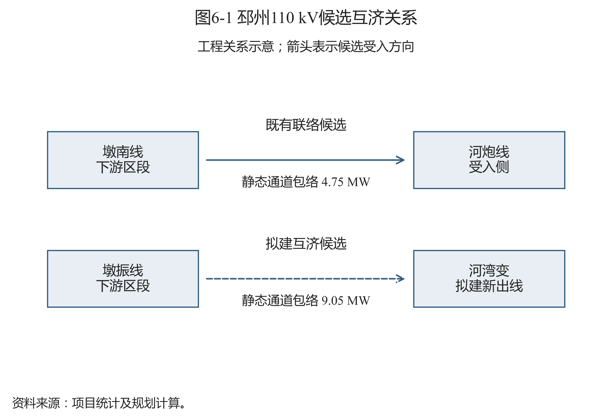
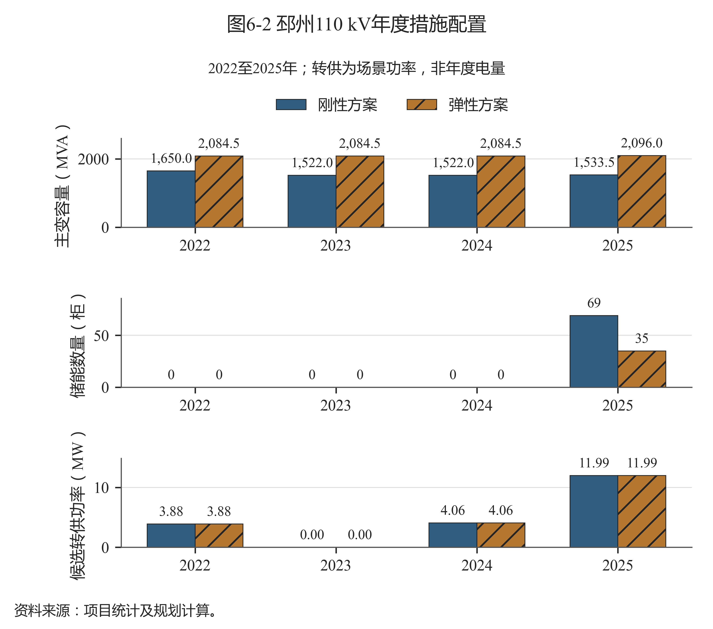
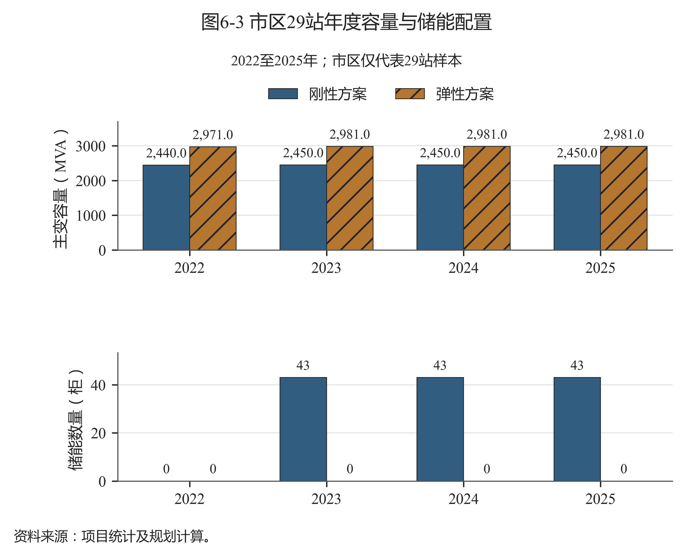

# 第六章 典型区域案例分析

## 6.1 案例选择与基础条件

选择邳州110 kV和市区29站110 kV开展案例分析，原因是两者分别具有资料可支撑的局部互济候选和无站间候选的模型条件，可以解释网络措施对容量配置的作用。邳州35 kV作为支撑层保留在第五章对照，不与110 kV合并形成案例容量或费用。

两案例基础条件见表6-1。邳州2021年容量2027 MVA、2025年参考净峰956.450 MW；市区29站基期2948 MVA、2025年参考净峰1307.315 MW。停运恢复比例分别为60%和45%，是模型研究假设。两案例条件不同，不以其费用绝对值评价区域投资效率高低。

表6-1 典型区域案例的基础条件

| 案例单元 | 站数（座） | 基期容量（MVA） | 正/反向尖峰模板（h） | 停运恢复比例 | 互济条件 |
| --- | --- | --- | --- | --- | --- |
| 邳州110 kV | 20 | 2027.0 | 4/3 | 60% | 既有及拟建候选 |
| 市区29站110 kV | 29 | 2948.0 | 5/2 | 45% | 无站间候选 |

资料来源：项目统计及规划计算；原始数据定位见《数据来源说明》。

案例沿用共同起点和原完整优化路径，先解释输入条件，再分析年度措施及费用，最后提出工程核查重点。数据来自年度统计、设备快照、站级场景及对应路径结果；来源位置和数字精度在《数据来源说明》中登记。

## 6.2 邳州110 kV案例

### 6.2.1 局部互济条件与优化过程

邳州110 kV包含20座站。区县源荷背景由2023年的约0.742增至2025年的约1.631，站级反向压力仍需单独识别。模型2025年最大站反向峰56.920 MW，正、反向尖峰时长模板最大值分别为4和3 h，不能仅凭区县装机指标决定各站容量。

候选互济关系如图6-1所示：既有墩南线下游区段经联络转入河炮线受入侧，拟建候选将墩振线下游区段接至河湾变新出线。既有路径静态包络4.75 MW，拟建通道上界9.05 MW；前者来自已登记局部案例的保守热限包络，后者为同型导线的研究折算。图为工程关系示意，不能当作测绘路线或潮流计算图。

图6-1 邳州110 kV候选互济关系

资料来源：项目统计及规划计算；见《数据来源说明》中图6-1的逐项定位。

优化按年度选择主变组合、储能柜数和区段转供，逐年满足技术代理条件。受端余量和供端可转负荷进一步收紧通道能力，所以实际结果不会自动达到图中的静态上界。拟建线路按3 km及44.543万元/km估计，其首次投资133.629万元，未单列全部开关、间隔和保护通信工程。

邳州年度措施如图6-2所示。弹性容量在2022至2024年保持2084.5 MVA，2025年为2096 MVA；前三年不配置储能，2025年配置35柜。刚性容量受到2.0上限和累计3%增配预算共同限制，2025年为1533.5 MVA，并配置69柜储能。

图6-2 邳州110 kV年度措施配置

资料来源：项目统计及规划计算；见《数据来源说明》中图6-2的逐项定位。

### 6.2.2 配置与费用解释

2025年及完整路径关键结果见表6-2。两方案均选择既有候选转供4.497 MW和拟建候选转供7.491 MW。供受端成对计量，转供改变站级压力，不改变忽略损耗后的区域总功率；区域参考峰仍保持原分母。

表6-2 邳州110 kV两方案关键结果（2025年）

| 指标 | 刚性方案 | 弹性方案 |
| --- | --- | --- |
| 规划容量（MVA） | 1533.5 | 2096.0 |
| 规划参考容载比（MVA/MW） | 1.603 | 2.191 |
| 储能在役数量（柜） | 69 | 35 |
| 既有候选转供功率（MW） | 4.497 | 4.497 |
| 拟建候选转供功率（MW） | 7.491 | 7.491 |
| 完整路径费用现值（万元） | 5245.66 | 4410.44 |
| 费用降幅（%） | 比较基准 | 15.92 |

资料来源：项目统计及规划计算；原始数据定位见《数据来源说明》。

弹性路径费用4410.44万元，比刚性5245.66万元低15.92%。两路径的实际转供结果相同，不能把费用下降解释为弹性方案新增了更多转供；差异主要对应主变容量路径和储能配置的改变，更新及固定运维随采购时序一并变化。反向压力和停运代理同时约束站级措施，因此还需结合每站配置核查，区域容量总量不能替代站级可行性。

该案例说明，具备互济通道时，主变和储能仍需与局部转供一起比选。在当前假设下，保留容量减少了储能需求，但既有和拟建候选在弹性路径中仍有经济作用。工程应用应核实可转区段负荷、受端实际运行方式和路径最弱设备，再判断是否采用该候选及其投资规模。

### 6.2.3 10 kV分段联络的工程支撑作用

局部10 kV馈线分段联络为110 kV站级容量配置提供下级网络互济候选。本模型按区段整体选择和静态容量边界进行拓扑容量重构规划，不计算完整交流或直流潮流、短路和保护定值。年度区段负荷按供端峰值比例缩放，未形成真实历史转供操作记录。

后续需要核对区段对应设备、开关可操作性、送受端同时刻潮流、电压、故障电流和保护配合。普通正向负荷转供使用实际通道与受端条件，不能直接套用80%的反向负载率。经上述校核后，局部候选才可转化为具体工程方案。

## 6.3 市区29站110 kV案例

### 6.3.1 样本范围与年度配置

市区29站样本采用自身负荷和容量边界，原表全市区统计只用于背景及年度缩放，不替代样本结果。三站缺少可对应设备容量、逐站2021年容量采用代理分配，停运恢复比例取45%，均需随案例结论说明。

市区年度容量与储能配置如图6-3所示。刚性2022年容量2440 MVA，2023至2025年2450 MVA，2023年起43柜储能保持在役；弹性2022年2971 MVA，2023年增至2981 MVA并保持至2025年，各年储能均为零。

图6-3 市区29站年度容量与储能配置

资料来源：项目统计及规划计算；见《数据来源说明》中图6-3的逐项定位。

样本模型无站间线路候选，因此两方案通过主变与储能组合满足同一技术代理条件。零储能表示当前成本和措施条件下未选择该措施，不能推广为市区无储能价值或无需应急支撑。若加入新的联络通道、时序约束或收益边界，应重新求解。

### 6.3.2 结果及工程启示

关键结果见表6-3。2025年弹性规划参考比值2.280，刚性1.874；完整路径费用分别1912.29万元和3211.15万元，下降40.45%。较高弹性比值主要来自保留共同起点中的容量及少量增配，与43柜储能的替代配置共同影响费用。

表6-3 市区29站两方案关键结果（2025年）

| 指标 | 刚性方案 | 弹性方案 |
| --- | --- | --- |
| 规划容量（MVA） | 2450.0 | 2981.0 |
| 规划参考容载比（MVA/MW） | 1.874 | 2.280 |
| 储能在役数量（柜） | 43 | 0 |
| 完整路径费用现值（万元） | 3211.15 | 1912.29 |
| 费用降幅（%） | 比较基准 | 40.45 |

资料来源：项目统计及规划计算；原始数据定位见《数据来源说明》。

弹性方案无储能更新投资，新增主变在评价期内也未触发20年寿命更新，因此该路径的更新费用为零。费用节省依赖评价期和当前固定运维规则，不代表更长期、更完整费用边界下仍有相同幅度的优势。

工程上应先查明样本站历史设备、缺测负荷及真实停运恢复能力，再判断既有容量是否可以保留或退出。当前没有站间候选只表示现有资料尚未形成相应候选措施，不等于城市网络实际没有联络。若补齐可用通道，宜连同主变和储能完整比选，不能直接套用邳州的转供规模。

## 6.4 案例结论的使用范围

两案例支持在同一研究单元内比较控制条件及措施组合，并说明局部网络条件、存量容量和价格对参考比值的共同作用。它们没有形成跨区域独立验证，也没有证明区域比值相近就具有相同供电安全和承载能力。

案例结果适合用于选择需要进一步核查的主变、储能和联络方案。进入工程设计前，应以现场设备和同范围时序更新输入，补充标准承载力、供电安全、储能运行及候选线路完整造价校核。未闭合的条件保留待核查，不用当前样本参考范围直接替代工程结论。
