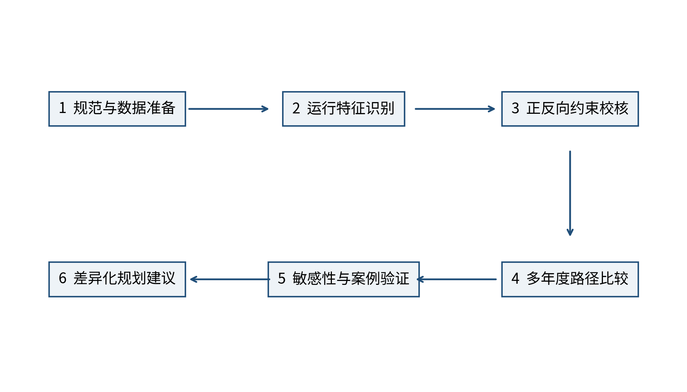
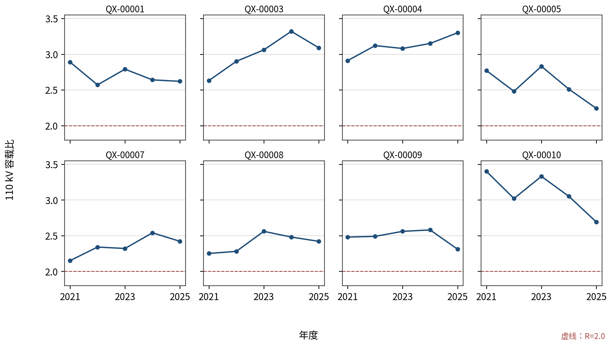
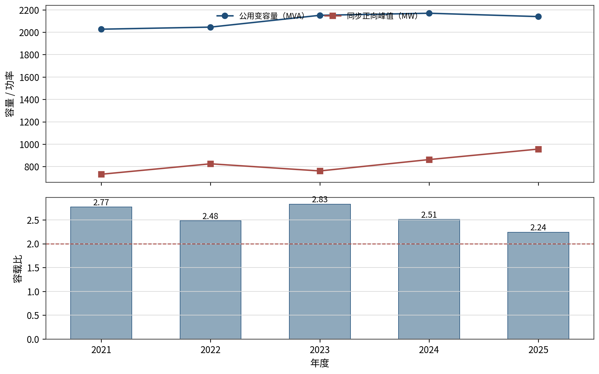
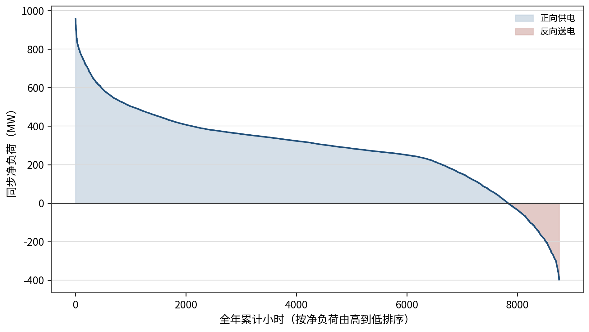
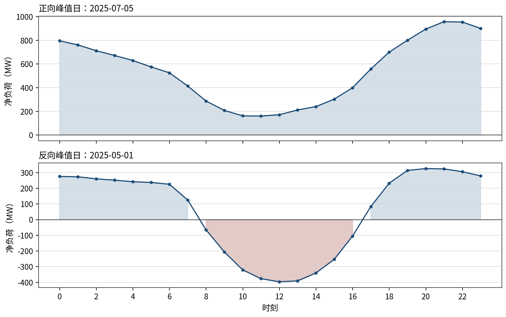
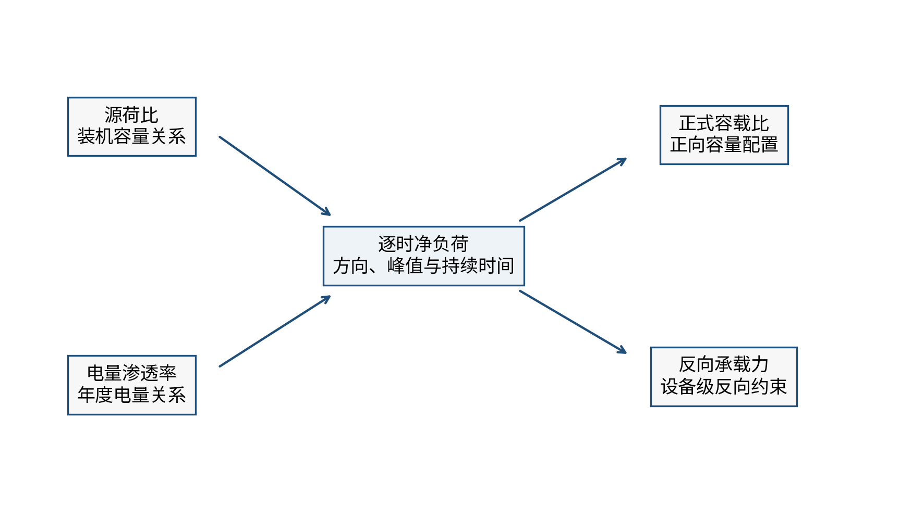
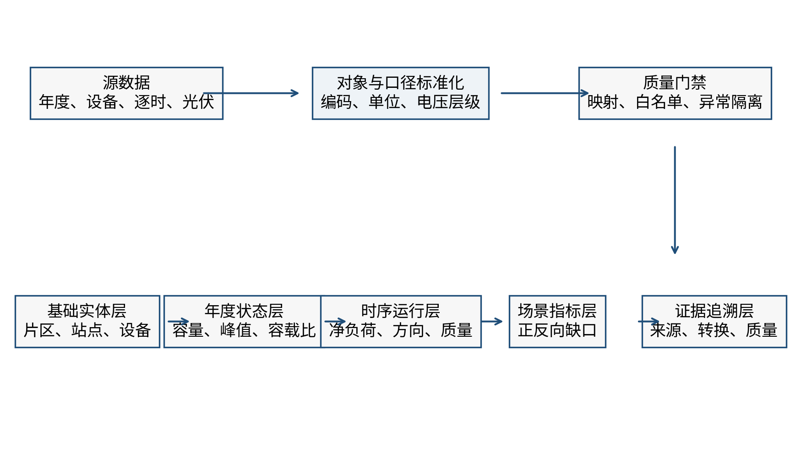

# 第一章 绪论

## 1.1 研究背景与意义

碳达峰、碳中和目标和新型电力系统建设持续推进，我国新能源已经进入大规模、高比例发展阶段。分布式光伏建设周期短、接入层级低、靠近负荷侧，是能源绿色低碳转型的重要组成部分。国家能源局发布的并网运行情况显示，截至 2025 年底，全国分布式光伏累计并网容量已达到较大规模[1]。《关于新形势下配电网高质量发展的指导意见》《加快构建新型电力系统行动方案（2024—2027 年）》和《配电网高质量发展行动实施方案（2024—2027 年）》均提出提升配电网对分布式新能源和多元负荷的承载能力，强化源网荷储协同，提高电网规划建设的精准性和投资效益[2-4]。配电网规划由此增加了一项任务：在满足负荷增长需要的同时，还要适应新能源出力变化引起的潮流重构和运行边界变化。

江苏省用能密度较高、分布式光伏发展较快，各地区产业结构、城乡负荷形态和新能源资源条件并不相同。徐州地处江苏北部，县域面积较大，工业、农业和城乡居民负荷并存，分布式光伏接入在空间上呈现一定的集聚特征。部分县域或高压供电分区已出现午间净负荷下降、局部时段反向送电增加、正反向功率快速转换等现象。与传统单向供电模式相比，这类运行形态不再由单一负荷高峰决定：在负荷集中增长时段，主变仍需承担由上级电网向负荷侧供电的正向功率；在光伏出力较大而本地用电需求较低的时段，分布式电源可能经主变向上级电网反送；在天气变化或光伏出力爬坡、回落时段，主变潮流方向及负载水平还可能在较短时间内发生变化。

同一片区由此面临两类性质不同的约束。区域负荷处于高峰时，要判断主变容量、运行方式和网络转供能力能否满足正向供电；新能源高出力而本地负荷较低时，则要判断主变及相关网络能否安全承受反向功率。两类约束未必在同一时刻出现，也可能落在不同设备上。正向负荷不高，不等于反向承载一定充足；出现较大反向功率，也不能据此认定正向容量配置过多。高渗透率地区的规划分析需要回答三个实际问题：负荷高峰需要多少容量，反向送电由哪些设备承受，不同措施在多年尺度上是否经济。

容载比是我国配电网规划中衡量变电容量配置水平的重要宏观指标。按照 DL/T 5729—2023《配电网规划设计技术导则》，某一电压等级容载比反映规划区域公用变压器总容量与最大负荷之间的配置关系，具体取值需要综合考虑负荷增长、供电安全和转供能力[5]。该指标计算简明、便于开展地区间比较，在传统负荷主导的规划条件下具有较强的工程适用性。但是，容载比本质上侧重正向容量充裕度，不能单独刻画反向潮流持续时间、设备反向承载能力、新能源出力波动以及储能等灵活资源的时序作用。DL/T 2041—2025《分布式电源接入电力系统承载力评估导则》则从系统级和设备级对分布式电源承载能力进行分析，为设备容量、电压、反向功率和调节资源校核提供了依据[6]。因此，在分布式新能源高渗透条件下，容载比和承载力应分别计算、相互校核，不能用其中一个指标替代另一个指标。

从规划实践看，单纯追求较低容载比可能通过提前扩建形成较大的容量裕度，但也可能增加投资和设备闲置；单纯提高容载比虽然能够推迟部分建设，却可能压缩正向供电裕度，并加大故障转供和负荷增长不确定性带来的风险。对于新能源占比较高的地区，还存在另一种容易混淆的情形：容载比较高并不必然意味着需要扩建，容载比较低也不必然意味着具备充分的反向承载能力。措施是否触发，应当由正向容量缺口、反向承载缺口、运行方式和网络压力等可验证的物理条件决定，而不能只依据容载比是否超过某一数值作出判断。

不同规划措施的作用机理和成本发生方式也不相同。主变扩建、替换或减容改变的是离散设备容量；网架加强主要改善站间转供和网络压力；储能通过受约束的充放电改变局部时序功率；运行方式调整和局部联络措施则改变功率分布。若只比较一次建设投资，难以反映措施投运年份、设备使用年限和多年在役状态对经济性的影响。为保证不同方案可比，本研究以 2021 年实际状态为共同基准，将 2021 年既有资产视为共同沉没成本，统一按 2025 年价格评价 2022—2025 年新增措施，并以“累计年化成本”作为单目标经济指标，即计算决策期内累计在役等效年成本。这一处理能够把“何时建设、建设何种离散容量、在役多少年”纳入同一比较口径，也避免将缺少依据的损耗、残值或未知实际成本写入结果。

本研究据此选取徐州典型地区 110 kV 电网作为主要对象，同时对 35 kV 电网分层分析。在统一物理约束、候选措施和成本口径下，报告比较实际发展事实、不限制容载比的成本优化，以及以 2021 年实际在役资产为起点、在规划期新增容量上执行容载比控制的严格优化（仅作用于 110 kV 正式层）。2021 年既有容量作为存量资产保留，不因后续容载比要求反向改造；严格方案的控制对象是 2022—2025 年新增容量。这里的“弹性”不放松供电安全、设备容量或电能质量要求，其含义是在物理红线内，根据片区源荷特征、正反向缺口、网络条件和经济代价，识别容载比控制的合理边界。

本研究将正式容载比的正向同步口径与设备级反向承载校核并列设置，避免正反向功率混用造成指标失真；年度总量锚点、设备范围、时序方向和质量标记也在同一数据链条中衔接。建立这两层基础后，再以统一口径比较弹性优化方案与严格优化方案，量化容载比控制要求增加的经济代价。研究结论可用于支撑徐州各片区的差异化规划，而不是给出脱离片区条件的统一取值。

## 1.2 研究范围与对象

本研究属于面向规划方法和投资决策的专题研究，研究对象为徐州地区分布式新能源占比较高、运行特征具有代表性的县域或高压供电分区。空间上以八个片区为年度总量分析单元，进一步选取逐时数据、设备映射和年度资产范围较完整的典型片区开展主变多工况分析。为保持规划指标与运行数据的一致性，片区边界、站点归属和设备电压等级均采用项目标准化关系，不以任意划定的小区域替代正式统计单元。

电压层级方面，110 kV 与 35 kV 分开建模、分开聚合、分开输出。110 kV 层形成八片区正式分析结果，35 kV 层形成对应的辅助分析结果。两类电压等级的变电容量、同步峰值、光伏容量和成本均不得跨电压相加。10 kV 网络不纳入主体模型的全县联络优化；仅在后续具备父级映射、同步转移量、候选完整性和独立审批条件时，才可将现有联络切分或新建联络线路作为局部案例回接优化方案。局部案例只能改变站间负荷分布，不能改变片区总功率或造成重复治理、重复计费。

时间范围方面，以 2021 年实际状态作为方案比较的共同基准，以 2022—2025 年作为决策期。2021 年既有资产不计入增量成本；2022—2025 年的扩建、减容、退役、替换、储能或其他已批准措施按照实际投运年份进入在役成本。年度历史状态以官方片区容量、同步正向峰值和容载比为总量锚点，不以 2025 年在役设备表按投运年份回溯的结果替代实际历史资产。逐时运行分析使用 2022—2025 年通过年度资产白名单、设备映射审批和质量门禁的数据。

指标范围方面，正式容载比仅采用同一电压等级的公用变压器总容量与该方案、该年度、同步、正向最大净负荷之比。源主变负荷按净负荷解释，不再次扣减现状光伏；各优化方案应根据自身干预后的净负荷重新计算正向峰值和容载比。反向峰值、反向持续时间和反向承载力单独统计，不把正向与反向峰值取大后称为正式容载比。设备级反向承载力依据设备运行方式计算，分列或单台主变与并列主变组分别采用相应校核规则。

物理边界方面，措施触发依据为正向容量缺口、反向承载缺口、运行方式和网络压力，容载比大于 2.0 本身不自动触发扩建或储能。储能充电只能吸收本时段原本存在的反向功率，不得跨越零点制造正向峰值以降低容载比；储能放电只能服务本地正向负荷，不得形成反送或无约束套利。扩容、减容、退役和替换均从可追溯的离散候选中选择，减容后必须重新通过正向容量、反向承载、运行方式和网络压力检查。主体模型不设置弃光决策，物理不可行时明确标记为不可行。

安全分析方面，本研究结合设备容量和网络连接关系开展内部 N-1 容量网络压力筛查，用于识别候选措施可能引起的供电压力变化。由于部分对象缺少开展精确潮流所需的完整阻抗、运行方式和边界条件，本研究不以该筛查替代具体工程的 AC/DC 潮流、短路电流、继电保护、电压质量和接入系统专题论证。报告提出的规划建议属于方法研究和方案比较结论，具体项目实施前仍需按现行规程完成相应设计审查。

表 1-1 汇总了本研究的主要边界。

**表 1-1 研究对象与边界**

| 维度 | 研究范围 | 主要限制 |
|---|---|---|
| 空间范围 | 徐州八片区及数据条件完整的典型片区 | 正式统计采用项目统一片区边界 |
| 电压范围 | 110 kV 正式分析、35 kV 辅助分析 | 两个电压等级分开计算和输出 |
| 时间范围 | 2021 年共同基准，2022—2025 年决策期 | 2021 年既有资产为共同沉没成本 |
| 运行指标 | 同步正向峰值、正式容载比、反向峰值、反向承载及缺口 | 正反向指标分列，不混用分母 |
| 措施范围 | 离散扩建、减容、替换、退役、储能及经批准的局部措施 | 措施必须可追溯并通过物理校核 |
| 网络分析 | 设备容量与内部 N-1 网络压力筛查 | 不宣称完成精确 AC/DC 潮流 |
| 经济评价 | 2022—2025 年累计年化成本 | 统一采用 2025 年价格，未知成本不写 0 |

## 1.3 研究目标与内容

本研究的总体目标是：依托徐州 2021—2025 年年度状态和可用逐时运行数据，构建能够同时反映正向容量配置、反向承载约束和多年建设成本的规划分析框架，比较严格控制容载比与允许容载比在物理可行范围内弹性变化的经济技术差异，为不同片区形成差异化容载比建议和配套措施提供依据。

围绕总体目标，设置以下四项具体目标。

第一，建立口径统一、来源可追溯的“新能源渗透水平—电网运行状态”数据库。数据库覆盖片区、站点、主变、线路和光伏等基础对象，连接年度容量与同步峰值、逐时净负荷、设备运行方向、资产范围、数据质量和证据等级，为指标计算与模型输入提供统一数据基础。

第二，识别高渗透率地区主变多工况运行特征。通过年度锚点和逐时数据，分别分析正向供电、低负荷、反向送电及正反向转换工况，揭示源荷变化对同步正向峰值、正式容载比、反向功率和设备承载的不同作用，避免以单一峰值或单一指标概括复杂运行状态。

第三，构建统一口径的多年方案比较方法。研究设置实际发展情况、弹性优化方案和严格优化方案三类正式方案。实际发展情况用于描述 2021—2025 年已发生的资产和运行事实，不参与最优排名；两条优化方案均从 2021 年实际在役资产起步，在物理约束、候选措施和成本边界内寻求累计年化成本最小。严格优化方案不追溯改造存量容量，自 2022 年起仅对 110 kV 规划期新增容量施加容载比不超过 2.0 的政策控制。两个方案在同一实际资产基线上表征不同规划规则的演进成本；容载比上限弹性扫描用于识别控制要求开始释放经济代价的阈值。以 2×P2021 构造的状态不进入正式规划基线。

第四，形成差异化规划分析基础。在满足正向容量、反向承载、运行方式和网络压力等约束的前提下，综合年度运行轨迹、措施组合和敏感性分析结果，提炼不同片区的主要矛盾，形成容载比推荐区间及配套技术措施的证据基础。推荐区间不机械取若干年度独立最优值的最小值和最大值，而应来自弹性优化方案的成本最小可行结果、容载比上限弹性扫描前沿近优带及其经验证的敏感性结果。

按照开题报告确定的目录，本研究报告共分七章。第一章阐述研究背景、研究边界、研究目标和技术路线；第二章梳理国内外研究进展并界定核心概念；第三章分析徐州典型地区新能源与负荷发展、主变多工况运行特征和指标关联，构建基础数据库；第四章建立基于实际工程的电网建设成本模型；第五章结合模型结果提出“一片一策”规划建议；第六章开展典型案例验证；第七章形成结论与展望。

## 1.4 研究方法与技术路线

本研究综合采用规范分析、数据标准化、时序统计、物理约束校核、多年度方案优化和工程经济评价等方法。各方法并非相互独立，而是围绕“数据可追溯—指标可解释—约束可验证—成本可比较”逐层衔接。

（1）规范分析法。系统梳理新型电力系统、配电网高质量发展、分布式光伏管理以及配电网规划设计等政策和标准，明确容载比、承载力、供电安全和电压层级的适用范围。对于标准推荐值、项目比较约束和设备物理红线分别表述，避免将推荐区间等同于普遍强制边界。

（2）数据标准化与证据追溯法。对片区、站点、主变、线路、光伏和工程措施建立唯一对象关系，按年度状态和逐时运行两类时间粒度组织数据。派生数据保留来源、版本、转换规则、场景和质量标记，对映射冲突、异常值、年度范围差异和跨年快照分别记录处理规则，使报告中的统计结果能够追溯到精确数据源。

（3）同步时序统计法。对同一片区、同一电压等级、同一时刻的主变净负荷进行同步聚合，在此基础上计算年度正向最大净负荷和正式容载比；同时单列反向峰值、反向持续时间和负载率分布。该方法避免把不同站点在不同时刻出现的静态极值相加后冒充片区同步峰值。

（4）设备级正反向缺口分析法。正向侧依据主变容量、运行方式和负荷峰值判断容量缺口；反向侧依据单台、分列或并列组的设备条件计算反向承载能力。容量缺口与反向承载缺口分别形成措施触发原因。减容、扩容、替换和储能等候选措施在实施后重新进行正向、反向和网络压力检查。

（5）多年度方案比较法。以 2021 年实际在役资产为共同起点，对 2022—2025 年逐年决策和在役状态进行连续追踪。弹性优化方案与严格优化方案采用相同的候选、物理约束、成本库和求解精度；严格优化方案不重构既有资产，只对规划期新增容量执行 110 kV 容载比控制。两条优化路径具有相同的实际资产基线，因而在两者均可行时可以直接比较累计在役等效年成本；容载比上限弹性扫描进一步识别收紧控制要求的经济释放阈值。以 2×P2021 构造的标准化状态仅用于反事实或敏感性分析，不作为正式规划起点。

（6）工程经济评价法。将离散工程措施按统一 2025 年价格计价，根据投运年份折算其在决策期内的在役等效年成本，同时输出年度投资、年度在役等效年成本、累计投资和累计年化成本。经济评价不以缺少证据的项目填补成本项，也不把共同基准资产重复计入增量成本。

（7）敏感性与案例验证法。在正式结果基础上，对关键成本、源荷情景、时长参数和措施边界开展敏感性分析，判断推荐区间对主要假设的稳定程度。具备完整映射和候选条件的局部 10 kV 联络案例独立接入、独立审批、独立验证，不具备条件的对象保留为问题台账，不据此阻断其他片区研究。

本研究技术路线如图 1-1 所示。研究从规范、数据和证据准备起步，在识别片区年度状态和典型片区多工况运行特征后，校核正向容量、反向承载和网络压力，并据此形成可追溯的离散措施候选。多年度方案比较采用统一成本口径，推荐结论还需经过敏感性分析和典型案例验证。

这一路线将正式容载比限定为正向容量配置指标，将反向承载力作为独立物理约束，并通过同口径方案比较把安全要求与经济代价联系起来。第二章梳理相关研究进展和理论依据，第三章说明徐州实际数据呈现的运行特征及数据库构建方法。

# 第二章 文献综述与理论基础

## 2.1 国内外研究现状

容载比、最大供电能力和分布式电源承载力分别描述容量配置、供电能力和新能源接纳边界。分布式光伏接入规模增加以后，相关研究由静态断面逐步延伸至时序运行、不确定性评估、灵活资源配置和全寿命周期经济比较。受电网结构、规划制度和指标体系差异影响，国外文献主要围绕 Hosting Capacity、主动配电网和灵活性资源展开，国内研究则更重视容载比、最大供电能力、主配协同和工程规划评价。下文据此梳理两类研究脉络，并分析其对徐州 110 kV 电网的适用性。

### 2.1.1 国外研究现状

国外对分布式电源接纳能力的研究通常以 Hosting Capacity 为核心，即在不违反设备容量、电压质量、保护配合和运行安全等约束的条件下，配电网能够接纳的分布式电源规模。早期研究多采用确定性最不利断面，通过逐步增加分布式电源容量识别首个越限约束。这种方法结构清晰、计算量相对较小，适合开展接入边界的初步判断，但其结果对负荷断面、光伏出力假设和接入位置较为敏感，难以充分反映新能源与负荷在时间上的非同步性。

随着智能量测和时序数据条件改善，承载力研究逐步转向多时段和不确定性分析。Lin 等在考虑源荷不确定性和主动管理的条件下计算配电网光伏承载力，说明有载调压、无功调节和主动功率控制等措施能够改变原有静态承载边界[7]。Chen 等将源荷不确定性纳入光伏承载力评估，强调不同随机场景对电压和设备约束触发概率的影响[8]。Liu 等进一步综合多类不确定因素开展承载力评估，反映出由单一确定值向区间或风险水平表达的发展趋势[9]。这类研究的共同特点是把“可接入容量”视为与场景、控制方式和风险容忍程度相关的量，而不是脱离运行条件的固定常数。

高渗透率光伏对配电设备和净负荷形态的影响，是国外研究的另一重点。Majeed 和 Nwulu 分析了光伏接入低压网络后反向功率对配电变压器的影响，指出反向潮流可能改变设备负载和热状态，传统只关注正向峰值的运行认知需要相应调整[10]。Hou 等提出高光伏渗透电力系统的概率“鸭形曲线”概念，揭示午间净负荷下凹和晚间爬坡压力在不同场景下的变化[11]。Xie 等针对光伏反向功率引起的过电压现象及抑制策略开展研究，说明反向功率、线路参数、电压调节和接入位置之间具有耦合关系[12]。上述成果表明，高渗透率场景下既要关注峰值大小，也要关注潮流方向、持续时间和快速转换；但这些研究多集中于中低压馈线或配电变压器层级，不能直接替代高压分区的变电容量规划分析。

在提升承载力的措施方面，研究重点已由单一扩建逐步转向网架、储能、柔性互联和运行控制的协同。Wang 等提出柔性配电网多资源动态协同规划方法，通过统筹网络重构、柔性设备和分布式资源，提高系统在不同场景下的适应能力[13]。Martínez 等研究分布式电池储能在持续负荷增长情景下延缓配电网增容的作用，表明储能是否优于传统网架增强取决于负荷增长、利用时长和成本条件[14]。Holweger 等从经济性角度比较分布式灵活性和网络加固，指出灵活资源能够在部分场景中推迟建设，但其优势存在明显的参数适用范围[15]。Matthiss 等对高光伏配电网中的储能选址定容进行研究，进一步说明储能作用与局部光伏出力、负荷曲线及网络位置密切相关[16]。

对本项目而言，规划措施的有效性必须结合时序功率和设备位置判断，储能功率、网络容量和柔性资源不能作为无条件替代的同质变量。网架与储能的比较还应采用一致的约束和成本基准，单个算例给出的经济阈值不宜直接移植到徐州工程。本项目进一步限定储能的作用范围：充电只吸收本时段已有的反向功率，放电只服务本地正向负荷，不考虑无约束能量套利。

全寿命周期经济评价也逐渐成为国外配电网规划的重要组成部分。Xu 等将分布式储能的寿命周期成本纳入规划，体现了投资、寿命、运维和更换等因素对配置结果的共同影响[17]。Huang 等在新能源条件下研究变电站容量规划，说明容量选择需要统筹建设投资、供电需求和新能源作用[18]。Zeng 等采用经济寿命区间方法分析输电线路全寿命周期成本，强调评价年限、折现和更新规则对不同方案可比性的影响[19]。相较只比较初始投资，寿命周期方法更能反映建设时序和在役年限，但前提是各项成本具有统一的价格基准、明确的数据来源和一致的计算范围。

国外研究已形成“承载边界评估—高渗透运行特征—灵活资源提升—寿命周期经济比较”的方法链条，时序、不确定性和多资源协同是其主要特点。多数研究对象仍是中低压馈线、配电变压器或标准测试系统，也缺少我国规划实践中常用的容载比指标。徐州 110 kV 电网可以借鉴其时序分析和同基准经济比较方法，但不宜直接套用具体阈值或算例结论。

### 2.1.2 国内研究现状

国内配电网容量规划长期以容载比为重要宏观指标，并围绕网络结构、负荷增长和供电可靠性形成了较丰富的理论成果。肖峻等量化分析变电容载比与下一级中压配电网络之间的关系，指出中压联络和负载转移能力会影响上一级变电容量需求[20]。陈浩等研究多电压等级配电网最优容载比计算方法，将容量配置置于多层级技术经济关系中考察[21]。王凯亮等进一步讨论多电压等级电网协同规划下的容载比优化配置，反映出容载比取值由单一经验范围向多层级协调发展的趋势[22]。相关结论说明，容载比不能脱离下级网络结构和供电能力单独评价；数值相同的容载比，在不同网架条件下可能对应不同的安全裕度。

在指标精细化方面，刘文霞等提出基于容载比色带的区域配电网充裕性分析方法，通过分区、分级表达容量配置状态，提高了宏观指标的辨识能力[23]。刘炜彬等面向精细化规划研究容载比参数优化，将地区发展、负荷特征和经济性纳入指标选取[24]。相关成果推动容载比由“单值判断”向“区间分析、分类应用”发展，为差异化规划提供了方法基础。但需要注意，区间或色带仍属于容量配置状态的表达方式，不能替代对设备过载、反向功率和电压问题的专项校核；不同研究给出的分级阈值也应结合其样本和适用条件使用。

最大供电能力研究从网络拓扑和 N-1 安全约束出发，补充了容载比难以直接表达实际转供能力的不足。马雨欣、林凌雪提出面向精准规划的最大供电能力评估方法，并将分布式电源场景纳入供电能力计算[25]。这类研究关注的是在给定网络结构、运行方式和安全约束下可以持续供应的最大负荷，其结果与线路容量、站间联络、主变组合和负载均衡程度密切相关。对高压分区而言，TSC 和网络转供能力能够解释“容量相同但供电能力不同”的原因，也能为判断局部减容或扩建是否会加大网络压力提供辅助依据。

随着分布式光伏规模增长，国内研究逐步形成从确定性承载力到主配协同、概率和区间评估的研究体系。王守相等考虑多供电层级耦合，对中低压配电网分布式光伏承载力进行一体化精细评估，强调不同层级约束之间的传导关系[26]。王方敏等从风险抑制角度开展分布式光伏承载力概率评估，将不确定性和风险水平纳入结果表达[27]。宋钰等构建分布式光伏接入配电网的安全经济承载力评估方法，把安全约束与措施经济性联系起来[28]；李敬如等进一步考虑主配协同条件下的安全经济承载力计算，说明上级变电层和下级网络需要在统一场景下协调分析[29]。徐非非等采用区间方法处理源荷不确定性，为数据不完全或场景变化条件下的承载力表达提供了参考[30]。

承载力研究与容载比研究关注的侧重点不同。容载比主要回答正向最大负荷条件下变电容量配置是否充足，承载力主要回答新增或现有分布式电源在设备和运行约束下能够达到何种水平。二者相互关联，却不能替代。高渗透率地区只看容载比，容易遗漏光伏大发时段的反向承载问题；只看分布式电源承载力，又不能直接回答负荷高峰和故障转供条件下的容量配置问题。本项目将正式容载比、正向容量缺口、反向峰值和设备级反向承载缺口分列计算，再在措施决策层衔接。

在源网荷储协同和灵活资源配置方面，龚锐等研究储能优化配置对配电网综合承载水平的提升作用，表明储能配置需要兼顾位置、容量和运行场景[31]。梁志峰等针对高比例分布式光伏条件下的主配网运行风险及防控策略开展研究，强调多层级风险识别和协同控制[32]。黄海泉等总结新型配电网分布式储能方案与配置方法，指出储能可参与削峰、吸收局部富余功率和提供调节，但其经济性受到利用率、寿命和场景约束[33]。贺春光等研究多电压等级配电网柔性互联装置协同规划，体现了柔性互联在负荷转移和资源协调中的作用[34]。徐峰亮等从运行灵活性角度研究中压配电系统源—网—储协同扩展规划，乐健等则通过随机场景开展配电网源网储协同规划[35-36]。这些成果说明，高渗透率地区的规划应由单一设备扩建转向多措施组合，但各类措施必须在明确的物理边界内比较。

江苏电网负荷和新能源具有较强的区域特征。龚玺等对江苏电网负荷变化特征进行研究，指出地区产业、季节和气象条件会共同影响负荷曲线[37]。在徐州等分布式光伏增长较快的地区，午间光伏出力可能降低由上级电网供给的净负荷，而夏冬高负荷时段和晚峰仍可能形成正向容量压力。因此，不能预设“春秋必然反送、夏冬必然重载”等固定规律，而应使用实际时序数据识别不同年份、季节和典型日的运行特征。吕达夫关于源荷不确定性条件下承载能力的研究也说明，源荷关系的变化会导致接纳边界和风险水平发生变化[38]。

在规划经济评价方面，国内研究已经从一次投资比较拓展到全生命周期投入产出和精准投资。张全等提出基于全生命周期投入产出效益的电网规划精准投资方法，强调建设成本与长期效益的统一[39]。何凯等从全成本电价角度开展电网规划方案评价与优选，将不同成本项目纳入一致比较框架[40]。武小琳等研究输变电工程造价自动计算，为工程规模与造价数据的结构化关联提供了思路[41]。黄碧斌等在高渗透率分布式光伏优化规划中考虑电网改造，反映出新能源规划结果与网架投资之间的相互作用[42]。本项目据此采用实际工程造价和离散候选，并按措施投运年份核算多年在役成本。

在差异化规划和综合评价方面，罗宁等采用 AHP-CRITIC 组合赋权与可拓模型开展配电网综合评价，体现了主客观信息结合的评价思路[43]。谢天祥等提出基于数据驱动的配电网“三级弹性”精准规划方法，说明容量指标可以结合区域功能和发展条件进行分类管理[44]。陈璨等研究分布式光伏边界渗透率的快速定位和消纳方案择优，强调先识别约束边界、再进行措施选择[45]。孙东磊等对多层级配电网分布式新能源最大消纳空间进行分解测算，体现了跨层级指标分解的重要性[46]。金勇等针对高压配电网负荷转供建立分层优化模型，为分析网络转供和功能单元间协同提供了依据[47]。

从国内研究总体进展看，容载比、最大供电能力、分布式电源承载力、源网荷储协同和工程经济评价均已形成相对成熟的方法。其突出优势是与我国配电网规划制度、网络层级和工程实践结合紧密，具备较好的落地基础；现有不足主要表现为各研究线之间仍存在一定分离，部分承载力和协同规划算例集中于中低压网络或标准测试系统，针对地方 110 kV 高压分区的多年度、逐时、设备级实证相对较少。

### 2.1.3 研究现状评述

国内外研究的演变路径较为清晰：评价对象由单一最不利断面转向多时段、概率和风险场景，研究结果也由固定上限发展为与场景、控制方式相关的可行边界；规划手段由单一扩建转向网架、储能、柔性互联和运行方式的组合，位置、时长和实际利用程度开始进入措施比较；经济评价则由初始投资延伸到全寿命周期或等效年成本，统一价格基准和建设时序成为方案可比的前提。

现有成果为本研究奠定了较充分的理论基础，但与徐州项目的工程问题相比，仍存在三个需要进一步研究的方面。

地方 110 kV 高压分区的实证研究仍然偏少。国外承载力研究和国内主动配电网研究多以中低压馈线、配电变压器或标准测试系统为对象，其网络边界、设备组合和数据条件与县域 110 kV 变电层存在差异。徐州项目既要使用年度片区锚点，也要使用设备级逐时证据，其中还涉及年度资产范围、同步峰值和反向功率方向等工程数据问题。

正向容载比和反向承载力在同一决策框架中的分工也不够清楚。既有容载比研究侧重容量充裕度，承载力研究侧重新能源接入边界，两类指标虽有联系，但计算分母、物理含义和约束对象不同。简单合并正反向峰值，或者以容载比高低代替反向承载校核，都会掩盖实际约束。本研究采用“正式容载比—正向缺口—反向峰值—设备级反向缺口”的分列指标体系处理这一问题。

严格约束的经济代价尚缺少基于真实多年度数据和工程成本的充分量化。已有文献证明灵活资源可能延缓网架建设，但经济边界对负荷增长、光伏时序、工程价格和设备候选高度敏感。本研究使用相同的候选、物理约束、成本库和求解精度，通过容载比上限自 1.5 至 3.0 的弹性扫描与无上限对照，把严格控制要求的经济代价从其他因素中分离出来。

因此，本研究不是另行提出一套替代现行标准的容载比定义，而是在现有规划指标和承载力理论基础上，利用徐州实际数据构建正向、反向和经济性相互衔接的工程分析框架。其研究重点在于口径统一、证据闭合和方案可比，而不是追求脱离工程边界的复杂算法或单一数学最优值。

## 2.2 核心概念与理论基础

### 2.2.1 容载比

容载比用于表征规划区域某一电压等级公用变电容量与最大负荷之间的配置关系。设年度为 y、电压等级为 v，则本研究正式容载比记为：

R(y,v) = S(y,v) / P⁺max(y,v)

式中：S(y,v) 为年度 y、同一电压等级 v 的公用变压器在役总容量，单位为 MVA；P⁺max(y,v) 为该年度、同一电压等级下同步正向最大净负荷，单位为 MW。由于规划阶段通常近似按功率因数和容量口径进行统计，报告沿用行业规划中容载比的无量纲表达。具体工程设计仍应结合无功、电压和设备额定条件进行校核。后续章节比较不同规划方案时，分别按各方案干预后的容量与净负荷代入同一公式计算，不在指标定义中引入方案下标。

“同步”是正式容载比计算的重要条件。片区最大正向净负荷应先将同一时刻、同一电压等级、属于同一片区的设备净负荷进行聚合，再在全年时序中取正向最大值；不能把各站或各主变在不同时间出现的静态极值相加。采用同步峰值能够反映片区在真实运行时刻对上级电网的最大正向需求，也能避免由于峰值错时而高估分母。

“正向”体现了容载比与反向承载力的分工。正式容载比分母只采用由上级电网向负荷侧供电的最大正向净负荷，反向峰值不参与取大或替换。源主变负荷已经按净负荷解释，不再重复扣减现状光伏；当储能、局部转供或其他措施改变净负荷时，各方案应基于干预后的时序重新计算正向峰值和容载比，不能沿用统一的干预前固定分母。

DL/T 5729—2023 给出了 110～35 kV 电网规划容载比的推荐考虑方式，并要求结合负荷增长、供电安全和转供能力确定具体取值[5]。本研究将 2.0 作为严格优化方案自 2022 年起逐年的附加比较约束，而不是把它解释为所有片区共同的设备物理上限。容载比超过 2.0 也不自动触发措施；是否扩建、减容、替换或配置储能，取决于正向容量、反向承载、运行方式和网络压力检查结果。

### 2.2.2 源荷比与电量渗透率

源荷比反映研究单元内新能源装机规模与负荷规模的相对关系。若以分布式新能源装机容量 C_RE 与同期最大负荷 P_L,max 表示，则源荷比可写为：

K_SL = C_RE / P_L,max

源荷比较高，说明新能源装机相对于负荷规模较大，午间低负荷时段出现反向功率的可能性通常随之增加，但该指标本身不包含新能源出力曲线、负荷时序和接入位置，不能直接等同于反向峰值或设备越限概率。

电量渗透率反映年度尺度上新能源发电量占同期用电量的比例。设年度新能源发电量为 E_RE、同期用电量为 E_L，则电量渗透率为：

K_E = E_RE / E_L

源荷比属于容量口径，电量渗透率属于电量口径。两个地区即使具有相同源荷比，也可能因光伏利用小时数、负荷曲线和空间分布不同而具有不同电量渗透率；同样的电量渗透率也可能对应不同的瞬时反向峰值。因而，两项指标适合用于描述新能源发展水平，不作为正式容载比或承载力校核的替代条件。在同年度装机、发电量和负荷数据不能闭合时，只进行机制性和相对特征分析，不计算缺乏同口径依据的精确相关系数。

### 2.2.3 分布式电源承载力

分布式电源承载力是指在给定网络结构、运行方式、负荷与电源场景以及调节资源条件下，电网在不违反相关技术约束时可接纳的分布式电源水平。DL/T 2041—2025 从系统级和设备级规定了承载力评估要求[6]。系统级分析关注研究区域总体供需、运行边界和新能源利用条件，设备级分析则进一步校核主变、线路、电压和具体接入设备的约束。

承载力不是单一设备额定容量的简单剩余量。新能源接入位置、设备并列或分列运行方式、负荷与出力的同步关系以及储能等调节措施，均可能改变承载边界。本研究重点关注设备级反向承载：对于分列或单台主变，按规定的设备容量比例校核；对于并列主变组，还需考虑最大单台退出后剩余容量形成的约束。反向承载力和正式容载比分别对应反向功率和正向容量配置，二者在指标表中分列显示。

主体模型不设置弃光变量，也不通过无约束削减新能源出力使不可行方案变为可行。若某一年度、某一方案在给定候选措施下仍不能消除正向或反向缺口，则明确标记为物理不可行。这样的处理能够保证承载力结果反映设备和候选措施的真实边界，而不是由未批准的动作类型改变研究问题。

### 2.2.4 最大供电能力与网络转供能力

最大供电能力（Total Supply Capability，TSC）通常指配电网在满足 N-1 等安全约束条件下能够持续供应的最大负荷。与容载比相比，TSC 更直接地考虑网络拓扑、线路容量、主变组合和故障后的负荷转移，因此能够反映“装机容量相同、实际供电能力不同”的情况[20,25]。网络转供能力则表示相邻变电站或供电分区在既定联络和运行方式下相互转移负荷的能力，是影响 TSC 和容量共享的重要因素。

对本研究而言，TSC 和转供能力主要用于解释容量配置及开展网络压力检查，而不另行构造与正式容载比竞争的主指标。110 kV 网络根据现有线路连接、设备容量和内部 N-1 条件开展容量压力筛查，判断候选措施是否将负荷压力转移至其他设备。35 kV 网络单独分析，不与 110 kV 容量直接相加。只有父级映射、同步转移量和离散候选完整时，才允许跨层联合枚举，以防止同一缺口在不同层级被重复治理。

由于本项目部分对象缺少精确潮流所需的完整阻抗和运行边界，容量网络压力筛查不能表述为完整 AC/DC 潮流。其作用是排除明显不满足容量和 N-1 条件的方案，并为后续工程专题论证识别重点对象。具体项目实施仍需结合潮流、电压、短路电流、保护和电能质量进行详细校核。

### 2.2.5 全寿命周期成本与等效年成本

全寿命周期成本（Life Cycle Cost，LCC）用于汇总规划方案在建设、运行、维护、更新和处置阶段发生的经济代价。其一般形式可表示为初始投资、后续更新投资、运行维护费用和其他可核验成本的现值之和，并根据明确规则扣除期末残值。LCC 的优势是能够把寿命不同、建设时点不同的措施置于统一评价期内比较，避免仅以初始投资判断长期经济性[17,19,39-40]。

等效年成本（Equivalent Annual Cost，EAC）是将一次性投资及其寿命周期成本折算为等额年费用的方法。在给定折现率 i 和经济寿命 n 时，常用资本回收因子为：

CRF(i,n) = i(1+i)ⁿ / [(1+i)ⁿ - 1]

若某项措施的可计价资本成本为 CAPEX，则其年度等效成本可表示为 CAPEX × CRF(i,n)，再按该措施在决策期内的实际在役年份计入年度在役 EAC。对于不同年份投运的措施，这一处理能够体现建设时序对累计成本的影响。

本项目借鉴 LCC 的完整成本边界思想，但正式优化目标不是无限期或全寿命现值之和，而是统一按 2025 年价格计算的 2022—2025 年累计在役 EAC，正式中文成本字段写作“累计年化成本”。2021 年实际状态为共同基准，既有资产属于共同沉没成本，不计入两个优化方案的增量成本。模型同时输出年度 CAPEX、年度在役 EAC、累计 CAPEX 和累计年化成本，以区分现金投资规模和决策期内的年化占用。

成本数据必须具有明确来源和适用范围。能够由实际工程规模和投资资料识别的费用进入成本库；跨年度统一折算至 2025 年价格。实际发展情况的措施成本只有在设备级毛动作闭合后才能计算，未知成本明确记为“未识别”，不得用 0 替代。减容暂按同电压、同容量扩容成本对称计价，CAPEX 为正，不形成负成本或残值抵扣。主体模型不纳入缺少充分证据的弃光成本、伪精确损耗成本或残值收益，从而保证方案差异来源清晰、结果可复核。

### 2.2.6 差异化规划理念

差异化规划是指在统一标准、物理红线和评价口径下，根据不同片区的负荷增长、新能源规模、正反向运行特征、设备组合、网络转供条件和措施成本，形成有区别的建设节奏与指标建议。其核心不是降低安全要求，而是避免把同一容载比数值、同一措施组合或同一建设年份机械应用于所有地区。

差异化规划遵循“物理可行在先、经济比较在后、证据等级随结论呈现”的顺序。正向容量、反向承载、运行方式和网络压力通过校核后，才在可行候选中比较累计年化成本；推荐区间还需由敏感性结果检验其稳定程度。采用官方片区锚点和经验时长情景的对象，应明确证据等级和适用边界，不能把经验场景表述为概率置信结果。

本项目通过两个优化方案识别差异化规划的经济边界：弹性优化方案不设置统一容载比上限，但仍严格满足全部物理约束；严格优化方案与弹性方案共同从 2021 年实际在役资产起步，既有容量存量豁免，自 2022 年起仅对 110 kV 规划期新增容量施加 Rcap≤2.0 的政策控制。两条路径的实际资产基线一致，在两者均可行时累计年化成本可以直接比较；容载比严格控制要求的经济代价，则由 Rcap 自 1.5 至 3.0 的弹性扫描前沿进一步定位。以 2×P2021 构造的标准化状态只用于反事实或敏感性分析，不作为正式规划起点。

在此基础上，“一片一策”应表现为可追溯的片区分类和措施组合：有的片区主要矛盾是正向容量不足，有的片区主要矛盾是反向承载受限，有的片区则可能在满足物理约束后具有减容或推迟建设的空间。推荐容载比区间应来源于弹性优化方案的成本最小可行结果、容载比上限弹性扫描前沿的近优带及其经验证的敏感性结果，不能机械取多个独立年度最优值的最小值和最大值。第三章将进一步结合徐州年度锚点和典型片区逐时数据，说明上述指标在实际运行中的表现及其数据库基础。

# 第三章 徐州典型地区“新能源—电网”运行特征分析

徐州各片区的负荷规模、新能源接入水平和变电容量配置并不相同，容载比的年度变化也没有呈现统一方向。仅用某一年度或某一座变电站的峰值，难以说明片区整体运行状态。2021—2025 年官方片区容量、同步正向峰值和容载比用于描述年度总量变化；通过设备映射、年度资产范围和质量门禁的逐时数据用于识别主变正向供电、低负荷、反向送电和方向转换工况。年度锚点和逐时数据各有适用范围，不以当前设备明细回溯替代历史年度锚点，也不把静态站级极值相加作为片区同步峰值。

## 3.1 徐州新能源发展与电力负荷概况

本研究覆盖徐州八个片区，110 kV 与 35 kV 分层统计。年度锚点包含 2021—2025 年五个完整年度，每个年度均有八片区、两个电压等级的公用变容量、同步正向峰值和容载比，共 80 条记录。逐时运行文件覆盖 2022—2025 年，其中平年为 8760 个时刻，闰年 2024 年为 8784 个时刻。站级光伏数据主要反映 2026 年 3—5 月的装机快照，只用于说明当前空间分布和构建场景背景，不改写为 2025 年或更早年度的实测装机。

**表 3-1 研究数据的年度、空间、电压和时间分辨率**

| 数据类型 | 年度或时点 | 空间粒度 | 电压层级 | 时间分辨率 | 本章用途 |
|---|---|---|---|---|---|
| 官方年度锚点 | 2021—2025 年 | 八片区 | 110 kV、35 kV | 年度 | 容量、同步正向峰值和容载比年度比较 |
| 主变逐时运行 | 2022—2025 年 | 主变、站点、典型片区 | 110 kV、35 kV | 1 h | 数据完整性审计；通过门禁范围用于多工况分析 |
| 设备与站点主表 | 当前设备范围 | 主变、站点 | 110 kV、35 kV | 静态 | 建立设备归属、容量和运行方式关系 |
| 年度资产范围 | 2021—2025 年 | 主变、站点、片区 | 110 kV、35 kV | 年度 | 判断各年度逐时数据是否具备正式使用条件 |
| 站级光伏快照 | 2026 年 3—5 月 | 站点、片区 | 110 kV、35 kV | 快照 | 当前新能源空间背景和情景输入 |
| 光伏标准曲线 | 2025 年典型曲线 | 全网曲线 | 不跨电压汇总 | 1 h | 场景构建，不替代站级历史实测 |
| 网架和工程候选 | 当前资料 | 线路、主变、站点 | 分电压管理 | 静态 | 后续网络压力检查和离散措施输入 |

2025 年八片区 110 kV 年度锚点见表 3-2。各片区公用变容量介于 966.5～3701.0 MVA，同步正向峰值介于 313.03～1528.82 MW，容载比介于 2.24～3.30。QX-00005 的 110 kV 容载比为 2.24，是当年八片区中的最低值；QX-00004 为 3.30，是当年最高值。容量规模最大的片区并不对应最高容载比，容载比高低取决于容量与同步正向峰值的相对关系，不能仅按容量总量判断。

**表 3-2 2025 年八片区 110 kV 容量、同步正向峰值和容载比**

| 片区 | 公用变容量（MVA） | 同步正向峰值（MW） | 容载比 | 年度证据 |
|---|---:|---:|---:|---|
| QX-00001 | 1425.0 | 544.55 | 2.62 | 官方年度锚点 |
| QX-00003 | 966.5 | 313.03 | 3.09 | 官方年度锚点 |
| QX-00004 | 2094.0 | 634.28 | 3.30 | 官方年度锚点 |
| QX-00005 | 2139.5 | 956.45 | 2.24 | 官方年度锚点 |
| QX-00007 | 3701.0 | 1528.82 | 2.42 | 官方年度锚点 |
| QX-00008 | 1839.0 | 759.56 | 2.42 | 官方年度锚点 |
| QX-00009 | 1877.0 | 813.38 | 2.31 | 官方年度锚点 |
| QX-00010 | 1979.5 | 734.91 | 2.69 | 官方年度锚点 |

35 kV 年度锚点与 110 kV 分开列示，结果见表 3-3。2025 年八片区 35 kV 容载比介于 1.86～3.08，片区间差异同样明显。QX-00005 为 1.86，QX-00009 为 3.08。表 3-2 和表 3-3 还说明，同一片区在不同电压等级可能处于不同容量配置状态。例如，QX-00003 的 110 kV 容载比为 3.09，35 kV 为 2.42；QX-00005 的 110 kV 为 2.24，35 kV 为 1.86。若跨电压等级相加容量和负荷，这类层级差异会被掩盖，所得指标也不再具有明确物理含义。

**表 3-3 2025 年八片区 35 kV 容量、同步正向峰值和容载比**

| 片区 | 公用变容量（MVA） | 同步正向峰值（MW） | 容载比 | 年度证据 |
|---|---:|---:|---:|---|
| QX-00001 | 276.5 | 119.49 | 2.31 | 官方年度锚点 |
| QX-00003 | 302.0 | 124.78 | 2.42 | 官方年度锚点 |
| QX-00004 | 250.0 | 106.61 | 2.34 | 官方年度锚点 |
| QX-00005 | 275.0 | 147.65 | 1.86 | 官方年度锚点 |
| QX-00007 | 36.0 | 14.68 | 2.45 | 官方年度锚点 |
| QX-00008 | 164.3 | 82.31 | 2.00 | 官方年度锚点 |
| QX-00009 | 274.3 | 89.00 | 3.08 | 官方年度锚点 |
| QX-00010 | 232.0 | 79.75 | 2.91 | 官方年度锚点 |

八片区 110 kV 容载比的年度变化如图 3-1 所示。2021—2025 年间，QX-00004 由 2.91 上升至 3.30，QX-00003 由 2.63 上升至 3.09；QX-00010 则由 3.40 降至 2.69，QX-00005 由 2.77 降至 2.24。其余片区在不同年份也有不同幅度的波动。由图可见，徐州各片区不存在同步上升或同步下降的统一轨迹，容量投运和同步正向峰值变化共同决定年度容载比。图中的 R=2.0 仅为后续严格优化方案的比较线，不表示超过该线就发生设备越限或必须采取措施。

QX-00005 具备 2025 年正式逐时分析条件，可作为典型片区。该片区 2021—2025 年的年度锚点见表 3-4。110 kV 公用变容量由 2021 年的 2027.0 MVA 增至 2024 年的 2169.5 MVA，2025 年运行口径为 2139.5 MVA；同期同步正向峰值由 731.77 MW 增至 956.45 MW。与 2021 年相比，2025 年容量增加 112.5 MVA，增幅约 5.6%，同步正向峰值增加 224.68 MW，增幅约 30.7%，容载比相应由 2.77 降至 2.24。35 kV 层的变化更为明显：容量由 245.0 MVA 增至 275.0 MVA，峰值由 80.76 MW 增至 147.65 MW，容载比由 3.03 降至 1.86。两层数据均表明，典型片区近年同步正向峰值增长快于变电容量增长。

**表 3-4 QX-00005 片区 2021—2025 年年度容量、同步正向峰值和容载比**

| 年度 | 110 kV 容量（MVA） | 110 kV 同步峰值（MW） | 110 kV 容载比 | 35 kV 容量（MVA） | 35 kV 同步峰值（MW） | 35 kV 容载比 |
|---:|---:|---:|---:|---:|---:|---:|
| 2021 | 2027.0 | 731.77 | 2.77 | 245.0 | 80.76 | 3.03 |
| 2022 | 2045.5 | 825.00 | 2.48 | 263.0 | 124.72 | 2.11 |
| 2023 | 2151.0 | 761.23 | 2.83 | 263.0 | 86.70 | 3.03 |
| 2024 | 2169.5 | 862.66 | 2.51 | 263.0 | 128.36 | 2.05 |
| 2025 | 2139.5 | 956.45 | 2.24 | 275.0 | 147.65 | 1.86 |

图 3-2 将典型片区 110 kV 容量、同步正向峰值和容载比置于同一年度轨迹中。2023 年同步正向峰值回落，容载比升至 2.83；此后峰值连续增加，容载比降至 2.24。该变化说明容载比是容量与同步峰值共同作用的结果，单独比较容量增减不能解释年度状态。2025 年容量口径还需与年末设备范围区分：正式运行口径为 20 座站、40 台主变，年末新增设备不进入当年运行口径，因此不能用年末设备总量替换表 3-4 中的官方锚点。

站级光伏快照覆盖 2026 年 3 月 1 日至 5 月 29 日，共涉及 183 座站、七个片区。快照汇总的在运光伏约 7006.78 MW，其中 110 kV 归属站点约 5705.51 MW，35 kV 归属站点约 1301.27 MW；另有在建或待接入规模约 1356.24 MW。QX-00005 的快照在运规模约 1797.01 MW，是已覆盖片区中较高的区域。以上数据能够说明当前光伏接入具有较大的规模和空间差异，但其年份晚于历史负荷与年度锚点。本章不据此计算 2021—2025 年逐年源荷比或电量渗透率，也不把未覆盖片区按比例补齐。

## 3.2 主变负载率多工况统计分析

主变多工况分析要求设备身份、年度资产范围和逐时质量同时闭合。现有逐时文件每年包含 58 条源序列，其中 56 条已完成映射核验；另有 2 条对应 2025 年末新增设备，不进入当年正式运行口径。2025 年 QX-00005 的 40 台 110 kV 主变全部通过运行白名单和映射门禁，形成 20 座站、8760 个时刻的正式逐时证据。2022—2024 年虽然保留完整源记录和映射审计信息，但历史设备范围尚未闭合，本章不以这些年度形成正式设备级多工况结论。

**表 3-5 2022—2025 年逐时数据完整性及使用范围**

| 年度 | 源记录数 | 时刻数 | 源序列数 | 已批准映射数 | 线性补点数 | 已隔离异常数 | 正式主变数 | 本章使用范围 |
|---:|---:|---:|---:|---:|---:|---:|---:|---|
| 2022 | 508080 | 8760 | 58 | 56 | 54 | 0 | 0 | 完整性与映射审计 |
| 2023 | 508080 | 8760 | 58 | 56 | 108 | 0 | 0 | 完整性与映射审计 |
| 2024 | 509472 | 8784 | 58 | 56 | 108 | 3 | 0 | 完整性与异常审计 |
| 2025 | 508080 | 8760 | 58 | 56 | 56 | 0 | 40 | 正式逐时多工况分析 |

缺失点采用相邻小时线性插补，并保留点级质量标记。2024 年发现的 3 个量级异常值分别为 -7319 MW、-6858 MW 和 16630 MW，原值、发生时间、源列号和设备映射均保留在质量台账中；统计时只隔离异常点，不覆盖原始记录。若将这些数值直接纳入年度峰值，正向峰值和反向峰值都会发生数量级失真。表 3-5 因而把“源文件完整”与“具备正式分析资格”分开表达，避免把记录数量等同于证据闭合。

本研究以净负荷正负号表示潮流方向：正值表示由上级电网向片区负荷侧供电，负值表示片区向上级电网反送。为便于统计，将运行状态划分为表 3-6 所列四类。低正向净负荷工况采用 2025 年官方同步正向峰值的 20% 作为描述阈值，只用于观察低负荷时段分布，不作为设备安全红线或措施触发条件。方向转换次数按相邻有效小时净负荷符号变化统计。

**表 3-6 主变多工况统计指标和计算方法**

| 工况或指标 | 判定方法 | 物理含义 | 规划用途 |
|---|---|---|---|
| 正向供电 | 同步净负荷 P>0 | 上级电网向片区供电 | 计算同步正向峰值和正式容载比 |
| 低正向净负荷 | 0<P≤0.2P⁺max | 片区正向需求较低 | 观察接近潮流反转的运行区间 |
| 反向送电 | 同步净负荷 P<0 | 片区向上级电网反送 | 计算反向峰值、时长和设备反向缺口 |
| 正反向转换 | 相邻有效时刻 P 的符号变化 | 潮流方向发生改变 | 识别运行转换频度，不作安全阈值 |
| 正向最大净负荷 | 同电压设备先按时刻聚合，再取正向最大值 | 片区年度最大正向供电需求 | 正式容载比分母 |
| 反向峰值 | 同步净负荷最小值的绝对值 | 片区最大反送功率 | 反向承载分析，不进入容载比分母 |

2025 年典型片区逐时曲线先按 40 台正式运行主变同步求和，所得原始正向峰值为 951.66 MW。为与官方年度锚点保持一致，整条聚合曲线按 956.45/951.66=1.0050 的比例进行锚定；该调整只消除来源口径的微小差异，不改变潮流方向、时序形态和峰谷发生时刻。处理后的多工况统计结果见表 3-7。

**表 3-7 QX-00005 片区 2025 年 110 kV 正反向运行特征**

| 指标 | 统计结果 | 说明 |
|---|---:|---|
| 正式运行站点数 | 20 座 | 2025 年运行口径 |
| 正式运行主变数 | 40 台 | 年末新增 2 台不计入 |
| 有效时刻数 | 8760 h | 完整年度 |
| 同步正向峰值 | 956.45 MW | 2025-07-05 21:00 |
| 同步反向峰值 | 397.23 MW | 2025-05-01 12:00 |
| 正向供电时长 | 7834 h | 占全年约 89.4% |
| 低正向净负荷时长 | 1122 h | 阈值为 191.29 MW，仅作描述 |
| 反向送电时长 | 926 h | 占全年约 10.6% |
| 相邻小时方向转换 | 418 次 | 按有效时刻符号变化统计 |

表 3-7 表明，典型片区全年仍以正向供电为主，但反向送电并非少数孤立时点。反向时长达到 926 h，反向峰值约为同步正向峰值的 41.5%；正向峰值与反向峰值之间的功率跨度约为 1353.68 MW。对变电容量规划而言，正向峰值决定正式容载比分母，反向峰值则用于设备级反向承载检查。若将两者取绝对值后合并为一个峰值指标，会混淆两种不同的规划问题。

图 3-3 给出了 2025 年同步净负荷持续曲线。曲线右端进入负值区，与 926 h 的反向时长相对应；左端正向峰值较高，说明片区同时存在负荷高峰条件下的正向容量需求。持续曲线能够直观看出不同功率水平的累计时长，但不保留事件发生顺序，因此还需结合典型日曲线判断潮流转换发生在一天中的何时。

图 3-4 分别列出正向峰值日和反向峰值日。2025 年 7 月 5 日的同步净负荷在 21:00 达到全年正向峰值，午间虽有下降，但全天保持正向供电；5 月 1 日的曲线在上午由正转负，12:00 达到最大反向功率，傍晚又恢复正向。两条曲线说明，夏季高负荷时段的正向容量压力与春季低负荷、光伏高出力条件下的反向承载压力可以出现在同一片区，却对应不同日期和设备运行状态。规划方案必须分别校核，不能由其中一个工况推断另一个工况一定安全。

## 3.3 源荷比、电量渗透率与容载比的关联规律

源荷比、电量渗透率、正式容载比和反向承载力分别对应装机容量、年度电量、正向容量配置和设备反向能力。四项指标的数据粒度和物理含义不同，不能互换使用。表 3-8 对其定义、数据来源和本项目用途作了统一说明。

**表 3-8 核心指标定义、数据来源和用途**

| 指标 | 定义 | 主要数据来源 | 本项目用途 | 使用限制 |
|---|---|---|---|---|
| 源荷比 | 新能源装机容量/同期最大负荷 | 同年度新能源装机与负荷 | 表征装机规模相对负荷水平 | 不直接等同反向峰值或承载力 |
| 电量渗透率 | 新能源年发电量/同期用电量 | 同年度发电量与用电量 | 表征年度电量平衡关系 | 不反映瞬时潮流和接入位置 |
| 正式容载比 | 同电压公用变容量/同步正向最大净负荷 | 年度锚点或方案干预后时序 | 判断正向容量配置状态 | 反向峰值不进入分母 |
| 反向峰值 | 同步净负荷最小值的绝对值 | 逐时净负荷 | 描述最大反送功率 | 不称为容载比分母 |
| 反向承载力 | 设备运行方式下允许的反向功率 | 主变容量、并列关系和运行方式 | 判断设备级反向缺口 | 与正式容载比分列校核 |

从作用机理看，新能源装机增长会提高源荷比，但只有在新能源出力与本地低负荷时段重合时，才会压低同步净负荷并可能形成反向送电。电量渗透率反映全年累计关系，不能说明最大反向功率发生在哪一天、持续多长时间。正式容载比随公用变容量增加而升高，随同步正向峰值增加而降低；光伏对其影响取决于光伏出力与正向峰值是否同步。反向承载力主要受设备容量、并列方式和最大单台退出条件影响，不随正式容载比按固定比例变化。

**表 3-9 指标变化对正向容量和反向承载的作用机制**

| 变化因素 | 对同步正向峰值的可能影响 | 对正式容载比的可能影响 | 对反向功率的可能影响 | 说明 |
|---|---|---|---|---|
| 本地负荷增长 | 峰值通常增加 | 容量不变时下降 | 可能减小反送 | 仍取决于负荷时序和行业结构 |
| 光伏装机增长 | 光伏同期出力可能压低峰值 | 分母变化方向取决于峰值时刻 | 低负荷高出力时通常增大 | 不能只用装机容量推断潮流 |
| 主变扩建 | 不直接改变原始负荷 | 分子增加，容载比上升 | 设备承载能力可能提高 | 需使用离散候选并核对运行方式 |
| 主变减容 | 不直接改变原始负荷 | 分子减少，容载比下降 | 反向裕度可能减小 | 减容后须重新通过正反向校核 |
| 储能受约束充电 | 不得制造新的正向峰值 | 通过方案干预后时序重新计算 | 可吸收本时段已有反向功率 | 充电不得跨越零点 |
| 储能受约束放电 | 可降低本地正向负荷 | 通过方案干预后时序重新计算 | 不得形成反送 | 不考虑无约束套利 |
| 局部转供 | 改变站间负荷分布 | 片区总功率不变时总量影响有限 | 可改变设备级反向分布 | 需要完整映射和同步转移量 |

图 3-5 表示四类指标的关系。源荷比和电量渗透率通过逐时净负荷间接作用于正向峰值和反向功率，正式容载比与反向承载力则分别面向正向容量配置和设备级反向约束。正向容量缺口、反向承载缺口由此形成两类独立的措施触发原因。

典型片区数据能够说明上述机理。2025 年 QX-00005 的正式容载比为 2.24，全年仍出现 397.23 MW 的同步反向峰值；这意味着一个片区可以在保持较大正向容量配置的同时，存在明显反向送电。另一方面，2021—2025 年该片区 110 kV 同步正向峰值增长约 30.7%，容载比由 2.77 降至 2.24，表明负荷增长形成的正向容量需求仍然存在。高渗透率运行并没有消除传统负荷高峰，两类压力叠加后，单一容载比数值更难完整反映设备状态。

现有光伏资料与历史负荷并非同年度闭合数据。本章据此只判断装机空间分布、净负荷方向和年度容量配置之间的机制关系，不计算源荷比与容载比的伪精确相关系数，也不把描述性关系写成因果结论。待同年度新能源装机、发电量、用电量和逐时负荷形成闭合数据后，可进一步开展分片区回归或分组比较；在当前证据条件下，年度锚点和 2025 年正式逐时曲线已经能够支撑后续模型的正向峰值、反向峰值和时长输入。

## 3.4 “新能源渗透水平—电网运行状态”数据库的构建

数据库围绕年度总量、设备范围、逐时方向和模型输入建立统一的对象关系。片区、站点、主变和线路均设置唯一标识，110 kV 与 35 kV 分开保存；同一设备在年度白名单、逐时记录、候选措施和质量台账中使用一致的关联键。正文只保留片区级和典型对象的必要代码，设备明细、质量记录和文件校验信息列入技术底稿。

数据库按基础实体、年度状态、时序运行、场景指标和证据追溯五层组织。实体层解决“对象是谁、属于哪个片区和电压等级”；年度状态层解决“当年实际容量和同步峰值是多少”；时序层记录“何时正向、何时反向以及数据是否可用”；场景指标层把逐时数据转换为正向峰值、反向峰值、缺口和候选输入；证据追溯层保存来源、版本、转换规则、场景、质量标记和输入哈希。主要主题表见表 3-10。

**表 3-10 数据库主题表、数据粒度和主要用途**

| 数据层 | 主要主题表 | 数据粒度 | 主要字段 | 用途 |
|---|---|---|---|---|
| 基础实体层 | 片区、站点、主变、线路主表 | 对象级 | 唯一标识、电压、归属、容量、运行方式 | 建立跨表对象关系 |
| 年度状态层 | 年度锚点、年度资产白名单、范围闭合表 | 片区—电压—年度；设备—年度 | 容量、同步峰值、容载比、运行范围 | 还原实际年度状态并控制证据门禁 |
| 时序运行层 | 2022—2025 年主变逐时表 | 设备—小时 | 净负荷、方向、原值、点级质量标记 | 同步聚合和多工况分析 |
| 新能源层 | 站级光伏快照、光伏标准曲线 | 站点快照；小时 | 在运、在建规模、曲线系数、快照时间 | 当前空间背景和情景构建 |
| 网络与候选层 | 110 kV 线路、扩建候选、实际资产动作 | 线路或措施级 | 连接关系、离散容量、动作类型、投运年 | 网络压力检查和规划措施输入 |
| 证据追溯层 | 数据质量台账、映射审批、manifest | 问题或文件级 | 来源、版本、转换、场景、质量、哈希 | 支撑复核、降级和问题追踪 |

当前标准化数据库包括 235 座站、425 台主变、364 条 110 kV 线路、2550 条年度资产白名单记录、92 条离散扩建候选和 66 条实际资产动作。年度锚点为 80 条，光伏标准曲线为 8760 点，数据质量台账记录 27 项问题。上述数量反映数据库的覆盖范围，不代表每一对象在每一年都具备同等级证据；正式使用资格仍按年度资产范围和质量门禁逐项判断。

数据质量处理遵循“原值保留、问题显式、可用对象继续”的原则。不会改变方向、容量单位、电压归属或年度口径的问题，记录后降低证据等级，不阻断其他对象分析；可能改变上述关键口径且无法按权威顺序消解的问题，则不得进入正式计算。主要问题和处理规则列于表 3-11。

**表 3-11 主要数据质量问题及处理规则**

| 问题类型 | 具体表现 | 处理规则 | 对本章影响 |
|---|---|---|---|
| 历史设备范围未闭合 | 2021—2024 年设备表不能完整还原实际在役范围 | 年度总量使用官方锚点，不以当前设备投运年份回溯替代 | 2022—2024 年逐时数据仅作审计，不形成正式设备级结论 |
| 2025 年运行与年末范围不同 | QX-00005 年末新增 1 座站、2 台主变 | 正式运行采用 20 座站、40 台主变，年末设备单列 | 不让年末新增设备阻断 40 台正式逐时证据 |
| 2024 年量级异常 | -7319 MW、-6858 MW、16630 MW | 原值、时刻和列号留存，统计前隔离 | 不进入峰值、持续曲线和多工况统计 |
| 时序源表头冲突 | 个别列的源表头与审批映射存在冲突 | 同时保留源表头和审批后目标设备，不静默覆盖 | 设备身份可审计 |
| 35 kV 容量范围待核 | 个别片区官方容量与设备汇总口径不一致 | 35 kV 使用官方年度锚点作辅助分析，设备级结果降级 | 不与 110 kV 混算，不输出伪精确设备结论 |
| 光伏快照跨年 | 站级光伏主要为 2026 年快照 | 标记快照时间，仅作当前背景和场景输入 | 不计算历史年度伪精确源荷相关性 |
| 馈线字段含义易混淆 | 馈线“装机容量(kVA)”为下挂配变或用户装见容量 | 不作为光伏容量、线路允许输送能力或光伏曲线乘数 | 防止 10 kV 数据误入新能源计算 |

数据库构建流程如图 3-6 所示。源数据进入标准化环节后，先统一对象、单位和电压层级，再通过映射审批、年度白名单和异常隔离形成质量门禁。年度状态层与时序运行层分别保留总量事实和设备运行证据，场景指标层只调用满足相应门禁的数据。结构化明细表用于精确查值，研究报告用于人工审查和结论表达，版面化表格不替代可复核的底层数据。

徐州八片区的容载比年度轨迹差异明显，容量与同步正向峰值需要按片区、按电压逐年比较。QX-00005 的逐时数据还显示，同一片区既有 956.45 MW 的正向峰值，也有 397.23 MW 的反向峰值，反向送电累计 926 h。由此可见，年度总量不能替代逐时工况，单一静态容载比也不能替代正、反向物理校核。所建数据库将年度状态、逐时证据、质量边界和候选输入关联起来，为后续成本测算和规划路径比较提供数据基础。

# 参考文献

[1] 国家能源局. 2025 年可再生能源并网运行情况[EB/OL]. 2026-02-12.

[2] 国家发展改革委, 国家能源局. 关于新形势下配电网高质量发展的指导意见：发改能源〔2024〕187 号[Z]. 2024.

[3] 国家发展改革委, 国家能源局. 加快构建新型电力系统行动方案（2024—2027 年）[Z]. 2024.

[4] 国家能源局. 配电网高质量发展行动实施方案（2024—2027 年）[Z]. 2024.

[5] DL/T 5729—2023 配电网规划设计技术导则[S].

[6] DL/T 2041—2025 分布式电源接入电力系统承载力评估导则[S].

[7] LIN T, WU G, LAI S, et al. Calculation of distribution network PV hosting capacity considering source–load uncertainty and active management[J]. Electronics, 2024, 13(20): 4048.

[8] CHEN C, PENG W, XIE C, et al. Photovoltaic hosting capacity assessment of distribution networks considering source–load uncertainty[J]. Energies, 2025, 18(8): 2134.

[9] LIU H, HE J, DENG L, et al. Assessment of distribution network hosting capacity incorporating multiple uncertainty factors[J]. Electronics, 2025, 14(22): 4495.

[10] MAJEED I B, NWULU N I. Impact of reverse power flow on distributed transformers in a solar-photovoltaic-integrated low-voltage network[J]. Energies, 2022, 15(23): 9238.

[11] HOU Q, ZHANG N, DU E, et al. Probabilistic duck curve in high PV penetration power system: concept, modeling, and empirical analysis in China[J]. Applied Energy, 2019, 242: 205-215.

[12] XIE Y, LI Q, YANG L, et al. The phenomenon and suppression strategy of overvoltage caused by PV power reverse flow[J]. Frontiers in Energy Research, 2024, 12: 1495742.

[13] WANG R, JI H, LI P, et al. Multi-resource dynamic coordinated planning of flexible distribution network[J]. Nature Communications, 2024, 15: 4576.

[14] MARTÍNEZ M, MATEO C, GÓMEZ T, et al. Distributed battery energy storage systems for deferring distribution network reinforcements under sustained load growth scenarios[J]. Journal of Energy Storage, 2024, 100: 113404.

[15] HOLWEGER J, BALLIF C, WYRSCH N. Distributed flexibility as a cost-effective alternative to grid reinforcement[C]. 22nd Power Systems Computation Conference, 2022.

[16] MATTHISS B, MOMENIFARAHANI A, BINDER J. Storage placement and sizing in a distribution grid with high PV-generation[EB/OL]. arXiv:2001.05814, 2020.

[17] XU T, MENG H, ZHU J, et al. Considering the life-cycle cost of distributed energy-storage planning in distribution grids[J]. Applied Sciences, 2018, 8(12): 2615.

[18] HUANG J, SUN Z, XIE H, et al. Optimal substation capacity planning method in high-density load areas considering renewable energy[J]. Energy Reports, 2023, 9: 1520-1530.

[19] ZENG W, FAN J, ZHANG W, et al. Whole life cycle cost analysis of transmission lines using the economic life interval method[J]. Energies, 2023, 16(23): 7804.

[20] 肖峻, 刘柔嘉, 龙梦皓. 变电容载比与下一级中压配电网络关系的量化分析[J]. 电力建设, 2015, 36(11): 45-50.

[21] 陈浩, 张焰, 俞国勤, 等. 多电压等级配电网最优容载比的计算方法[J]. 电气应用, 2011, 30(1): 25-29.

[22] 王凯亮, 何卓怡, 叶健鹏, 等. 多电压等级电网协同规划的容载比优化配置方法[J]. 南方电网技术, 2025, 19(7): 131-139.

[23] 刘文霞, 刘其达, 邓诗语, 等. 基于容载比色带的区域配电网充裕性分析[J]. 华北电力大学学报（自然科学版）, 2022, 49(2): 1-12, 22.

[24] 刘炜彬, 梁咏秋, 李锡刚, 等. 面向精细化规划的容载比参数优化方法研究[J]. 电气工程学报, 2025, 20(1): 208-217.

[25] 马雨欣, 林凌雪. 面向配电网精准规划的最大供电能力评估方法[J]. 现代电力, 2025, 42(6): 1120-1130.

[26] 王守相, 尹孜阳, 赵倩宇. 考虑多供电层级耦合的中低压配电网分布式光伏承载力一体化精细评估方法[J]. 电工技术学报, 2025, 40(6): 1930-1942.

[27] 王方敏, 顼佳宇, 苏宁, 等. 新型电力系统风险抑制下分布式光伏承载力概率评估方法[J]. 中国电力, 2025, 58(6): 33-44.

[28] 宋钰, 郭玥, 王旭阳, 等. 分布式光伏接入配电网安全经济承载力评估[J]. 浙江电力, 2025, 44(11): 93-102.

[29] 李敬如, 白宇, 王旭阳, 等. 考虑主配协同的分布式光伏接入电网安全经济承载力计算方法[J]. 电力建设, 2025, 46(10): 113-121.

[30] 徐非非, 等. 计及不确定性的配电网分布式光伏承载能力区间分析方法[J]. 浙江电力, 2023, 42(11): 86-95.

[31] 龚锐, 李华强, 许立雄. 面向配电网综合承载力提升的储能优化配置方法[J]. 电网技术, 2025, 49(9): 3860-3868.

[32] 梁志峰, 康重庆, 隋凌峰, 等. 含高比例分布式光伏的主配网运行风险评估与防控策略研究[J]. 清华大学学报（自然科学版）, 2024, 64(11): 1964-1978.

[33] 黄海泉, 等. 新型配电网分布式储能系统方案及配置研究综述[J]. 南方能源建设, 2024, 11(4): 42-53.

[34] 贺春光, 王林峰, 曹媛, 等. 考虑综合收益的多电压等级配电网柔性互联装置协同规划方法[J]. 中国电力, 2025, 58(1): 78-84.

[35] 徐峰亮, 王克谦, 等. 计及运行灵活性的中压配电系统源—网—储协同扩展规划[J]. 中国电力, 2024, 57(7): 98-108.

[36] 乐健, 王靖, 廖小兵, 等. 基于随机场景的配电网源网储协同规划方法[J]. 电力系统保护与控制, 2025, 53(4): 132-147.

[37] 龚玺, 徐金阁, 卢炜. 江苏电网负荷变化特征研究[J]. 电气工程, 2023, 11(3): 137-143.

[38] 吕达夫. 考虑源荷不确定性的分布式光伏承载能力评估[J]. 上海电力大学学报, 2024, 40(6): 579-586.

[39] 张全, 等. 基于全生命周期投入产出效益的电网规划精准投资方法[J]. 中国电力, 2018, 51(10): 171-177.

[40] 何凯, 等. 基于全成本电价的电网规划方案评估与优选[J]. 中国电力, 2020, 53(3): 66-75.

[41] 武小琳, 等. 基于 LM-CNN 的输变电工程造价自动计算模型[J]. 中国电力, 2023, 56(2): 157-163.

[42] 黄碧斌, 等. 计及电网改造的高渗透率分布式光伏优化规划[J]. 电力建设, 2015, 36(10): 82-86.

[43] 罗宁, 贺墨琳, 高华, 等. 基于改进的 AHP-CRITIC 组合赋权与可拓评估模型的配电网综合评价方法[J]. 电力系统保护与控制, 2021, 49(16): 86-96.

[44] 谢天祥, 赏炜, 高捷. 基于数据驱动的配电网“三级弹性”精准规划方法研究[J]. 电气工程, 2022, 10(3): 139-153.

[45] 陈璨, 白明辉, 张婉明, 等. 分布式光伏边界渗透率快速定位及消纳方案择优[J]. 中国电力, 2022, 55(8): 40-49.

[46] 孙东磊, 孙毅, 刘蕊, 等. 计及多层级配电网的分布式新能源最大消纳空间分解测算[J]. 中国电力, 2024, 57(8): 108-114.

[47] 金勇, 刘俊勇, 张曦, 等. 基于功能单元的高压配电网负荷转供分层优化模型[J]. 工程科学与技术, 2017, 49(3): 179-190.

\[48\] 中国电力企业联合会. 新型储能项目定额及费用计算规定（锂离子电池储能电站分册）：中电联定额〔2023〕366 号[Z]. 2023.
