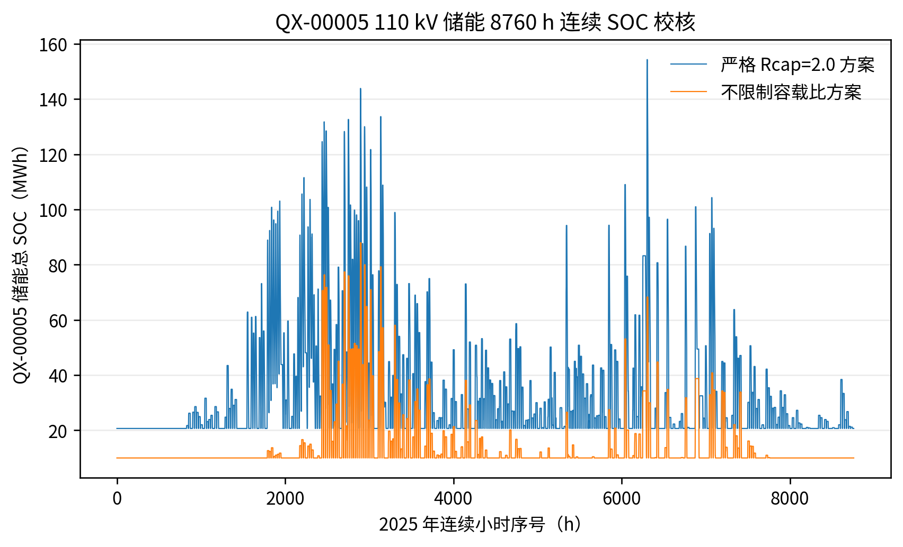
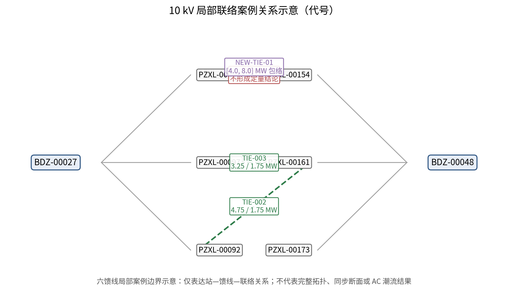

# 第六章 典型案例验证

## 6.1 QX-00005 片区数据与年度状态复核

QX-00005 是八个片区中逐时数据条件最完整的片区。2025 年正式运行口径覆盖 20 座 110 kV 站、40 台主变，逐时净负荷经过年度资产白名单、设备映射审批和质量标记校核，能够支撑 A 级年度连续回放。

官方年度基准数据显示，公用变在役总容量由 2021 年的 2027 MVA 增至 2025 年的 2139.5 MVA，同期同步正向峰值由 731.77 MW 增至 956.45 MW，容载比由 2.77 降至 2.24。2023 年负荷回落使年度容载比短暂回升至 2.83，说明单年断面不能替代多年连续决策。容量、负荷和容载比的年度锚点在正式结果中保持一致，没有把当前在役设备按投运年份回溯后冒充历史资产。

2025 年逐时序列聚合后的正向峰值与官方 956.45 MW 锚点吻合。40 台主变均进入年度白名单；年末新增但不属于该运行口径的设备没有混入逐时验证。该复核为后续储能 SOC 连续校核和两条优化路径比较提供了数据基础。

## 6.2 两条优化路径的结果对照

弹性优化方案与严格优化方案均从 2021 年实际在役资产起步，既有容量不计入规划期增量。弹性方案不设置统一 Rcap 上限；严格方案自 2022 年起对 110 kV 规划期新增容量施加 Rcap=2.0 的控制，但不通过减容或退役重构存量容量。因此严格方案的政策控制比为 2.0，按实际在役容量计算的物理实现容载比可以高于 2.0。

**表 6-1 QX-00005 片区 2025 年结果对照**

| 指标 | 实际发展情况 | 弹性优化方案 | 严格优化方案 |
| --- | ---: | ---: | ---: |
| 2025 年物理实现容载比 | 2.240 | 2.172 | 2.119 |
| 2025 年政策控制比 | — | 2.172 | 2.000 |
| 在役容量（MVA） | 2139.5 | 2077.0 | 2027.0 |
| 规划期新增容量（MVA） | 未闭合 | 50.0 | 0 |
| 储能柜数 | 未识别 | 465 | 962 |
| 储能功率（MW） | 未识别 | 46.5 | 96.2 |
| 累计年化成本（万元） | 未识别 | 1745.53 | 3359.05 |
| 2025 年反向峰值（MW） | — | 375.60 | 364.95 |

弹性方案选择新增第三台主变和 465 柜储能，严格方案在存量容量豁免条件下不增加主变、配置 962 柜储能。两条路径的累计年化成本差额为 1613.52 万元，这一差额建立在相同实际资产基线上，可解释为 Rcap=2.0 新增容量控制在本案例中的直接经济代价。该差额不应推广为所有片区的固定比例，QX-00003、QX-00004 和 QX-00007 的两条可行路径成本相同，QX-00008、QX-00009、QX-00010 则尚未形成可行路径。

## 6.3 储能 8760 h 连续 SOC 校核

QX-00005 的储能验证采用 8760 个小时的真实时间顺序连续回放，只在年首和年末设置 SOC 闭合，不在每个自然日强制回到同一状态。每个储能柜额定功率为 0.1 MW、额定能量为 0.215 MWh，充放电效率分别为 0.95，SOC 约束为 10%～90%。充电只吸收同一时段已有的反向功率，放电只服务本地正向负荷；模型禁止跨零充电、放电反送和同时充放电。

正式结果包含 40 台主变对应的连续曲线，共 61320 条逐时曲线记录，弹性方案 465 柜、严格方案 962 柜的回放均通过 SOC 审计。曲线审计结果显示，SOC 全部处于 10%～90% 范围内，功率和能量约束无越界，年初与年末 SOC 闭合，未发现充放电方向或效率计算错误。465 柜是弹性方案的实际选型规模，962 柜是严格 Rcap=2.0 方案的实际选型规模，二者不能混写为同一方案结果。

该校核只能证明已选储能方案在现有 QX-00005 时序输入和模型边界内可行，不能替代储能并网、电能质量、保护和现场控制策略审查。其他片区没有同等完整的同步 8760 h 证据，仍按经验时长场景降为 B 级。

## 6.4 10 kV 局部联络案例验证

10 kV 案例只研究六条指定馈线及其关联的既有联络和新建候选，采用 110 kV 站级等值源端分析。该案例的结论是局部工程化互济能力或容量包络，不是完整配电网 AC/DC 潮流结果。

既有联络 TIE-002 的正向和反向转供能力分别为 4.75 MW 和 1.75 MW。正向受路径最小有效热限 4.94 MVA 绑定，反向受受端馈线可转出负荷规模限制。TIE-003 的正向和反向能力分别为 3.25 MW 和 1.75 MW，正向主要受送侧可转出负荷限制。TIE-001 因拓扑断点无法满足连通性判据，按负责人确认不再补充收资，最终不形成定量结论。

新建联络候选 NEW-TIE-01 以现有六馈线数据计算，中心容量包络为 8.0 MW，考虑弱段是否位于实际转供路径的不确定性，报告区间为 4.0～8.0 MW。中心造价按 2.5 km、60 万元/km 的已确认工程假设计为 150 万元，单位能力投资为 18.8 万元/MW，长度和造价敏感性范围为 10.5～29.2 万元/MW。该数值没有把馈线内碎片化拓扑误写成完整支路潮流结论。

六条馈线的结构化拓扑存在缺杆段形成的碎片森林，负荷 seed 的源端可达率为 0%～100%。因此，S1/S2 电压与支路负载结果仅对源端可达分量成立，跨站联络后的电压和支路负载校核在现有数据下不可实现；转供能力数字按送侧可转负荷、受端站正常余量和路径有效热限的三重容量约束取最先绑定，并携带受端同时段余量前置条件。该边界与数据质量记录一并进入正式结果包。

## 6.5 方法有效性与适用范围

本章验证覆盖三个层面。年度锚点和资产白名单验证了历史状态与正式运行口径的一致性；QX-00005 的 8760 h 连续 SOC 审计验证了储能方案的时序可行性；10 kV 案例复算验证了 TIE-002、TIE-003 和 NEW-TIE-01 的容量包络计算，并对 TIE-001 保留不可定量的边界结论。

验证结果不支持以下扩展性表述：不能把经验时长场景当作完整逐时证据，不能把容量网络压力筛查当作精确潮流，不能把局部联络能力直接推广为全片区同步削峰能力，也不能把 2026 年光伏快照与 2025 年负荷组合解释为同年度能源渗透率。具体工程实施仍需补充阻抗、拓扑、运行方式、保护、电压和短路校核。

## 6.6 本章小结

QX-00005 的连续年度回放表明，465 柜弹性方案和 962 柜严格方案均满足当前 SOC、功率和方向约束。两条路径从同一实际存量基线出发，严格控制的直接增量成本为 1613.52 万元。10 kV 案例形成了 TIE-002、TIE-003 和 NEW-TIE-01 的容量包络结论，TIE-001 保留为不可定量案例；拓扑碎片化和受端同时段余量条件明确限定了局部结果的适用范围。
