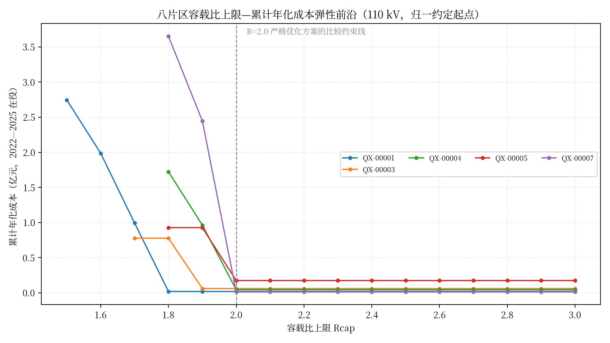
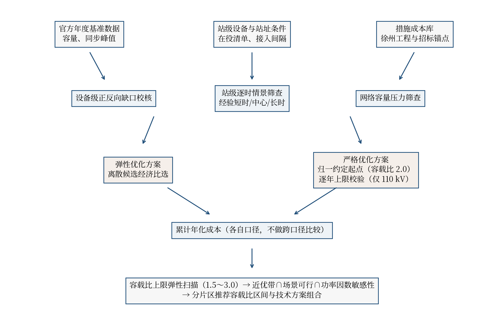

# 第四章 基于实际工程的电网建设成本模型

## 4.1 分布式新能源配套工程成本数据收集与处理

成本数据的收集范围覆盖主变扩建、替换增容、新建变电站和储能四类措施。主变扩建与替换成本取自徐州地区 110 千伏输变电工程投资资料，储能成本取自公开招标与中标结果，全部价格统一折算至 2025 年价格水平。数据进入成本库时保留工程类型、容量档位、价格性质和来源行号，供结果追溯。

主变扩建成本方面，徐州实际 50 MVA 第三台主变扩建样本的动态投资为 1170 万至 1516 万元，中位值 1343 万元。63、80、100 MVA 档位缺少同规模工程案例，模型按同类型工程区间匹配放大，不虚构点估计；替换增容的成本增量按新额定容量与旧额定容量之差计算。新建变电站仅在个别片区作为候选出现，因缺少可直接匹配的整站造价案例，其成本缺口不进入成本优化，仅保留候选登记。各容量档位的投资区间见表 4-1。

**表 4-1 110 kV 扩建候选投资区间（按措施类型与容量档位，2025 年价格）**

| 措施类型 | 容量档位（MVA） | 候选数 | 投资区间（万元） | 中位值（万元） | 计价依据 |
| --- | --- | --- | --- | --- | --- |
| 新建第三台主变 | 50 | 74 | 1170～1516 | 1343 | 徐州同类型工程点估计区间 |
| 新建第三台主变 | 63 | 5 | 1474.2～1910.2 | — | 同类型区间匹配放大 |
| 新建第三台主变 | 80 | 5 | 1872.0～2425.6 | — | 同类型区间匹配放大 |
| 新建第三台主变 | 100 | 5 | 2340.0～3032.0 | — | 同类型区间匹配放大 |
| 新建变电站 | 50 | 3 | 未计价 | — | 缺少可匹配整站造价，不进入成本优化 |

储能成本采用 100 kW/215 kWh 磷酸铁锂一体化柜的整数柜组合。两个价格锚点分别来自苏州市公共资源交易平台单套 27.2 万元的最高限价和浏阳经开区 1 MW/2.2 MWh 项目 210.456 万元的中标价，前者反映小规模采购的上界，后者反映十柜批量采购的实际水平。柜数不超过 10 时按线性公式 6.8382＋20.3618N 万元计价；超过 10 柜后按十柜批量块叠加单柜余数计价，不对两个锚点直接做线性外推。这一处理与中电联《新型储能项目定额及费用计算规定》的费用构成口径衔接\[48\]，也反映了小规模储能相对集中式电站的规模溢价。分段计价函数与锚点见表 4-2。

**表 4-2 储能一体化柜分段计价函数与价格锚点（2025 年价格）**

| 柜数 N | 基准投资（万元） | 计价规则 | 锚点性质 |
| --- | --- | --- | --- |
| 1 | 27.200 | 6.8382＋20.3618N | 单套采购最高限价（江苏公共资源交易公告） |
| 10 | 210.456 | 6.8382＋20.3618N | 十柜批量项目实际中标价（1 MW/2.2 MWh） |
| 11 | 237.656 | 批量块＋单柜余数 | 十柜块 210.456 万元叠加余数柜 27.2 万元 |
| 20 | 420.913 | 批量块叠加 | 两个十柜块叠加，不外推单价 |

年化参数取折现率 6%、储能寿命 10 年、主变措施寿命 30 年，运维费率分别取 3% 和 1.8%。上述参数属于模型假设，第四章结果均配套折现率 4%～8%、储能寿命 8～12 年、主变寿命 25～35 年的敏感性检验，参数取值与敏感性维度见表 4-3。

**表 4-3 年化参数基准值与敏感性维度**

| 参数 | 基准值 | 敏感性取值 | 参数性质 |
| --- | --- | --- | --- |
| 折现率 | 6% | 4%、6%、8% | 模型假设 |
| 储能寿命 | 10 年 | 8、10、12 年 | 模型假设 |
| 储能固定运维费率 | 3%/年 | 1.5%、3%、4.5% | 模型假设 |
| 主变措施寿命 | 30 年 | 25、30、35 年 | 模型假设 |
| 主变固定运维费率 | 1.8%/年 | 1%、1.8%、2.5% | 模型假设 |

## 4.2 成本驱动因子识别与参数化模型建立

影响措施成本的因子可以归纳为电压等级、容量档位、措施类型和站址条件四类。电压等级决定单位容量的造价水平，110 kV 与 35 kV 工程不共用成本曲线；容量档位决定主变工程能否找到同类型案例，50 MVA 档位有直接样本，其余档位只能给出区间；措施类型区分新建第三台主变、替换增容、新建站和线路间隔工程，四者的费用构成不同，不能按统一的每 MVA 造价折算；站址条件以 10 kV 剩余间隔数表示，间隔为 0 的站点无法接入储能或新主变，这一条件在优化中作为硬约束处理。

参数化模型将上述因子落实为可追溯的离散候选。八个片区 110 kV 层共形成 92 条扩建与新建站候选，每条候选登记既有容量、新增容量、可扩建容量、10 kV 间隔数和成本区间；退役候选由年度在役设备清单按整台组合派生，成本按同电压、同容量扩容成本对称计价，不产生负投资。全部候选登记来源行号与数据校验标识，任何进入求解的措施都可以回溯到具体工程案例。

## 4.3 刚性容载比场景全寿命周期成本测算

刚性场景对应严格优化方案：以初始基准年容载比 2.0 的统一约定口径为报告起点，2022 年起在 110 kV 正式层逐年校验容载比不超过 2.0。起点口径仅用于容量记账，峰值保持官方年度基准数据，起点调整本身不计入决策期成本；设备级缺口、储能定容和网络筛查仍按实际在役资产评估。

求解结果显示，五个片区形成了 2022—2025 年完整可行方案，2025 年报告口径容载比介于 1.58 至 1.98 之间，全部满足 2.0 约束，逐年措施与累计年化成本见表 4-4。QX-00005 的措施为 50 MVA 第三台主变加 465 柜储能，两项措施均在 2025 年投运，累计年化成本 1745.53 万元，其中主变部分投资 1343 万元、年化成本 121.74 万元，储能部分投资 9789.64 万元、年化成本 1623.79 万元。储能柜数按站址条件分配在 BDZ-00022、BDZ-00135 和 BDZ-00164 三座站。

**表 4-4 严格优化方案措施组合与累计年化成本（110 kV，措施均于 2025 年投运）**

| 片区 | 措施组合 | 投资（万元） | 累计年化成本（万元） | 2025 年报告口径容载比 |
| --- | --- | --- | --- | --- |
| QX-00001 | 50 MVA 第三台主变＋储能 19 柜 | 1743.55 | 188.18 | 1.66 |
| QX-00003 | 储能 173 柜 | 3645.68 | 604.70 | 1.70 |
| QX-00004 | 储能 124 柜 | 2613.76 | 433.54 | 1.98 |
| QX-00005 | 50 MVA 第三台主变＋储能 465 柜 | 11132.64 | 1745.53 | 1.58 |
| QX-00007 | 50 MVA 第三台主变 | 1343.00 | 121.74 | 1.91 |
| QX-00008 | 未形成完整可行方案 | — | — | — |
| QX-00009 | 未形成完整可行方案 | — | — | — |
| QX-00010 | 未形成完整可行方案 | — | — | — |

三个片区未形成完整可行方案。QX-00008 与 QX-00010 分别因 BDZ-00043、BDZ-00120 两座站无可用储能接入间隔，QX-00009 因 BDZ-00014 缺少完整的经验时长场景。这些限制来自站址条件和数据证据边界，属于工程与数据事实，不作为软件缺陷处理；后续补测间隔或补充场景后可重新求解。

## 4.4 弹性容载比场景全寿命周期成本测算

弹性场景不设置统一容载比上限，由物理约束、离散候选和成本边界决定措施组合。为回答“容载比控制在什么水平需要付出多少代价”，本章在弹性场景基础上增加容载比上限弹性扫描：上限 Rcap 自 1.5 至 3.0 按步长 0.1 取值并保留无上限对照，各点采用与刚性场景相同的归一起点、候选、物理约束和成本库独立求解。

图 4-1 给出八个片区的上限—成本前沿，关键点成本见表 4-5。曲线形态呈现一致规律：上限不低于 2.0 时，各可行片区成本与无上限结果完全一致，说明 2.0 以内的控制要求不改变成本最优措施选择；上限自 2.0 继续收紧，各片区成本先后进入快速增长段——QX-00004 与 QX-00007 在上限 1.9 时成本已分别升至 9642.0 万元和 24462.5 万元，QX-00003 与 QX-00005 在 1.8～1.9 区间出现跳升，以 QX-00005 为例，上限 2.0 时累计年化成本 1745.53 万元，压至 1.8 时增至 9282.00 万元，对应储能规模由 465 柜增至 760 柜；QX-00001 在 1.8 以下快速上升。上限低于 1.8 后，多数片区的站级日储能调度无法满足充放电物理约束，不再形成完整可行方案，仅 QX-00001（至 1.5）和 QX-00003（至 1.7）仍可行，前沿在该区间截断。

注：R=2.0 为严格优化方案的比较约束线，不代表设备物理越限线；QX-00008、QX-00009、QX-00010 在各上限点均未形成完整可行方案，图中不出现对应曲线。

**表 4-5 弹性扫描前沿关键点累计年化成本（万元）**

| 片区 | Rcap=1.5 | Rcap=1.6 | Rcap=1.7 | Rcap=1.8 | Rcap=1.9 | Rcap=2.0 | 无上限 |
| --- | --- | --- | --- | --- | --- | --- | --- |
| QX-00001 | 27455.3 | 19859.7 | 9929.9 | 188.2 | 188.2 | 188.2 | 188.2 |
| QX-00003 | — | — | 7774.7 | 7774.7 | 604.7 | 604.7 | 604.7 |
| QX-00004 | — | — | — | 17237.6 | 9642.0 | 433.5 | 433.5 |
| QX-00005 | — | — | — | 9282.0 | 9282.0 | 1745.5 | 1745.5 |
| QX-00007 | — | — | — | 36513.9 | 24462.5 | 121.7 | 121.7 |

注：“—”表示该上限点未形成完整可行方案；Rcap=2.1～3.0 各点成本与 Rcap=2.0 及无上限结果一致，表中不再重复列出。

推荐容载比区间按“最低成本 5% 以内的近优带、三个经验时长场景均可行、功率因数敏感性下措施选择稳定”三项条件从前沿导出，表示建议控制的容载比水平而非负荷预测。五个可行片区的推荐区间为：QX-00005 收敛为单点值 2.17，QX-00001 为 2.27～2.36，QX-00003 收敛为单点值 2.23，QX-00004 收敛为单点值 2.97，QX-00007 为 2.04～2.07。措施选择在情景间发生翻转的片区只给区间，不给单一数值。

## 4.5 两场景经济技术对比与决策案例库形成

刚性场景与弹性场景的对比不宜表述为两套成本的直接相减。两个方案的报告起点不同——前者为容载比 2.0 的约定口径，后者为 2021 年实际基准——各自的累计年化成本表征各自口径下的最优演进结果。真正回答“严格控制值多少钱”的，是弹性扫描前沿上各上限点相对无上限结果的成本增量：五个可行片区在 Rcap=2.0 处的增量全部为零，控制要求的经济代价集中出现在 2.0 以下的区间，且随上限收紧呈加速上升。

这一结构支撑了第五章的规划建议方式：容载比推荐不给出脱离片区条件的统一数值，而是按片区给出区间与触发代价。刚性与弹性场景的决策流程见图 4-2：两方案共享数据基础、物理校核与离散候选，差异仅在于严格方案以归一约定起点报告并逐年校验容载比上限；前沿扫描在两方案之上提供“控制水平—经济代价”的连续边界，经近优带与敏感性收敛后形成分片区推荐区间。

决策案例库按片区登记措施组合、触发原因、证据等级和成本区间，其中正向容量缺口、反向承载缺口和站级逐时情景筛查分别记录触发原因；QX-00008、QX-00009、QX-00010 三个片区标注为站址或数据条件受限，暂不形成完整定量结论。

本章成本模型的结果边界需要说明：逐时优化与回放仅在 QX-00005 具备正式证据，其余片区采用官方年度基准数据和经验时长场景，证据等级不高于 B 级；实际发展情况的措施成本因设备级毛动作尚未闭合，正文一律写“未识别”而不写零；网络压力筛查基于容量与连接关系，不能替代具体工程的潮流与短路电流校核。
