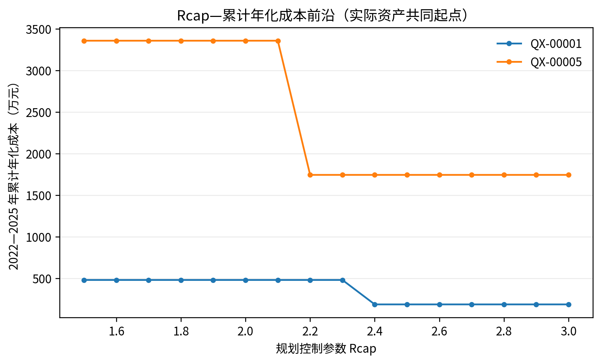

# 第四章 基于实际工程的电网建设成本模型

## 4.1 分布式新能源配套工程成本数据收集与处理

成本数据的收集范围覆盖主变扩建、替换增容、新建变电站和储能四类措施。主变扩建与替换成本取自徐州地区 110 kV 输变电工程投资资料，储能成本取自公开招标与中标结果，全部价格统一折算至 2025 年价格水平。进入成本库的每条记录保留工程类型、容量档位、价格性质和来源行号，结果表可以回溯到对应的成本依据。

主变扩建成本方面，50 MVA 第三台主变扩建样本的动态投资为 1170 万～1516 万元，中位值 1343 万元。63、80、100 MVA 档位缺少同规模工程案例，模型按同类型工程区间匹配放大，不虚构点估计；替换增容的成本增量按新额定容量与旧额定容量之差计算。新建变电站虽然保留在候选登记中，但因缺少可直接匹配的整站造价案例，不进入本轮成本优化。

储能采用 100 kW/215 kWh 磷酸铁锂一体化柜的整数柜组合。单套采购最高限价为 27.2 万元，十柜批量项目中标价为 210.456 万元。柜数不超过 10 柜时使用单柜价格基准；超过 10 柜后按十柜批量块叠加余数柜，不对两个价格点直接作无限外推。这一处理保留了小规模接入和批量采购的差异，也使储能柜数、功率和能量之间具有明确换算关系。

年化参数取折现率 6%、储能寿命 10 年、储能固定运维费率 3%/年、主变措施寿命 30 年、主变固定运维费率 1.8%/年。上述参数属于模型假设，不是设备强制寿命。模型契约登记了折现率、寿命和运维费率的待复核取值，但本次冻结结果没有逐项运行这些年化参数的独立敏感性。正式敏感性采用储能成本和扩建成本上下浮动 20% 检验成本不确定性，并同时考察净负荷、功率因数和反向承载系数；年化参数的独立扰动仍列为后续复核项。

**表 4-1 年化参数基准值与契约登记的待复核取值**

| 参数 | 基准值 | 契约登记的待复核取值 | 本次冻结结果处理 |
| --- | --- | --- | --- |
| 折现率 | 6% | 4%、6%、8% | 未单独扰动 |
| 储能寿命 | 10 年 | 8、10、12 年 | 未单独扰动 |
| 储能固定运维费率 | 3%/年 | 1.5%、3%、4.5% | 未单独扰动 |
| 主变措施寿命 | 30 年 | 25、30、35 年 | 未单独扰动 |
| 主变固定运维费率 | 1.8% | 1%、1.8%、2.5% | 未单独扰动 |

## 4.2 成本驱动因子识别与参数化模型建立

影响措施成本和可行性的因素包括电压等级、容量档位、措施类型和站址条件。110 kV 与 35 kV 工程分开建模，不共用成本曲线；容量档位决定主变工程能否找到同类型案例；措施类型区分新建第三台主变、替换增容、新建站和储能；站址条件以可用 10 kV 接入间隔等工程条件进入硬约束。

参数化模型将上述因素落实为可追溯的离散候选。110 kV 主变工程成本库共登记 92 条记录，其中 89 条为新增第三台主变候选，3 条新建站候选因缺少整站造价而不进入本轮优化；储能按站址接入条件另行生成整数柜候选。正式主模型不启用退役候选，当前实际资产候选集中也不包含替换增容动作。所有入选动作在投运后都重新接受正向容量、反向承载和内部容量网络压力筛查。

成本目标不是一次性建设投资，而是 2022—2025 年累计在役等效年成本。若候选在某年投运，则只从投运年起计入当年及以后在役成本；2021 年既有资产为共同存量，不进入增量成本。年度结果同时输出 CAPEX、年度在役等效年成本、累计 CAPEX 和累计年化成本，未知实际措施成本保留为“未识别”，不以零填充。

## 4.3 共同资产基线与严格控制模型

三类正式方案的关系如下：实际发展情况用于记录 2021—2025 年事实，不参与最优排名；弹性优化方案从 2021 年实际在役资产出发，不设置统一 Rcap 上限；严格优化方案也从同一实际在役资产出发，既有容量存量豁免，自 2022 年起仅对 110 kV 规划期新增容量施加 Rcap=2.0 的控制。

对片区 (q)、电压等级 (v) 和年份 (y)，规划容量分解为

\[
S_{y,q,v}=S_{2021,q,v}^{existing}+\Delta S_{y,q,v},
\]

其中 (S_{2021,q,v}^{existing}) 是 2021 年已确认的实际在役容量，\(\Delta S\) 是由离散候选形成的规划期新增容量。严格控制的增量约束写为

\[
\Delta S_{y,q,110}\leq\max\left(Rcap\cdot P^+_{y,q,110}-S_{2021,q,110}^{existing},0\right).
\]

该式表示政策控制作用于新增容量，不要求通过减容或退役把既有资产强行压到 Rcap 以内。因此，正式输出中同时保留“物理实现容载比”和“政策控制比”：前者按实际在役总容量除以同步正向最大净负荷计算，后者用于表示新增容量的控制上限。严格方案的物理实现容载比可能高于 2.0，这不是约束失效，而是存量容量豁免规则的直接结果。

以 (2P^+_{2021}) 构造的标准化状态只用于反事实对照或敏感性分析，不进入正式规划基线，也不改变设备级物理容量、站址和网络约束。

## 4.4 物理触发原因与正式方案结果

本轮 110 kV 结果显示，正式措施触发不能由“容载比大于 2.0”单独推出。2025 年零动作诊断中的正向容量缺口均为零；QX-00001、QX-00003、QX-00004、QX-00005 形成反向承载缺口，分别为 7.885 MW、9.455 MW、10.460 MW 和 52.800 MW，对应缺口设备数为 3、1、2 和 4。QX-00007 未形成设备级正反向缺口，成本优化不配置新增措施。QX-00008、QX-00009、QX-00010 虽有反向约束诊断，但无上限方案未形成完整物理可行集，先按技术约束优先处理。

**表 4-2 110 kV 片区措施触发与 2025 年结果**

| 片区 | 正向容量缺口（MW） | 反向承载缺口（MW） | 反向缺口设备数 | 弹性方案措施 | 弹性方案累计年化成本（万元） | 严格方案措施 | 严格方案累计年化成本（万元） |
| --- | ---: | ---: | ---: | --- | ---: | --- | ---: |
| QX-00001 | 0 | 7.885 | 3 | 新增第三台主变、储能 19 柜 | 188.18 | 储能 138 柜 | 481.96 |
| QX-00003 | 0 | 9.455 | 1 | 储能 173 柜 | 604.70 | 储能 173 柜 | 604.70 |
| QX-00004 | 0 | 10.460 | 2 | 储能 124 柜 | 433.54 | 储能 124 柜 | 433.54 |
| QX-00005 | 0 | 52.800 | 4 | 新增第三台主变、储能 465 柜 | 1745.53 | 储能 962 柜 | 3359.05 |
| QX-00007 | 0 | 0 | 0 | 无 | 0 | 无 | 0 |
| QX-00008 | 0 | 12.520 | 3 | 未形成完整可行方案 | — | 未形成完整可行方案 | — |
| QX-00009 | 0 | 37.815 | 3 | 未形成完整可行方案 | — | 未形成完整可行方案 | — |
| QX-00010 | 0 | 87.805 | 5 | 未形成完整可行方案 | — | 未形成完整可行方案 | — |

表 4-2 中的反向承载缺口是物理触发证据，最终是否扩容、配储及其组合由离散候选成本和全部约束共同决定。QX-00001 和 QX-00005 的第三台主变并非由正向容量缺口直接触发，而是与储能共同构成累计年化成本最小的可行组合；严格控制收紧后，新增容量受到限制，储能规模随之增加。

## 4.5 容载比上限弹性扫描与经济释放阈值

为识别控制要求开始产生经济代价的位置，模型在同一 2021 年实际资产基线上扫描 Rcap=1.5～3.0，步长 0.1，并保留无上限对照。每个扫描点使用相同的候选、正反向物理约束、储能时序规则、成本库和求解精度。Rcap 是政策控制上限，优化后的物理实现容载比是结果指标，二者不作数值交集。

**表 4-3 110 kV Rcap 阈值识别结果**

| 片区 | 粗扫描阈值 | 局部细化阈值 | 稳健近优下限 | 扫描上界是否识别 | 解释 |
| --- | --- | --- | --- | --- | --- |
| QX-00001 | 2.3～2.4 | 2.359～2.360 | ≥2.5 | 否 | 收紧至局部阈值以下开始释放经济代价 |
| QX-00003 | 未识别 | 未识别 | 不适用（非绑定） | 否 | 研究范围内 Rcap 不改变最优措施，不形成唯一阈值 |
| QX-00004 | 未识别 | 未识别 | 不适用（非绑定） | 否 | 研究范围内 Rcap 不改变最优措施，不形成唯一阈值 |
| QX-00005 | 2.1～2.2 | 2.171～2.172 | ≥2.3 | 否 | 收紧至局部阈值以下开始释放经济代价 |
| QX-00007 | 未识别 | 未识别 | 不适用（非绑定） | 否 | 研究范围内没有新增投资，Rcap 不构成有效约束 |
| QX-00008 | 不适用 | 不适用 | — | 否 | 无上限方案已不可行，先处理物理边界 |
| QX-00009 | 不适用 | 不适用 | — | 否 | 无上限方案已不可行，先处理物理边界 |
| QX-00010 | 不适用 | 不适用 | — | 否 | 无上限方案已不可行，先处理物理边界 |

QX-00001 的弹性方案累计年化成本为 188.18 万元，严格 Rcap=2.0 方案为 481.96 万元，同一实际资产基线下的直接增量为 293.78 万元。QX-00005 的对应成本为 1745.53 万元和 3359.05 万元，直接增量为 1613.52 万元。QX-00003、QX-00004 和 QX-00007 在两条可行方案下的结果相同，分别为 604.70 万元、433.54 万元和 0 万元。QX-00008、QX-00009、QX-00010 的无上限方案均未形成可行解，不作成本比较。

局部阈值回答的是“从哪个位置继续收紧会触发新增经济代价”，不是设备安全限值。稳健近优判断覆盖 5 个功率因数或反向承载系数情景、6 个单因素成本或负荷情景以及 6 个非笛卡尔联合压力情景，共 17 个敏感性情景；推荐结论采用 5% 近优带，并以 2% 和 10% 近优带辅助复核。六个联合情景均未改变 QX-00001、QX-00005 无上限方案的措施类型，两片区的稳健近优下限仍分别为 2.5 和 2.3。共同近优带均延伸至扫描上界 3.0，因而只能报告“下限已识别、上界未识别”，不能把 3.0 写成推荐上限。

## 4.6 35 kV 辅助层结果

35 kV 层单独聚合、单独求解，不施加逐年 Rcap 上界，也不与 110 kV 结果相加。当前形成可行辅助结果的片区为 QX-00003、QX-00009 和 QX-00010，2025 年物理实现容载比分别为 2.613、3.487 和 3.605，储能规模分别为 145、0 和 613 柜，累计年化成本分别为 506.73、0 和 2140.65 万元。其余片区未形成完整 35 kV 可行解，原因包括接入间隔、场景数据和设备边界，不能用 110 kV 结论替代。

## 4.7 本章小结

本章建立了以实际工程候选和在役成本为基础的多年经济模型。v3.2 的核心修正是保留 2021 年实际在役资产作为共同存量基线，将 Rcap 控制限定为规划期新增容量约束；由此可以在两条方案均可行时直接计算严格控制的增量经济代价。正式结果还表明，QX-00001 和 QX-00005 存在可识别的经济释放阈值，QX-00003、QX-00004 和 QX-00007 在研究范围内不识别唯一 Rcap 阈值，QX-00008、QX-00009、QX-00010 应先处理技术可行性。扩容和储能的触发原因已在结果表中与正向容量、反向承载及政策约束分列呈现。
