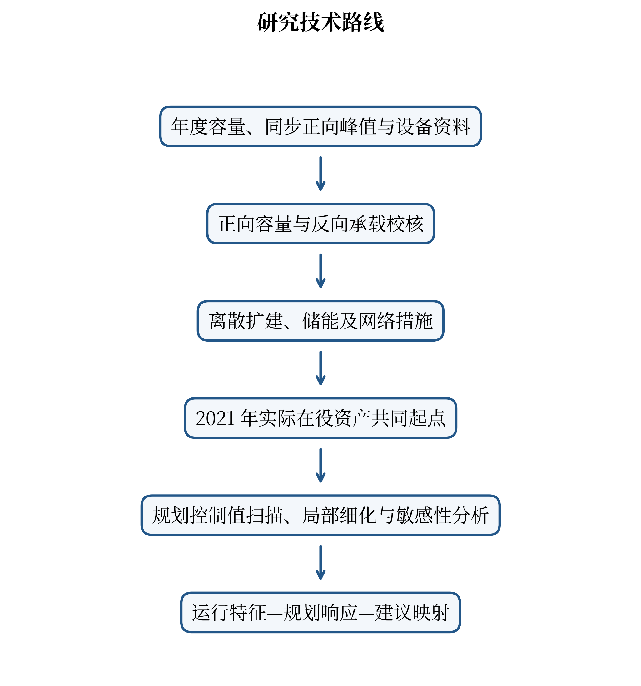
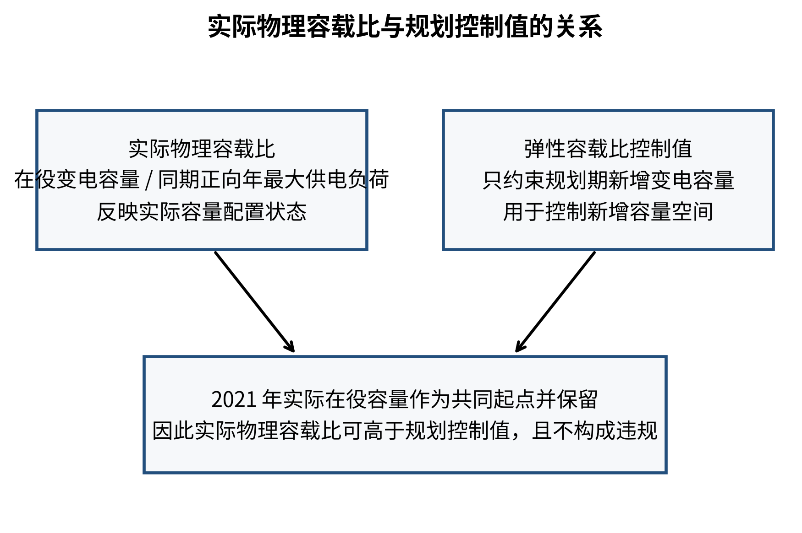
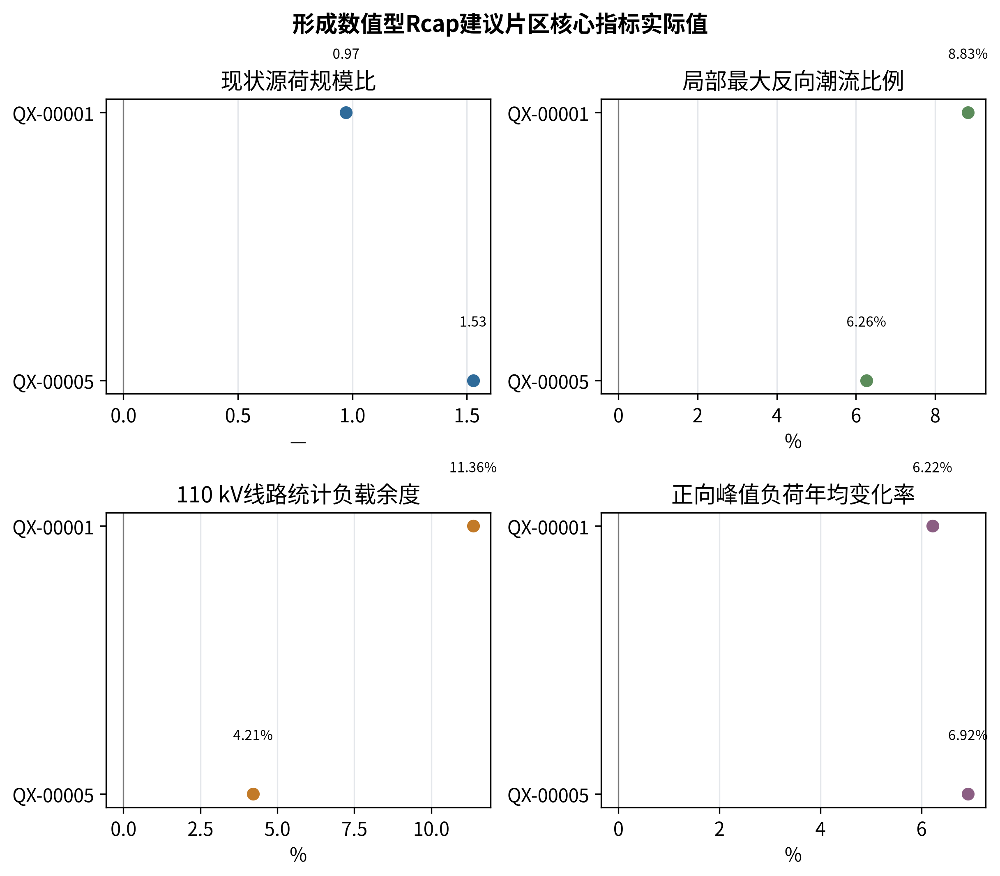
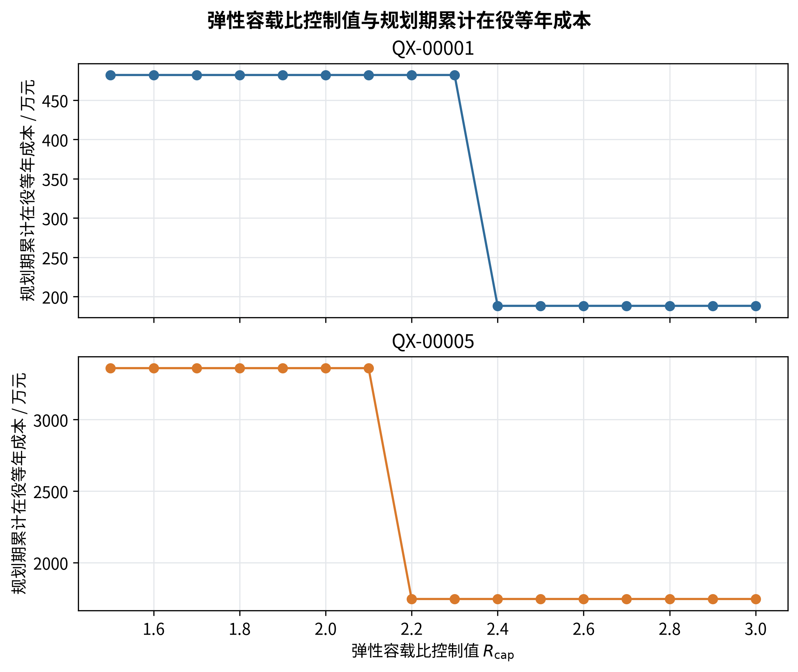
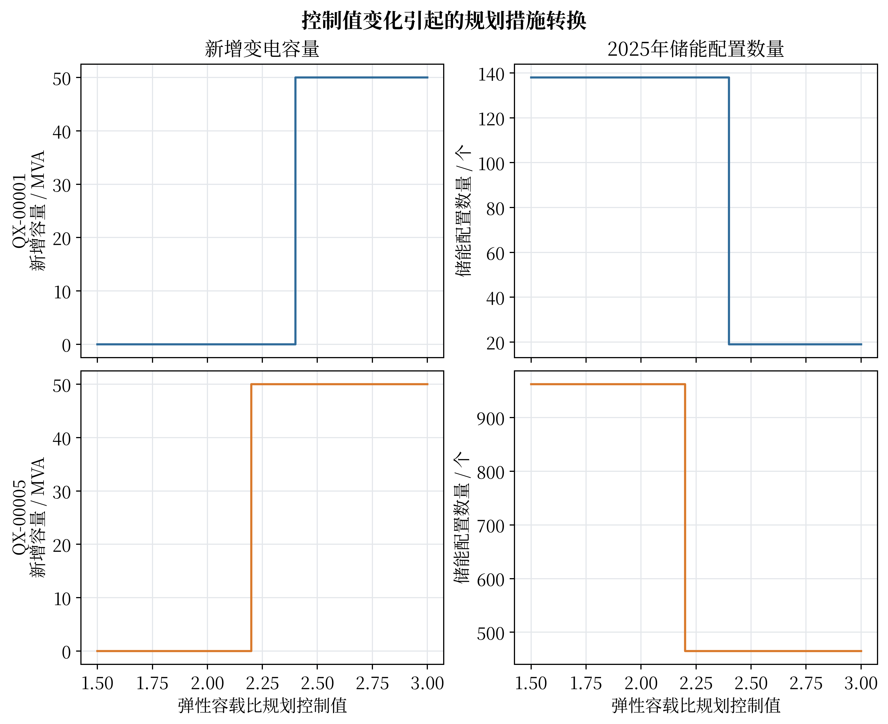
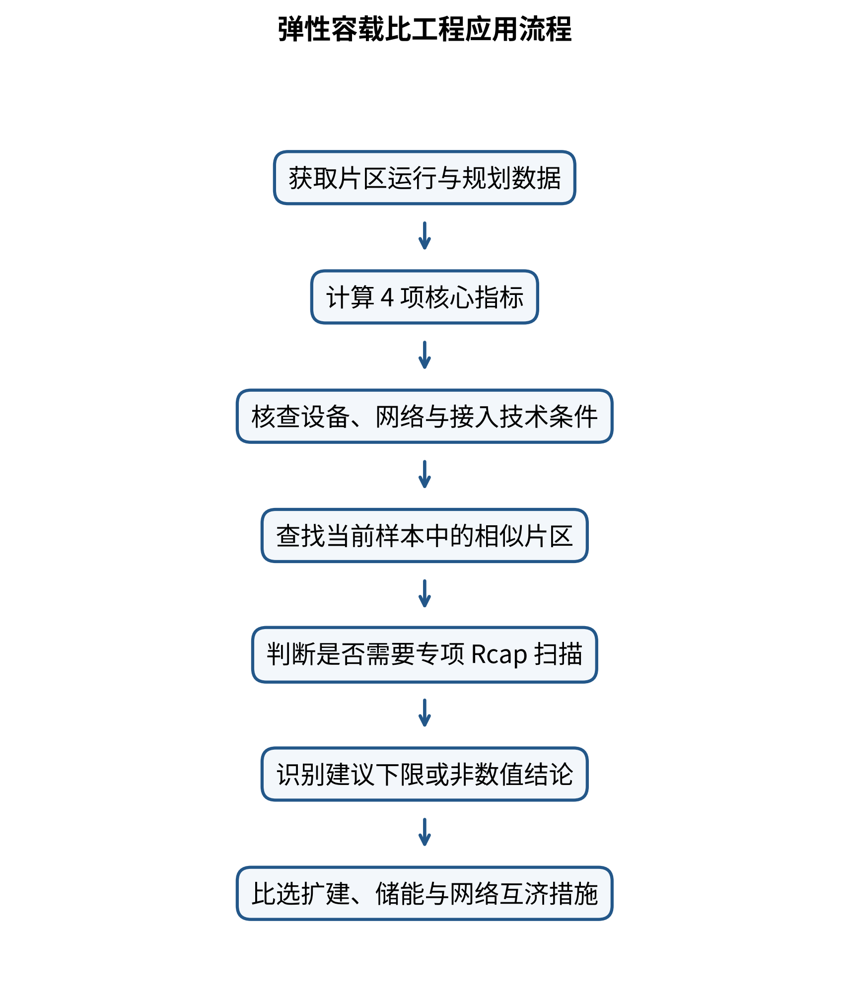

# 第一章 绪论

## 1.1 研究背景与意义

随着分布式新能源持续接入，110 kV电网既承担负荷供电，又承担新能源汇集以及上下级电网之间的双向功率交换。典型片区可能在光伏高出力时段出现反向潮流，而在晚峰仍承担较高正向供电负荷。正向峰值与反向功率通常不在同一时刻出现，仅依靠单一容载比数值，难以完整描述主变扩建、储能配置、局部网络支撑与新能源接入之间的关系[1-4]。

传统容载比以变电容量与同期正向最大供电负荷之比衡量供电能力，物理含义清晰，是电网规划的重要宏观指标。高比例分布式新能源条件下，如果把统一容载比控制值直接理解为所有既有容量和新增容量的刚性上限，容易产生两类偏差：一是既有设备容量高于控制值时被误解为需要退役或拆除；二是控制值过紧时，合理新增变电容量受到限制，规划方案被迫更多依赖储能承担局部功率调节，进而改变规划期成本与工程措施组合。

本研究保留传统容载比的物理定义，将弹性容载比控制值定位为规划期新增变电容量的控制参数。在真实资产共同起点下，通过正向容量、反向承载、储能时序和局部网络条件联合校核，识别容载比约束在不同片区中的作用类型、经济释放位置及工程适用边界。研究结果可为徐州新能源高渗透片区形成差异化规划策略、提高投资针对性和避免单一指标机械约束提供支撑。

## 1.2 研究范围与对象

研究对象为徐州地区8个110 kV典型片区，片区名称统一采用QX编号。规划期为2021—2025年，其中2021年实际在役变电容量作为各规划方案的共同资产起点，2022—2025年进行增量规划比较。研究重点包括110 kV变电容量、储能规模、实际物理容载比及规划期累计在役等年成本。

10 kV资料用于识别局部馈线、变电站接入位置、容量缺口和互济条件，辅助解释110 kV片区规划响应，不作为完整交流潮流或精确电压安全计算。部分片区缺少完整阻抗、拓扑和同步源荷时序，因此报告对网络分析、可靠性和新能源消纳结论保持与现有数据能力一致的边界。

## 1.3 研究目标与内容

研究目标是在不改变既有资产的条件下，建立适用于高比例分布式新能源片区的弹性容载比分析方法，并形成可用于工程规划的“一片一策”建议。主要内容包括：

（1）整理2021—2025年片区负荷、主变容量、反向潮流、线路负载及新能源装机等资料，分析典型片区多工况运行特征，建立“新能源渗透水平—电网运行状态”基础数据库。

（2）建立以实际工程措施为基础的经济模型。不同寿命的变电扩建和储能投资采用等年值方法折算，并在共同资产起点上比较2022—2025年各年度在役措施形成的累计成本。

（3）建立存量容量豁免条件下的弹性容载比规划约束。实际物理容载比与规划控制值分开定义，反向潮流不并入传统容载比分母，而通过独立指标和设备约束处理。

（4）开展Rcap控制值扫描、局部阈值细化及多参数敏感性分析，识别经济释放阈值、稳健近优下限、非主导约束和技术约束优先等不同规划响应。

（5）结合现状源荷规模、局部反向潮流、线路统计负载余度和负荷增长特征形成典型片区参考矩阵，并通过典型案例复盘验证方法的工程解释能力。

按照开题报告确定的研究框架，本研究报告严格分为七章：第一章绪论；第二章文献综述与理论基础；第三章徐州典型地区“新能源—电网”运行特征分析；第四章基于实际工程的电网建设成本模型；第五章“一片一策”弹性容载比规划建议；第六章典型案例验证；第七章结论与展望。

## 1.4 研究方法与技术路线

本研究综合采用规范分析、数据标准化、同步时序统计、物理约束校核、多年度路径优化、工程经济评价、敏感性分析和案例验证等方法。技术路线遵循“数据可追溯—运行特征识别—工程措施建模—规划方案优化—差异化建议—案例验证”的逻辑。

图1-1所示技术路线首先建立真实数据基础并识别片区运行特征，其后比较刚性与弹性规划场景。技术可行性校核先于容载比数值推荐，避免使用单一比例参数替代设备容量、接入位置、储能接入条件和局部互济能力等工程约束。

# 第二章 文献综述与理论基础

## 2.1 国内外研究现状

现行电网规划标准仍以供电能力、负荷增长和设备利用效率为重要基础，容载比具有明确的规划统计意义。国内关于多电压等级电网容载比、精细化规划参数和主配协同规划的研究表明，容载比适合进行区域容量水平评价，但其推荐范围需要结合网络结构、供电可靠性和规划颗粒度解释[5-6,13-16]。

随着分布式光伏渗透率提高，新能源承载力研究逐渐从静态装机比例扩展到源荷不确定性、时序潮流和主动管理。相关研究表明，反向潮流、局部接入位置和源荷同步性会显著影响可承载水平，单纯以新能源装机占负荷比例不能替代网络约束分析[7-10,17,19]。

储能与柔性资源能够缓解局部反向送电或推迟网络扩建，但其经济效果取决于负荷增长、持续时间、设备成本和网络约束。现有研究已经形成源—网—储协调规划和储能延缓扩建等方法，但针对地方110 kV片区、真实存量资产、多年度工程措施及弹性容载比联合决策的实证仍相对有限[11-12,18,20]。

本项目因此不重新定义传统容载比的物理分母，而是在真实资产共同起点下区分“物理结果指标”和“规划控制参数”，并把反向承载、储能和网络技术条件作为独立约束纳入工程规划比较。

## 2.2 核心概念与理论基础

第y年实际物理容载比定义为该规划路径下变电总容量与同期正向年最大供电负荷之比：

$$
R_{\mathrm{CLR},y}=\frac{S_y}{P_y^{+}}
$$
（2-1）

其中，正向年最大供电负荷根据规划路径内净负荷重新计算：

$$
P_y^{+}=\max_t\left\{\max\left[\sum_i\left(P_{\mathrm{actual},i,t}+P_{\mathrm{c},i,t}-P_{\mathrm{d},i,t}+P_{\mathrm{tie},i,t}\right),0\right]\right\}
$$
（2-2）

反向潮流不进入容载比分母，而作为独立指标和设备约束处理。由此，实际物理容载比是规划结果指标，不等同于限制新增容量的Rcap。

各规划方案均以2021年实际在役变电容量为共同起点。存量资产不因控制值变化假设拆除或退役，Rcap只约束规划期新增容量：

$$
\Delta S_y\leq\max\left(R_{\mathrm{cap}}P_y^{+}-S_{2021},0\right)
$$
（2-3）

当既有容量已经高于控制值对应容量时，右端取零，表示该控制值下不允许继续新增容量，而不是要求削减既有容量。因此，存量容量豁免条件下，实际物理容载比高于规划控制值并不必然构成约束违反。

图2-1说明了实际物理容载比与Rcap规划控制值的概念边界：前者是结果指标，后者只约束规划期新增容量。

储能按本地功率调节资源建模。单个模块额定功率0.1 MW、额定容量0.215 MWh，SOC运行范围10%～90%，基准充、放电效率均取0.95。储能充电只吸收本地反向或剩余功率，不通过充电使潮流跨越零点；放电只服务本地正向负荷，不因放电形成外送。能量状态满足：

$$
E_t=E_{t-1}+\eta_{\mathrm{c}}P_{\mathrm{c},t}\Delta t-\frac{P_{\mathrm{d},t}\Delta t}{\eta_{\mathrm{d}}}
$$
（2-4）

$$
0.10E_{\mathrm{rated}}\leq E_t\leq0.90E_{\mathrm{rated}}
$$
（2-5）

QX-00005采用审批后的2025年8760小时连续时序，储能SOC按全年序列连续传递；其余片区采用静态真实数据与经验短、中、长持续时间场景进行可行性校核，因此不同片区的时序证据能力需区别解释。

# 第三章 徐州典型地区“新能源—电网”运行特征分析

## 3.1 徐州新能源发展与电力负荷概况

研究使用2021—2025年片区正向最大供电负荷、2021年和2025年在役变电容量、变电站年度最大及最小净负荷、110 kV线路负载水平以及新能源装机资料。新能源采用现有2026年装机快照，用于与2025年最近完整年度负荷进行现状规模比较；该跨年度组合不解释为严格同期运行状态。主要数据及用途见表3-1。

**表 3-1 主要数据及用途**

| 数据类别 | 时间范围 | 主要用途 | 使用限制 |
|---|---|---|---|
| 片区正向最大供电负荷 | 2021—2025年 | 容载比、负荷变化率、规划需求 | 年度峰值不反映全年同步波动 |
| 在役变电容量 | 2021年、2025年 | 共同资产起点与容量核验 | 按现有台账统计 |
| 变电站年度净负荷极值 | 现有统计年度 | 局部反向潮流分析 | 各站极值不一定同时发生 |
| 110 kV线路负载水平 | 现状资料 | 线路统计负载余度 | 不等同完整AC/DC潮流结果 |
| 新能源装机快照 | 2026年 | 源荷规模横向比较 | 与2025年负荷不属于严格同期量 |
| 连续运行时序 | 2025年 | 连续SOC与时序可行性 | 目前QX-00005具备正式8760小时证据 |

8个典型片区在新能源规模、正向负荷、局部反向功率、线路负载和负荷变化方面差异明显。部分片区新能源装机已接近或超过近期正向峰值负荷，部分片区110 kV线路统计最大负载率超过100%，说明高渗透片区的规划问题具有明显空间差异。

## 3.2 主变负载率多工况统计分析

在正向供电、低负荷和反向送电等不同工况下，主变承担的功率方向和设备压力不同。年度最大正向净负荷用于描述传统供电峰值，年度最小净负荷小于零时，其绝对值用于描述站点统计年度内的最大反向潮流功率。除具有完整连续时序的QX-00005外，不将不同变电站在不同时刻发生的年度极值直接相加为片区同步反向峰值。

线路负载同样只作为统计容量压力使用。当统计最大负载率接近或超过100%时，说明应进一步开展设备允许负载、运行方式和转供能力校核；该统计量不能直接解释为完整交流潮流中的电压或热稳定安全裕度。

## 3.3 源荷比、电量渗透率与容载比的关联规律

现有样本采用“最新新能源装机快照/最近完整年度正向最大负荷”构造现状源荷规模比：

$$
R_{\mathrm{SL}}^{*}=\frac{C_{\mathrm{RE,snap}}}{P_{\mathrm{load,max,base}}^{+}}
$$
（3-1）

局部最大反向潮流比例定义为片区内各变电站年度最大反向潮流功率的最大值与片区正向最大负荷之比：

$$
R_{\mathrm{rev}}=\frac{\max_i\left(P_{\mathrm{rev,max},i}\right)}{P_{\mathrm{load,max}}^{+}}
$$
（3-2）

110 kV线路统计负载余度定义为：

$$
K_{\mathrm{line}}=1-\max_l\left(\lambda_l\right)
$$
（3-3）

正向峰值负荷年均变化率采用2021年和2025年片区正向最大供电负荷计算：

$$
g_P=\left(\frac{P_{2025}^{+}}{P_{2021}^{+}}\right)^{1/4}-1
$$
（3-4）

图3-1表明，不同规划响应并不能由某一单项指标简单分界。例如QX-00003和QX-00004具有较高源荷规模比或局部反向潮流比例，但Rcap扫描并未改变规划方案；QX-00010的线路统计负载余度仍为正，但局部设备与接入条件使其无上限方案未形成完整可行路径。因此，源荷规模、电量渗透和容载比之间存在关联，但不能据此建立单因素数值映射。

## 3.4 “新能源渗透水平—电网运行状态”数据库的构建

数据库按片区统一组织负荷、容量、反向潮流、线路负载、新能源装机、储能参数和经济参数。净负荷统一采用正向供电为正、反向送电为负；容量采用MVA，功率采用MW，储能电量采用MWh；缺失数据保持缺失，不以零替代。

候选指标筛选兼顾数据覆盖率、物理含义、信息重复程度和对规划响应的解释能力。表3-2给出筛选结果。

**表 3-2 候选指标筛选结果**

| 候选指标 | 数据可得性 | 规划解释作用 | 处理结果 |
|---|---|---|---|
| 现状源荷规模比 | 7个片区可计算 | 反映新能源相对规模 | 保留 |
| 局部最大反向潮流比例 | 8个片区可计算 | 反映最突出接入点反向压力 | 保留 |
| 110 kV线路统计负载余度 | 8个片区可计算 | 反映线路统计容量压力 | 保留 |
| 正向峰值负荷年均变化率 | 8个片区可计算 | 反映持续增长需求 | 保留 |
| 反向承载缺口比例 | 8个片区可计算 | 与源荷规模比信息重复较高 | 辅助诊断 |
| 反向潮流站点比例 | 8个片区可计算 | 只反映空间覆盖面 | 辅助诊断 |
| 年负荷率、峰谷差率 | 资料不完整 | 无法统一横向计算 | 暂不进入主体指标体系 |
| 储能需求 | 优化后可得 | 属于规划响应而非前置指标 | 用于结果解释 |

当前7个源荷规模比完整样本中，源荷规模比与反向承载缺口比例的Spearman秩相关约为0.86。该值仅用于识别信息冗余，不作统计显著性或因果判断。最终保留4项核心运行指标进入后续规划建议分析。

# 第四章 基于实际工程的电网建设成本模型

## 4.1 分布式新能源配套工程成本数据收集与处理

成本模型以实际可实施工程措施为对象，重点考虑变电扩建、储能配置及已具备数据基础的网络措施。不同投资寿命通过资本回收系数折算为等年成本，避免直接比较一次性投资额。

资本回收系数为：

$$
\mathrm{CRF}(r,n)=\frac{r(1+r)^n}{(1+r)^n-1}
$$
（4-1）

单项在役措施等年成本为：

$$
C_{\mathrm{EAC}}=C_{\mathrm{inv}}\mathrm{CRF}(r,n)+C_{\mathrm{om}}
$$
（4-2）

单项等年成本量纲为万元/年。设备价格、寿命和固定运维费率均作为规划研究参数，并在敏感性分析中检查其对推荐结果的影响。

## 4.2 成本驱动因子识别与参数化模型建立

本项目正式规划不是只比较2025年单年费用，而是在2021年共同资产起点上，对2022—2025年各年度已投运措施的等年成本进行累计：

$$
\min J=\sum_{y=2022}^{2025}C_{\mathrm{EAC},y}^{\mathrm{in\mbox{-}service}}
$$
（4-3）

程序以年度为离散步长对在役等年成本求和，正式报告将该目标统一称为“2022—2025年规划期累计在役等年成本”，单位为万元。该数值不是一次性投资，也不是某一个单独年度的万元/年费用。措施投运年份、储能规模和变电扩建规模共同影响多年度目标。

求解采用确定性的离散状态枚举与动态保留，时序线性可行性校核由HiGHS完成。同一输入可复现相同结果，不依赖随机元启发式搜索。

## 4.3 刚性容载比场景全寿命周期成本测算

刚性比较场景取Rcap=2.0，并遵循存量容量豁免：既有主变容量保持不变，仅限制规划期新增变电容量。若控制值限制新增主变后仍需满足正向容量与反向承载要求，模型通过储能或其他可用措施补足局部调节需求。

QX-00001在Rcap=2.0时不新增变电容量，2025年配置138个储能模块，即13.8 MW/29.670 MWh，2022—2025年累计在役等年成本为481.9566万元。QX-00005在Rcap=2.0时配置962个储能模块，即96.2 MW/206.830 MWh，累计成本为3359.0522万元。

## 4.4 弹性容载比场景全寿命周期成本测算

弹性场景在1.5～3.0范围内以0.1步长扫描Rcap，并包含无上限方案；经济释放位置附近进一步以0.001步长细化。以无上限方案成本为基准，将成本上浮5%以内定义为近优集合，并在正式敏感性情景上求Rcap维度稳健交集。

图4-1反映Rcap变化对规划期累计在役等年成本的影响，图4-2进一步展示新增变电容量与储能规模随控制值变化形成的措施替代关系。

QX-00001的局部经济释放阈值为2.359～2.360，稳健近优下限为2.50；QX-00005的局部经济释放阈值为2.171～2.172，稳健近优下限为2.30。两者的近优集合均延伸至扫描上界3.0，因此当前只识别推荐下限，不把3.0解释为推荐上限。

## 4.5 两场景经济技术对比与决策案例库形成

两个阈值型片区的刚性与弹性结果见表4-1。

**表 4-1 两个阈值型片区刚性与弹性场景对比**

| 片区 | 场景 | 2025年实际物理容载比 | 新增容量/MVA | 2025年储能模块/个 | 储能功率/MW | 储能容量/MWh | 2022—2025年累计在役等年成本/万元 |
|---|---|---:|---:|---:|---:|---:|---:|
| QX-00001 | 无上限弹性 | 2.3597466 | 50 | 19 | 1.9 | 4.085 | 188.1800 |
| QX-00001 | Rcap=2.0 | 2.2679276 | 0 | 138 | 13.8 | 29.670 | 481.9566 |
| QX-00005 | 无上限弹性 | 2.1715720 | 50 | 465 | 46.5 | 99.975 | 1745.5283 |
| QX-00005 | Rcap=2.0 | 2.1192953 | 0 | 962 | 96.2 | 206.830 | 3359.0522 |

QX-00001较紧控制使累计目标增加293.7765万元；QX-00005增加1613.5239万元。两者均体现出当新增变电容量受到限制后，储能需求大幅增加的措施替代关系。

其余片区形成另外两类决策案例，见表4-2。

**表 4-2 其他片区规划响应及决策类型**

| 片区 | 规划响应 | 2025年储能模块/个 | 2022—2025年累计在役等年成本/万元 | 决策类型 |
|---|---|---:|---:|---|
| QX-00003 | 扫描范围内方案不变 | 173 | 604.7015 | 容载比非主导 |
| QX-00004 | 扫描范围内方案不变 | 124 | 433.5391 | 容载比非主导 |
| QX-00007 | 无明显新增措施 | 0 | 0 | 容载比非主导 |
| QX-00008 | 无上限仍未形成完整可行路径 | — | — | 技术约束优先 |
| QX-00009 | 无上限仍未形成完整可行路径 | — | — | 技术约束优先 |
| QX-00010 | 无上限仍未形成完整可行路径 | — | — | 技术约束优先 |

成本与技术响应共同构成后续“一片一策”建议的决策案例库：既不能将所有片区统一放宽，也不能机械坚持同一数值上限。

# 第五章 “一片一策”弹性容载比规划建议

## 5.1 历史负荷与分布式光伏接入特征分析典型片区负荷与分布式光伏预测

本节严格沿用开题报告确定的章节名称。当前正式分析以2021—2025年历史正向最大供电负荷描述负荷变化，以2026年新能源装机快照描述最新接入规模。由于缺少所有片区统一基准年的完整光伏出力—负荷同步预测，报告不把跨年度源荷规模比解释为严格预测结果，而将其作为片区分类的现状背景量。

典型片区中，QX-00001与QX-00005的正向峰值负荷年均变化率分别为6.22%和6.92%，均表现出较明确的正向容量增长需求；QX-00004为-0.51%，其Rcap扫描结果也表现为容载比非主导。后续滚动规划应使用最新负荷预测和新能源接入预测重新计算核心指标，不长期沿用当前历史增长率。

## 5.2 含正向容载比与反向承载力协同约束的弹性规划评价指标体系设计

评价体系分为两层。第一层是必须满足的技术可行性条件，包括设备容量、接入位置、储能接入条件、局部互济及必要的时序运行约束；该层不采用加权补偿，任何关键技术条件不满足时均应优先处理技术问题。

第二层是用于片区特征描述和规划建议检索的4项核心指标：现状源荷规模比、局部最大反向潮流比例、110 kV线路统计负载余度和正向峰值负荷年均变化率。表5-1汇总当前典型片区指标与正式规划响应。

**表 5-1 典型片区关键指标及正式规划建议**

| 片区 | 现状源荷规模比 | 局部最大反向潮流比例 | 110 kV线路统计负载余度 | 正向峰值负荷年均变化率 | 正式建议 |
|---|---:|---:|---:|---:|---|
| QX-00001 | 0.973 | 0.088 | 11.36% | 6.22% | 不低于2.50 |
| QX-00003 | 1.523 | 0.126 | -2.26% | 4.19% | 容载比非主导 |
| QX-00004 | 1.161 | 0.079 | 24.43% | -0.51% | 容载比非主导 |
| QX-00005 | 1.527 | 0.063 | 4.21% | 6.92% | 不低于2.30 |
| QX-00007 | 缺失 | 0.021 | -5.06% | 1.34% | 容载比非主导；不外推 |
| QX-00008 | 0.673 | 0.067 | -15.67% | 5.48% | 技术约束优先 |
| QX-00009 | 1.003 | 0.071 | -0.39% | 3.78% | 技术约束优先 |
| QX-00010 | 1.599 | 0.109 | 17.59% | 8.76% | 技术约束优先 |

该体系保持正向容载比与反向承载力概念分离：Rcap控制新增变电容量，局部反向潮流通过独立指标、储能和设备条件处理；线路统计余度仅用于容量层面的初筛，不替代完整潮流安全校核。

## 5.3 基于层次分析法的指标赋权

开题报告提出采用层次分析法确定指标权重。二次科学审查表明，正式v3.2优化模型的Rcap建议并非由4项指标加权求和产生，而是由真实工程约束下的规划优化、控制值扫描和敏感性稳健交集得到。若在报告后处理中再用主观权重直接计算2.50或2.30，会改变正式模型的因果链条。

因此，本研究保留AHP作为工程应用阶段的指标层级组织和辅助优先级接口：目标层为“片区弹性容载比规划适用性”，准则层为源荷规模、局部反向压力、线路统计负载余度和正向负荷增长四类信息。实际开展专家赋权时，应由规划、运行和设计专业人员形成两两比较判断矩阵，并按最大特征根法计算权重，同时进行一致性检验：

$$
CI=\frac{\lambda_{\max}-n}{n-1},\qquad CR=\frac{CI}{RI}
$$
（5-1）

当CR小于0.10时，判断矩阵的一致性可接受。当前项目正式结果中尚无经专家确认的判断矩阵，因此本报告不虚构具体AHP权重值，也不利用未确认权重修改正式Rcap推荐。AHP结果后续可用于新片区指标采集优先级、相似片区筛选和规划人员辅助判断，但最终Rcap仍应由专项优化确认。

## 5.4 不同片区类型的容载比推荐区间及技术方案组合

正式敏感性分析覆盖17个情景，其中包含6个联合压力角点。对各情景5%近优Rcap集合求稳健交集后，QX-00001稳健近优下限为2.50，QX-00005为2.30；两者近优集合均延伸至扫描上界3.0，故当前不能识别推荐上限。

基于现有样本，片区可分为三类：经济释放阈值型、容载比非主导型和技术约束优先型。当前仅两个样本形成数值推荐，不能据此构造具有统计推广能力的连续四维区间。表5-2因此定位为“样本支持参考矩阵”。

**表 5-2 弹性容载比样本支持参考矩阵**

| 应用条件 | 现状源荷规模比 | 局部最大反向潮流比例 | 线路统计负载余度 | 正向峰值负荷年均变化率 | 建议与技术方案 | 当前样本 |
|---|---|---|---|---|---|---|
| 技术可行；当前样本点 | 0.973 | 0.088 | 11.36% | 6.22% | Rcap建议不低于2.50；扩建与储能协同 | QX-00001 |
| 技术可行；当前样本点 | 1.527 | 0.063 | 4.21% | 6.92% | Rcap建议不低于2.30；扩建与储能协同 | QX-00005 |
| 技术可行；当前样本点 | 1.523 | 0.126 | -2.26% | 4.19% | Rcap非主导；按常规规划及局部技术条件处理 | QX-00003 |
| 技术可行；当前样本点 | 1.161 | 0.079 | 24.43% | -0.51% | Rcap非主导；按常规规划处理 | QX-00004 |
| 核心指标缺失 | 缺失 | — | — | — | 补充数据或专项优化 | QX-00007 |
| 完整技术可行性未满足 | 不作为判定条件 | 不作为判定条件 | 专项校核 | 不作为判定条件 | 技术约束优先，先解决设备、接入或网络问题 | QX-00008、QX-00009、QX-00010 |
| 未覆盖组合 | 其他 | 其他 | 其他 | 其他 | 开展专项Rcap扫描与工程优化 | 当前无样本 |

图5-1给出了从技术可行性检查、核心指标计算、相似样本参考到专项Rcap优化的工程应用顺序。

工程应用时，应先校核技术可行性，再利用4项核心指标查找可比片区。与数值推荐样本相似时，2.50或2.30仅作为Rcap扫描起点，最终控制值仍需专项计算。变电扩建应对正向峰值增长，储能承担局部反向功率调节，10 kV联络和转供改善局部容量分布，三类措施按片区主要矛盾组合。

# 第六章 典型案例验证

## 6.1 刚性规划方案复盘（以某高渗透率片区为例）

选取QX-00005作为主要验证案例。该片区现状源荷规模比为1.527，正向峰值负荷年均变化率为6.92%，且具备正式2025年8760小时连续时序资料，是当前样本中时序证据最完整的高渗透片区。

Rcap=2.0时，存量容量豁免后的新增容量上限使规划期不能新增50 MVA变电容量。为满足局部功率调节与时序约束，2025年需配置962个储能模块，即96.2 MW/206.830 MWh，规划期累计在役等年成本达到3359.0522万元。该结果说明刚性控制并不是降低实际物理容载比本身，而是通过限制新增容量改变措施组合。

## 6.2 含反向承载力校核的弹性容载比方案设计与对比

在无上限弹性方案下，QX-00005新增50 MVA变电容量，储能规模降至465个模块，即46.5 MW/99.975 MWh，2025年实际物理容载比为2.1715720，规划期累计在役等年成本为1745.5283万元。与Rcap=2.0相比，储能减少497个模块，累计成本减少1613.5239万元。

局部细化表明其经济释放阈值为2.171～2.172；在正式敏感性情景5%近优集合上求稳健交集后，推荐下限为2.30。该下限高于单一基准情景的局部释放位置，为经济参数、功率因数、反向允许系数、净负荷尺度和工程成本变化预留了稳健余量。两场景的主要对比结果见表6-1。

**表 6-1 QX-00005刚性与弹性方案验证结果**

| 指标 | Rcap=2.0刚性方案 | 无上限弹性方案 | 对比结果 |
|---|---:|---:|---|
| 2025年实际物理容载比 | 2.1192953 | 2.1715720 | 弹性方案允许合理新增容量 |
| 新增变电容量/MVA | 0 | 50 | 增加50 |
| 储能模块/个 | 962 | 465 | 减少497 |
| 储能功率/MW | 96.2 | 46.5 | 减少49.7 |
| 储能容量/MWh | 206.830 | 99.975 | 减少106.855 |
| 2022—2025年累计在役等年成本/万元 | 3359.0522 | 1745.5283 | 减少1613.5239 |

## 6.3 效果评估与方法有效性验证

除QX-00005外，QX-00001形成相同类型的经济释放响应：Rcap=2.0时储能由无上限方案的19个模块增加至138个，累计成本由188.1800万元增至481.9566万元；其局部经济释放阈值为2.359～2.360，稳健近优下限为2.50。两个独立片区均说明，在正向负荷持续增长且技术条件允许扩建时，过紧的新增容量控制可能造成较高的储能替代成本。

与此同时，QX-00003、QX-00004和QX-00007的Rcap扫描没有改变正式规划方案，QX-00008～QX-00010则在无上限条件下仍存在技术可行性问题。这些反例说明本方法并非预设“所有高渗透片区都应放宽容载比”，而是先识别Rcap是否为主导约束，再决定是否讨论数值建议。

表6-2将当前样本重新输入参考矩阵，用于检查报告映射与正式优化结论是否一致。该检查由同一批样本构建并回代，只能称为样本内一致性检查，不属于独立、交叉或外部验证。

**表 6-2 样本回代一致性检查**

| 片区 | 参考矩阵输出 | 正式优化结论 | 状态 |
|---|---|---|---|
| QX-00001 | 不低于2.50 | 稳健近优下限2.50 | 一致 |
| QX-00003 | 容载比非主导 | 扫描范围内方案不变 | 一致 |
| QX-00004 | 容载比非主导 | 扫描范围内方案不变 | 一致 |
| QX-00005 | 不低于2.30 | 稳健近优下限2.30 | 一致 |
| QX-00007 | 数据不足，转专项分析 | 正式个案为非主导 | 数据例外 |
| QX-00008 | 技术约束优先 | 无上限未形成完整可行路径 | 一致 |
| QX-00009 | 技术约束优先 | 无上限未形成完整可行路径 | 一致 |
| QX-00010 | 技术约束优先 | 无上限未形成完整可行路径 | 一致 |

当前验证支持方法的工程解释能力，但不能证明四项指标到Rcap建议之间已经形成可外推的连续边界。后续应增加独立片区及完整同步源荷时序，采用留出样本或跨片区验证评估推广能力。

# 第七章 结论与展望

本研究严格围绕开题报告确定的研究框架，在2021年实际在役资产共同起点上开展110 kV片区弹性容载比规划分析，主要结论如下。

（1）实际物理容载比与弹性规划控制值应分开定义。实际物理容载比采用变电总容量除以规划路径内重新计算的同期正向年最大供电负荷；Rcap只约束规划期新增变电容量，既有资产执行存量容量豁免。反向潮流不并入传统容载比分母，而通过独立指标、设备条件与储能功率平衡处理。

（2）正式经济目标为2022—2025年规划期累计在役等年成本，而不是单一年份的“年化规划成本”。QX-00001和QX-00005在Rcap较紧时均因合理扩建受限而显著增加储能配置，说明容载比控制会通过工程措施替代关系影响规划经济性。

（3）QX-00001的局部经济释放阈值为2.359～2.360，正式敏感性情景5%近优集合的稳健下限为2.50；QX-00005的局部阈值为2.171～2.172，稳健下限为2.30。两者扫描至3.0均未识别上限，因此正式建议只给下限，不补造闭区间。

（4）QX-00003、QX-00004和QX-00007在当前研究范围内容载比控制不是主导约束；QX-00008、QX-00009和QX-00010应优先解决设备、网络、接入位置或时序技术条件。由此，“一片一策”的核心不是为所有片区配置不同数值，而是首先识别约束类型，再确定数值控制与工程措施组合。

（5）最终保留现状源荷规模比、局部最大反向潮流比例、110 kV线路统计负载余度和正向峰值负荷年均变化率4项核心指标。当前数值推荐只有2个正式样本，不能形成具有外推能力的连续四维区间；现阶段参考矩阵用于片区特征描述和相似样本检索，最终Rcap仍需由专项规划优化确认。

后续研究重点包括：补充更多片区的统一基准年源荷同步时序和8760小时连续数据；完善10 kV拓扑、阻抗、运行方式和网络互济资料并开展专项交流潮流校核；按照开题框架组织正式专家AHP判断矩阵并完成一致性检验，但保持其辅助决策定位，不用主观权重替代规划优化；随独立样本增加重新识别连续适用边界，并通过留出样本、跨片区回测和年度滚动规划持续检验方法的工程推广性。

# 参考文献

[1] 国家能源局. 2025年可再生能源并网运行情况[EB/OL]. 2026-02-12.

[2] 国家发展改革委, 国家能源局. 关于新形势下配电网高质量发展的指导意见：发改能源〔2024〕187号[Z]. 2024.

[3] 国家发展改革委, 国家能源局. 加快构建新型电力系统行动方案（2024—2027年）[Z]. 2024.

[4] 国家能源局. 配电网高质量发展行动实施方案（2024—2027年）[Z]. 2024.

[5] DL/T 5729—2023 配电网规划设计技术导则[S].

[6] DL/T 2041—2025 分布式电源接入电力系统承载力评估导则[S].

[7] LIN T, WU G, LAI S, et al. Calculation of distribution network PV hosting capacity considering source-load uncertainty and active management[J]. Electronics, 2024, 13(20): 4048.

[8] CHEN C, PENG W, XIE C, et al. Photovoltaic hosting capacity assessment of distribution networks considering source-load uncertainty[J]. Energies, 2025, 18(8): 2134.

[9] MAJEED I B, NWULU N I. Impact of reverse power flow on distributed transformers in a solar-photovoltaic-integrated low-voltage network[J]. Energies, 2022, 15(23): 9238.

[10] HOU Q, ZHANG N, DU E, et al. Probabilistic duck curve in high PV penetration power system: concept, modeling, and empirical analysis in China[J]. Applied Energy, 2019, 242: 205-215.

[11] WANG R, JI H, LI P, et al. Multi-resource dynamic coordinated planning of flexible distribution network[J]. Nature Communications, 2024, 15: 4576.

[12] MARTÍNEZ M, MATEO C, GÓMEZ T, et al. Distributed battery energy storage systems for deferring distribution network reinforcements under sustained load growth scenarios[J]. Journal of Energy Storage, 2024, 100: 113404.

[13] 肖峻, 刘柔嘉, 龙梦皓. 变电容载比与下一级中压配电网络关系的量化分析[J]. 电力建设, 2015, 36(11): 45-50.

[14] 陈浩, 张焰, 俞国勤, 等. 多电压等级配电网最优容载比的计算方法[J]. 电气应用, 2011, 30(1): 25-29.

[15] 王凯亮, 何卓怡, 叶健鹏, 等. 多电压等级电网协同规划的容载比优化配置方法[J]. 南方电网技术, 2025, 19(7): 131-139.

[16] 刘炜彬, 梁咏秋, 李锡刚, 等. 面向精细化规划的容载比参数优化方法研究[J]. 电气工程学报, 2025, 20(1): 208-217.

[17] 王守相, 尹孜阳, 赵倩宇. 考虑多供电层级耦合的中低压配电网分布式光伏承载力一体化精细评估方法[J]. 电工技术学报, 2025, 40(6): 1930-1944.

[18] 龚锐, 李华强, 许立雄. 面向配电网综合承载力提升的储能优化配置方法[J]. 电网技术, 2025, 49(9): 3860-3869.

[19] 梁志峰, 康重庆, 隋凌峰, 等. 含高比例分布式光伏的主配网运行风险评估与防控策略研究[J]. 清华大学学报（自然科学版）, 2024, 64(11): 1964-1978.

[20] 徐峰亮, 王克谦, 等. 计及运行灵活性的中压配电系统源—网—储协同扩展规划[J]. 中国电力, 2024, 57(7): 98-108.