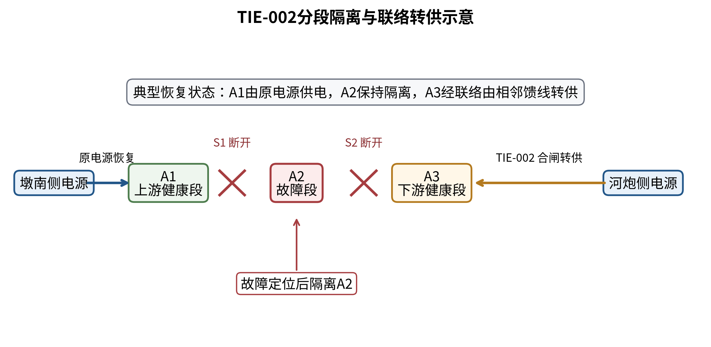

# 第一章 绪论

## 1.1 研究背景与意义

随着分布式光伏等新能源持续接入，110 kV电网的运行特征正在由单向供电逐步转变为“负荷供电、新能源汇集和双向功率交换”并存。典型高渗透片区在光伏高出力、低负荷时段可能出现反向潮流，而在晚峰或连续高负荷时段仍承担较大的正向供电需求。由于正向峰值与反向功率通常不在同一时刻出现，仅依靠单一容载比数值，已难以完整描述变电容量、储能配置、局部网络互济与新能源接入之间的关系[1-4]。

容载比仍是衡量区域变电容量与负荷需求关系的重要规划指标，其物理含义清晰、工程应用基础成熟[5-6,13-16]。但在高比例分布式新能源条件下，如果把统一容载比控制值直接视为既有容量和新增容量共同适用的刚性上限，容易产生两类偏差：一是既有设备容量高于控制值时被误解为需要压减存量容量；二是控制值过紧时，合理的新增变电容量受到限制，规划方案被迫更多依赖储能或局部网络措施承担调节任务，从而改变工程措施组合及规划经济性。

基于上述问题，本研究保留传统容载比的物理定义，将弹性容载比规划控制值（以下简称Rcap）定位为规划期新增变电容量的约束参数，并以2021年实际在役资产为各方案的共同起点。在此基础上，将正向容量需求、局部反向承载、储能时序约束和10 kV局部互济条件纳入统一分析框架，识别不同片区中容载比约束的作用类型、经济释放位置及工程适用边界。研究目的不是简单提高或降低容载比，而是在满足技术可行性的前提下，使变电扩建、储能和网络互济措施与片区主要矛盾相匹配，为徐州高渗透率地区形成差异化、“一片一策”的规划方法提供依据。

## 1.2 研究范围与对象

研究对象为徐州地区8个110 kV典型片区，片区名称统一采用QX编号。规划期为2021—2025年，其中2021年实际在役变电容量作为各规划方案的共同资产起点，2022—2025年开展增量规划比较。研究重点包括110 kV变电容量配置、储能规模、实际物理容载比、规划控制值以及2022—2025年规划期累计在役等年成本。

为进一步解释110 kV片区内部反向承载压力的空间调节能力，本研究同步开展10 kV高光伏跨站供电边界重构分析。专题范围聚焦墩集变与河湾变所带六条目标馈线，研究在局部变电站反向承载压力较高、相邻变电站仍有承接空间时，如何优先利用既有联络、必要时配置新增联络，将光伏富余供电单元调整至相邻站供电范围。其中，墩南线PZXL-00092与河炮线PZXL-00161之间的TIE-002作为典型案例，用于验证“反向压力识别—既有联络利用—供电边界重构—受端承载校核—新增联络容量定型”的规划分析流程。

本研究的10 kV分析定位为规划级拓扑与容量评估，用于判断局部互济的可实施条件和能力边界，不替代完整交流潮流、短路电流计算、继电保护定值校核和现场倒闸操作设计。对于缺少同步源荷时序、完整阻抗或现场开关属性的数据项，报告按照已有证据能力给出相应边界，不将规划级结果扩大解释为运行控制结论。

## 1.3 研究目标与内容

研究目标是在保留既有资产、尊重实际运行边界的条件下，建立适用于高比例分布式新能源片区的弹性容载比分析方法，并形成可用于工程规划的差异化建议。围绕这一目标，主要开展以下工作：

（1）整理2021—2025年片区负荷、主变容量、反向潮流、线路负载及新能源装机等资料，统一数据口径，分析典型片区在正向高负荷、低负荷和反向送电等工况下的运行特征，形成“新能源渗透水平—电网运行状态”基础数据库。

（2）建立以实际工程措施为基础的经济模型。对变电扩建和储能等不同寿命的投资采用等年值方法折算，并在共同资产起点上比较2022—2025年各年度在役措施形成的累计成本，使不同技术方案具备可比的经济口径。

（3）建立存量容量豁免条件下的弹性容载比规划约束。将实际物理容载比与规划控制值分开定义，反向潮流不并入传统容载比分母，而通过独立指标、设备能力和储能功率平衡进行处理。

（4）开展Rcap控制值扫描、局部阈值细化及多参数敏感性分析，识别经济释放阈值、稳健近优下限、容载比非主导和技术约束优先等不同规划响应，避免对所有片区采用同一数值结论。

（5）构建以现状源荷规模、局部反向潮流、110 kV线路统计负载余度和正向峰值负荷变化为核心的片区特征体系，形成弹性容载比样本支持参考矩阵，并明确其适用范围和数据边界。

（6）建立10 kV高光伏跨站供电边界重构规划模型，以TIE-002为案例识别局部光伏净外送需求，量化既有联络可转移能力，并在既有通道不足时计算新增联络容量需求和候选受端馈线，使10 kV层面的反向功率空间转移能力与110 kV弹性容载比规划形成工程衔接。

按照开题报告确定的研究框架，本研究报告分为七章：第一章绪论；第二章文献综述与理论基础；第三章徐州典型地区“新能源—电网”运行特征分析；第四章基于实际工程的电网建设成本模型；第五章“一片一策”弹性容载比规划建议；第六章典型案例验证；第七章结论与展望。

## 1.4 研究方法与技术路线

本研究综合采用规范分析、数据标准化、运行特征统计、物理约束校核、多年度路径优化、工程经济评价、敏感性分析和案例验证等方法。整体技术路线遵循“数据整理与口径统一—运行特征识别—工程措施建模—规划方案优化—差异化建议—典型案例验证”的顺序展开。

如图1-1所示，首先以真实资产、负荷、新能源和线路资料建立研究基础，分别识别正向供电压力与反向承载压力；随后在统一的规划期经济口径下，对变电扩建、储能和局部网络互济措施进行组合比较，并通过Rcap扫描及敏感性分析识别经济释放阈值与稳健建议下限。对于10 kV层面的局部问题，则进一步通过供电边界重构分析高光伏净外送功率能否经既有或新增联络向相邻站转移，并同步校核受端通道和变电站反向承接能力。整个分析过程中，技术可行性始终先于数值推荐，避免以单一比例指标替代设备能力、接入位置和网络结构等工程约束。

# 第二章 文献综述与理论基础

## 2.1 国内外研究现状

现行电网规划标准仍以供电能力、负荷增长和设备利用效率为重要基础，容载比作为区域变电容量配置水平的统计指标，长期用于指导电网规划与投资安排[5-6]。国内关于多电压等级电网容载比、精细化规划参数和主配协同规划的研究表明，容载比适合反映区域容量储备水平，但其合理取值需要与网络结构、供电可靠性、负荷增长和规划颗粒度共同分析[13-16]。

随着分布式光伏渗透率提高，配电网承载力研究逐步从静态装机比例扩展到源荷不确定性、时序潮流、主动管理和主配协同。已有研究指出，新能源接入对电网的影响不仅取决于装机规模，还与源荷同步性、接入位置、局部网络结构及反向潮流密切相关[7-10,17,19]。因此，单纯以新能源装机与负荷之比判断承载能力，难以反映设备和网络在不同方向功率下的真实压力。

储能及其他柔性资源能够在一定程度上缓解局部反向送电、削减正向峰值或推迟网络扩建，但其经济性高度依赖负荷增长、功率持续时间、设备成本和网络约束[11-12,18,20]。在实际工程中，储能并非变电扩建的简单替代物：当正向负荷持续增长且扩建条件具备时，过度限制新增变电容量可能导致储能规模快速增加；而当局部反向潮流或接入位置成为主要矛盾时，仅增加主变容量也未必能够解决问题。

综合现有研究可以看出，高比例分布式新能源条件下的容量规划需要同时回答三个问题：一是正向供电需要多少变电容量；二是新能源反送对局部设备和网络形成多大压力；三是扩建、储能和网络互济三类措施如何组合更为合理。本研究据此不重新定义传统容载比的物理分母，而是区分“实际物理容载比”和“规划控制参数”，并将反向承载、储能和10 kV局部互济条件作为独立约束纳入规划比较。

## 2.2 核心概念与理论基础

### 2.2.1 实际物理容载比与规划控制值

第y年实际物理容载比定义为该规划路径下在役变电总容量与同期正向年最大供电负荷之比：

$$
R_{\mathrm{CLR},y}=\frac{S_y}{P_y^{+}}
$$
（2-1）

式中，S_y为第y年在役变电总容量；P_y^+为同一规划路径下重新计算的正向年最大供电负荷。考虑储能充放电和局部互济后，P_y^+由净负荷序列确定：

$$
P_y^{+}=\max_t\left\{\max\left[\sum_i\left(P_{\mathrm{actual},i,t}+P_{\mathrm{c},i,t}-P_{\mathrm{d},i,t}+P_{\mathrm{tie},i,t}\right),0\right]\right\}
$$
（2-2）

该定义保留了传统容载比“容量/正向峰值负荷”的物理含义。反向潮流不进入容载比分母，而通过独立指标和设备约束处理。因此，实际物理容载比是规划方案形成后的结果指标，不等同于限制新增容量的Rcap。

各规划方案均以2021年实际在役变电容量为共同起点。既有容量保持在役，不因控制值变化假设退役或拆除；Rcap只约束规划期新增容量：

$$
\Delta S_y\leq\max\left(R_{\mathrm{cap}}P_y^{+}-S_{2021},0\right)
$$
（2-3）

当既有容量已经高于控制值对应的容量水平时，式（2-3）右端取零，表示该控制值下不再允许新增变电容量，而不是要求压减既有容量。由此形成存量容量豁免机制，也解释了为什么某些规划路径的实际物理容载比可以高于Rcap而不构成约束违反。

图2-1给出了两类指标的关系：实际物理容载比用于描述最终容量配置状态，Rcap用于控制规划期新增容量空间。将两者分开，是避免存量资产被错误纳入刚性上限的关键。

### 2.2.2 储能运行约束

储能作为本地功率调节资源参与规划。单个模块额定功率为0.1 MW、额定容量为0.215 MWh，SOC运行范围为10%～90%，基准充电效率和放电效率均取0.95。储能充电仅吸收本地反向或剩余功率，不通过充电人为改变潮流方向；储能放电仅服务本地正向负荷，不通过放电形成新的外送功率。能量状态满足：

$$
E_t=E_{t-1}+\eta_{\mathrm{c}}P_{\mathrm{c},t}\Delta t-\frac{P_{\mathrm{d},t}\Delta t}{\eta_{\mathrm{d}}}
$$
（2-4）

$$
0.10E_{\mathrm{rated}}\leq E_t\leq0.90E_{\mathrm{rated}}
$$
（2-5）

其中，E_t为时刻t的储能电量，P_c,t和P_d,t分别为充电功率和放电功率。QX-00005具备2025年8760小时连续运行时序，储能SOC按全年序列连续传递；其余片区采用静态真实数据并结合短、中、长持续时间场景进行可行性校核。由于数据完整度不同，各片区关于储能时序可行性的结论应按相应证据能力解释。

# 第三章 徐州典型地区“新能源—电网”运行特征分析

## 3.1 徐州新能源发展与电力负荷概况

本研究使用2021—2025年片区正向最大供电负荷、2021年和2025年在役变电容量、变电站年度最大及最小净负荷、110 kV线路负载水平以及新能源装机资料。新能源规模采用现有2026年装机快照，与2025年最近完整年度负荷进行横向比较，主要用于识别片区的现状源荷规模特征。由于两类数据不属于严格同期量，因此不将该比值解释为某一时刻的实际潮流状态。主要数据及用途见表3-1。

**表 3-1 主要数据及用途**

| 数据类别 | 时间范围 | 主要用途 | 使用限制 |
|---|---|---|---|
| 片区正向最大供电负荷 | 2021—2025年 | 容载比、负荷变化率、规划需求 | 年度峰值不反映全年同步波动 |
| 在役变电容量 | 2021年、2025年 | 共同资产起点与容量核验 | 按现有台账统计 |
| 变电站年度净负荷极值 | 现有统计年度 | 局部反向潮流分析 | 各站极值不一定同时发生 |
| 110 kV线路负载水平 | 现状资料 | 线路统计负载余度 | 不等同完整交流潮流结果 |
| 新能源装机快照 | 2026年 | 源荷规模横向比较 | 与2025年负荷不属于严格同期量 |
| 连续运行时序 | 2025年 | 连续SOC与时序可行性 | 目前QX-00005具备8760小时连续数据 |

从样本整体看，8个典型片区在新能源规模、正向负荷、局部反向功率、线路负载和负荷变化方面存在明显差异。部分片区新能源装机已接近或超过近期正向峰值负荷，部分片区110 kV线路统计最大负载率达到或超过100%。这说明高渗透片区面临的主要矛盾并不一致，既可能表现为正向容量增长压力，也可能表现为局部反向承载或线路容量压力，因而需要进一步开展分类型分析。

## 3.2 主变负载率多工况统计分析

在正向供电、低负荷和反向送电等不同工况下，主变及相关线路承担的功率方向不同。年度最大正向净负荷用于描述传统供电峰值；当年度最小净负荷小于零时，其绝对值用于表征该站统计年度内出现的最大反向潮流功率。对于不具备完整同步时序的片区，不将不同变电站在不同时刻发生的年度极值直接相加，以避免把非同期事件误认为片区同步反向峰值。

线路负载水平同样用于识别容量压力，而不是直接替代潮流安全结论。当统计最大负载率接近或超过100%时，说明相关线路应进一步核查设备允许负载、实际运行方式、负荷转供条件和必要的网络改造措施；该统计值本身不能直接推导节点电压、无功分布或热稳定裕度。

因此，本研究将主变和线路的统计运行特征作为片区分类与约束识别的基础信息，并在后续规划中把正向容量需求、局部反向承载和线路压力分别处理，避免将性质不同的问题压缩为单一容载比指标。

## 3.3 源荷比、电量渗透率与容载比的关联规律

为从现有资料中提取能够稳定横向比较的片区特征，本研究从新能源相对规模、反向潮流、线路压力和负荷增长四个方面构造核心指标。由于现有片区资料尚缺统一基准年的全年新能源发电量与用电量，电量渗透率暂不作为正式横向指标，而作为理解新能源电量占比的辅助概念；本节正式比较采用能够在各片区统一计算的源荷规模比等指标。

现状源荷规模比采用“最新新能源装机快照/最近完整年度正向最大负荷”计算：

$$
R_{\mathrm{SL}}^{*}=\frac{C_{\mathrm{RE,snap}}}{P_{\mathrm{load,max,base}}^{+}}
$$
（3-1）

该指标反映新能源装机相对于片区正向峰值负荷的规模关系，用于横向比较，不代表严格同期的功率平衡。

局部最大反向潮流比例定义为片区内各变电站年度最大反向潮流功率的最大值与片区正向最大负荷之比：

$$
R_{\mathrm{rev}}=\frac{\max_i\left(P_{\mathrm{rev,max},i}\right)}{P_{\mathrm{load,max}}^{+}}
$$
（3-2）

该指标突出片区内最受反向潮流影响的局部接入点，避免将不同时间发生的各站极值简单叠加。

110 kV线路统计负载余度定义为：

$$
K_{\mathrm{line}}=1-\max_l\left(\lambda_l\right)
$$
（3-3）

当K_line为负时，表示现有统计资料中至少有一条110 kV线路的最大负载率超过100%，需进一步核查运行方式和设备允许负载。该指标用于容量压力筛查，不作为完整交流潮流安全裕度。

正向峰值负荷年均变化率采用2021年和2025年片区正向最大供电负荷计算：

$$
g_P=\left(\frac{P_{2025}^{+}}{P_{2021}^{+}}\right)^{1/4}-1
$$
（3-4）

图3-1显示，不同片区的规划响应不能由某一项指标单独划分。例如，QX-00003和QX-00004具有较高的源荷规模比或局部反向潮流比例，但在Rcap扫描范围内规划方案并未发生变化；QX-00010的线路统计负载余度仍为正，但局部设备与接入条件使其在放开Rcap后仍未形成完整可行路径。因此，源荷规模、反向潮流、线路压力与容载比之间存在关联，但不足以建立“一项指标对应一个Rcap值”的简单映射。

## 3.4 “新能源渗透水平—电网运行状态”数据库的构建

数据库按片区统一组织负荷、容量、反向潮流、线路负载、新能源装机、储能参数和经济参数。净负荷统一采用正向供电为正、反向送电为负；变电容量采用MVA，功率采用MW，储能电量采用MWh。对于无法从现有资料确认的数据项保持缺失状态，不以零值替代，避免在后续分类和模型计算中形成虚假信息。

候选指标筛选综合考虑数据覆盖率、物理含义、信息重复程度以及对规划响应的解释能力，结果见表3-2。

**表 3-2 候选指标筛选结果**

| 候选指标 | 数据可得性 | 规划解释作用 | 处理结果 |
|---|---|---|---|
| 现状源荷规模比 | 7个片区可计算 | 反映新能源相对规模 | 保留 |
| 局部最大反向潮流比例 | 8个片区可计算 | 反映最突出接入点反向压力 | 保留 |
| 110 kV线路统计负载余度 | 8个片区可计算 | 反映线路统计容量压力 | 保留 |
| 正向峰值负荷年均变化率 | 8个片区可计算 | 反映持续增长需求 | 保留 |
| 反向承载缺口比例 | 8个片区可计算 | 与源荷规模比信息重复较高 | 辅助诊断 |
| 反向潮流站点比例 | 8个片区可计算 | 反映反向潮流空间覆盖面 | 辅助诊断 |
| 年负荷率、峰谷差率 | 资料不完整 | 无法统一横向计算 | 暂不进入主体指标体系 |
| 储能需求 | 优化后可得 | 属于规划响应而非前置指标 | 用于结果解释 |

在7个源荷规模比完整样本中，源荷规模比与反向承载缺口比例的Spearman秩相关约为0.86。由于样本数量有限，该结果仅用于识别指标之间的信息重叠程度，不用于统计显著性检验或因果推断。综合数据完整性和工程解释性，后续规划建议采用现状源荷规模比、局部最大反向潮流比例、110 kV线路统计负载余度和正向峰值负荷年均变化率4项核心指标。

### 3.4.1 10 kV高光伏跨站供电边界重构表达

110 kV层面的反向承载压力具有明显的空间不均衡性。同一片区内，不同变电站及其下辖10 kV馈线的负荷水平、分布式光伏规模和反向潮流强度并不一致。当局部110 kV变电站在高光伏、低负荷时段出现较强反向送电，而相邻变电站仍具有承接空间时，可通过调整10 kV供电边界，将部分净发电供电单元转移至相邻站供电范围，从而改变光伏富余功率向上级电网反送的路径。该过程并不减少光伏实际出力，而是对反向功率进行空间重分配。

为描述这一过程，本研究将10 kV网络抽象为由馈线、物理支路、联络关系和可调整供电单元组成的拓扑图。分段、联络等开关设备统一视为供电边界控制资源，模型关注其是否能够支撑供电归属调整，而不以实时分合状态识别或现场倒闸顺序为研究对象。规划重构后必须保持单电源辐射运行，禁止两个110 kV电源通过10 kV网络直接并列。实时开关状态、遥控属性、保护定值和具体操作步骤属于工程实施阶段的专项校核内容。

对任一可调整供电归属的供电单元k，定义净有功功率为：

$$
P_k=P_{L,k}-P_{PV,k}
$$
（3-5）

当净有功功率小于0时，该单元为净发电单元，可用于跨站转移的光伏富余功率为：

$$
G_k=\max\left(P_{PV,k}-P_{L,k},0\right)
$$
（3-6）

定义二元供电归属变量：取0表示仍由原110 kV变电站供电，取1表示通过供电边界重构调整至相邻变电站供电范围，则跨站转移功率为：

$$
P_{\mathrm{tr}}=\sum_k x_kG_k
$$
（3-7）

当前六条目标馈线已完成馈线—变电站映射、关键物理支路、规划级线路参数、负荷/光伏边界和主要联络关系整理。墩集变对应墩振线PZXL-00099、墩西线PZXL-00097和墩南线PZXL-00092；河湾变对应河东线PZXL-00154、河炮线PZXL-00161和河镇线PZXL-00173。其中，TIE-002连接墩南线与河炮线，两侧端点和关键路径均已达到规划计算所需的数据质量，可作为首个跨站供电边界重构案例。

受现有数据粒度限制，墩南线7.34 MW为馈线级实际光伏峰值出力锚点，尚不能完整还原各局部区段在同一时刻的负荷—光伏空间分布。因此，正式数值算例以馈线级作为当前最小可验证单元；供电归属变量用于建立可扩展的局部优化框架。后续如补充节点级光伏分布或同步量测，可直接将馈线级单元细化为多个局部供电单元，而无需改变模型结构。

# 第四章 基于实际工程的电网建设成本模型

## 4.1 分布式新能源配套工程成本数据收集与处理

高渗透率片区的规划方案通常由多类工程措施共同构成，不同措施的投资规模、使用寿命和运维方式存在明显差异。若直接比较一次性投资额，难以反映不同寿命设备在规划期内的经济占用。因此，本研究以可实施工程措施为对象，重点考虑变电扩建、储能配置及已具备数据基础的网络措施，并通过等年值方法统一经济评价口径。

资本回收系数为：

$$
\mathrm{CRF}(r,n)=\frac{r(1+r)^n}{(1+r)^n-1}
$$
（4-1）

其中，r为折现率，n为设备经济寿命。单项在役措施的等年成本为：

$$
C_{\mathrm{EAC}}=C_{\mathrm{inv}}\mathrm{CRF}(r,n)+C_{\mathrm{om}}
$$
（4-2）

式中，C_inv为初始投资，C_om为年固定运维成本。单项措施等年成本的单位为万元/年。设备价格、经济寿命和固定运维费率作为规划参数参与计算，并在敏感性分析中检验其变化对Rcap建议和措施组合的影响。

## 4.2 成本驱动因子识别与参数化模型建立

在统一等年成本口径后，规划目标进一步考虑措施的投运年份。各方案以2021年实际在役资产为共同起点，对2022—2025年每一年已经投入运行的新增措施计算等年成本，并在规划期内累计：

$$
\min J=\sum_{y=2022}^{2025}C_{\mathrm{EAC},y}^{\mathrm{in\mbox{-}service}}
$$
（4-3）

因此，本文将目标函数统一称为“2022—2025年规划期累计在役等年成本”，单位为万元。该指标既不是一次性总投资，也不是某一个单独年度的万元/年费用，而是反映不同投运时点和不同工程措施在规划期内持续占用成本的累计量。

成本变化主要由三类因素共同驱动：一是新增变电容量是否受到Rcap约束；二是储能为满足正向容量、反向承载及时序约束所需的规模；三是工程措施投运年份。模型以年度为离散步长，对候选扩建和储能状态进行确定性枚举与动态筛选；涉及连续时序的储能可行性问题采用线性约束求解。由于求解过程不依赖随机搜索，相同输入条件下可获得一致的规划结果。

## 4.3 刚性容载比场景全寿命周期成本测算

本节所称“全寿命周期成本”通过设备经济寿命进入等年成本折算，方案之间的比较口径仍统一为2022—2025年规划期累计在役等年成本。为分析统一较紧控制值对规划方案的影响，刚性比较场景取Rcap=2.0，并继续执行存量容量豁免。也就是说，2021年已经在役的主变容量保持不变，Rcap只限制2022—2025年能够新增的变电容量。当新增主变受到限制但片区仍需满足正向容量和反向承载要求时，模型通过储能或其他可用措施补足相应调节需求。

QX-00001在Rcap=2.0时不新增变电容量，2025年需配置138个储能模块，对应13.8 MW/29.670 MWh，2022—2025年规划期累计在役等年成本为481.9566万元。QX-00005在同一控制条件下不能采用50 MVA扩建措施，2025年需配置962个储能模块，对应96.2 MW/206.830 MWh，规划期累计在役等年成本为3359.0522万元。

这两个片区共同表明，较紧的新增容量控制并不一定降低总体规划成本。当片区正向峰值负荷持续增长、且新增变电容量具备工程可行性时，限制扩建会将更多调节任务转移给储能，从而显著改变措施组合。

## 4.4 弹性容载比场景全寿命周期成本测算

弹性场景沿用上述经济评价口径，在1.5～3.0范围内以0.1步长扫描Rcap，同时设置不施加Rcap上限的对照方案；在经济响应发生变化的位置附近，再以0.001步长进行局部细化。为避免单一参数条件下的局部最优直接被作为规划建议，本研究进一步以不施加Rcap上限方案的成本为基准，将成本上浮5%以内定义为近优集合，并在多组敏感性情景中寻找共同满足条件的Rcap范围。

图4-1给出了QX-00001和QX-00005随Rcap变化的规划期累计在役等年成本，图4-2进一步展示新增变电容量和储能规模的变化。两个片区均存在明显的“措施转换”现象：当Rcap低于一定水平时，新增变电容量受到约束，储能需求显著增加；当Rcap放宽至经济释放位置后，扩建与储能重新形成成本更低的组合。

QX-00001的局部经济释放阈值为2.359～2.360，敏感性分析得到的5%稳健近优下限为2.50；QX-00005的局部经济释放阈值为2.171～2.172，稳健近优下限为2.30。两者的近优集合均延伸至本研究扫描上界3.0，因此当前只能识别建议下限，不能把3.0解释为推荐上限。

## 4.5 两场景经济技术对比与决策案例库形成

两个具有明显经济释放阈值的片区，其刚性与弹性方案对比见表4-1。

**表 4-1 两个阈值型片区刚性与弹性场景对比**

| 片区 | 场景 | 2025年实际物理容载比 | 新增容量/MVA | 2025年储能模块/个 | 储能功率/MW | 储能容量/MWh | 2022—2025年累计在役等年成本/万元 |
|---|---|---:|---:|---:|---:|---:|---:|
| QX-00001 | 不施加Rcap上限 | 2.3597466 | 50 | 19 | 1.9 | 4.085 | 188.1800 |
| QX-00001 | Rcap=2.0 | 2.2679276 | 0 | 138 | 13.8 | 29.670 | 481.9566 |
| QX-00005 | 不施加Rcap上限 | 2.1715720 | 50 | 465 | 46.5 | 99.975 | 1745.5283 |
| QX-00005 | Rcap=2.0 | 2.1192953 | 0 | 962 | 96.2 | 206.830 | 3359.0522 |

QX-00001在Rcap=2.0条件下的规划期累计在役等年成本比不施加上限方案增加293.7765万元；QX-00005增加1613.5239万元。成本差异主要来自扩建受限后储能规模的大幅增加，说明弹性容载比的经济意义体现在工程措施之间的替代关系，而不是单纯追求更高的实际物理容载比。

其他片区的规划响应见表4-2。

**表 4-2 其他片区规划响应及决策类型**

| 片区 | 规划响应 | 2025年储能模块/个 | 2022—2025年累计在役等年成本/万元 | 决策类型 |
|---|---|---:|---:|---|
| QX-00003 | 扫描范围内方案不变 | 173 | 604.7015 | 容载比非主导 |
| QX-00004 | 扫描范围内方案不变 | 124 | 433.5391 | 容载比非主导 |
| QX-00007 | 无明显新增措施 | 0 | 0 | 容载比非主导 |
| QX-00008 | 放开Rcap后仍未形成完整可行路径 | — | — | 技术约束优先 |
| QX-00009 | 放开Rcap后仍未形成完整可行路径 | — | — | 技术约束优先 |
| QX-00010 | 放开Rcap后仍未形成完整可行路径 | — | — | 技术约束优先 |

由此可以形成三类具有不同规划含义的案例：QX-00001和QX-00005属于经济释放阈值型；QX-00003、QX-00004和QX-00007属于容载比非主导型；QX-00008～QX-00010属于技术约束优先型。三类结果共同构成后续“一片一策”建议的案例基础，也说明既不能对所有高渗透片区统一放宽Rcap，也不能机械采用相同的刚性上限。

# 第五章 “一片一策”弹性容载比规划建议

## 5.1 历史负荷与分布式光伏接入特征分析典型片区负荷与分布式光伏预测

本节按照既定研究内容，从历史负荷变化和分布式光伏接入特征两个方面判断典型片区未来规划压力。现阶段以2021—2025年正向最大供电负荷描述负荷变化趋势，以2026年新能源装机快照描述最新接入规模。由于尚缺少所有片区统一基准年的完整光伏出力—负荷同步预测，本研究不将跨年度源荷规模比解释为严格的未来功率预测，而将其作为片区分类和滚动规划的现状背景量。

典型片区中，QX-00001和QX-00005的正向峰值负荷年均变化率分别为6.22%和6.92%，均表现出较明确的正向容量增长需求；QX-00004为-0.51%，其Rcap扫描结果也表现为容载比非主导。该对比说明，新能源规模较高并不意味着容载比一定需要放宽，负荷增长、局部反向潮流、线路压力和设备条件必须结合分析。

在后续滚动规划中，应使用最新负荷预测、已明确的新能源接入计划以及可获得的同步时序重新计算核心指标。当片区新增大型负荷、新能源项目或网络结构发生明显变化时，不宜长期沿用当前历史增长率和现状源荷规模比。

## 5.2 含正向容载比与反向承载力协同约束的弹性规划评价指标体系设计

弹性规划评价采用“技术可行性底线+片区特征指标”两层结构。第一层为必须满足的技术可行性条件，包括设备容量、接入位置、储能接入条件、局部网络互济以及必要的时序运行约束。该层属于刚性条件，不能通过指标加权相互抵消；任何关键技术条件不满足时，都应优先解决设备、网络或接入问题。

第二层用于描述片区特征并辅助检索规划经验，包含4项核心指标：现状源荷规模比、局部最大反向潮流比例、110 kV线路统计负载余度和正向峰值负荷年均变化率。各典型片区的指标与规划响应见表5-1。

**表 5-1 典型片区关键指标及规划建议**

| 片区 | 现状源荷规模比 | 局部最大反向潮流比例 | 110 kV线路统计负载余度 | 正向峰值负荷年均变化率 | 规划建议 |
|---|---:|---:|---:|---:|---|
| QX-00001 | 0.973 | 0.088 | 11.36% | 6.22% | Rcap建议不低于2.50 |
| QX-00003 | 1.523 | 0.126 | -2.26% | 4.19% | 容载比非主导 |
| QX-00004 | 1.161 | 0.079 | 24.43% | -0.51% | 容载比非主导 |
| QX-00005 | 1.527 | 0.063 | 4.21% | 6.92% | Rcap建议不低于2.30 |
| QX-00007 | 缺失 | 0.021 | -5.06% | 1.34% | 容载比非主导；不作外推 |
| QX-00008 | 0.673 | 0.067 | -15.67% | 5.48% | 技术约束优先 |
| QX-00009 | 1.003 | 0.071 | -0.39% | 3.78% | 技术约束优先 |
| QX-00010 | 1.599 | 0.109 | 17.59% | 8.76% | 技术约束优先 |

该体系保持正向容载比与反向承载力的概念边界：Rcap控制规划期新增变电容量，局部反向潮流通过独立指标、储能和设备条件处理；110 kV线路统计负载余度用于识别线路容量压力，不替代完整交流潮流校核。通过这种分层方式，可以先判断“技术上能否实施”，再讨论“Rcap取值是否需要调整”。

### 5.2.1 10 kV跨站反向功率转移约束

10 kV局部互济在本研究中主要服务于高光伏条件下的反向承载压力再分配。规划决策遵循“既有联络优先、既有能力不足后再考虑新增联络”的两级逻辑：第一层优先利用已经形成物理联络条件的通道调整供电边界；第二层仅对既有联络无法承接的剩余反向功率，计算新增联络所需的最小有效容量，并筛选具备受端容量条件的相邻馈线。在约束满足的前提下，模型采用分层目标：首先最大化送端反向功率削减量，其次优先利用既有联络以减少新增工程，最后对仍需转移的剩余功率最小化新增联络有效容量。

对既有联络e，其可用于反向功率转移的能力同时受到送端路径、受端路径和受端变电站承接能力限制。设送端、受端路径规划有效容量分别为S_e,D^eff和S_e,R^eff，受端站剩余反向承接能力为H_R，则既有联络可转移有功功率满足：

$$
0\le P_{e,\mathrm{tr}}\le \min\left(S_{e,D}^{\mathrm{eff}}\cos\varphi_{\mathrm{tr}},\beta S_{e,R}^{\mathrm{eff}}\cos\varphi_{\mathrm{tr}},H_R\right)
$$
（5-1）

式中，cosφtr为跨站反向功率转移的功率因数；β为反向功率通道控制系数。依据本项目专题分析采用的反向潮流控制条件，β取0.80。当前高光伏规划案例按cosφtr≈1.0进行容量换算。该80%控制线仅用于受端反向功率通道的规划筛查，不作为普通正向负荷转供的统一负载率上限，也不解释为国家或行业通用标准。

供电边界重构后，送端站和受端站的净功率分别更新为：

$$
P_D'=P_D^0+P_{\mathrm{tr}},\qquad P_R'=P_R^0-P_{\mathrm{tr}}
$$
（5-2）

其中规定正值为净负荷、负值为反向送电。由式（5-2）可见，跨站转移会降低送端站反向功率绝对值，同时增加受端站反向功率，因此必须同时校核“送端减压”和“受端承载”，不能将跨站转移等同于光伏消纳量增加。

若高光伏场景下的净富余功率超过既有联络可承接能力，则剩余需求为：

$$
G_{\mathrm{res}}=\max\left(G-P_{e,\mathrm{tr}},0\right)
$$
（5-3）

当仍存在正的剩余转移需求且相邻站仍有承接空间时，进入新增联络层。按相同反向通道控制口径，新联络所需的最小规划有效容量为：

$$
S_{\mathrm{new}}^{\min}=\frac{G_{\mathrm{res}}}{\beta\cos\varphi_{\mathrm{tr}}}
$$
（5-4）

式（5-4）给出了由剩余有功转移需求反推新增联络容量的统一换算关系；当前案例取cosφtr≈1.0，因此所得MVA值可近似作为相应MW有功转移需求在80%控制条件下的有效容量下限。该结果用于确定新增联络的容量等级和候选受端馈线，不直接等同于具体线路型号、线路长度或工程投资。由于当前缺少候选接入点GIS坐标和线路廊道，本研究不虚构新建线路的最短路径和工程长度；若后续进入工程选线阶段，应进一步结合接入点—站端全过程径、电压偏差、短路电流、保护配置和建设条件开展专项设计。

拓扑方面，模型只要求重构后保持单电源辐射运行，不允许两个110 kV电源经10 kV网络直接并列。分段开关、联络开关的实时状态以及具体倒闸顺序不作为规划模型的阻塞输入；其工程作用统一抽象为“具备或可通过工程措施形成必要的供电边界切换能力”。故障后的负荷转供仍是联络网架的附加可靠性价值，但不作为本专题的主要优化目标。

## 5.3 基于层次分析法的指标赋权

层次分析法用于组织多指标决策时，通常需要由具有实际工程经验的专家对指标重要性进行两两比较，形成判断矩阵，再通过最大特征根法计算权重并进行一致性检验。对n阶判断矩阵，其一致性指标和一致性比率分别为：

$$
CI=\frac{\lambda_{\max}-n}{n-1},\qquad CR=\frac{CI}{RI}
$$
（5-5）

当CR小于0.10时，通常认为判断矩阵的一致性可以接受。

结合本项目的实际数据与优化结果，AHP更适合作为片区特征组织和工程人员辅助判断的工具，而不宜直接替代Rcap专项优化。原因在于，QX-00001和QX-00005的2.50、2.30建议下限来自工程约束下的Rcap扫描、局部阈值细化和敏感性分析，并不是由4项指标加权求和得到。若在缺少专家确认的情况下直接设置权重，再反推Rcap数值，会改变原有的工程因果关系。

目前尚未形成由规划、运行和设计专业共同确认的AHP判断矩阵。因此，本报告不虚构具体AHP权重值，也不以未经专家确认的权重修改现有Rcap结果。后续如组织专家赋权，可将目标层设为“片区弹性容载比规划适用性”，准则层对应源荷规模、局部反向压力、线路统计负载余度和正向负荷增长四类信息。AHP结果可用于相似片区筛选、信息采集优先级和规划人员辅助判断，最终Rcap仍应通过专项优化确认。

## 5.4 不同片区类型的容载比推荐区间及技术方案组合

敏感性分析共覆盖17个情景，其中包含6个联合压力角点。对各情景5%近优Rcap集合求共同区间后，QX-00001的稳健近优下限为2.50，QX-00005为2.30；两者的近优集合均延伸至扫描上界3.0，因此现有结果只能识别建议下限，尚不能确定推荐上限。

结合规划响应，典型片区可划分为三类。第一类为经济释放阈值型，Rcap变化会显著改变变电扩建与储能之间的措施组合；第二类为容载比非主导型，在研究范围内调整Rcap并不改变主要规划方案；第三类为技术约束优先型，即使放开Rcap，仍需先解决设备、网络、接入或时序条件。由于当前只有QX-00001和QX-00005两个片区形成数值型Rcap建议，现有样本不能形成具有外推能力的连续四维区间。因此，表5-2定位为弹性容载比样本支持参考矩阵，而不是可直接套用的通用分区标准。

**表 5-2 弹性容载比样本支持参考矩阵**

| 应用条件 | 现状源荷规模比 | 局部最大反向潮流比例 | 线路统计负载余度 | 正向峰值负荷年均变化率 | 建议与技术方案 | 当前样本 |
|---|---|---|---|---|---|---|
| 技术可行；当前样本点 | 0.973 | 0.088 | 11.36% | 6.22% | Rcap建议不低于2.50；扩建与储能协同 | QX-00001 |
| 技术可行；当前样本点 | 1.527 | 0.063 | 4.21% | 6.92% | Rcap建议不低于2.30；扩建与储能协同 | QX-00005 |
| 技术可行；当前样本点 | 1.523 | 0.126 | -2.26% | 4.19% | Rcap非主导；按常规规划及局部技术条件处理 | QX-00003 |
| 技术可行；当前样本点 | 1.161 | 0.079 | 24.43% | -0.51% | Rcap非主导；按常规规划处理 | QX-00004 |
| 核心指标缺失 | 缺失 | — | — | — | 补充数据后开展专项优化 | QX-00007 |
| 完整技术可行性未满足 | 不作为判定条件 | 不作为判定条件 | 专项校核 | 不作为判定条件 | 技术约束优先，先解决设备、接入或网络问题 | QX-00008、QX-00009、QX-00010 |
| 未覆盖组合 | 其他 | 其他 | 其他 | 其他 | 开展专项Rcap扫描与工程优化 | 当前无样本 |

图5-1给出了工程应用顺序。对于新片区，应首先完成技术可行性校核，再计算4项核心指标并查找可比样本。如果与QX-00001或QX-00005特征相近，2.50或2.30只能作为Rcap专项扫描的参考起点，不能未经计算直接作为最终控制值。工程措施方面，变电扩建主要应对持续增长的正向峰值，储能主要承担局部时序调节，10 kV联络及供电边界重构主要用于缓解局部反向承载压力并改善反向功率空间分布；故障转供属于联络网架的附加可靠性价值。三类措施应围绕片区主要矛盾组合配置。

# 第六章 典型案例验证

## 6.1 刚性规划方案复盘（以某高渗透率片区为例）

选取QX-00005作为110 kV层面的主要验证案例。该片区现状源荷规模比为1.527，正向峰值负荷年均变化率为6.92%，同时具备2025年8760小时连续运行时序，是当前样本中储能时序证据最完整的高渗透片区。

在Rcap=2.0条件下，存量容量豁免后允许新增的变电容量不足以支持50 MVA扩建方案。为满足正向容量、局部功率调节及时序运行约束，2025年需配置962个储能模块，对应96.2 MW/206.830 MWh，2022—2025年规划期累计在役等年成本达到3359.0522万元。

该结果说明，刚性控制的主要影响并不是简单降低实际物理容载比，而是限制了规划期新增变电容量的选择空间，并将更多调节任务转移给储能。对于正向负荷持续增长且具备扩建条件的片区，这种措施替代可能带来较高的经济代价。

## 6.2 含反向承载力校核的弹性容载比方案设计与对比

在不施加Rcap上限的对照方案中，QX-00005新增50 MVA变电容量，2025年储能规模降至465个模块，对应46.5 MW/99.975 MWh，实际物理容载比为2.1715720，规划期累计在役等年成本为1745.5283万元。与Rcap=2.0方案相比，储能减少497个模块，功率减少49.7 MW，容量减少106.855 MWh，规划期累计在役等年成本减少1613.5239万元。

局部细化计算表明，QX-00005的经济释放阈值为2.171～2.172；进一步考虑经济参数、功率因数、反向潮流允许水平、净负荷尺度和工程成本变化后，5%近优集合的稳健下限为2.30。该下限高于单一基准情景的局部释放位置，为多参数变化预留了规划余量。两种方案的主要结果见表6-1。

**表 6-1 QX-00005刚性与弹性方案验证结果**

| 指标 | Rcap=2.0刚性方案 | 不施加Rcap上限方案 | 对比结果 |
|---|---:|---:|---|
| 2025年实际物理容载比 | 2.1192953 | 2.1715720 | 弹性方案允许合理新增容量 |
| 新增变电容量/MVA | 0 | 50 | 增加50 |
| 储能模块/个 | 962 | 465 | 减少497 |
| 储能功率/MW | 96.2 | 46.5 | 减少49.7 |
| 储能容量/MWh | 206.830 | 99.975 | 减少106.855 |
| 2022—2025年累计在役等年成本/万元 | 3359.0522 | 1745.5283 | 减少1613.5239 |

从工程含义看，QX-00005并不是“容载比越高越好”，而是存在一个能够释放合理扩建空间的区间。超过经济释放位置后，继续提高Rcap并不会必然产生新的经济收益；因此，规划建议以稳健下限表达更为合理。

## 6.3 效果评估与方法有效性验证

除QX-00005外，QX-00001形成相同类型的经济释放响应：Rcap=2.0时，2025年储能由不施加上限方案的19个模块增加至138个，规划期累计在役等年成本由188.1800万元增加至481.9566万元；其局部经济释放阈值为2.359～2.360，稳健近优下限为2.50。两个片区共同表明，当正向负荷持续增长且变电扩建技术条件具备时，过紧的新增容量控制可能导致较高的储能替代成本。

另一方面，QX-00003、QX-00004和QX-00007在Rcap扫描范围内规划方案基本不变，QX-00008～QX-00010则在放开Rcap后仍存在技术可行性问题。这些结果说明，本方法并不预设“高渗透片区均应放宽容载比”，而是首先识别Rcap是否为主导约束，再决定是否需要提出数值建议。

为检查参考矩阵与既有规划结果的对应关系，将当前8个片区重新代入表5-2进行样本内一致性检查，结果见表6-2。由于参考矩阵和检查样本来自同一批片区，该过程只能用于检查分类规则是否与已有结果自洽，不能作为独立验证、交叉验证或外部验证。

**表 6-2 样本回代一致性检查**

| 片区 | 参考矩阵输出 | 规划优化结论 | 状态 |
|---|---|---|---|
| QX-00001 | Rcap不低于2.50 | 稳健近优下限2.50 | 一致 |
| QX-00003 | 容载比非主导 | 扫描范围内方案不变 | 一致 |
| QX-00004 | 容载比非主导 | 扫描范围内方案不变 | 一致 |
| QX-00005 | Rcap不低于2.30 | 稳健近优下限2.30 | 一致 |
| QX-00007 | 数据不足，转专项分析 | 个案结果为容载比非主导 | 数据例外 |
| QX-00008 | 技术约束优先 | 放开Rcap后未形成完整可行路径 | 一致 |
| QX-00009 | 技术约束优先 | 放开Rcap后未形成完整可行路径 | 一致 |
| QX-00010 | 技术约束优先 | 放开Rcap后未形成完整可行路径 | 一致 |

当前样本能够支持“先识别约束类型、再确定Rcap是否需要数值优化”的工程逻辑，但尚不能证明4项指标与Rcap建议之间已经形成可直接外推的连续边界。后续应通过新增独立片区、同步源荷时序和年度滚动数据进一步检验其推广能力。

### 6.3.1 TIE-002高光伏跨站供电边界重构案例验证

为验证10 kV层面的跨站反向功率转移方法，选取墩集变墩南线PZXL-00092与河湾变河炮线PZXL-00161之间的TIE-002作为典型案例。墩南侧源端至联络点的规划路径约2.25 km，导线基准热限为8.6603 MVA；考虑馈线485 A运行允许值后，规划有效容量取较严的8.4004 MVA。河炮侧联络点至站端路径约2.75 km，导线基准热限为9.5263 MVA，低于馈线运行允许上限10.3057 MVA，因此受端路径规划有效容量取9.5263 MVA。河炮线现有光伏汇总为0 kVA；同时，由于缺少与墩南线光伏峰值严格同步的受端负荷断面，容量筛查不利用河炮线本地负荷抵消转移功率，而按跨站转移功率单独占用受端通道处理，属于偏保守口径。高光伏反向转移按功率因数近似1.0进行规划级容量换算，因此本案例中MVA通道限值可近似映射为MW有功转移上限。

墩集变与河湾变2025年年度最小净负荷分别为-37.27 MW和-5.22 MW，表明墩集侧反向送电压力明显高于河湾侧。该组数据用于识别跨站功率再分配的工程方向，但两个年度最小值并非同一时间戳，不能直接解释为某一历史同步断面的双站潮流。按河湾变最大主变退出后剩余50 MVA容量进行简单N-1热容量筛查，并扣除5.22 MW反向功率锚点后，站级反向承接余量约44.78 MW，高于TIE-002通道上限，因此当前案例的主导容量约束来自10 kV受端通道而非站级容量。该余量仅用于规划级热容量筛查，不替代实际N-1潮流、母线电压和保护校核。墩南线另具有7.34 MW实际光伏峰值出力锚点，该数值用于构造高光伏规划场景，不解释为完整装机容量。

图6-1所示的研究逻辑不是故障后的负荷恢复，而是高光伏时段的供电边界调整。规划模型先识别墩南线净外送富余功率，再判断TIE-002能否作为既有跨站通道承接该功率。重构时通过退出原供电边界并投入站间联络，使相应供电单元转入河湾变供电范围，同时保持10 kV网络单电源辐射运行。具体采用哪一台现场开关、开关当前状态及倒闸顺序不在本研究中逐项模拟，而在工程实施阶段复核。

TIE-002在反向功率场景下的保守转移能力为：

$$
P_{\mathrm{TIE002,tr}}^{\max}=\min\left(8.4004\times1.0,0.8\times9.5263\times1.0,44.78\right)=7.62104\ \mathrm{MW}
$$
（6-1）

在最保守的“本地负荷为0”包络下，当前7.34 MW光伏峰值锚点可全部作为净外送功率。此时河炮侧路径反向利用率为77.05%，低于本项目80%反向通道控制线，因此既有TIE-002从容量尺度上能够承接当前光伏峰值锚点对应的保守外送上界，无需因当前锚点立即新增联络容量。

若采用高光伏规划场景中30%负荷系数，即以墩南线年度最大有功6.529596 MW的30%作为本地负荷代理，则当前光伏锚点下净富余功率为：

$$
G=7.34-0.3\times6.529596=5.3811212\ \mathrm{MW}
$$
（6-2）

对应河炮侧路径利用率约56.49%，既有联络具有更充足的容量余度。该结果属于规划应力场景，不解释为历史同步潮流。

为评估新能源继续增长后的边界，进一步设置光伏倍率场景。当本地负荷取0、光伏达到当前峰值锚点的1.2倍时，净外送功率为8.808 MW，TIE-002按80%控制可承担7.62104 MW，剩余1.18696 MW需由新增联络或其他措施承担，对应新增联络最小规划有效容量约1.4837 MVA。当负荷系数取0.3、光伏达到1.5倍时，净外送功率约9.0511 MW，既有联络之后仍有约1.4301 MW剩余需求，对应新增联络最小规划有效容量约1.7876 MVA。

河湾变下辖河东线、河炮线和河镇线的馈线级容量筛查表明，在上述未来压力场景中，河东线和河镇线从站端容量尺度上均具备承接剩余转移需求的条件，可作为新增联络进一步勘察的候选受端馈线。该筛查仅用于确定“是否值得进入工程选线”，不表示已经形成具体线路路径。由于当前缺少候选接入点GIS坐标和廊道距离，本研究不进一步给出新建线路长度或投资额。

上述场景的容量对比结果汇总见表6-3。

**表 6-3 TIE-002高光伏跨站反向功率转移规划结果**

| 规划场景 | 净外送/需转移功率 | 既有TIE-002利用 | 剩余新增转移需求 | 规划判断 |
|---|---:|---:|---:|---|
| 当前PV锚点、零本地负荷 | 7.3400 MW | 7.3400 MW，受端利用率77.05% | 0 | 既有联络可完整承接 |
| 当前PV锚点、30%负荷 | 5.3811 MW | 5.3811 MW，受端利用率56.49% | 0 | 既有联络余度较充足 |
| 1.2倍PV、零本地负荷 | 8.8080 MW | 7.6210 MW | 1.1870 MW | 进入新增联络层；最小有效容量约1.4837 MVA |
| 1.5倍PV、30%负荷 | 9.0511 MW | 7.6210 MW | 1.4301 MW | 进入新增联络层；最小有效容量约1.7876 MVA |

该案例说明，10 kV联络在110 kV弹性规划中的核心作用，是为局部反向功率提供可重构的空间转移通道。其价值不能用联络开关数量简单表征，而应由光伏富余功率、既有通道有效容量、相邻站反向承接能力以及重构后的辐射运行条件共同决定。故障转供可作为同一联络网架的附加可靠性收益，但不是本案例的主要规划结论。

# 第七章 结论与展望

本研究围绕高比例分布式新能源条件下110 kV电网容载比的差异化规划问题，在2021年实际在役资产共同起点上，将正向容量需求、局部反向承载、储能时序和10 kV局部互济纳入统一分析框架。主要结论如下。

（1）实际物理容载比与弹性规划控制值需要分开定义。实际物理容载比采用在役变电总容量除以规划路径内重新计算的正向年最大供电负荷，是方案形成后的结果指标；Rcap只约束规划期新增变电容量，既有资产执行存量容量豁免。反向潮流不并入传统容载比分母，而通过独立指标、设备条件和储能功率平衡进行处理。

（2）规划经济评价应反映工程措施的寿命和投运时点。本研究将不同措施折算为等年成本，并统一采用2022—2025年规划期累计在役等年成本作为比较目标。QX-00001和QX-00005在Rcap较紧时均因合理扩建受到限制而显著增加储能配置，说明容载比控制会通过扩建与储能之间的措施替代关系影响规划经济性。

（3）QX-00001的局部经济释放阈值为2.359～2.360，敏感性分析得到的5%稳健近优下限为2.50；QX-00005的局部经济释放阈值为2.171～2.172，稳健下限为2.30。两者扫描至3.0均未识别推荐上限，因此现阶段只给出建议下限，不人为构造闭区间。

（4）不同片区对Rcap的敏感程度明显不同。QX-00003、QX-00004和QX-00007在当前研究范围内容载比控制不是主导约束；QX-00008、QX-00009和QX-00010即使放开Rcap，仍需优先解决设备、网络、接入位置或时序技术条件。因此，“一片一策”的核心不是为每个片区简单配置一个不同数值，而是先识别约束类型，再确定是否需要数值型Rcap建议及相应工程措施。

（5）现状源荷规模比、局部最大反向潮流比例、110 kV线路统计负载余度和正向峰值负荷年均变化率可作为当前片区特征描述的4项核心指标。由于现有数值型推荐样本仅有QX-00001和QX-00005，当前数据不能形成具有外推能力的连续四维区间。弹性容载比样本支持参考矩阵适合用于相似样本检索和专项优化入口，不应被作为新片区直接套用的固定标准。

（6）10 kV局部互济的主要规划价值之一，是利用供电边界重构在相邻110 kV变电站之间重新分配高光伏反向功率。TIE-002案例表明，在零本地负荷的保守包络下，墩南线7.34 MW实际光伏峰值出力锚点可由既有联络完整承接，河炮侧路径反向利用率约77.05%，低于本项目80%反向通道控制线；当光伏升至1.2倍且本地负荷取零时，既有联络后仍有约1.187 MW剩余需求，对应新增联络最小有效容量约1.484 MVA。由此可见，10 kV联络方案应采用“既有联络优先、能力不足再新增”的分层规划逻辑，并同时校核送端减压、受端反向承载、通道容量和辐射运行条件。

后续研究应重点补充统一基准年的源荷同步时序和更多片区8760小时连续数据，完善10 kV节点级光伏空间分布、候选新联络接入点GIS坐标和线路廊道信息，并在工程实施阶段对关键联络方案开展交流潮流、短路电流、保护适应性和具体运行方式专项校核。在样本规模扩大后，可重新识别4项核心指标与Rcap建议之间的适用边界，并通过独立片区、留出样本和年度滚动规划持续检验方法的工程推广性。对于AHP部分，后续可组织规划、运行和设计专业专家形成正式判断矩阵并开展一致性检验，但其定位仍应是辅助决策，不替代专项规划优化。

# 参考文献

[1] 国家能源局. 2025年可再生能源并网运行情况[EB/OL]. 2026-02-12.

[2] 国家发展改革委, 国家能源局. 关于新形势下配电网高质量发展的指导意见：发改能源〔2024〕187号[Z]. 2024.

[3] 国家发展改革委, 国家能源局. 加快构建新型电力系统行动方案（2024—2027年）[Z]. 2024.

[4] 国家能源局. 配电网高质量发展行动实施方案（2024—2027年）[Z]. 2024.

[5] DL/T 5729—2023 配电网规划设计技术导则[S].

[6] DL/T 2041—2025 分布式电源接入电力系统承载力评估导则[S].

[7] LIN T, WU G, LAI S, et al. Calculation of distribution network PV hosting capacity considering source-load uncertainty and active management[J]. Electronics, 2024, 13(20): 4048.

[8] CHEN C, PENG W, XIE C, et al. Photovoltaic hosting capacity assessment of distribution networks considering source-load uncertainty[J]. Energies, 2025, 18(8): 2134.

[9] MAJEED I B, NWULU N I. Impact of reverse power flow on distributed transformers in a solar-photovoltaic-integrated low-voltage network[J]. Energies, 2022, 15(23): 9238.

[10] HOU Q, ZHANG N, DU E, et al. Probabilistic duck curve in high PV penetration power system: concept, modeling, and empirical analysis in China[J]. Applied Energy, 2019, 242: 205-215.

[11] WANG R, JI H, LI P, et al. Multi-resource dynamic coordinated planning of flexible distribution network[J]. Nature Communications, 2024, 15: 4576.

[12] MARTÍNEZ M, MATEO C, GÓMEZ T, et al. Distributed battery energy storage systems for deferring distribution network reinforcements under sustained load growth scenarios[J]. Journal of Energy Storage, 2024, 100: 113404.

[13] 肖峻, 刘柔嘉, 龙梦皓. 变电容载比与下一级中压配电网络关系的量化分析[J]. 电力建设, 2015, 36(11): 45-50.

[14] 陈浩, 张焰, 俞国勤, 等. 多电压等级配电网最优容载比的计算方法[J]. 电气应用, 2011, 30(1): 25-29.

[15] 王凯亮, 何卓怡, 叶健鹏, 等. 多电压等级电网协同规划的容载比优化配置方法[J]. 南方电网技术, 2025, 19(7): 131-139.

[16] 刘炜彬, 梁咏秋, 李锡刚, 等. 面向精细化规划的容载比参数优化方法研究[J]. 电气工程学报, 2025, 20(1): 208-217.

[17] 王守相, 尹孜阳, 赵倩宇. 考虑多供电层级耦合的中低压配电网分布式光伏承载力一体化精细评估方法[J]. 电工技术学报, 2025, 40(6): 1930-1944.

[18] 龚锐, 李华强, 许立雄. 面向配电网综合承载力提升的储能优化配置方法[J]. 电网技术, 2025, 49(9): 3860-3869.

[19] 梁志峰, 康重庆, 隋凌峰, 等. 含高比例分布式光伏的主配网运行风险评估与防控策略研究[J]. 清华大学学报（自然科学版）, 2024, 64(11): 1964-1978.

[20] 徐峰亮, 王克谦, 等. 计及运行灵活性的中压配电系统源—网—储协同扩展规划[J]. 中国电力, 2024, 57(7): 98-108.
